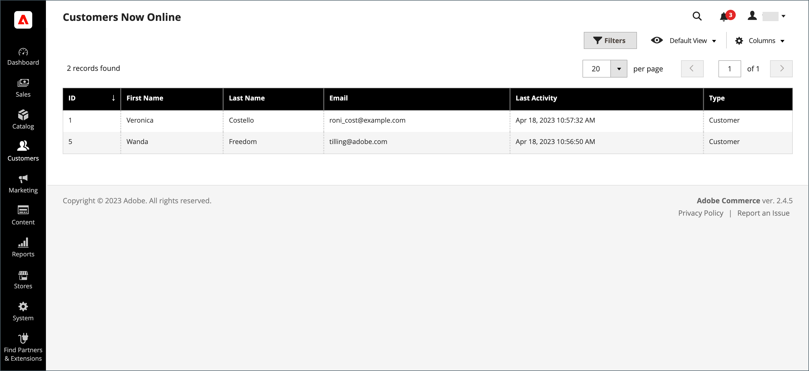
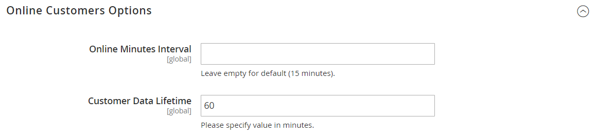

# Now Online

The **[!UICONTROL Now Online]** option on the [!DNL Customers] menu lists all [!DNL Customers] and visitors who are currently online in your store. The interval of time that [!DNL Customers] are shown as currently online is set in the configuration, and determines how long the [!DNL Customer's] activity is visible from the Admin. By default, the interval is fifteen minutes. The session ends if the keyboard is not used during this time and [!DNL Customers] must sign into their accounts again to continue shopping. It is important to note that the contents of the carts are saved for later access.

The online status of [!DNL Customers] is updated only upon customer login, registration, or any other state-changing event, i.e. cart-related events such as adding, removing, modifying products, etc.

>[!NOTE]
>
> Page visits alone will not update the customer's online status. To collect such information, it is recommended to [set up Google Analytics](../merchandising-promotions/google-analytics.md) (alone or via [Google Tag Manager](../merchandising-promotions/google-tag-manager.md)) or use other analytics software with Adobe Commerce.

## See all customers currently online

1. On the _Admin_ sidebar, go to **[!UICONTROL Customers]** > **[!UICONTROL Online Now]**.

1. To help an online customer complete a purchase, see [Shopping Assistance](../stores-purchase/introduction.md#shopping-assistance).

## Configure the time interval

1. On the _Admin_ sidebar, go to **[!UICONTROL Stores]** > _[!UICONTROL Settings]_ > **[!UICONTROL Configuration]**.

1. In the left panel, expand **[!UICONTROL Customers]** and choose **[!UICONTROL Customer Configuration]**.

1. Expand the **[!UICONTROL Online Customers Options]** section and do the following:

      

      - For **Online Minutes Interval**, enter the number of minutes for the customer session to be visible from the Admin. Leave the field empty to accept the default interval of fifteen minutes.

      - For **Customer Data Lifetime**, enter the number of minutes before any unsaved data entered by the customer expires.

1. When complete, click **[!UICONTROL Save Config]**.

## Column Descriptions

|Column|Description|
| --- | --- |
| **[!UICONTROL ID]** | The customer ID of a registered customer. |
| **[!UICONTROL First Name]** | The first name of a registered customer. |
| **[!UICONTROL Last Name]** | The last name of a registered customer. |
| **[!UICONTROL Email]** | The email address of a registered customer. |
| **[!UICONTROL Last Activity]** | The date and time of the customer's last activity in your store. |
| **[!UICONTROL Type]** | Options: Customer / Visitor |
| **[!UICONTROL Last URL]** | The last URL the customer visited. |
| **[!UICONTROL Company]** | The name of the company to which the user belongs. |

{style="table-layout:auto"}
