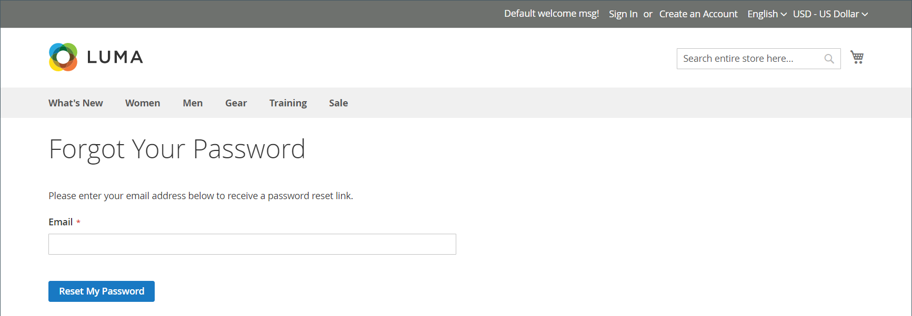

# Reset customer passwords

Customers usually reset their passwords from the storefront by clicking _[!UICONTROL Forgot Your Password?]_. However, the store administrator can initiate either a password reset or a forced sign-in from the Admin.

|Function|Description|
| --- | --- |
|Reset Password | A password reset email is sent directly to the customer's email account. The store administrator cannot gain access to the customer's password.|
|Force Sign In | Revokes the OAuth access tokens that are associated with the customer account. This can be used only with customer accounts that have been assigned OAuth tokens, as part of a Web API [integration](../systems/integrations.md). To learn more, see [OAuth-based authentication](https://developer.adobe.com/commerce/webapi/get-started/authentication/gs-authentication-oauth/) in the developer documentation.   Standard customer accounts created from the storefront or from the Admin do not have OAuth tokens.|

{style="table-layout:auto"}

## Reset a password from the storefront

1. On the login page, the customer clicks **[!UICONTROL Forgot Your Password?]**.

1. When prompted, enters the **[!UICONTROL Email Address]** that is associated with their account and clicks **[!UICONTROL Reset My Password]**.

   {width="600" zoomable="yes"}

   >[!INFO]
   >
   >If the entered email address matches the one that is associated with the account, the customer receives a Password Reset Confirmation email with a link to reset their password.

1. When the email arrives, the customer clicks the _reset password_ link and enters their **[!UICONTROL New Password]** when prompted.

1. Enters it again to confirm and clicks **[!UICONTROL Reset Password]**.
   
   >[!IMPORTANT]
   >
   >The new password must be six or more characters in length without spaces. When they receive confirmation that the password is updated, they can use the new password to sign in to their account. By default, the _reset password_ link is valid for 24 hours.

## Reset a password from the Admin

1. On the _Admin_ sidebar, go to **[!UICONTROL Customers]** > **[!UICONTROL All Customers]**.

1. Find the customer account in the grid and click **[!UICONTROL Edit]** in the _Action_ column.

1. In the set of options across the top of the page, click **[!UICONTROL Reset Password]**.

   The number of password reset requests that are allowed within an hour is set in the [configuration](../configuration-reference/customers/customer-configuration.md) topic.

## Revoke a customer's OAuth tokens

>[!IMPORTANT]
>
>Do not proceed unless you have a full understanding of API Authentication.

1. On the _Admin_ sidebar, go to **[!UICONTROL Customers]** > **[!UICONTROL All Customers]**.

1. Find the customer account in the grid and click **[!UICONTROL Edit]** in the _Action_ column.

1. In the set of options across the top of the page, click **[!UICONTROL Force Sign In]**.

1. When prompted to confirm, click **OK**.
