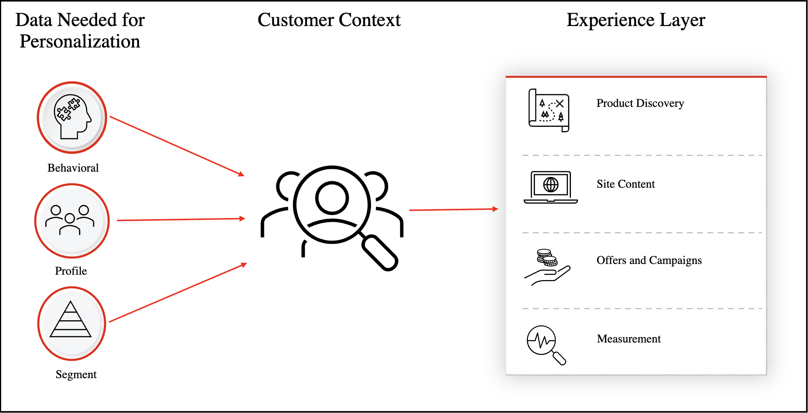

# Personalization at scale

​Personalization at scale allows businesses the ability to personalize the shopping experience for every customer touchpoint based on immediate context and previously observed behavior. The goal is to present the most relevant and personalized experience possible every time.

To understand the benefits of delivering a personalized shopping experience, download the [_Getting Started with Personalization at Scale_](https://business.adobe.com/resources/reports/getting-started-with-personalization-at-scale.html) report.

Creating a personalized shopping experience requires that you become familiar with the type of data needed to understand the shopper context. From there, you learn which features in Adobe Commerce use that data to unlock customer insights so you can create that personalized shopping experience.

The following image illustrates the concepts involved in personalizing the shopping experience:

{width="700" zoomable="yes"}

This article discusses each of the above concepts in more detail.

## How do you personalize the shopping experience

Successful personalization starts with shopper context. Building an understanding of the customer context requires data. In this section, you learn what types of data are available to help you build that shopper context.

### Behavioral data

Behavioral data answers the question: how do shoppers interact with your site? For example, do they:

- Click a search ad
- Watch a video
- Interact with the call center
- Open an email offer
- Browse your site from a mobile device
- View specific products or categories
- Make purchases
- Return items

### Customer profile data

Customer profile data answers the question: who are your shoppers? For example, what is their:

- Name
- Gender
- Address
- Loyalty status
- Phone number
- Email address

### Segment data

Segment data answers the question: which segments do your shoppers qualify for. For example, are they:

- Eligible for upgrades
- Cross-channel shoppers
- Prospects for new products
- Gold, silver, or bronze loyalty members

The above data forms the foundation of the Commerce customer context, which helps you know what products your customers are viewing and ultimately purchasing. You can then target their interests and personalize their experience.

In the next section, you learn which features in Commerce can use this data to personalize the shopping experience.

## Commerce features that use customer context data to personalize the shopping experience

Sitting on top of the customer context data in Commerce is the experience layer. This layer is composed of the features in Commerce that can act on that data and is divided into four main pillars:

- Product discovery
- Site content
- Offers and campaigns
- Measurement

The following sections go into each of these pillars in more detail and provide the available Commerce features you can use to turn that data into actionable insights.

### Product discovery

The product discovery pillar contains merchandising services that are [deployed as SaaS](https://experienceleague.adobe.com/docs/commerce-merchant-services/user-guides/integration-services/saas.html). These are features that allow you to use behavioral data, product attributes, and inventory levels to automatically personalize product discovery across search results, product recommendations, and browsing pages. These features all use Adobe Sensei AI.

#### Commerce features to use

You can use the following Commerce features to assist in product discovery.

- **Product Recommendations** - Displays AI-fueled product recommendations based on shopper behavior, trends, product similarity and more. When combined with your Adobe Commerce catalog, product recommendations deliver a highly engaging, relevant, and personalized experience. Learn [more](https://experienceleague.adobe.com/docs/commerce-merchant-services/product-recommendations/guide-overview.html).

- **Live Search** - Uses AI ranking algorithms to personalize and optimize search results based on shopper's on-site behavioral actions, boosting search relevance and conversion. Learn [more](https://experienceleague.adobe.com/docs/commerce-merchant-services/live-search/guide-overview.html).

- **Category Merchandising** - Accessed from the Live Search Admin, category merchandising uses AI to automatically rerank the sequence of products on each category page to boost relevance and conversion for every shopper. You can create and manage AI-powered rules to automatically rerank product sequencing on category pages according to shopper actions and affinities. Learn [more](https://experienceleague.adobe.com/docs/commerce-merchant-services/live-search/live-search-admin/category-merch.html).

### Site content

The site content pillar refers to the ability to deploy personalized dynamic content blocks based on the current customer browsing your site.

#### Commerce features to use

You can use the following Commerce features to assist in personalizing site content.

- **Dynamic blocks informed by native Commerce features** - Allows you to deliver personalized site content based on logic configured in price rules and customer segments. Learn [more](https://experienceleague.adobe.com/docs/commerce-admin/content-design/elements/dynamic-blocks/dynamic-blocks.html).

- **Dynamic blocks informed by Real-Time CDP audiences** - Enables merchants to deliver personalized site content based on audiences configured in Real-Time CDP. Learn [more](https://experienceleague.adobe.com/docs/commerce-admin/customers/audience-activation.html).

### Offers and campaigns

The offers and campaigns pillar lets you deploy personalized promotional content based on segment data.

#### Commerce features to use

You can use the following Commerce features to assist in creating personalized offers and campaigns.

- **Cart price rules** - Lets you apply discounts to items in the shopping cart, based on a set of conditions. Learn [more](https://experienceleague.adobe.com/docs/commerce-admin/marketing/promotions/cart-rules/price-rules-cart.html).

- **Dynamic blocks informed by native Commerce features** - Allows you to display personalized banner promotions based on customer segments configured natively in Commerce. Learn [more](https://experienceleague.adobe.com/docs/commerce-admin/content-design/elements/dynamic-blocks/dynamic-blocks.html).

- **Dynamic blocks informed by Real-Time CDP audiences** - Allows you to display personalized promotions based on audiences configured in Real-Time CDP. Learn [more](https://experienceleague.adobe.com/docs/commerce-admin/customers/audience-activation.html).

### Measurement

The measurement pillar uses data intelligence to better understand your business including revenue, channel and merchandise performance, promotions, and so on.

#### Commerce features to use

You can use the following Commerce feature to assist in measuring the success of any personalization at scale implementation.

- **Adobe Commerce Intelligence** - (Formerly known as Magento Business Intelligence) is a cloud platform that provides best practice insights to help you make data-driven decisions and take clear and informed actions. Adobe Commerce Intelligence can analyze your data to help you answer questions about order growth, customer behavior, and the effectiveness of promotional strategies. Learn [more](https://experienceleague.adobe.com/docs/commerce-business-intelligence/mbi/getting-started.html).

## Features beyond commerce

As mentioned above, [!DNL Audience Activation] uses Real-Time CDP which is available in the Experience Platform. You can also take advantage of other Adobe DX products, such as Adobe [!DNL Journey Optimizer], [!DNL Customer Journey Analytics], Adobe [!DNL Analytics], and others to personalize your store. Like [!DNL Audience Activation], it starts with connecting your Commerce instance to the Experience Platform using the [!DNL Data Connection] extension. Learn [more](https://experienceleague.adobe.com/docs/commerce-merchant-services/data-connection/overview.html).
