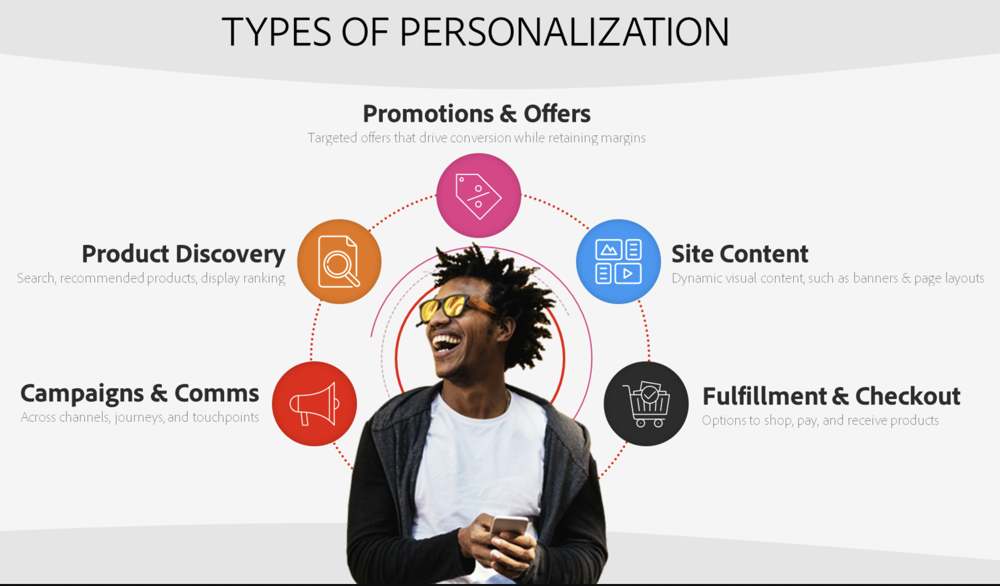
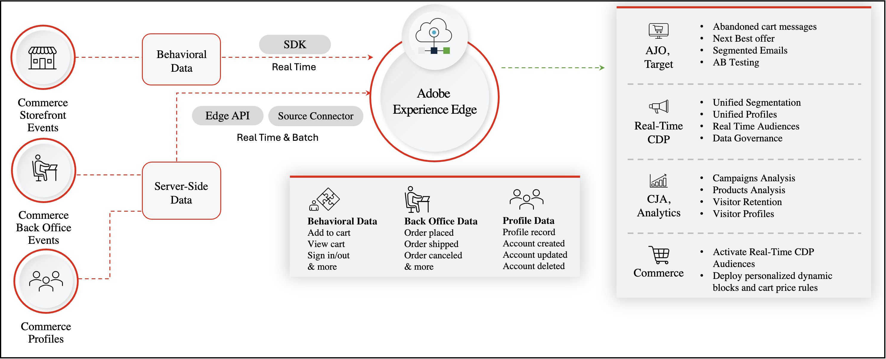
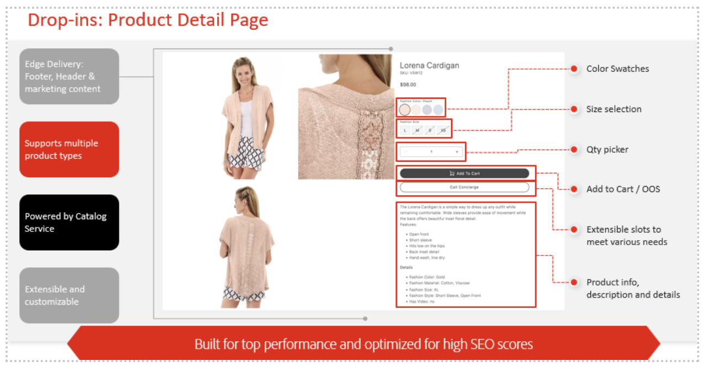

# Create Compelling, Personalized Experiences at Scale

Adobe [!DNL Commerce] gives you a powerful toolkit to personalize every customer touchpoint, boosting shopper engagement, conversion, and revenue.

In this article, you learn:

- What is personalization? 
- What data do I need to achieve personalization? 
- How does Adobe [!DNL Commerce] unlock personalization? 
- Available personalization use-cases 

## What is personalization?

Personalization means tailoring aspects of each customer's buying experience to meet their unique needs, context, and preferences. Personalization is not limited to content on the site, or recommending best-fit products, but rather encompasses all touchpoints across the customer journey, including: 

- **Campaigns and Communications** - Delivering relevant and consistent messaging via campaigns and communications 
- **Product Discovery** - Showing the right products to the right customers in just the right moments 
- **Promotions and Offers** - Targeting promotions and offers to drive each customer to convert 
- **Content Experiences** - Tailoring site content to feel hyper-relevant to each customer and their journey 

{width="700" zoomable="yes"}

While these types of personalized experiences can seem achievable for a small subset of customers, personalizing at scale for thousands or millions of customers across every touchpoint and channel, all in real-time can feel impossible. In the following sections, you learn how Adobe [!DNL Commerce] and Adobe Experience Cloud can help. 

## What data do I need to achieve personalization? 

Effective personalization requires context or signals that provide information about customers that can then be used to modify their experience. The following table provides the various data types and the role that Adobe [!DNL Commerce] plays in supporting the gathering and activating of that data.  

|Data Types|Storefront Data (Behavioral Events)|Back office Data (Server-Side Events)|Customer Profile and Segment Data|
|---|---|---|---|
|**Definition**|Clicks or actions customers take on your site.|Information on the lifecycle and details of each order (past and current).|Who your shoppers are and what segments do they qualify for.| 
|**Events Captured by Adobe Commerce**|[pageView](https://experienceleague.adobe.com/en/docs/commerce-merchant-services/data-connection/event-forwarding/events#pageview) [productPageView](https://experienceleague.adobe.com/en/docs/commerce-merchant-services/data-connection/event-forwarding/events) [searchRequestSent](https://experienceleague.adobe.com/en/docs/commerce-merchant-services/data-connection/event-forwarding/events#searchrequestsent) [searchResponseReceived](https://experienceleague.adobe.com/en/docs/commerce-merchant-services/data-connection/event-forwarding/events#searchresponsereceived) [addToCart](https://experienceleague.adobe.com/en/docs/commerce-merchant-services/data-connection/event-forwarding/events#addtocart) [openCart](https://experienceleague.adobe.com/en/docs/commerce-merchant-services/data-connection/event-forwarding/events#opencart) [signIn](https://experienceleague.adobe.com/en/docs/commerce-merchant-services/data-connection/event-forwarding/events#signin) [signOut](https://experienceleague.adobe.com/en/docs/commerce-merchant-services/data-connection/event-forwarding/events#signout) [startCheckout](https://experienceleague.adobe.com/en/docs/commerce-merchant-services/data-connection/event-forwarding/events#startcheckout) [completeCheckout](https://experienceleague.adobe.com/en/docs/commerce-merchant-services/data-connection/event-forwarding/events#completecheckout) [createRequisitionList](https://experienceleague.adobe.com/en/docs/commerce-merchant-services/data-connection/event-forwarding/events#createrequisitionlist) [addToRequisitionList](https://experienceleague.adobe.com/en/docs/commerce-merchant-services/data-connection/event-forwarding/events#addtorequisitionlist) [removeFromRequisitionList](https://experienceleague.adobe.com/en/docs/commerce-merchant-services/data-connection/event-forwarding/events#removefromrequisitionlist)|**Order status**: [orderPlaced](https://experienceleague.adobe.com/en/docs/commerce-merchant-services/data-connection/event-forwarding/events-backoffice#orderplaced) [orderItemsReturnedInitiated](https://experienceleague.adobe.com/en/docs/commerce-merchant-services/data-connection/event-forwarding/events-backoffice#orderitemsreturnedinitiated) [orderItemsShipped](https://experienceleague.adobe.com/en/docs/commerce-merchant-services/data-connection/event-forwarding/events-backoffice#orderitemsshipped) [orderCancelled](https://experienceleague.adobe.com/en/docs/commerce-merchant-services/data-connection/event-forwarding/events-backoffice#ordercancelled) [**Order history**](https://experienceleague.adobe.com/en/docs/commerce-merchant-services/data-connection/fundamentals/connect-data#send-historical-order-data): - SKU, Name, Price Quantity, Discount - Product Category - Payment Amount, Type, Currency - Shipping Method and Amount - Refund ID, Amount, Currency - Return Reason, Condition, Resolution - Address - Email|[**Profile record**](https://experienceleague.adobe.com/en/docs/commerce-merchant-services/data-connection/event-forwarding/events-profilerecord): (Name, Gender, Address, Loyalty Status, Phone Number, Email Address) **Account status**: [accountCreated](https://experienceleague.adobe.com/en/docs/commerce-merchant-services/data-connection/event-forwarding/events-backoffice#accountcreated) [accountUpdated](https://experienceleague.adobe.com/en/docs/commerce-merchant-services/data-connection/event-forwarding/events-backoffice#accountupdated) [accountDeleted](https://experienceleague.adobe.com/en/docs/commerce-merchant-services/data-connection/event-forwarding/events-backoffice#accountdeleted)| 

With all of this rich, first-party [!DNL Commerce] data, you are ready to target and personalize each shopper's experience. In the next section, you learn how [!DNL Commerce] and Adobe Experience Cloud help you create personalized experiences and the use-cases that you can activate. 

## How does Adobe [!DNL Commerce] empower personalization?

Adobe [!DNL Commerce] Data Sharing lets you collect and share the data types in the previous table to other Adobe Experience Cloud products to power unified customer profiles and audiences, personalized campaigns, and rich analytics and insights.  

{width="700" zoomable="yes"}

Adobe [!DNL Commerce] Data Sharing includes two key components:

1. [Data Connection](https://experienceleague.adobe.com/en/docs/commerce-merchant-services/data-connection/overview): Share storefront, back office, and customer profile data from Adobe [!DNL Commerce] to the Adobe Experience Platform edge network for use across Adobe Experience Cloud applications, including: 

    - [Adobe [!DNL Real-Time CDP]](https://experienceleague.adobe.com/en/docs/experience-platform/rtcdp/intro/rtcdp-intro/overview): Stitch customer data from across sources (ERP, CRM, POS) into unified profiles and create rules-based or AI-based segments. 
    - [Adobe [!DNL Journey Optimizer]](https://experienceleague.adobe.com/en/docs/journey-optimizer/using/get-started/get-started): Launch personalized omni-channel journeys, including email campaigns, SMS, push notifications, and more.  
    - [Customer Journey Analytics](https://experienceleague.adobe.com/en/docs/analytics-platform/using/cja-overview/cja-overview) and [Adobe [!DNL Analytics]](https://experienceleague.adobe.com/en/docs/analytics/analyze/admin-overview/analytics-overview): Gain insights into the customer and the business.
    - [Adobe [!DNL Target]](https://experienceleague.adobe.com/en/docs/target/using/introduction/intro): Test and optimize content, recommended products, offers, navigation, and more. 

1. [[!DNL Audience Activation]](https://experienceleague.adobe.com/en/docs/commerce-admin/customers/audience-activation): Use [!DNL Real-Time CDP] audiences to personalize dynamic content blocks, promotions, and related product rules on your Adobe [!DNL Commerce] site.

### Personalized Storefront Experiences across any channel, at scale 

Adobe [!DNL Commerce] can take adavantage of a high-performance storefront, called [Edge Delivery Services](https://experienceleague.adobe.com/developer/commerce/storefront/), to deliver personalized experiences across all your channels, with AI capabilities at the core, and speed as a foundation.

With Edge Delivery Services, you can:

- **Craft personalized content**: Use document-based authoring, native experimentation with Generative AI text & image variations for personalizing the experience at scale. Use Assets and Generative AI content creation to produce product and marketing images at scale. 

- **Generate variations**: Allows content authors to use Generative AI to create large volumes of personalized AI-driven [text content and image variations](https://experienceleague.adobe.com/en/docs/experience-manager-learn/sites/generative-ai/generate-variations) with Adobe Firefly.

- **Deploy via Edge Delivery Services Storefront**: Content on the Edge and Commerce capabilities powered by drop in components, to create bespoke shoppable experiences for your audiences.

- **Commerce and Adobe Experience Manager Assets**: Generative AI product asset creation and variations at scale. Create, deliver, and monitor content delivery across any channel.

{width="700" zoomable="yes"}

### Out-of-the-box Personalization: Get started with native Adobe [!DNL Commerce] features 

Adobe [!DNL Commerce] delivers powerful personalization with its native out-of-the-box capabilities. The following table describes [!DNL Commerce] features you can activate immediately to get started on your personalization journey.  

|Category|Features|
|---|---|
|Personalized Product Discovery|[[!DNL Live Search]](https://experienceleague.adobe.com/en/docs/commerce-merchant-services/live-search/overview): Personalize and optimize search results based on a shopper's onsite behavioral actions and affinities with AI-powered search. [Intelligent Category Merchandising](https://experienceleague.adobe.com/en/docs/commerce-merchant-services/live-search/live-search-admin/category-merch): AI-driven product ranking on category pages based on a shopper's onsite behavioral actions and affinities. [Product Recommendations](https://experienceleague.adobe.com/en/docs/commerce-merchant-services/product-recommendations/guide-overview): AI-powered product recommendations based on shopper behavior, trends, and affinities. [Related Product Rules](https://experienceleague.adobe.com/en/docs/commerce-admin/marketing/promotions/product-relationships/product-related-rules): Define custom rules to display products from your catalog to drive cross- and up-sell.|
|Personalized Site Content|[Dynamic Content Blocks](https://experienceleague.adobe.com/en/docs/commerce-admin/content-design/elements/dynamic-blocks/dynamic-blocks): Display personalized content blocks, for example, banners, based on customer segments in Adobe Commerce.|
|Personalized Offers and Promotions|[Cart Price Rules](https://experienceleague.adobe.com/en/docs/commerce-admin/marketing/promotions/cart-rules/price-rules-cart): Apply discounts to items in the shopping cart based on a set of conditions, including customer segments in Adobe [!DNL Commerce].|
|Insights and Measurement|[Adobe [!DNL Commerce] Intelligence](https://experienceleague.adobe.com/en/docs/commerce-business-intelligence/mbi/getting-started): Understand how your personalization strategies are working and improve over time.|

## Top personalization use-cases

Adobe [!DNL Commerce] customers are using out-of-the-box capabilities and sharing data to Adobe Experience Cloud for a variety of use-cases. The following sections highlight the top use-cases and describe how they are implemented using Adobe [!DNL Commerce] Only or [!DNL Commerce] plus Experience Cloud apps.

### Personalized campaigns and communications

|Use-Case|Solution|
|---|---|
|**Abandoned Cart and Browse** - Deliver a personalized re-engagement email or notification when a customer abandons their cart or browsing session after demonstrating high engagement|**Adobe [!DNL Commerce] Only**: [Email Reminders](https://experienceleague.adobe.com/en/docs/commerce-admin/marketing/communications/email-reminders/email-reminder-rules) **Adobe [!DNL Commerce] with Adobe Journey Optimizer**: [!DNL Commerce] data serves as the trigger for an omni-channel abandonment journey. Personalize that journey based on customer attributes, what they abandoned, other shopping behaviors, and past purchases. Commerce with Adobe Journey Optimizer and Real-Time CDP: Tailor abandonment campaigns based on unified customer profiles and centrally managed audiences, for example creating a high abandonment rate audience.|
|**Centralized Audience Creation** - Create rules-based or AI-powered audiences based on onsite behavior, past-purchases, profile attributes, category affinities, loyalty status, customer value and more|**Adobe [!DNL Commerce] Only**: Gather customer profile information when [!DNL Commerce] customers create accounts. Create rules-based [customer segments](https://experienceleague.adobe.com/en/docs/commerce-admin/customers/segments/customer-segments) and customer groups to personalize content and promotions. **Adobe [!DNL Commerce] with Adobe Real-Time CDP**:  [Unified profiles](https://experienceleague.adobe.com/en/docs/experience-platform/segmentation/home) from across data sources and channels; rules-based or AI-powered audiences.|
|**Personalized Email/SMS Offer Based on Shopper Behavior** - Send personalized offers to customers via targeted email based on past purchases and shopper behavior, for example, send offer for products or categories customers have viewed or engaged with.|**Adobe [!DNL Commerce] Only**: Export data for use with marketing automation solutions. **Adobe [!DNL Commerce] with Adobe Journey Optimizer and Real-Time CDP**: [!DNL Commerce] data serves as the trigger for email or SMS offers and provides signals (shopper behaviors) to personalize based upon. Real-Time CDP is not required, but generally these offers and campaigns are created around audiences, which would be created and managed within Real-Time CDP.|
|**Cross or Upsell Compatible Products/Brands** - If a customer purchases one product or brand that is compatible or indicates high affinity towards another product or brand, send a campaign (email/SMS) to drive cross-sell conversion.|**Adobe [!DNL Commerce] Only**: Use Adobe [!DNL Commerce] [Product Recommendations](https://experienceleague.adobe.com/en/docs/commerce-merchant-services/product-recommendations/guide-overview) to recommend specific products on the site. You can also use [Related Product Rules](https://experienceleague.adobe.com/en/docs/commerce-admin/marketing/promotions/product-relationships/product-related-rules) to suggest other products. **[!DNL Commerce] with [!DNL Target]**: Adobe [!DNL Target] also has a built-in product recommendation engine with powerful capabilities such as category affinity. This can be used for cross or upsell. **[!DNL Commerce] with Adobe Journey Optimizer**: Use [!DNL Target] or [!DNL Commerce] to determine products to recommend, then deliver via Adobe Journey Optimizer.|

### Personalized site experiences

|Use-Case|Solution|
|---|---|
|**Personalized Site Content** - Personalize site banners and other page content based on shopper actions, such as product browsing and category affinities. Deploy best-fit content based on results of A/B tests or business goals.|**Adobe [!DNL Commerce] Only**: Deploy segment-specific [dynamic content blocks](https://experienceleague.adobe.com/en/docs/commerce-admin/content-design/elements/dynamic-blocks/dynamic-blocks). **[!DNL Commerce] with Real-Time CDP**: Use [Audience Activation](https://experienceleague.adobe.com/en/docs/commerce-admin/customers/audience-activation) to deploy audience-specific dynamic content blocks that respond to real-time actions and unified customer profile data, while centrally managing profiles and audiences in Real-Time CDP. **[!DNL Commerce] with [!DNL Target]**: Personalize every part of the site experience, including content, navigation items, full page layouts and more using Adobe [!DNL Commerce] data in Adobe [!DNL Target]. A/B test content, automatically select and deploy winning content for each customer. **[!DNL Commerce] with AEM Assets**: Store all of your content in Adobe Experience Manager Assets. Natively access that content from within Adobe Commerce. Use Generative AI to create content variations to personalize for different segments or audiences.|
|**Personalized Onsite Offer Based on Behavior** - Personalize promotions based on shopper actions, such as product browsing and category affinities. Deploy the next best offer based on results of A/B tests or business goals.|**Adobe [!DNL Commerce] Only**: Deploy segment-specific catalog and [cart price rules](https://experienceleague.adobe.com/en/docs/commerce-admin/marketing/promotions/cart-rules/price-rules-cart). **Adobe [!DNL Commerce] with Real-Time CDP**: Use [Audience Activation](https://experienceleague.adobe.com/en/docs/commerce-admin/customers/audience-activation) to deploy audience-specific offers, while centrally managing profiles/audiences in Real-Time CDP. **Commerce with [!DNL Target]**: Use offer decisioning to determine which offer to deploy, A/B test or set business goals to guide offers deployed in Adobe Commerce.|

### Analytics and insights

|Use-Case|Solution|
|---|---|
|**Customer Behavior by Channel** - Understand the nuances of how customers engage in each channel (web, in-person, app, other) to impact marketing strategies for each channel; understand the shopper funnel and weaknesses in the customer experience.|**Adobe [!DNL Commerce] Only**: [Adobe [!DNL Commerce] Intelligence](https://experienceleague.adobe.com/en/docs/commerce-business-intelligence/mbi/getting-started) provides rich analytics on the digital [!DNL Commerce] channel, but not across channels or broader pieces of the customer journey. **Adobe [!DNL Commerce] with Customer Journey Analytics**: [!DNL Commerce] data feeds data dashboards for full rich detail on all stages of the customer experience (across channels). Understand every touchpoint and the broader funnel to identify weak points in the customer journey where customers may fall off.|
|**Purchase Trends** - Understand purchase behaviors over a specific time frame (for example, shopper basket analysis, product analysis) to identify trends, seasonality, and optimize marketing based on historical purchase patterns.|**Adobe [!DNL Commerce] Only**: [Adobe [!DNL Commerce] Intelligence](https://experienceleague.adobe.com/en/docs/commerce-business-intelligence/mbi/getting-started) provides rich analytics on the digital [!DNL Commerce] channel, but not across channels or broader pieces of the customer journey. **Adobe [!DNL Commerce] with Customer Journey Analytics**: [!DNL Commerce] data feeds data dashboards for full rich detail on all stages of the customer experience (across channels). Understand every touchpoint and the broader funnel to identify weak points in the customer journey where customers may fall off.|

## Example Use-Cases

- Learn how you can use Adobe Journey Optimizer to [send an abandoned cart email](https://experienceleague.adobe.com/en/docs/commerce-merchant-services/data-connection/use-cases/using-ajo).
- Learn how to [create an audience in Real-Time CDP](https://experienceleague.adobe.com/en/docs/commerce-merchant-services/data-connection/use-cases/create-audience) to inform a cart price rule in Adobe [!DNL Commerce].
