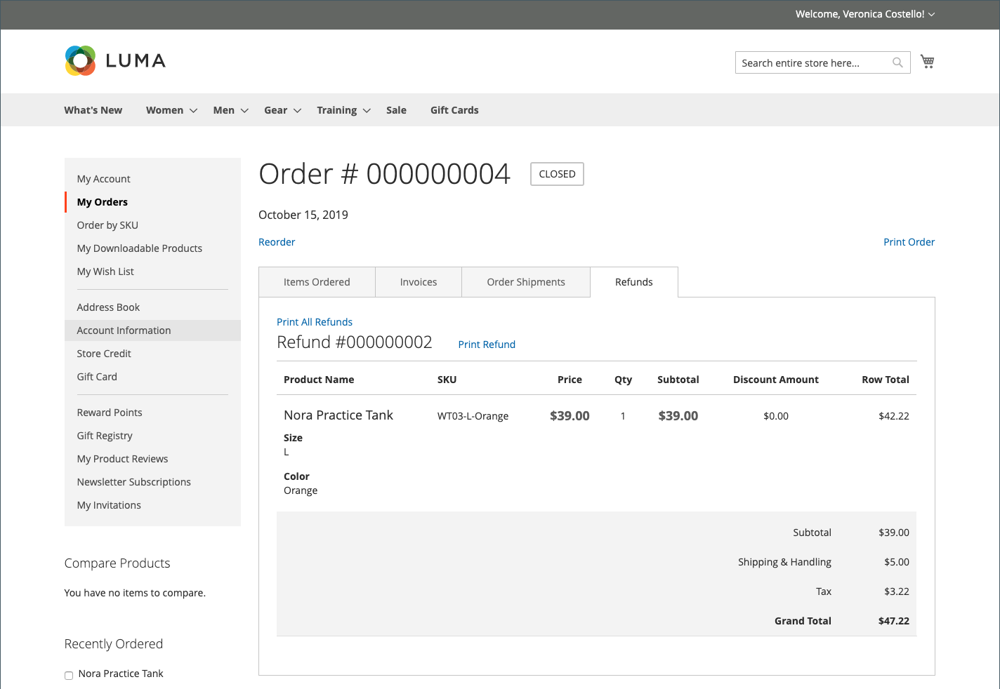
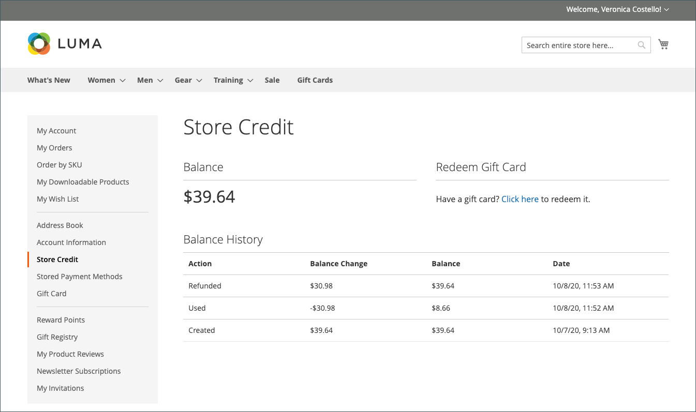
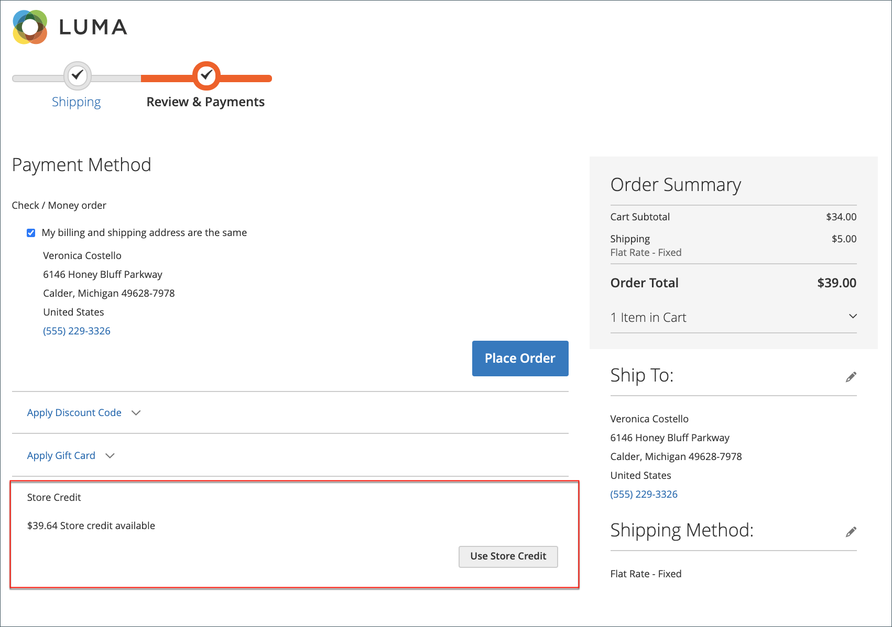

# Refunds in the Customer Account Dashboard

{{ee-feature}}

If a refund has been issued for an order, customers can view the refund information associated with the order in their account dashboard. If you have enabled the [!UICONTROL _Show Store Credit History to Customers_] option for [Store Credit configuration](../customers/credit-configure.md), customers can also access their [Store Credit](../customers/store-credit.md) history.

## View a refund on the storefront

1. From the storefront, the customer logs in to their account.

1. Locates their order using one of the following methods:

   * Finding the order in the list of **Recent Orders** and clicking **[!UICONTROL View]**.
   * In the left panel, choosing **[!UICONTROL My Orders]**. Then, finding the order in the list and clicking **[!UICONTROL View]**.

1. Clicks the **[!UICONTROL Refunds]** tab to view the details of the refund.

   

## View store credit balance and history on the storefront

Method 1: **From the customer account dashboard**

1. From the storefront, the customer logs in to account.

1. If the refund was applied to store credit, chooses **[!UICONTROL Store Credit]** in the left panel.

1. The amount refunded to their store credit appears in the list with the date and time of the action.

   

   >[!INFO]
   >
   > The Store Credit page also provides a link for the customer to redeem a [gift card](../stores-purchase/product-gift-card-workflow.md#check-status-and-balance-of-the-gift-card).

Method 2: **From the _Review & Payments_ page**

1. The customer adds a product to the cart.

2. Proceeds to checkout.

3. Passes the **[!UICONTROL Shipping]** step.

4. If store credit is available, the customer clicks **[!UICONTROL Use Store Credit]**.

   

5. If the customer changes their mind about using the store credit, clicks **[!UICONTROL Remove]** in the _Order Summary_ section.

## Payment actions in the Admin

You can configure payment actions for your specific [Payment Method](../configuration-reference/sales/payment-methods.md). Each payment method has a different set of payment actions.

|Payment action |Description|
|--- |---|
| Capture Online | When the invoice is submitted, the system captures the payment from the third-party payment gateway. You have the ability to create a credit memo and void the invoice. |
| Capture Offline | When the invoice is submitted, the system does not capture the payment. It is assumed that the payment is captured directly through the gateway, and you no longer have the option to capture this payment through Adobe Commerce. You have the ability to create a credit memo, but you do not have the option to void the invoice. (Even though the order used an online payment, the invoice is essentially an offline invoice.) |
| Not Capture | When the invoice is submitted, the system does not capture the payment. It is assumed that you will capture the payment through Adobe Commerce at a later date. There is a [!UICONTROL _Capture_] button in the completed invoice. Before capturing, you are able to cancel the invoice. After capturing, you are able to create a credit memo and void the invoice. |

{style="table-layout:auto"}

>[!WARNING]
>
> Select the [!UICONTROL _Not Capture_] option unless you are certain that you are going to capture the payment through Adobe Commerce at a later date. You cannot create a credit memo until the payment has been captured using the [!UICONTROL _Capture_] button.
