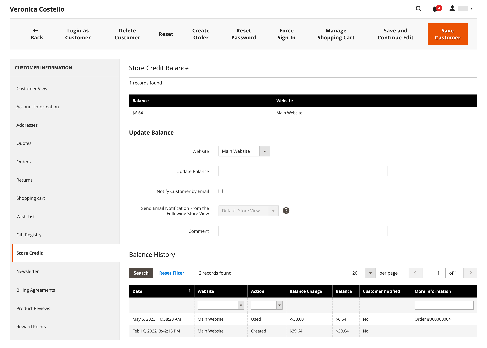
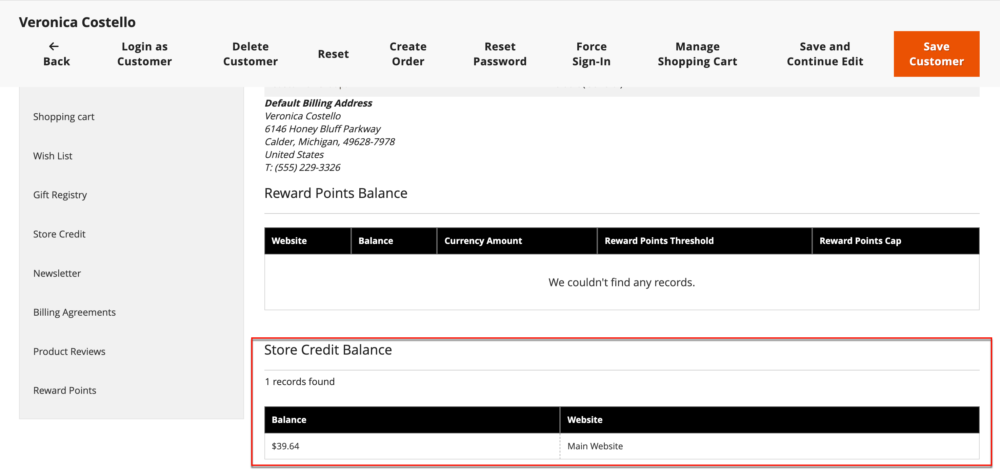
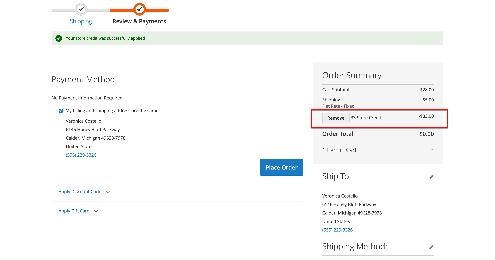

# Apply store credit

{{ee-feature}}

Store administrators can view the credit balance and history from the customer account, and also apply store credit to a purchase.

{width="600" zoomable="yes"}

## View the credit balance

1. On the _Admin_ sidebar, go to **[!UICONTROL Customers]** > **[!UICONTROL All Customers]**.

1. Find the customer in the grid.

1. In the _Action_ column, click **[!UICONTROL Edit]**.

1. Scroll _[!UICONTROL Customer View]_ page and view the **[!UICONTROL Store Credit Balance]** at the bottom.

{width="600" zoomable="yes"}

## Update store credit balance

1. On the _Admin_ sidebar, go to **[!UICONTROL Customers]** > _Operations_ > **[!UICONTROL All Customers]**.

1. Find the customer in the grid.

1. In the _Action_ column, click **[!UICONTROL Edit]**.

1. In the left panel, choose **[!UICONTROL Store Credit]**.

1. Choose the website (storefront) that you want to associate with the balance.

1. For **[!UICONTROL Update Balance]**, enter the new value.

1. To notify the customer about the balance update, select the **[!UICONTROL Notify Customer by Email]** checkbox and choose the store view from **[!UICONTROL Send Email Notification From the Following Store View]**.

1. Enter a **[!UICONTROL Comment]** about the change.

1. When updates are complete, click **[!UICONTROL Save and Continue Edit]** or **[!UICONTROL Save Customer]**.

The updated balance should be displayed in **[!UICONTROL Balance History]**.

## Apply a credit balance to an order as a store administrator

As a store administrator, you can do various things on behalf of a customer, including submitting orders. When you [create an order](../stores-purchase/customer-account-create-order.md), you can apply a Store Credit balance that is due to the customer. The available balance is displayed in the _Payment & Shipping Information_ section. Select the **[!UICONTROL Use Store Credit]** checkbox to apply the balance, or a portion of the balance if the order total is less.

{width="500" zoomable="yes"}

## Apply store credit during checkout

If there is a credit balance for the site, the customer can apply store credit to the order balance before placing the order on the storefront.

1. The customer views the amount of available store credit.

   During the _Review & Payments_ step, the available amount appears under _[!UICONTROL Store Credit]_.

1. To apply the amount to the order, clicks **[!UICONTROL Use Store Credit]**.

   >[!INFO]
   >
   >The order total is recalculated and the amount of store credit that is applied appears in the _[!UICONTROL Order Summary]_.

   {width="700" zoomable="yes"}

1. When ready, clicks **[!UICONTROL Place Order]**.
