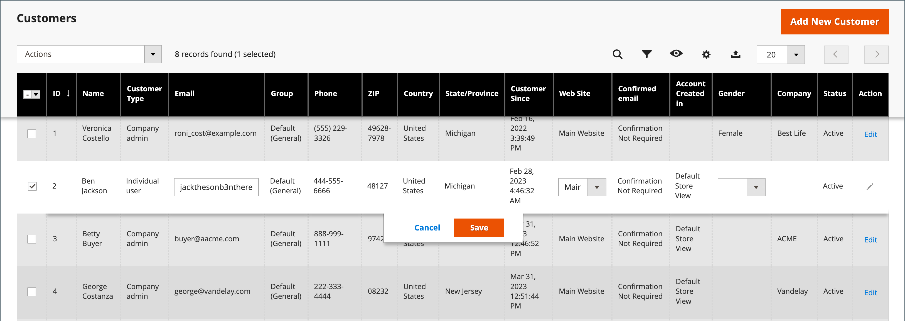

# Update a customer profile

The left panel of the _[!UICONTROL Customer Information]_ page includes information about customer activity, addresses, order statistics, recent orders, shopping cart contents, product reviews, and newsletter subscriptions.

{width="700" zoomable="yes"}

## Edit a customer account

Method 1: **_Quick Edit_**

1. In the first column, select the checkbox of the customer account to be edited.

1. Set the **[!UICONTROL Actions]** column to `Edit`.

   >[!INFO]
   >
   >The value of each value that can be updated appears in a text box. Only some values of the selected customer record can be edited from the grid.

   {width="700" zoomable="yes"}

1. Update any of the following values, as needed:

   * **[!UICONTROL Email]**
   * **[!UICONTROL Web Site]**
   * **[!UICONTROL Tax/VAT Number]**
   * **[!UICONTROL Gender]**

1. Click **[!UICONTROL Save]**.

Method 2: **_Full Edit_**

1. In the grid, find the customer record to be edited.

1. In the _Actions_ column on the far right, click **[!UICONTROL Edit]**.

1. Make the necessary changes to the company information.

   >[!INFO]
   >
   >To learn more, see [Update a customer profile](../customers/update-account.md).

1. When complete, click **[!UICONTROL Save Customer]**.

>[!INFO]
>
>If you want to undo all the edits prior to saving, click **[!UICONTROL Reset]** in the top button bar to return all changes to the last saved version.

## Customer information

### [!UICONTROL Customer View]

The _Customer View_ tab lists information about the customer, includes **[!UICONTROL Personal Information]**, **[!UICONTROL Reward Points Balance]**, and **[!UICONTROL Store Credit Balance]**.

### [!UICONTROL Account Information]

The [Account Information](../customers/account-dashboard-account-information.md) tab provides detailed information about the customer, where an Admin user can edit personal information, email, remote shopping assistance, date of birth, and attach customer to website or company.

### [!UICONTROL Addresses]

The [Addresses](../customers/account-dashboard-address-book.md) tab contains the customer's default billing and shipping addresses, and any additional addresses that they frequently use.

### [!UICONTROL Orders]

The [Orders](../stores-purchase/orders.md) grid contains a list of all current customer orders, the administrator can track their progress.

### [!UICONTROL Returns]

{{ee-feature}}

The [Returns](../stores-purchase/returns.md) tab lists the current returned customer requests.

### [!UICONTROL Shopping cart]

The [shopping cart](../stores-purchase/cart.md) tab displays products that are currently in the cart, but for some reason, the purchase was not completed.

### [!UICONTROL Wish List]

A [wish list](../stores-purchase/wishlists.md) displays a list of products that a customer can transfer to the cart later.

### [!UICONTROL Gift Registry]

{{ee-feature}}

The [Gift Registry](../merchandising-promotions/gift-registry-storefront.md) section lists the customer's current gift registries and the associated event.

### [!UICONTROL Store Credit]

{{ee-feature}}

The [Store credit](../customers/store-credit.md) tab displays an amount that is restored to a customer account, the admin can manage this value.

### [!UICONTROL Newsletter]

The [Newsletter](../merchandising-promotions/newsletters.md) tab displays all emails sent to the current customer.

### [!UICONTROL Billing Agreements]

The [Billing Agreements](../stores-purchase/paypal-billing-agreements.md) tab lists all PayPal billing agreements between the store and the customer.

### [!UICONTROL Product Reviews]

The [Product Reviews](../catalog/settings-advanced-product-reviews.md) tab displays all the reviews submitted by this customer.

### [!UICONTROL Reward Points]

{{ee-feature}}

The [Reward Points](../merchandising-promotions/rewards-loyalty.md) section shows the customer's current balance of reward points. An Admin user can manage this value.

## Button bar

| Button   | Description  |
|----------|--------------|
| **[!UICONTROL Back]** | Returns to the Customers page without saving changes. |
| **[!UICONTROL Login as Customer]** | Allows the ability for the merchant to log in as the customer. |
| **[!UICONTROL Delete Customer]** | Deletes the customer account.  |
| **[!UICONTROL Reset]** | Resets any unsaved changes in the customer form to their previous values.  |
| **[!UICONTROL Create Order]** | [Creates an order](../stores-purchase/customer-account-create-order.md) that is associated with the customer account.  |
| **[!UICONTROL Reset Password]** | Resets the password of the customer.  |
| **[!UICONTROL Force Sign-In]** | Clears the tokens associated with the customer's password and provides the administrator access to the account. |
| **[!UICONTROL Manage Shopping Cart]** | Provides access to the shopping cart of a customer. |
| **[!UICONTROL Save and Continue Edit]**  | Saves changes and keeps the customer account open. |
| **[!UICONTROL Save Customer]** | Saves changes and closes the customer account. |

{style="table-layout:auto"}
