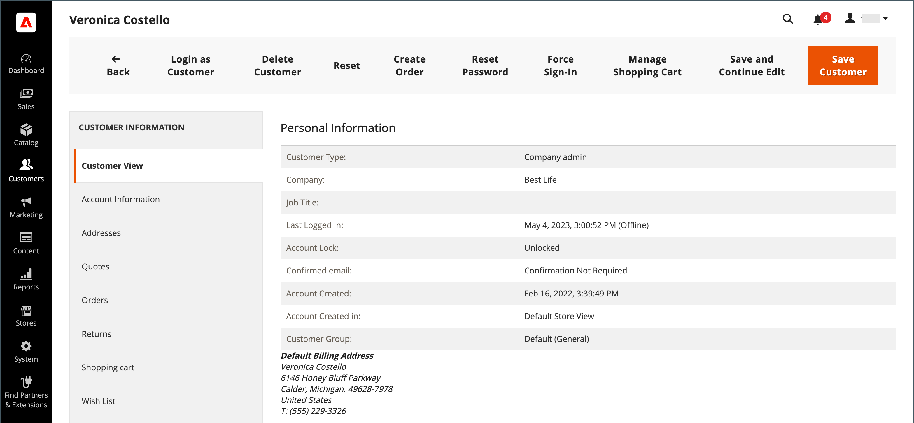

# Update a Customer Profile

The left panel of the Customer Information page includes information about customer activity, such as when the customer last signed in or out of their account, addresses, order statistics, recent orders, shopping cart contents, product reviews, newsletter subscriptions, and so on.

_**To update a customer profile:**_

1. On the _Admin_ sidebar, go to **[!UICONTROL Customers]** > **[!UICONTROL All Customers]**.

1. Find the customer in the grid and click **[!UICONTROL Edit]** in the _Action_ column.

1. In the left panel, choose the type of information you need to edit.

1. Make any necessary changes to the field values using the field descriptions for reference.

1. When complete, click **[!UICONTROL Save Customer]** or **[!UICONTROL Save and Continue Edit]**.

>[!INFO]
>
> If you want to undo all the edits made, click **[!UICONTROL Reset]** in the top button bar to return all changes to the last saved version

## Customer information

### Customer View

The Customer View tab lists information about the customer, includes **Personal Information**, **Reward Points Balance**, and Store **Credit Balance**.

### Account Information

The [Account Information](../customers/account-dashboard-account-information.md) tab provides detailed information about the customer, where an Admin user can edit personal information, email, remote shopping assistance, date of birth, and attach customer to website or company.

### Addresses

The [Addresses](../customers/account-dashboard-address-book.md) tab contains the customer's default billing and shipping addresses, and any additional addresses that they frequently use.

### Orders

The [Orders](../stores-purchase/orders.md) grid contains a list of all current customer orders, the administrator can track their progress.

{ee-feature}

### Returns

The [Returns](../stores-purchase/returns.md) tab lists the current returned customer requests.

### Shopping cart

The [Shopping cart](../stores-purchase/cart.md) tab displays products that are currently in the cart, but for some reason, the purchase was not completed.

### Wish List

A [Wish List](https://docs.magento.com/user-guide/marketing/wishlists.html) displays a list of products that a customer can transfer to the cart at a later date.

### Store Credit

{ee-feature}

The [Store credit](../customers/store-credit.md) tab displays an amount that is restored to a customer account, the admin can manage this value.

### Gift Registry

{ee-feature}

The [Gift Registry](../merchandising-promotions/gift-registry-storefront.md) section lists the customer's current gift registries and the associated event.

### Newsletter

The [Newsletter](../merchandising-promotions/newsletters.md) tab displays all emails sent to the current customer.

### Billing Agreements

The [Billing Agreements](../stores-purchase/paypal-billing-agreements.md) tab lists all PayPal billing agreements between the store and the customer.

### Product Reviews

The [Product Reviews](../catalog/settings-advanced-product-reviews.md) tab displays all the reviews submitted by this customer.

### Reward Points

{ee-feature}

The [Reward Points](../merchandising-promotions/rewards-loyalty.md) section shows the current balance of reward points earned by the customer. An Admin user can manage this value.

## Button bar

| Button   | Description  |
|----------|--------------|
| **[!UICONTROL Back]** | Returns to the Customers page without saving changes. |
| **[!UICONTROL Login as Customer]** | Allows the ability for the merchant to login as the customer. |
| **[!UICONTROL Delete Customer]** | Deletes the customer account.  |
| **[!UICONTROL Reset]** | Resets any unsaved changes in the customer form to their previous values.  |
| **[!UICONTROL Create Order]** | [Creates a new order](../stores-purchase/customer-account-create-order.md) that is associated with the customer account.  |
| **[!UICONTROL Reset Password]** | Resets the password of the customer.  |
| **[!UICONTROL Force Sign-In]** | Clears the tokens associated with the customer's password and provides the administrator access to the account. |
| **[!UICONTROL Manage Shopping Cart]** | Provides access to the shopping cart of a customer. |
| **[!UICONTROL Save and Continue Edit]**  | Saves changes and keeps the customer account open. |
| **[!UICONTROL Save Customer]** | Saves changes and closes the customer account. |

{style="table-layout:auto"}
