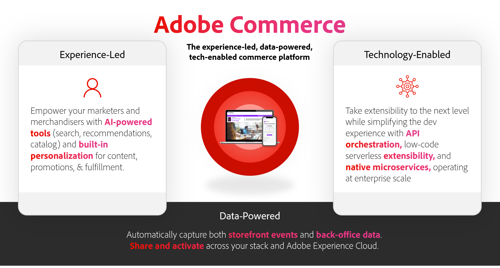
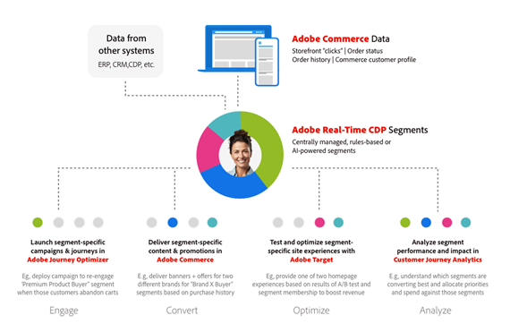
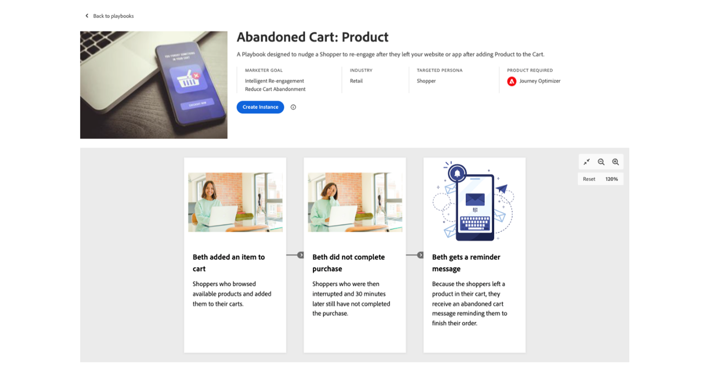
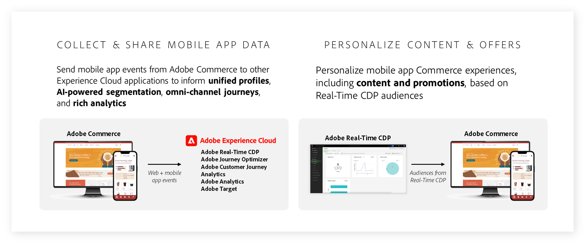
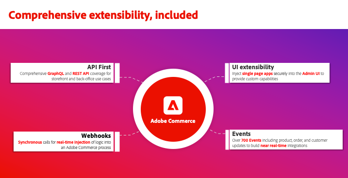

# What is Adobe Commerce?

Adobe Commerce is an enterprise commerce solution that delivers superior ecommerce experiences for consumers and B2B buyers globally. With thousands of customers and billions in annual gross merchandise value processed through our cloud platform, Adobe Commerce is at the forefront of powering the world's largest and most complex ecommerce experiences for retailers, consumer brands, manufacturers and wholesale distributors globally.

## Ecommerce teams are facing unique challenges

Ecommerce teams today must deliver exceptional experiences for their customers. A fast, convenient, personalized commerce experience leads to increased sales, deeper customer relationships and operational efficiencies for your business.

Unfortunately, creating and delivering exceptional commerce experiences is harder than ever. 

- **Technical debt is blocking the business**—Complex, legacy technical environments span multiple platforms and are challenging to maintain. [60%](https://engage.adobe.com/DigComRptWBR-register.html) of ecommerce professionals say they struggle to maintain and integrate their tech.
- **Teams are expected to do more with less**—Many ecommerce teams are facing high growth expectations but often struggle to re-define the customer experience due to manual processes, overly technical solutions and limited data. [56%](https://engage.adobe.com/DigComRptWBR-register.html) of ecommerce professionals say they lack adequate funding.
- **Data overload**—Data volumes continue to rise in quantity but do not translate into quality experiences because the data is trapped in various systems, making it hard to drive the business and create impactful experiences. [60%](https://engage.adobe.com/DigComRptWBR-register.html) of ecommerce professionals say that they don't have the right data in the right systems.
- **Consumers expect more**—The number of channels and business models that businesses must support continue to multiply, which adds more cost and complexity. [53%](https://www.bloomreach.com/en/news/2020/bloomreach-releases-new-global-research-study) of consumers will not buy again from the same company if they had a bad experience and [90%](https://www.prweb.com/releases/study-90-of-b2b-buyers-will-turn-to-a-competitor-if-a-suppliers-digital-channel-doesn-t-meet-their-needs-811395853.html) of B2B buyers turn to a competitor if a supplier can't meet their needs digitally.

## Adobe Commerce's vision is experience-led commerce

Adobe's vision is to deliver an experience-led, data-powered, technology-enabled commerce platform. 

- [Experience-led](#experience-led-commerce). At Adobe, we believe that growth comes from experiences. That's why we are focused on powering the world's fastest ecommerce storefronts and empowering ecommerce teams to author personalized experiences at scale.

- [Data-powered](#data-powered-commerce). Adobe Commerce provides seamless data sharing across your marketing technology stack, empowering you to put your first-party commerce data to work, personalizing experiences across every touchpoint and channel.

- [Technology-enabled](#tech-enabled-commerce). Adobe Commerce is a composable ecommerce platform designed to launch ecommerce features faster, easily share data between third-party systems, and lower the cost of ownership for integrations and customizations.

## Experience-led Commerce 

As we move further into 2024, it is critical for ecommerce leaders to deliver highly performant and personalized commerce experiences to their shoppers.

### Lightning fast storefront using Edge Delivery Services

Research has shown that about [64% of shoppers](https://techreport.com/statistics/website-load-time-statistics-data) go to a competitor's site to purchase a similar item if their web experience is poor. Conversely, for every 0.1 second improvement in site speed, businesses can expect a [9.2% increase in average order value](https://techreport.com/statistics/website-load-time-statistics-data).

[Edge Delivery Services in Adobe Commerce](https://experienceleague.adobe.com/developer/commerce/storefront/) is a set of composable services that drives business value by delivering exceptional experiences, in both content creation and customer experiences. It combines business-based capabilities, like document-based content authoring and built-in A/B testing, with Adobe Commerce dropin components for core commerce functionality. All of this is  delivered from the edge for lightning-fast storefront experiences.

This new high-performance storefront has already been successfully piloted by several Adobe Commerce merchants, such as [Maidenform](https://business.adobe.com/blog/perspectives/how-hanesbrands-and-adobe-built-one-of-the-fastest-ecommerce-websites-in-the-world), a property of HanesBrands. The results speak for themselves. Maidenform pages consistently deliver Google Lighthouse scores of [100 and Core Web Vitals results](https://treo.sh/sitespeed/www.maidenform.com) far above the industry average.

{width="50%" align=center}
{zoomable="yes"}

>[!BEGINSHADEBOX]

Discover how HanesBrands and Adobe developed a high-performance edge architecture with data sharing and personalization capabilities. [E-Comm Masterclass: Hanesbrands Creates the World's Fastest Storefront](https://business.adobe.com/summit/2024/sessions/ecomm-masterclass-hanesbrands-creates-the-worlds-f-s435.html)

>[!ENDSHADEBOX]

At the heart of this new experience-driven storefront are a set of principles that focus on delivering a composable commerce experience, with improved conversion, reduction in costs, and increased velocity.

Conversion in Commerce is related to both your ability to connect your customers to your products off-site, and your ability to personalize their experience on site, in an efficient but targeted way. By embracing principles across Core Web Vitals, Edge Delivery Service in Commerce drives both metrics. 

This means that a faster, experience-driven site is ranked higher in search engines, driving down your SEO costs, whilst driving up your organic and keyword traffic. Not only does this increase your visitor count, but it also connects your customers and products together more seamlessly than ever before, allowing for speedier product discovery, selection, and checkout.

You also benefit from lower content creation costs as your business content owners can quickly and easily  refine your storefront experience while  your commerce managers are delivering integrated Commerce capabilities. No more operational roadblocks from  collaborating teams!

This is all achieved via a composable architecture, bringing content management system (CMS) and publishing capabilities together with Adobe Commerce dropin components to create a truly flexible Commerce storefront. Adobe provides a range of core commerce functionality as dropins, including product listing pages, product detail pages, and a new one-step checkout dropin, which allows you to add a seamless checkout experience to your customers' journeys in a plug-and-play fashion. Customers can start using Edge Delivery Services for key parts of their storefront in conjunction with their existing technology and expand from there over time.

The outcome: Velocity for your content creation teams, velocity in delivering that content to your customers, and velocity in   how your customers digitally engage with you through your new, experience-driven, highly performant storefront.

>[!TIP]
>
>If you want to get started with Edge Delivery Service in Adobe Commerce, you can see how it all comes together [here.](https://experienceleague.adobe.com/developer/commerce/storefront/)

### Adobe Experience Manager Assets integration

Adobe is bringing Adobe Experience Manager Assets together with Adobe Commerce to power your ecommerce experiences with on-brand, approved assets in bulk, leveraging powerful GenAI capabilities.

This allows an organization to use Experience Manager Assets Cloud Services as the single source of truth for asset creation and management, and as a central DAM powering Adobe Commerce to new heights of asset scalability.

A new Rules Engine Service feeds assets in Experience Manager Assets to matched products in Adobe Commerce, based  on SKU, or other key attributes depending on your Commerce strategy. Updates are automatically shared to ensure that your  site has the latest product assets and asset variations in place.

Personalize your customer experience and support new product launches, market expansions, or seasonal campaigns with increased velocity by generating millions of  product asset variations  using GenAI services in Experience Manager Assets.

### B2B Commerce

Adobe Commerce has delivered mission-critical B2B ecommerce features for years, including company accounts, purchase approval rules, quote management, and customer price books. That's why B2B ecommerce leaders like [Watsco](https://business.adobe.com/content/dam/dx/us/en/resources/ebooks/building-better-experiences/building-better-experiences-and-bigger-profits.pdf), [SealedAir](https://business.adobe.com/customer-success-stories/sealed-air-case-study.html), [Sunbelt Rentals](https://business.adobe.com/customer-success-stories/sunbelt-rentals-case-study.html), [Transcat](https://business.adobe.com/customer-success-stories/transcat-case-study.html), [FoodServiceDirect.com](https://business.adobe.com/customer-success-stories/foodservicedirect-case-study.html), and [Univar Solutions](https://business.adobe.com/summit/2023/sessions/debunking-top-b2b-commerce-myths-s517.html) power their global B2B ecommerce channels on Adobe Commerce.

Adobe is excited to share that new quoting and company management features will be available later in 2024.

Company management features allow businesses to configure any buyer company structure they need to support B2B2X, conglomerates, or global businesses using Adobe's new parent/child account structures. Buyers can also switch between multiple child accounts for streamlined purchasing.

Building on Adobe Commerce's strong built-in quoting tool, B2B sellers can capture more revenue faster with new request for quote (RFQ) tools, including draft quotes, duplicate quotes, split quotes, quote templates, and multi-admin access to quotes.

Both capabilities will be compatible with Adobe Commerce's native storefront architecture and headless commerce deployments that use GraphQL APIs.

>[!TIP]
>To learn more about B2B Commerce capabilities, read our documentation:
>
>- [Adobe Commerce B2B User Guide](https://experienceleague.adobe.com/en/docs/commerce-admin/b2b/guide-overview)
>- [Adobe Commerce B2B Developer Guide](https://developer.adobe.com/commerce/webapi/rest/b2b/)

### Payment Services for Adobe Commerce

[!BADGE Available now]{type=Informative tooltip="Available now"}

[Payment Services for Adobe Commerce](https://business.adobe.com/products/magento/payment-services.html) is a SaaS service that simplifies payments and increases conversions and  sales revenue. Used by companies like Toyota North America, it supports a range of payment methods and optional fraud and abuse protection capabilities across multiple markets. It allows merchants to securely manage payments and order data in one admin experience for efficiency gains.

The latest release builds on a series of updates from 2023 that added Apple Pay, an integration with Signifyd for fraud protection, international support for the UK, and France, infrastructure scaling for enterprise volume, and  transactions reporting. New capabilities expand payment options and make it easier to get started, no matter what  storefront technology is used.

>[!TIP]
>
>To learn how to get started with Payment Services, read our [documentation](https://experienceleague.adobe.com/en/docs/commerce/payment-services/guide-overview).

#### Headless support for Payment Services

[!BADGE Available now]{type=Informative tooltip="Available now"}

Payment Services now includes GraphQL support so merchants can accept and process payments  on headless storefront implementations, such as Adobe Experience Manager and other custom front ends.

Payment Services also offers right-for-you pricing options, including Interchange++ for more competitive payment processing rates and [self-service onboarding](https://experienceleague.adobe.com/en/docs/commerce/payment-services/get-started/production) to Payment Services Basic providing payment processing capabilities to almost 200 regions worldwide.

>[!TIP]
>
>To learn how to get started with Payment Services APIs, read our [documentation](https://developer.adobe.com/commerce/webapi/graphql/payment-services/).

#### Google Pay for Payment Services

[!BADGE Available Now]{type=Informative tooltip="Available Now"}

Adobe Commerce now supports Google Pay, a leading digital wallet expected to reach [36 million consumers](https://forecasts-na1.emarketer.com/591373e4aeb8830e3829e400/5efc402eac4d4d07841472f9?_gl=1*qmtm8x*_ga*OTEwMjg4NjExLjE3MDY2MzQ2MTk.*_ga_XXYLHB9SXG*MTcwNjk3NjkzNS44LjAuMTcwNjk3NjkzNS42MC4wLjA.*_gcl_au*MTkwNzgzOTY5OS4xNzA2NjM0NjE5LjQ3MzE4MjY5LjE3MDY3MTcyMjUuMTcwNjcxNzIyNQ..) consumers globally. The addition of Google Pay rounds out support for popular digital wallets, including Apple Pay and PayPal.

These digital wallets provide shoppers with the right payment method for them, increasing purchase confidence and purchase completion.

>[!TIP]
>
>To learn how to configure Google Pay, read our [documentation](https://experienceleague.adobe.com/en/docs/commerce/payment-services/payments-checkout/payments-options#google-pay-button).

### Live Search, Powered by Adobe Sensei

[!BADGE Available now]{type=Informative tooltip="Available now"}

Companies are seeking to personalize every part of the buying journey, from helping customers find the right products to delivering personalized campaigns, offers, and communications across all channels.

[Live Search, powered by Adobe Sensei](https://business.adobe.com/products/magento/live-search.html), helps you personalize how customers find exactly what they need so you can increase your conversion rates. In fact, Live Search customers boost conversion rates by an average of 7% after launching Live Search, with 15% of customers experiencing over a 40% conversion lift.

Adobe's latest release of Live Search focuses on making these features easy to use and empowers you to fully customize the search experience to fit your unique needs. You can now apply specific [AI re-ranking rules](https://experienceleague.adobe.com/en/docs/commerce/live-search/live-search-admin/rules/rules-add) for your highest volume searches, then supplement those rules with a default fallback rule to cover the long tail of _all other queries_.

For example, a merchandiser can set a rule that any search query containing the phrase "dress" should be sorted by the _trending items_ algorithm. That same merchandiser can then use the _most purchased_ algorithm for all other search queries. With this update, brands can showcase their top products for every search, simplifying personalized merchandising.

{align=center zoomable="yes"}

Adobe has also introduced new customization options for Live Search. Using Live Search's [PLP Widget](https://experienceleague.adobe.com/en/docs/commerce/live-search/live-search-storefront/plp-styling) and [Popover Widget](https://experienceleague.adobe.com/en/docs/commerce/live-search/live-search-storefront/storefront-popover), you can design the Live Search UI features, including color swatches, product detail page layout options, add to cart buttons, price sliders, and more using low code configuration tools. Adobe provides full flexibility through an [open code repository](https://experienceleague.adobe.com/en/docs/commerce/live-search/install), which serves as a best-practice reference implementation.

>[!TIP]
>
>To learn how to get started with Live Search, read our [documentation and updated installation guide](https://experienceleague.adobe.com/en/docs/commerce/live-search/overview)

#### Data Management Dashboard

Adobe Commerce provides a set of highly performant Software-as-a-Service (SaaS) capabilities to support merchandising and catalog management, including Live Search, Product Recommendations, and Catalog Service. In our latest release, Adobe is providing a new [Data Management Dashboard](https://experienceleague.adobe.com/en/docs/commerce-admin/systems/data-transfer/data-dashboard) to provide full transparency into how your catalog is syncing to Live Search, Product Recommendations, and Catalog Service.

This new dashboard can be accessed directly from the Adobe Commerce Admin ([!UICONTROL System] > [!UICONTROL Data Management Dashboard]) and allows you to confirm all catalog updates are reflected across services.

## Data-powered Commerce

### Integration between Adobe Commerce and Adobe Experience Platform

[!BADGE Available June 2024]{type=Informative tooltip="Available June 2024"}

Last year, Adobe Commerce released [Data Connection](https://experienceleague.adobe.com/en/docs/commerce/data-connection/overview), which automatically collects, maps, and shares a range of Commerce data including storefront clicks and back-office order status and order history information. Today, digital commerce leaders are using Data Connection to break down data siloes, create unified customer profiles and audiences, personalize customer journeys, and power rich analytics.

This year, Adobe will share even more data, including [Commerce customer profiles](https://experienceleague.adobe.com/en/docs/commerce-admin/customers/customer-accounts/manage/update-account), mobile app behavior, and custom attributes for back-office events to personalize campaigns and experiences at scale.

For example, customers will be able to use real-time Commerce customer registrations to trigger welcome email campaigns in [Adobe Journey Optimizer](https://experienceleague.adobe.com/en/docs/journey-optimizer/using/get-started/get-started).

{align="center" zoomable="yes"}

#### Abandon cart emails in Adobe Journey Optimizer using commerce data

Informed by hundreds of implementations of Adobe Commerce alongside other Adobe Experience Cloud solutions, Adobe is launching [Use Case Playbooks](https://experienceleague.adobe.com/en/docs/journey-optimizer/using/get-started/playbooks), which are ready-to-use implementation assets that allow customers to experience immediate time-to-value.  

The initial Adobe Commerce playbook enables customers to easily launch abandoned cart campaigns by guiding them through the data setup process. Once connected, customers can quickly launch campaigns, saving them time and helping lift sales. One global retailer achieved 1.9x conversion-on-click, 1,000 more people re-engaged per week, and a double-digit revenue lift from launching abandonment campaigns with Adobe Commerce and Adobe Journey Optimizer.

Adobe is also adding Commerce-specific dashboards in Adobe Experience Platform, such as recency, frequency and monetization reports, to help marketers analyze their  Commerce data and identify segmentation strategies and opportunities for personalization.

{zoomable="yes"}

#### Activate personalization using audiences from Adobe Real-time CDP

Last year, Adobe Commerce also launched [Audience Activation](https://experienceleague.adobe.com/en/docs/commerce-admin/customers/audience-activation), which leverages unified customer profiles and audiences from Real-Time CDP to personalize shopper journeys. Specifically, [Adobe Real-Time CDP](https://experienceleague.adobe.com/en/docs/experience-platform/rtcdp/intro/rtcdp-intro/get-started) stitches Commerce data with data from other sources to build detailed customer profiles and audience segments for targeting content and promotional offers in Adobe Commerce.

Adobe has expanded these [Audience Activation](https://experienceleague.adobe.com/en/docs/commerce-admin/customers/audience-activation) capabilities to allow marketers and merchandisers to use Audiences defined in Adobe's Real-Time CDP to personalize more aspects of the Adobe Commerce shopping experience, including [related product rules](https://experienceleague.adobe.com/en/docs/commerce-admin/marketing/promotions/product-relationships/product-related-rules) for upsell and cross-sell recommendations in addition to [promotions](https://experienceleague.adobe.com/en/docs/commerce-admin/marketing/promotions/cart-rules/price-rules-cart) and [content blocks](https://experienceleague.adobe.com/en/docs/commerce-admin/content-design/elements/dynamic-blocks/dynamic-blocks).

#### Track and personalize commerce in native mobile apps

Adobe is also bringing hyper-personalized experiences to mobile app commerce. Using [Data Connection](https://experienceleague.adobe.com/en/docs/commerce/data-connection/overview), you can send mobile app events from Adobe Commerce to other Adobe Experience Cloud applications, including Adobe Real-Time CDP, Adobe Journey Optimizer, Customer Journey Analytics, Adobe Analytics, and Adobe Target. Using [Audience Activation](https://experienceleague.adobe.com/en/docs/commerce-admin/customers/audience-activation), you can personalize the mobile app experience – including dynamic content, promotions, and related product rules – based on audiences created and managed within Adobe Real-Time CDP. 

 
>[!TIP]
>
>- To learn how to get started with Adobe Commerce Data Connection, read our [documentation](https://experienceleague.adobe.com/en/docs/commerce/data-connection/overview).
>- To start your personalization journey and learn about common personalization use cases, review the [personalization at scale documentation](https://experienceleague.adobe.com/en/docs/commerce-admin/customers/customers-menu/personalize-scale).

Explore Coca-Cola's digital transformation journey to create personalized shopping experiences at scale using Adobe Commerce's Data Connection with Adobe Journey Optimizer and Real-time CDP. [Coca-Cola: Unlocking Data to Create Consumer-Centric Commerce Experiences](https://business.adobe.com/summit/2024/sessions/cocacola-unlocking-data-to-create-consumercentric-s434.html).

## Tech-enabled Commerce

### Simplified composable development with App Builder

Adobe Commerce is a composable ecommerce platform designed to launch ecommerce features faster, easily share data between third-party systems, and lower the cost of ownership for integrations and customizations.

Traditional composable applications are built using point-to-point integrations between multiple services. This approach leads to a brittle integration layer with increasing technical debt. Adobe Commerce provides developers with comprehensive extension points as well as an extensible platform to orchestrate API, events, and data resulting in a flexible composable architecture. The Adobe Commerce platform includes:

- Comprehensive [API](https://developer.adobe.com/commerce/webapi/) coverage and API orchestration with [API Mesh](https://developer.adobe.com/graphql-mesh-gateway/)
- [Webhooks](https://developer.adobe.com/commerce/extensibility/webhooks/) to customize native commerce processes like add to cart and checkout
- Granular control to extend the Commerce [Admin UI](https://developer.adobe.com/commerce/extensibility/admin-ui-sdk/) for custom merchant capabilities
- Over 700 [events](https://experienceleague.adobe.com/en/docs/commerce-learn/tutorials/adobe-developer-app-builder/io-events/getting-started-io-events) to build scalable event-driven integraitons

### Integration starter kit & pre-built ERP integrations

[!BADGE Available now]{type=Informative tooltip="Available now"}

Integrating an ecommerce platform with your ERP, OMS, or CRM is a mission-critical requirement. Companies  can spend tens of thousands of dollars building these integrations. To reduce the cost of integrating with back-office  systems and to improve the reliability of real-time connections, Adobe offers an [integration starter kit](https://developer.adobe.com/commerce/extensibility/starter-kit/create-integration/) for Adobe Commerce.

The kit includes reference integrations for commonly used commerce data, including orders, products, and customers.  It also includes onboarding scripts and a standardized architecture for developers to build on following best practices. The  starter kit  is expected to reduce integration effort by up to 50%. These reference integrations can easily be customized by developers to meet the needs of the business, lowering the time to market and the cost of integrations.

In June of 2024 Adobe will release the first ERP integration accelerator built using this integration starter kit for [Microsoft Dynamics Finance & Operations](https://www.microsoft.com/en-us/dynamics-365/products/finance). This integration accelerator for Microsoft's ERP can be used to process orders, update product data and customer records, and sync inventory levels from Microsoft Dynamics Finance & Operations with Adobe Commerce. The Microsoft Dynamics Finance & Operations Accelerator will be available in the [Commerce Marketplace](https://commercemarketplace.adobe.com/).

### Adobe Commerce's HIPAA-ready solution

Adobe has extensive experience deploying HIPAA-Ready Services with healthcare customers of all sizes. From payors to providers to pharmaceutical and med tech vendors, Adobe sets the standard for responsible consumer data management. This expertise is now extending to the rapidly growing healthcare digital commerce market with a HIPAA-ready version of the Adobe Commerce cloud platform.

The HIPAA-Ready offering is available to Adobe Commerce cloud and Managed Service customers. It includes additional security and privacy controls to ensure the protection of electronic personal health information (ePHI) so healthcare and life sciences organizations can more easily fulfill their compliance obligations. The solution supports a range of use cases, including fast and convenient online sales of healthcare coverage, prescriptions, prescribed medical devices, and medical supplies. Adobe Commerce now joins the [Adobe Experience Cloud for Healthcare](https://business.adobe.com/solutions/industries/healthcare.html) suite of solutions, allowing customers to deliver secure and exceptional patient experiences while honoring consumer preferences.

>[!TIP]
>
>Learn more about HIPAA-readiness on Adobe Commerce, read our [documentation](https://experienceleague.adobe.com/en/docs/commerce-admin/start/compliance/hipaa-ready-service).

### Core platform update for Adobe Commerce

The latest release of [Adobe Commerce](https://experienceleague.adobe.com/en/docs/commerce-operations/release/notes/adobe-commerce/2-4-7) is now available and includes

- 30% improvement in GraphQL API response times with the newly introduced [GraphQL Application Server](https://experienceleague.adobe.com/en/docs/commerce-operations/performance-best-practices/concepts/application-server). 

- Bulk [import](https://developer.adobe.com/commerce/webapi/rest/modules/import/) up to 100k records per minute in JSON format.

- Support for up to 1M coupon-based cart price rules.

## Beta opportunities

Visit the [beta release page](https://experienceleague.adobe.com/en/docs/commerce-operations/release/beta) for a summary of beta and early access programs, including IBM Sterling Order Management, Data Connection to Adobe Experience Platform, and back-office ERP, CRM, and PIM integration starter kit using App Builder.

## On-demand content from Adobe Summit

Missed Adobe Summit? The entire conference is now on-demand! 

Read the [full summary](https://experienceleague.adobe.com/en/docs/commerce-operations/events/summit/2024) about Adobe Commerce at Adobe Summit including Adobe Commerce Roadmap, on-demand customer presentations and more!
