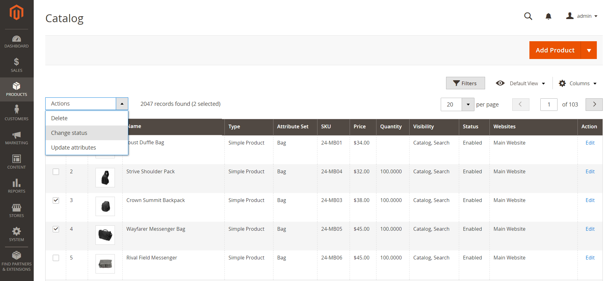
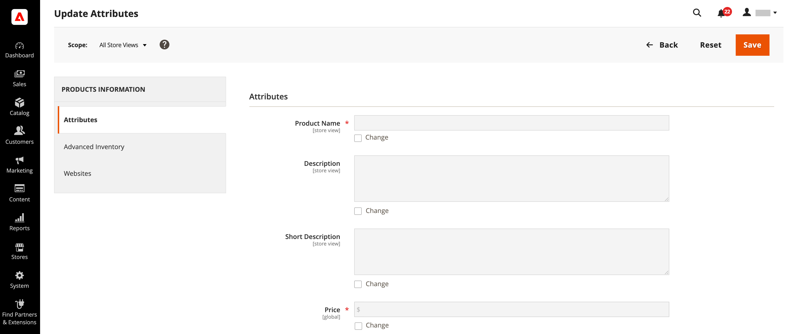

# Actions Control

When working with a collection of records in the grid, you can use the Actions control to apply an operation to one or more records. The Actions control lists each operation that is available for the specific type of data. For example, you can use the Actions control to update the attributes of selected products, to change the status from `Disabled` to `Enabled`, or to delete records from the database.

You can make as many changes as necessary, and then update the records in a single step. It is much more efficient than changing the settings individually for each product. Applying edits to a batch of records is an asynchronous operation, which executes in the background so that you can continue working in the Admin without waiting for the operation to finish. The system displays a message when the task is complete.

The selection of available actions varies by list, and additional options might appear, depending on the action selected. For example, when changing the status of a group of records, a Status box appears next to the Actions control with additional options.

<!-- zoom -->

## Step 1: Select records

The checkbox in the first column of the list identifies each record that is a target for the action. The [filter controls](admin-grid-controls.md) can be used to narrow the list to the records you want to target for the action.

1. Select the checkbox of each record that is a target for the action. Or, use one of the following **[!UICONTROL Actions]** to select a group of records:

   - Select or deselect  `All`
   - Select or deselect `All on This Page`

1. If needed, set the filters at the top of each column to show only the records that you want to include.

## Step 2: Apply an action to selected records

1. Set the **[!UICONTROL Actions]** control to the operation that you want to apply.

   **Example:** Update Attributes

   - In the list, select the checkbox of each record to be updated.

   - Set the **[!UICONTROL Actions]** control to `Update Attributes` and click **[!UICONTROL Submit]**.

      The Update Attributes page lists all the available attributes, organized by group in the panel on the left.

      <!-- zoom -->

   - Select the **[!UICONTROL Change]** checkbox next to each attribute and make the necessary changes.

   - Click **[!UICONTROL Save]** to update the attributes for the group of selected records.

1. When complete, click **[!UICONTROL Submit]**.

## Actions

|Action|Description|
|--- |--- |
|[!UICONTROL Select All]|Marks the checkbox of all records in the list.|
|[!UICONTROL Unselect All]|Clears the checkbox of all records in the list.|
|[!UICONTROL Select All on This Page]|Marks the checkbox of records on the current page.|
|[!UICONTROL Deselect All on This Page]|Clears the checkbox of records on the current page.|

{style="table-layout:auto"}
