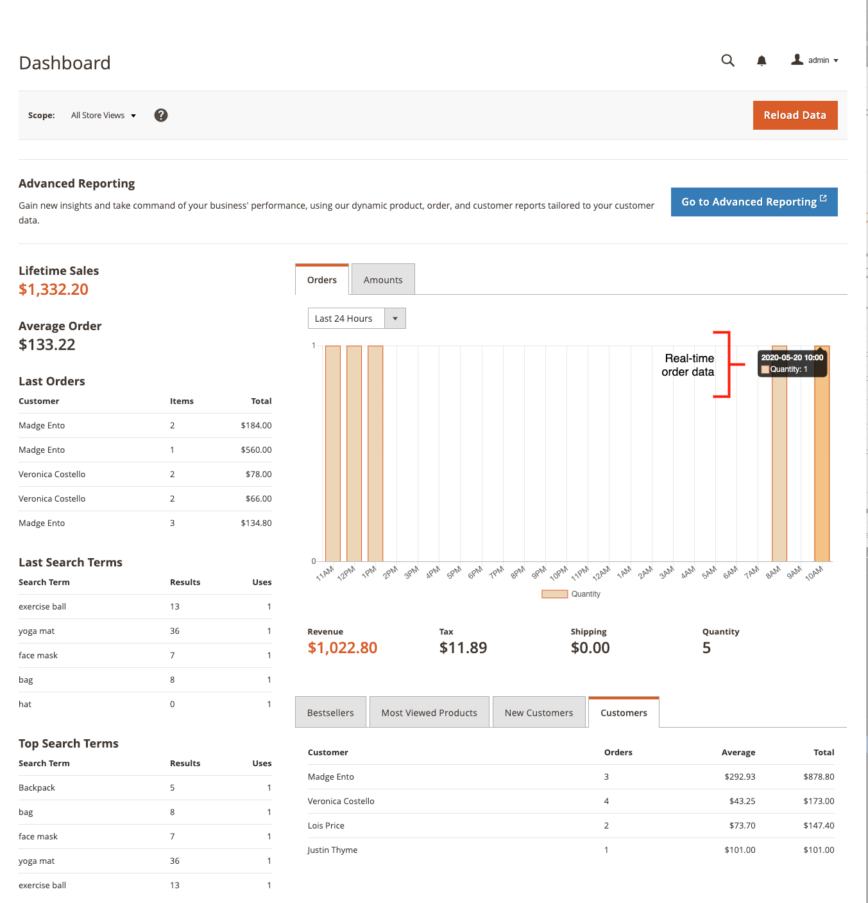
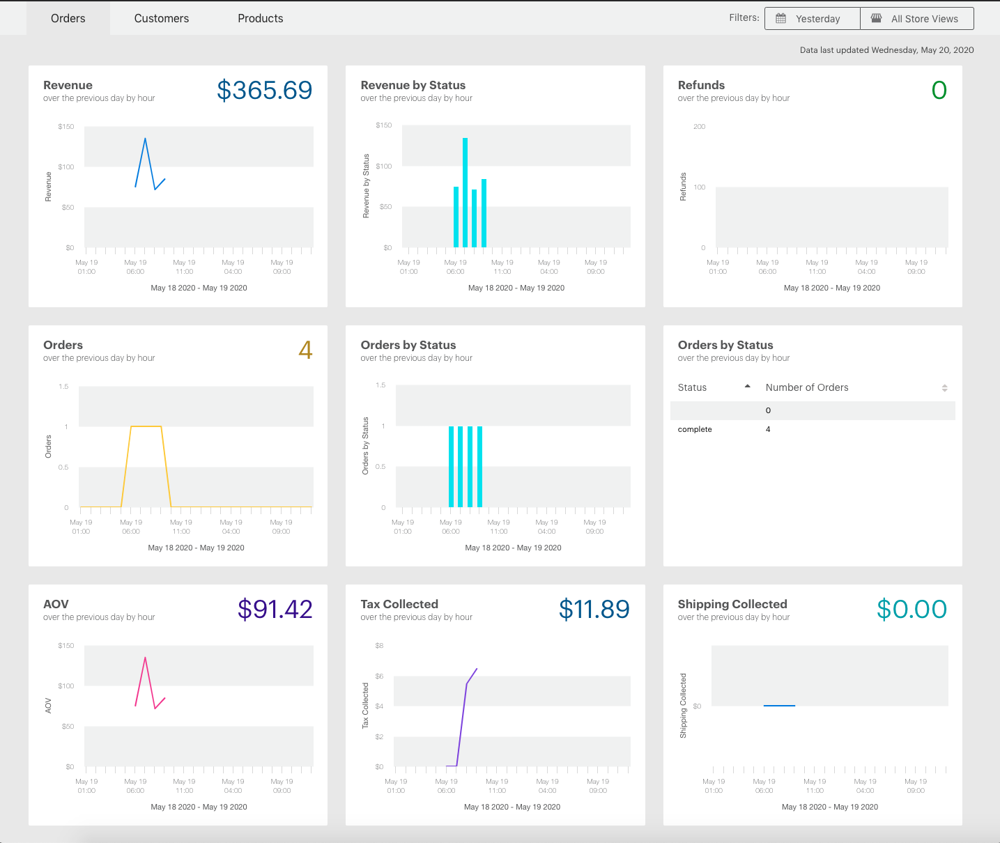
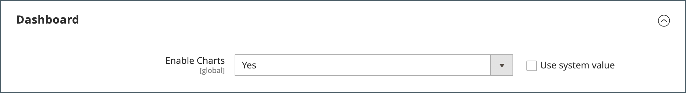
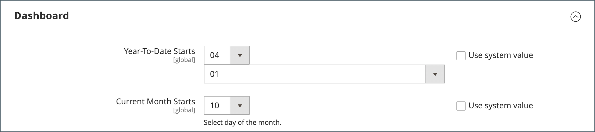
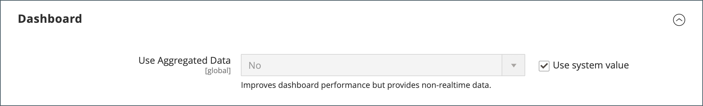

# Admin dashboard

The dashboard is usually the first page that appears when you log in to the _Admin_ and can provide a real-time overview of sales and customer activity. Dashboard data provides a snapshot of lifetime sales, average order amount, recent orders, and search terms. The chart shows completed orders and amounts for the selected date range, and can be generated from either dynamic, real-time data, or historical aggregated data. The tabs at the bottom provide quick reports of your best-selling products, most viewed products, new customers, and customers who have purchased the most.

If you have a significant amount of data to process, the chart can be turned off to improve performance. The dashboard in the following example is configured to use real-time data and shows completed orders by the hour for the last 24 hours. The chart is updated for each completed order.

{zoomable="yes"}

[Advanced Reporting](business-intelligence.md#advanced-reporting) displays a personalized dashboard based on your product, order, and customer data.

{zoomable="yes"}

## Configure the dashboard

1. On the _Admin_ sidebar, go to **[!UICONTROL Stores]** > _[!UICONTROL Settings]_ > **[!UICONTROL Configuration]** and complete any of the following settings.

1. When the configuration is complete, click **[!UICONTROL Save Config]**.

1. After saving the changes, click **[!UICONTROL Cache Management]** and refresh every invalid cache.

### Enable charts

If you have a large amount of data to process, you can turn off the display of the chart to improve performance. When not enabled, the message "No Data Found" appears in place of the chart, although the summary totals below are still generated.

1. In the left side panel under **[!UICONTROL Advanced]**, choose **[!UICONTROL Admin]**.

1. If necessary, expand the **[!UICONTROL Dashboard]** section.

   {width="400"}

1. To change the default value, clear the **[!UICONTROL Use system value]** checkbox.

1. Set **Enable Charts** to `Yes`.

For more information about the Admin configuration options, see the [Configuration Reference Guide](../configuration-reference/advanced/admin.md).

### Change the startup page

The dashboard is the default [startup page](../configuration-reference/advanced/admin.md) for the Admin, although you can configure a different startup page.

1. If you do not already have the Admin configuration options open, choose **[!UICONTROL Admin]** under _[!UICONTROL Advanced]_ in the left panel.

1. Click to expand the **Startup Page** section.

   {width="400"}

1. Clear the **[!UICONTROL Use system value]** checkbox and choose the **Startup Page** that you want to appear when you log in to the Admin.

### Choose the starting dates

1. In the left side panel under **[!UICONTROL General]**, choose **Reports**.

1. On the page, expand the **[!UICONTROL Dashboard]** section.

   {width="400"}

1. Clear the **[!UICONTROL Use system value]** checkboxes for the date settings and do the following:

   - Set **Year-To-Date Starts** to the **Month** and **Day**.

   - Set **Current Month Starts** to the **Day**.

For more information about the [!UICONTROL Reports] configuration options, see the [_Configuration Reference Guide_](../configuration-reference/general/reports.md).

### Configure the data source

The dashboard chart can be generated in real time or by using historical, aggregated data. If performance is an issue, you can speed up things by using aggregated data.

1. In the left side panel, click to expand **Sales** and choose **Sales**.

1. On the page, expand the **[!UICONTROL Dashboard]** section.   

   {width="400"}

1. Clear the **[!UICONTROL Use system value]** checkbox and set **[!UICONTROL Use Aggregated Data]** to one of the following:

   - For historical, aggregated data, choose `Yes`.
   - For real-time data, choose `No`.

## Chart sections

|Section|Description|
|--- |--- |
|[!UICONTROL Orders]|This tab displays a real-time chart of all completed orders for the current store view and specified time period.|
|[!UICONTROL Amounts]|This tab displays a real-time chart of all completed order amounts for the current store view and specified time period.|
|[!UICONTROL Time Range]|Determines the data that is represented in the chart and summary totals below. Options: `Last 7 Days` / `Current Month` / `YTD` / `2YTD`|
|[!UICONTROL Summary Totals]|The revenue, tax, shipping, and quantity totals below the chart are based on the chart data and current time range setting.|

{style="table-layout:auto"}

## Snapshot data

|Section|Description|
|--- |--- |
|[!UICONTROL Lifetime Sales]|The aggregated total sales during the lifetime of the store.|
|[!UICONTROL Average Order]|The average order amount during the lifetime of the store.|
|[!UICONTROL Last Orders]| A summary of the last five placed orders.|
|[!UICONTROL Last Search Terms]|The last five search terms.|
|[!UICONTROL Top Search Terms]|The five most commonly used search terms.|

{style="table-layout:auto"}

## Report tabs

|Section|Description|
|--- |--- |
|[!UICONTROL Bestsellers]|The five best-selling products during the specified time period.|
|[!UICONTROL Most Viewed Products]|The five products viewed the most during the specified time period.|
|[!UICONTROL New Customers]|The most recent five customers who registered for an account during the specified time period.|
|[!UICONTROL Customers]|The last five customers with an order that completed processing during the specified time period.|

{style="table-layout:auto"}

## Dashboard buttons

|Button|Description|
|--- |--- |
|[!UICONTROL Reload Data]|Refreshes dashboard data.|
|[!UICONTROL Go to Advanced Reporting]|Displays a personalized dashboard of dynamic charts and reports based on your product, order, and customer data. For more extensive analysis, see [Advanced Reporting](business-intelligence.md#advanced-reporting).|

{style="table-layout:auto"}
