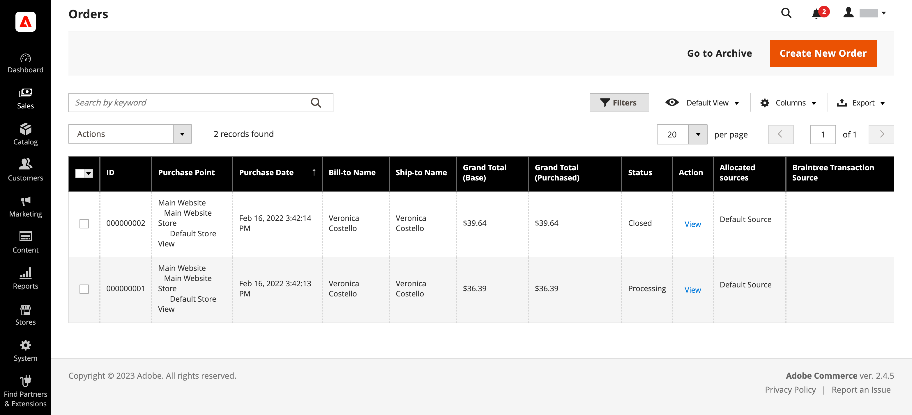
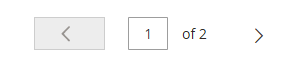
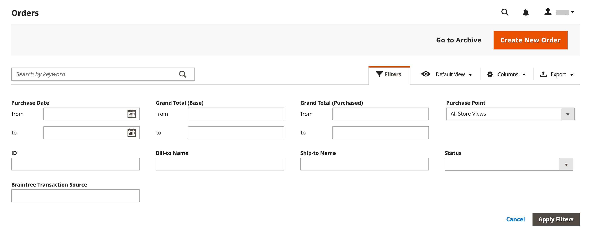
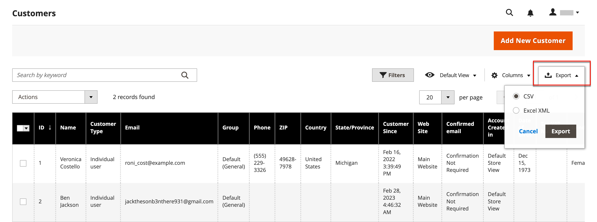
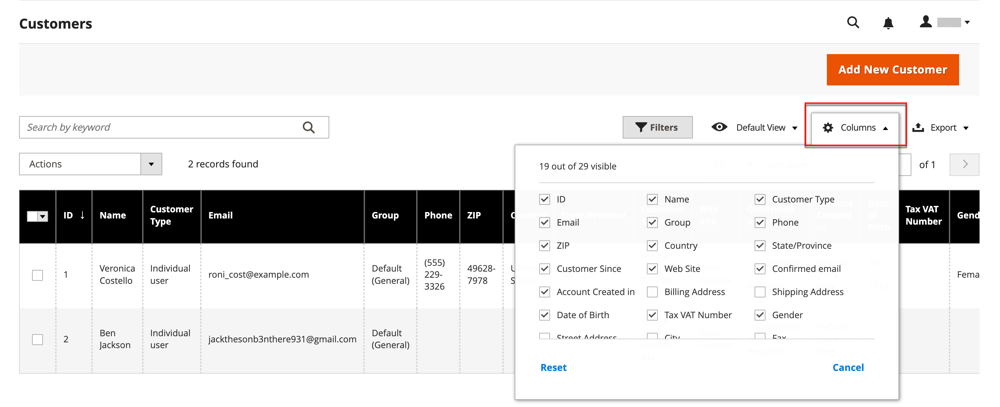

# Admin grid controls

Admin pages that manage data display a collection of records in a grid. The controls at the top of each column can be used to sort the data. The current sort order is indicated by an ascending or descending arrow in the column header. You can specify which columns appear in the grid, and drag them into different positions. You can also save different column arrangements as views that can be used later. The **[!UICONTROL Action]** column lists operations that can be applied to an individual record. In addition, date from the current view of most grids can be exported to a [CSV](../systems/data-csv.md) or XML file.

{width="700"}

## Sort the list

1. Click any column header.

   The arrow indicates the current order as either ascending or descending.

1. Use the pagination controls to view additional pages in the collection.    

   {width="300"}

## Paginate the list

1. Set the **[!UICONTROL Pagination]** control to the number of records that you want to view per page.

1. Click **[!UICONTROL Next]** and **[!UICONTROL Previous]** to page through the list, or enter a specific **[!UICONTROL Page Number]**.

## Filter the list

1. Click **[!UICONTROL Filters]**.

1. Complete as many filters as necessary to describe the record you want to find.

1. Click **[!UICONTROL Apply Filters]**.

    {zoomable="yes"}

## Export data

1. Select the records that you want to export.

   >[!NOTE]
   >
   >Product data cannot be exported from the grid. To learn more, see [Export](../systems/data-export.md).

1. On the _Export_ () menu in the upper-right corner, choose one of the following file formats:

   - `CSV`
   - `Excel XML`

   {zoomable="yes"}

1. Click **[!UICONTROL Export]**.

1. Look for the downloaded file of exported data at the location used for downloads by your browser.

## Grid Layout

The selection of columns and their order in the grid can be changed according to your preference, and saved as a _view_. You can control which attributes show in the grid under the individual attribute configuration. Having many attributes displayed in the product grid may affect admin load time and performance.

{zoomable="yes"}

### Change the selection of columns

1. In the upper-right corner, click the _Columns_ () control.

1. Change the column selections:

   - Select the checkbox of any column that you want to add to the grid.
   - Clear the checkbox of any column that you want to remove from the grid.
   - To return the default grid view, click **[!UICONTROL Reset]**.

  Make sure to scroll down to see all available columns.

### Move a column

1. Click the header of the column and hold.

1. Drag the column to the new position and release.

### Save a grid view

1. Click the _View_ () control.

1. Click **[!UICONTROL Save Current View]**.

1. Enter a **[!UICONTROL name]** for the view.

1. To save all changes, click the _Arrow_ ().

   The name of the view now appears as the current view.

### Change the grid view

1. Click the _View_ () control.

1. Do one of the following:

   - To use a different view, click the name of the view.
   - To change the name of a view, click the _Edit_ () icon and update the name.
   - To delete a view, click the _Edit_ () icon and then click the _Delete_ () icon.
