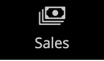
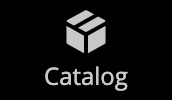
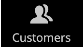
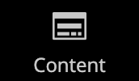
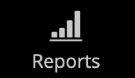
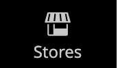
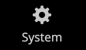
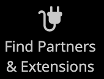

# The Admin Sidebar

The sidebar on the left is the main menu for the store _Admin_, and is designed for both desktop and mobile devices. The flyout menu provides access to all the tools that you use to manage your store daily.

| Menu icon | Link | Description |
| --------- | ---- | ----------- |
|  | **[Admin Startup Page](https://docs.magento.com/user-guide/configuration/advanced/admin.html)** | Displays the Admin startup page, which is the Dashboard by default. |
|  | **[Dashboard](admin-dashboard.md)** | The Dashboard provides a quick overview of the sales and customer activity in your store, and is usually the first page that appears when you log in to the Admin. |
|  | **[Sales](https://docs.magento.com/user-guide/sales/sales-menu.html)** | The Sales menu is where you can find everything related to the operations of processing orders, invoices, shipments, credit memos, and transactions. |
|  | **[Catalog](https://docs.magento.com/user-guide/catalog/catalog-menu.html)** | The Catalog menu is used to create products and define categories. |
|  | **[Customers](https://docs.magento.com/user-guide/customers/customers-menu.html)** | The Customers menu is where you can manage customer accounts, and see which customers are online at the moment. |
|  | **[Marketing](https://docs.magento.com/user-guide/marketing/marketing-menu.html)** | The Marketing menu is where you set up catalog and shopping cart price rules and coupons. Price rules trigger actions when a set of specific conditions is met. |
|  | **[Content](https://docs.magento.com/user-guide/cms/content-menu.html)** | The Content menu is where you manage the content elements and design of your store. Learn how to create pages, blocks, and frontend apps, and manage the presentation of your store. |
|  | **[Reports](reports-menu.md)** | The Reports menu provides a broad selection of reports that give you insight into every aspect of your store, including sales, shopping cart, products, customers, tags, reviews, and search terms. |
|  | **[Stores](https://docs.magento.com/user-guide/stores/stores.html)** | The Stores menu includes tools to configure and maintain every aspect of your store, including multisite installation settings, taxes, currency, product attributes, and customer groups. |
|  | **[System](https://docs.magento.com/user-guide/system/system.html)** | The System menu includes tools to manage system operations, install extensions, and manage Web Services for integration with other applications. |
|  | **[Find Partners & Extensions](commerce-marketplace.md)** | The COmmerce Marketplace is where you can find Adobe Commerce and Magento Open Source solutions for your store. |

{style="table-layout:auto"}
