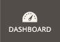
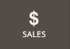
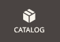
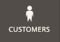
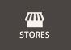
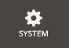

# The Admin sidebar

The sidebar on the left is the main menu for the store _Admin_ and is designed for both desktop and mobile devices. The flyout menu provides access to all the tools that you use to manage your store daily.

| Menu icon | Link | Description |
| --------- | ---- | ----------- |
|  | **[Admin Startup Page](../configuration-reference/advanced/admin.md)** | Displays the Admin startup page, which is the Dashboard by default. |
|  | **[[!UICONTROL Dashboard]](admin-dashboard.md)** | The Dashboard provides a quick overview of the sales and customer activity in your store, and is usually the first page that appears when you log in to the Admin. |
|  | **[[!UICONTROL Sales]](../stores-purchase/sales-menu.md)** | The [!UICONTROL Sales] menu is where you can find everything related to the operations of processing orders, invoices, shipments, credit memos, and transactions. |
|  | **[[!UICONTROL Catalog]](../catalog/catalog-menu.md)** | The [!UICONTROL Catalog] menu is used to create products and define categories. |
|  | **[[!UICONTROL Customers]](../customers/customers-introduction.md)** | The [!UICONTROL Customers] menu is where you can manage customer accounts, and see which customers are online at the moment. |
|  | **[[!UICONTROL Marketing]](../merchandising-promotions/marketing-menu.md)** | The [!UICONTROL Marketing] menu is where you set up catalog and shopping cart price rules and coupons. Price rules trigger actions when a set of specific conditions is met. |
|  | **[[!UICONTROL Content]](../content-design/content-menu.md)** | The [!UICONTROL Content] menu is where you manage the content elements and design of your store. Learn how to create pages, blocks, and frontend apps, and manage the presentation of your store. |
|  | **[[!UICONTROL Reports]](reports-menu.md)** | [!BADGE PaaS only]{type=Informative url="https://experienceleague.adobe.com/en/docs/commerce/user-guides/product-solutions" tooltip="Applies to Adobe Commerce on Cloud projects (Adobe-managed PaaS infrastructure) and on-premises projects only."} The [!UICONTROL Reports] menu provides a broad selection of reports that give you insight into every aspect of your store, including sales, shopping cart, products, customers, tags, reviews, search terms, and 24/7 real-time performance monitoring and recommendations from the [Site-Wide Analysis Tool](https://experienceleague.adobe.com/en/docs/commerce-operations/tools/site-wide-analysis-tool/intro). |
|  | **[[!UICONTROL Stores]](../stores-purchase/stores-menu.md)** | The [!UICONTROL Stores] menu includes tools to configure and maintain every aspect of your store, including multisite installation settings, taxes, currency, product attributes, and customer groups. |
|  | **[[!UICONTROL System]](../systems/system-menu.md)** | The [!UICONTROL System] menu includes tools to manage system operations, install extensions, and manage web services for integration with other applications. |
|  | **[[!UICONTROL Find Partners & Extensions]](commerce-marketplace.md)** | [!BADGE PaaS only]{type=Informative url="https://experienceleague.adobe.com/en/docs/commerce/user-guides/product-solutions" tooltip="Applies to Adobe Commerce on Cloud projects (Adobe-managed PaaS infrastructure) and on-premises projects only."} The [!DNL Commerce Marketplace] is where you can find Adobe Commerce and Magento Open Source solutions for your store. |

{style="table-layout:auto"}
