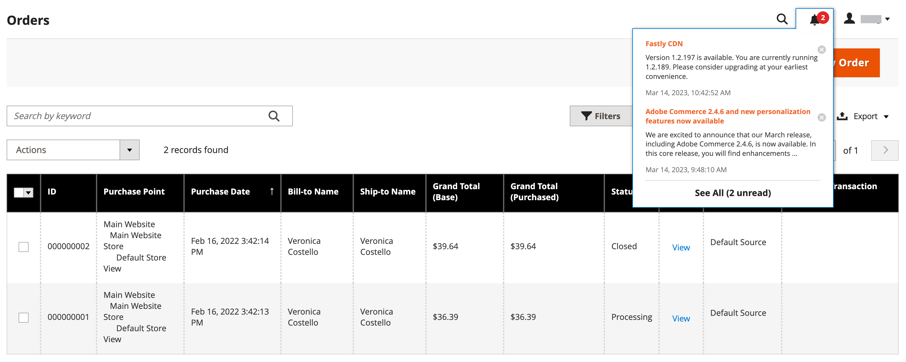
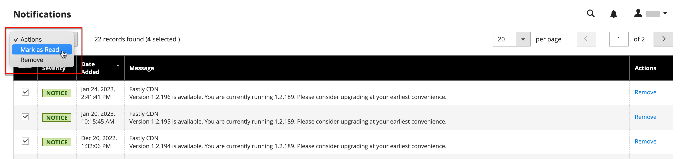

# Admin message inbox

Your store receives messages from Adobe regularly. The messages are rated by importance and might refer to system updates, patches, new releases, scheduled maintenance, or upcoming events. The bell icon in the header indicates the number of unread messages in your inbox.

{width="700"}

The _[!UICONTROL Notifications]_ page lists all messages ranked by date. The _[!UICONTROL Action]_ commands can be used to mark individual messages as read, view more detailed information, or to remove the message from the inbox.

The configuration determines how often the inbox is updated, and how the messages are delivered. If your store Admin has a secure URL, notifications must be delivered over HTTPS.

## View new incoming messages

1. Click the **[!UICONTROL Notification]** icon in the header and read the summary.

1. Do one of the following:

   - If necessary, click the message to display the full text.
   - To delete the message, click the delete icon to the right of the message.
   - To display the full Notifications list, click **[!UICONTROL See All]**.

## Address a critical message

For a message of critical importance, do one of the following:

- Click **[!UICONTROL Read Details]**.
- To dismiss the alert box but keep the message active, click **[!UICONTROL Close]**.

## Administer your notifications

1. Do one of the following to open the Notifications page:

   - Click the **[!UICONTROL Notification]** icon in the header. If there are one or more new messages displayed, click **[!UICONTROL See All]**.

   - On the _Admin_ sidebar, go to **[!UICONTROL System]** > _[!UICONTROL Other Settings]_ > **[!UICONTROL Notifications]**.

1. In the **[!UICONTROL Action]** column, do any of the following:

   - For more information, click **[!UICONTROL Read Details]** to open the linked page in a new window.

   - To keep the message in your inbox, click **[!UICONTROL Mark As Read]**.

      {zoomable="yes"}

   - To delete the message, click **[!UICONTROL Remove]**.

1. To apply an action to multiple messages, do one of the following:

   - Select the checkbox in the first column for each message to be managed.
   - To select multiple messages, set the **[!UICONTROL Mass Actions]** control as needed.

1. Set the **[!UICONTROL Actions]** control to one of the following:

   - `Mark as Read`
   - `Remove`

1. Click **[!UICONTROL Submit]** to complete the process.

## Configure notifications

1. On the _Admin_ sidebar, go to **[!UICONTROL Stores]** > _[!UICONTROL Settings]_ > **[!UICONTROL Configuration]**.

1. In the left panel, expand **[!UICONTROL Advanced]** and choose **[!UICONTROL System]**.

1. Expand the **[!UICONTROL Notifications]** section.
   
   {width="400"}

1. If your store Admin runs over a [secure URL](../stores-purchase/store-urls.md), set **[!UICONTROL Use HTTPS to Get Feed]** to  `Yes`.

1. Set **[!UICONTROL Update Frequency]** to determine how often your inbox is updated.

   The interval can be from one to 24 hours.

1. When complete, click **[!UICONTROL Save Config]**.

For more information about the [!UICONTROL System] configuration options, see the [Configuration Reference Guide](../configuration-reference/advanced/system.md).
