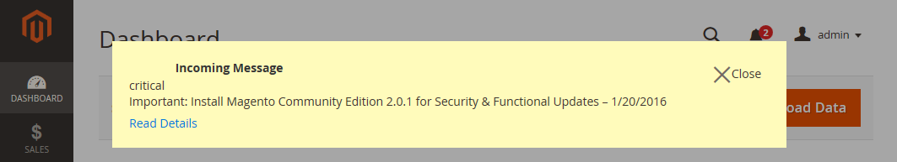

# Admin Message Inbox

Your store receives messages from Adobe regularly. The messages are rated by importance and might refer to system updates, patches, new releases, scheduled maintenance, or upcoming events. The bell icon in the header indicates the number of unread messages in your inbox.

<!-- zoom -->

Any message of critical importance appears in a pop-up window when you log into your store. The notice continues to appear after each login until the message is either marked as read or removed.

<!-- zoom -->

The _Notifications_ page lists all messages ranked by severity, with the most recent at the top. The Action commands can be used to mark individual messages as read, view more detailed information, or to remove the message from the inbox.

The configuration determines how often the inbox is updated, and how the messages are delivered. If your store Admin has a secure URL, notifications must be delivered over HTTPS.

## View new incoming messages

1. Click the **Notification** icon in the header and read the summary.

1. Do one of the following:

   - If necessary, click the message to display the full text.
   - To delete the message, click the delete icon to the right of the message.
   - To display the full Notifications list, click **See All**.

## Address a critical message

For a message of critical importance, do one of the following:

- Click **Read Details**.
- To dismiss the alert box but keep the message active, click **Close**.

## Administer your notifications

1. Do one of the following to open the Notifications page:

   - Click the **Notification** icon in the header. If there are one or more new messages displayed, click **See All**.

   - On the _Admin_ sidebar, go to **System** > _Other Settings_ > **Notifications**.

1. In the **Action** column, do any of the following:

   - For more information, click **Read Details** to open the linked page in a new window.

   - To keep the message in your inbox, click **Mark As Read**.

      <!-- zoom -->

   - To delete the message, click **Remove**.

1. To apply an action to multiple messages, do one of the following:

   - Select the checkbox in the first column for each message to be managed.
   - To select multiple messages, set the **Mass Actions** control as needed.

1. Set the **Actions** control to one of the following:

   - `Mark as Read`
   - `Remove`

1. Click **Submit** to complete the process.

## Configure notifications

1. On the _Admin_ sidebar, go to **Stores** > _Settings_ > **Configuration**.

1. In the left panel, expand **Advanced** and choose **System**.

1. Expand the **Notifications** section and do the following:

   - If your store Admin runs over a [secure URL](https://docs.magento.com/user-guide/stores/store-urls.html), set **Use HTTPS to Get Feed** to  `Yes`.

   - Set **Update Frequency** to determine how often your inbox is updated.

      The interval can be from one to 24 hours.

   <!-- zoom -->

1. When complete, click **Save Config**.

For more information about the System configuration options, see the [Configuration Reference Guide](https://docs.magento.com/user-guide/configuration/advanced/system.html).
