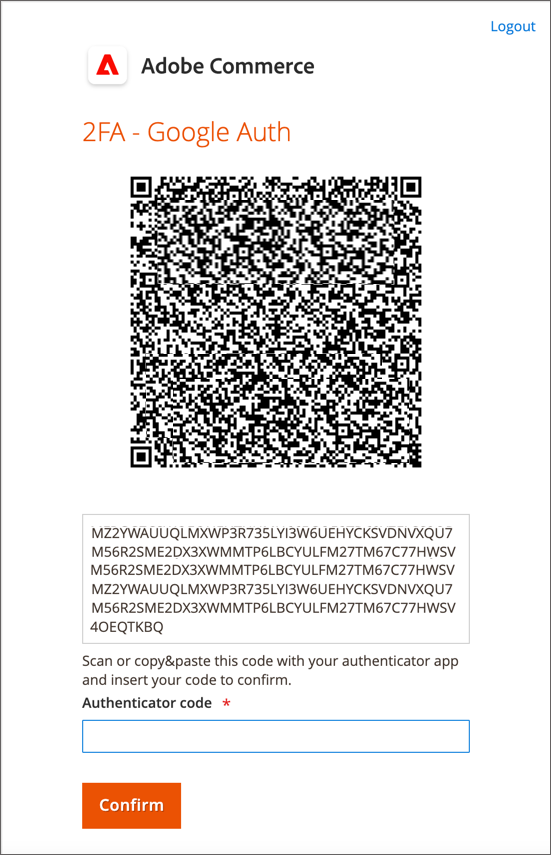
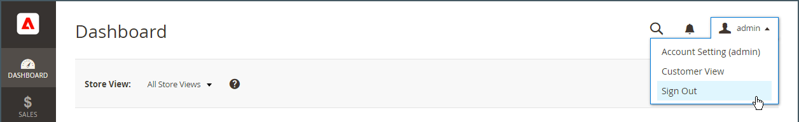
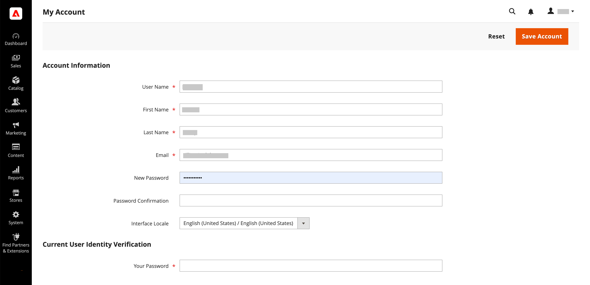
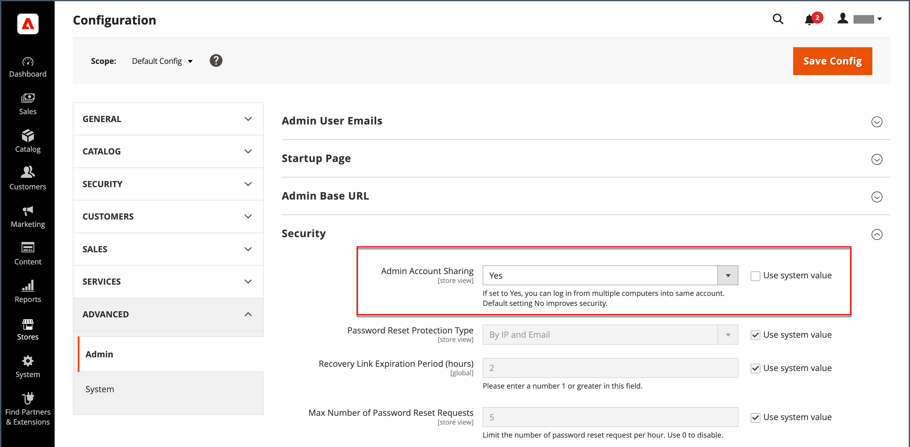

# Your Admin account

The primary Admin account was initially set up during the installation, and might contain initial placeholder information or sample data information. The designated owner of this account can personalize the user name and password and update the first name, last name, and email address at any time. This account, a _super user_ with all permissions by default, typically creates the Admin user accounts needed for the business.

- See [Create a user](../systems/permissions-users-all.md#create-a-user) for information on adding or editing users.

- See [Permissions](../systems/permissions.md) and [User Roles](../systems/permissions-user-roles.md) for information about Admin and user roles.

{{ims-admin-note}}

## Admin sign-in

The [!DNL Commerce] _Admin_ is protected by multiple layers of security measures to prevent unauthorized access to your store, order, and customer data. The first time you sign in to the _Admin_, you are required to enter your username and password and to set up [two-factor authentication](../systems/security-two-factor-authentication.md) (2FA).

Depending on the configuration of your store, there may be a [CAPTCHA](../systems/security-google-recaptcha.md) challenge to resolve, such as entering a series of keyboard characters, solving a puzzle, or clicking a series of images with a common theme. These tests are designed to identify you as a human, rather than an automated bot.

For additional security, you can determine which parts of the _Admin_ each user has [permission](../systems/permissions.md) to access, and also limit the number of [login attempts](../configuration-reference/advanced/admin.md). By default, after six attempts the account is locked, and the user must wait a few minutes before trying again. [Locked accounts](../systems/permissions-users-all.md#locked-users) can also be reset from the _Admin_.

>[!NOTE]
>
>The first time you sign in to the _Admin_, you are prompted to _Allow admin usage data collection_. See [Usage data collection](admin.md#usage-data-collection) for more information.

{width="400"}

### Step 1: Set up two-factor authentication

Before you can sign in to the _Admin_ of your store, you must have a two-factor authentication solution set up and ready to use. To learn more about the authentication process used by each solution, see [Using Two-Factor Authentication](../systems/security-two-factor-authentication-use.md). By default, [!DNL Commerce] supports [Google Authenticator][1].

Ask your [!DNL Commerce] system administrator which 2FA solutions are supported for the store. Then, complete the setup of your preferred 2FA solution according to the provider's instructions.

### Step 2: Sign in to the Admin

1. Enter the _Admin_ URL that was specified during the [!DNL Commerce] installation.

   The default _Admin_ URL looks something like `https://www.yourdomain.com/your-custom-admin-domain`.

   >[!NOTE]
   >
   >Although this documentation uses `admin` as the base URL in most examples, it is recommended that you choose a unique and hard-to-guess [custom URL](../stores-purchase/store-urls.md) for the _Admin_ of your store.

   You can add a bookmark for the page or save a shortcut on your desktop for easy access.

1. Enter your _Admin_ **[!UICONTROL Username]** and **[!UICONTROL Password]**.

1. (Optional) If a CAPTCHA is enabled for your store, follow the onscreen instructions to resolve the challenge.

   To learn more, see [CAPTCHA](../systems/security-captcha.md) and [reCAPTCHA](../systems/security-google-recaptcha.md).

1. Click **[!UICONTROL Sign in]**.

   If it is the first time you have signed in to the _Admin_ from the account, you should receive an email with a link to configuration instructions.

### Step 3: Complete the 2FA configuration

The following example shows how to pair your _Admin_ account with Google Authenticator.

1. When the QR code appears, use one of the following methods to capture the code and pair Google Authenticator with your _Admin_ account.

   {width="400"}

   - Capture QR Code using a smart phone

      On your smart phone, launch Google Authenticator. Tap the _plus sign_ (+) in the upper-right corner of the app. Then at the bottom of the screen, tap **[!UICONTROL Scan Barcode]** and take a picture of the QR code.

   - Capture QR Code from browser

      If Google Authenticator is installed as an extension in your browser, click the **Authenticator** icon in the toolbar and capture the page.

   - Manually enter QR code

      Copy the string of text below the QR code. Launch Google Authenticator with either your smart phone or browser, and click the plus sign (+). Then, choose **[!UICONTROL Manual Entry]**. Under **[!UICONTROL Account]**, enter the email address that is associated with your _Admin_ account and paste the QR code string into the **[!UICONTROL Key]** field.

1. To sign in to the _Admin_ with two-factor authentication, enter the six-digit code generated by Google Authenticator into the **[!UICONTROL Authenticator code]** field, and then click **[!UICONTROL Confirm]**.

   {width="400"}

## Reset your password

Reuse of the last four passwords assigned to the account is not allowed.

1. Enter the **[!UICONTROL Email Address]** that is associated with the _Admin_ account.

   {width="400"}

1. Click **[!UICONTROL Retrieve Password]**.

   If an account is associated with the email address, an email is sent to reset your password.

   >[!NOTE]
   >
   >An _Admin_ password must be seven or more characters long and include both letters and numbers. See [Configuring _Admin_ Security](../systems/security-admin.md) for information about password options.

## Sign out of the Admin

1. In the upper-right corner, click the _Account_ () icon.

1. Click **[!UICONTROL Sign Out]**.

   {width="700" zoomable="yes"}

The _[!UICONTROL Sign In]_ page displays a message that you are logged out. Sign out of the _Admin_ whenever you leave your computer unattended.

## Edit account information

1. Click the _Account_ () icon.

1. Click **[!UICONTROL Account Setting]**.

   {width="700" zoomable="yes"}

1. Make necessary changes to your account information.

   If you change your login credentials, ensure you store them in a secure location.

1. Enter your current account password.

1. Click **[!UICONTROL Save Account]**.

## Allow multiple Admin logins

The Admin provides access to manage the orders, customers, products, shipping, and payments functionalities. The default configuration is set to disallow multiple logins for an Admin user account as a security best practice. However, you can change this setting to allow Admin users to be logged in from multiple devices to accommodate your business workflows.

1. On the _Admin_ sidebar, go to **[!UICONTROL Stores]** > _[!UICONTROL Settings]_ > **[!UICONTROL Configuration]**.

1. In the left navigation panel, expand **[!UICONTROL Advanced]** and choose **[!UICONTROL Admin]**.

1. Expand  the **[!UICONTROL Security]** section.

1. For **Admin Account Sharing**, select `Yes`.

   {width="700" zoomable="yes"}

1. Click **[!UICONTROL Save Config]**.

## Set Admin user login names as case sensitive

1. On the _Admin_ sidebar, go to **[!UICONTROL Stores]** > _[!UICONTROL Settings]_ > **[!UICONTROL Configuration]**.

1. In the left navigation panel, expand **[!UICONTROL Advanced]** and choose **[!UICONTROL Admin]**.

1. Expand  the **[!UICONTROL Security]** section.

1. Set the **[!UICONTROL Login is Case Sensitive]** field to `Yes`.

1. Click **[!UICONTROL Save Config]**.

[1]: https://play.google.com/store/apps/details?id=com.google.android.apps.authenticator2&hl=en_US

## Maintan secure access to the Admin

To ensure the security of your admin, conduct regular audits of users and roles with admin access.

Additionally, consider [updating the Admin Base URL configuration](https://experienceleague.adobe.com/en/docs/commerce-admin/config/advanced/admin#admin-base-url) to change the default `/admin` endpoint to a custom path. Configuring a custom path provides the following security benefits:

**Enhanced Security**: The default "admin" path is widely known and often targeted by malicious actors attempting brute force attacks. By changing it to a unique, custom value, you significantly reduce the risk of unauthorized access attempts.

**Reduced Vulnerability**: Automated bots frequently scan for common paths like "admin" to exploit vulnerabilities. A custom path makes it harder for these bots to locate your admin login page, thereby reducing the likelihood of attacks.

**Improved Privacy**: A custom admin path adds an extra layer of obscurity, making it more difficult for potential attackers to identify and target your admin login page.

**Compliance with Best Practices**: Following security best practices, such as customizing your admin path, demonstrates a proactive approach to protecting your e-commerce site and customer data.

>[!NOTE]
>
>If a breach is suspected, make sure to remove all unknown Admin users and reset all Admin passwords and review the [Security action plan](https://experienceleague.adobe.com/en/docs/commerce-admin/systems/security/security) for further steps.
