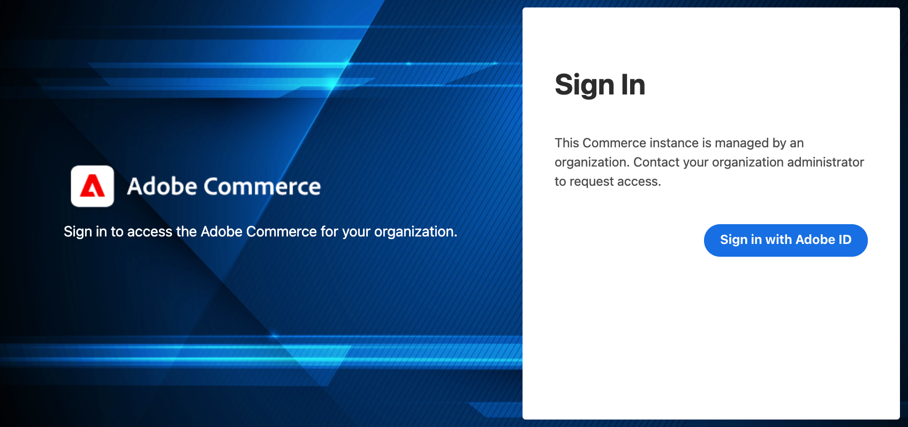
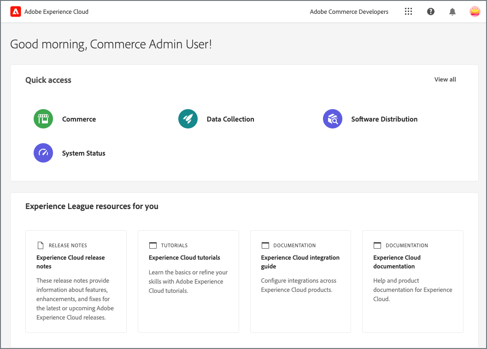
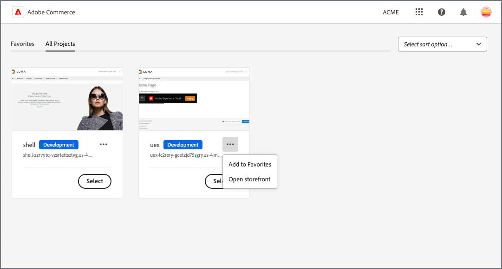
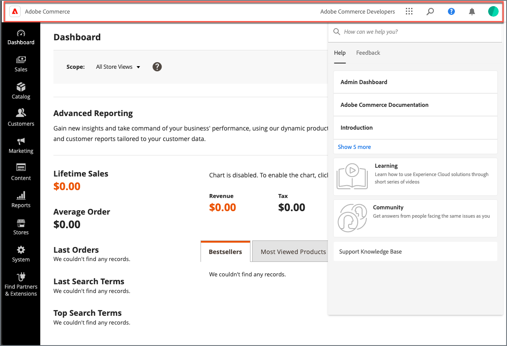

# Configure the Experience Cloud Integration with the Commerce Admin

>[!NOTE]
>
>This feature is for Beta users only and is not yet accessible to all customers. Contact your Adobe Commerce Beta program manager for assistance and questions.

Get started with the Commerce Admin Integration with Experience Cloud by configuring the Commerce application to use the Commerce Admin Unified Experience and Commerce Events extensions.


## Prerequisites

- Adobe Commerce must be configured to use [Adobe IMS authentication](../getting-started/adobe-ims-config.md)
- Account provisioning and permissions—Administrators must have an [Adobe business profile](https://helpx.adobe.com/enterprise/kb/introducing-adobe-profiles.html#:~:text=Adobe%20profiles%20help%20you%20manage,under%20the%20same%20email%20address) with access to the following resources to configure the Experience Cloud integration:
  - [Adobe Admin Console](https://helpx.adobe.com/enterprise/admin-guide.html)—Add and manage Adobe user and developer accounts for the organization
  - [Adobe Developer Console](https://developer.adobe.com/developer-console/docs/guides/getting-started/)—Developer or system administrator access to create App Builder projects and generate the connection credentials and project configuration to use the Adobe I/O Events service
  - [Commerce on cloud infrastructure project](https://experienceleague.adobe.com/docs/commerce-cloud-service/start/onboarding.html#get-started-with-the-project-web-interface)—Install required modules and configure the Commerce application server using the Adobe Commerce CLI
  - [Commerce Admin](https://experienceleague.adobe.com/docs/commerce-admin/start/guide-overview.html)—Update store configuration and manage Commerce user accounts

## Configuration overview

Enable the integration by completing the following tasks:

1. [Check the Commerce environment and application configuration](#check-the-commerce-environment-and-application-configuration).

1. [Enable the Commerce Admin Unified Experience extension](#enable-the-commerce-admin-unified-experience-extension).

1. [Set up Adobe I/O Events for Commerce](#set-up-adobe-io-events).

1. [Test the integration](#test-the-integration).

## Check the Commerce environment and application configuration

Before configuring the Experience Cloud integration, verify that your project and Commerce application meet the requirements.

1. On your local workstation, change to the project directory for your Commerce project.

1. Check out the environment branch for the instance to integrate with Experience Cloud.

1. Verify that Adobe IMS is enabled.

   - Use the [SSH Access URL](https://experienceleague.adobe.com/docs/commerce-cloud-service/user-guide/develop/secure-connections.html) for the environment to connect to the Commerce application server.

   - From the command line, use the Adobe Commerce CLI to check the IMS module status.

     ```bash
     bin/magento admin:adobe-ims:status
     ```

    If the module is not enabled, [enable it using the Organization and credentials for the IMS integration project](../getting-started/adobe-ims-config.md#step-3-enable-the-adminadobeims-module). If you don't have the credentials, [submit an Adobe Support ticket](https://experienceleague.adobe.com/docs/commerce-knowledge-base/kb/help-center-guide/magento-help-center-user-guide.html#submit-ticket).

1. Verify that the Admin user can log into the Commerce Admin using their Adobe ID.

   - Go to the Commerce Admin URL.

   - If you are logged in, log out.

   - Ensure that the Admin user is redirected to log in using their Adobe ID.

     {width="600" zoomable="yes"}

1. From the cloud project directory on your local workstation, verify that the Commerce Admin Unified Experience extension is installed.

   ```bash
   composer show *unified-experience*
   ```

   If the extension is installed, Composer returns the extension name and description.

   ```
   magento/module-unified-experience <version> Commerce module responsible for integration with Adobe Experience Cloud
   ```

   If the extension is not installed, use Composer to install it. Then, commit the changes and redeploy the cloud environment.

   ```
   composer require magento/module-unified-experience
   composer update
   ```

## Enable Commerce Admin Unified Experience

Enable the Commerce Admin Unified Experience extension, and then log in through Experience Cloud.

>[!NOTE]
>
>These instructions show how a Commerce Cloud project administrator can enable the extension using the Adobe Commerce CLI. Commerce Admin users can also enable the extension by updating the [Commerce store configuration settings](admin-unified-experience-integration-manage.md#from-the-commerce-admin).

1. From the root directory of your Cloud project environment on your local workstation, use the [magento-cloud CLI tool](https://experienceleague.adobe.com/docs/commerce-cloud-service/user-guide/dev-tools/cloud-cli.html) to log in to the Commerce application server.

   ```bash
   magento-cloud ssh
   ```

1. Enable the `magento/module-unified-experience` extension using the Adobe Commerce CLI:

   ```bash
   bin/magento config:set admin/unified_experience/enabled 1
   Admin Unified Experience integration is enabled
   ```

1. Clear the cache.

   ```bash
   bin/magento cache:clean
   ```

## Set up Adobe I/O Events for Commerce

After you enable the Admin Unified Experience extension, set up the Adobe I/O Events service.

When the Experience Cloud integration is enabled, the Adobe I/O Events service is required to send Commerce event data to Experience Cloud to manage administrator access to Commerce projects.

To enable the Adobe I/O Events service, complete the following set up and configuration tasks.

- Enable the Adobe I/O Events for Commerce extension (`magento/commerce-eventing`) on the cloud environment

- Configure the Commerce Events integration to send data from the Commerce instance to the Adobe I/O Events service.

### Enable Commerce Events

Enable the Commerce Events extension (`magento/commerce-eventing`) on the cloud environment. This extension must be enabled to send custom event data from the Commerce application to the Adobe I/O Events service.

>[!NOTE]
>
>The Commerce Events extension is loaded automatically as a dependency of the Admin Unified Experience extension. It is available with Commerce 2.4.6 and later.

1. From your local Commerce project development environment, add the following configuration to the `.magento.env.yaml` file.

     ```yaml
     stage:
       global:
         ENABLE_EVENTING: true
       deploy:
         CRON_CONSUMERS_RUNNER:
           cron_run: true
           max_messages: 0
           consumers: []
     ```

1. Add, commit, and deploy the updated `.magento.env.yaml file` to the cloud environment.

>[!TIP]
>
>For details on configuring and managing environment variables using the `.magento.env.yaml` file, see [Configure environment variables for deployment](https://experienceleague.adobe.com/docs/commerce-cloud-service/user-guide/configure/env/configure-env-yaml.html)

### Configure the Commerce Events integration

Complete the following tasks to configure the Commerce Events integration by following the detailed instructions in the [Adobe I/O Events for Commerce](https://developer.adobe.com/commerce/events/get-started/project-setup/) developer documentation.

1. [Create an App Builder project](https://developer.adobe.com/commerce/events/get-started/project-setup/) to receive event data from the Commerce instance.

   You need credentials and configuration data from the App Builder project to configure the integration in the Commerce Admin.

1. Configure Adobe Commerce to use Adobe I/O Events.

   - [Update the Store Configuration settings for the Adobe I/O Events service](https://developer.adobe.com/commerce/events/get-started/configure-commerce/#begin-configuring-events-on-commerce).

   - [Configure an event provider to send Commerce events](https://developer.adobe.com/commerce/events/get-started/configure-commerce/#create-an-event-provider-and-complete-the-commerce-configuration).

1. [Update the App Builder project to receive event data from the Commerce instance](https://developer.adobe.com/commerce/events/get-started/configure-commerce/#subscribe-and-register-events).

   Do not register or subscribe to events from the Commerce instance. The event registration is pushed to the App Builder project when you configure the event provider for the Commerce application.

   After connecting the event provider to the App Builder project, subscribe to the `observer.uex_commerce_instance_update` event and save the changes.

1. To establish the connection, send an event through the event provider to the consumer.

   - From the command line in the local cloud project directory, [use SSH to connect to the Commerce application server](https://experienceleague.adobe.com/docs/commerce-cloud-service/user-guide/develop/secure-connections.html#connect-to-a-remote-environment).

     ```bash
     magento-cloud ssh
     ```

   - Send event data by checking the status of the Admin Unified Experience extension using the Adobe Commerce CLI.

     ```bash
     bin/magento bin/magento admin:uex:status
     ```

### Test the integration

Verify that a Commerce Administrator can log in to Experience Cloud to view available Commerce projects and access the Admin and Storefront for each project.

1. [Sign in to Experience Cloud](https://experiencecloud.adobe.com/login?referrer_uri=https://experiencecloud.adobe.com/library) using the Adobe ID and organization associated with the Commerce instance.

   {width="600" zoomable="yes"}

1. View available Commerce Projects by selecting [!UICONTROL Commerce].

   {width="600" zoomable="yes"}

1. Open the Commerce Admin for an instance by selecting **[!UICONTROL Open]**.

   {width="600" zoomable="yes"}

1. Verify that you can perform Admin tasks as expected.

   Workflows in the Commerce Admin should follow the same process. If you experience workflow changes or errors after enabling the Experience Cloud integration, contact your Commerce system administrator or [submit an Adobe Support ticket](https://experienceleague.adobe.com/docs/commerce-knowledge-base/kb/help-center-guide/magento-help-center-user-guide.html#submit-ticket).

After you configure the Experience Cloud integration for Commerce Admin, verify that Commerce administrator accounts are provisioned correctly to access Commerce projects through Experience Cloud. See [Manage Admin users](/help/getting-started/admin-unified-experience-integration-manage.md#manage-admin-user-accounts).
