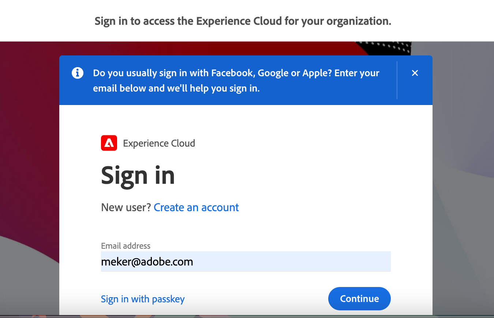

# Configure the Commerce Admin Integration with Experience Cloud

Get started with the Commerce Admin Integration with Experience Cloud by configuring the Commerce application to use the Commerce Admin Unified Experience and Commerce Events extensions.

## Prerequisites

- Adobe Commerce 2.4.5 or later
- Adobe IMS integration enabled on the cloud environment
- Account provisioning and permissions—Administrators must have access to the following resources to configure the integration for Commerce Admin:
  - [Adobe Admin Console](https://helpx.adobe.com/enterprise/admin-guide.html)—Add and manage Adobe user and developer accounts for the organization
  - [Adobe Developer Console](https://developer.adobe.com/developer-console/docs/guides/getting-started/)—Developer or system administrator access to generate connection credentials and information for the Adobe I/O Events service
  - [Commerce on cloud infrastructure project](https://experienceleague.adobe.com/docs/commerce-cloud-service/start/onboarding.html?lang=en#get-started-with-the-project-web-interface)—Install required modules and configure the Commerce application server using the Adobe Commerce CLI
  - [Commerce Admin](https://experienceleague.adobe.com/docs/commerce-admin/start/guide-overview.html)—Update store configuration and manage Commerce user accounts


## Configuration Overview

To set up the Experience Cloud integration for a Commerce instance, complete the following steps.

1. Check the Commerce application environment.

1. Enable the Commerce Admin Unified Experience extension

1. Connect to the Adobe I/O Events

1. Test the integration.

## Check the Commerce application and environment

- Verify that IMS is enabled on the Commerce instance
- Verify that Commerce Admin accounts for the Cloud instance can successfully authenticate when IMS is enabled
- Verify that the required extensions are available in the cloud project environment

1. On your local workstation, change to the project directory for your Commerce on cloud project.

1. Check out the environment branch for the instance you plan to configure.

1. Verify that Adobe IMS is enabled.

   - Use the [SSH Access URL](https://experienceleague.adobe.com/docs/commerce-cloud-service/user-guide/develop/secure-connections.html) for the environment to connect to the Commerce application server.

   - From the command line, use the Adobe Commerce CLI to check the IMS module status.

     ```bash
     bin/magento admin:adobe-ims:status
     ```

    If the module is not enabled, [enable it using the Organization and credentials for the IMS integration project](../getting-started/adobe-ims-config.md#step-3-enable-the-adminadobeims-module). If you don't have the credentials, submit an Adobe Support ticket.

1. Verify that the Admin user can log into the Commerce Admin using their Adobe ID.

   - Go the Commerce Admin URL.

   - If you are logged in, log out.

   - Ensure that the Admin user is redirected to log in using their Adobe ID.

     {width="700" zoomable="yes"}

1. Verify that the Commerce Admin Unified Experience extension is available on your instance.

   - From the cloud project directory on your local workstation, use composer to find the extension.

     ```bash
     composer show *unified-experience**
     ```

    If the extension is installed, Composer returns the information about the extension.

    ```
    magento/module-unified-experience <version> Commerce module responsible for integration with Adobe Experience Cloud
    ```

    If the extension is not installed, use Composer to install it. Then, commit the changes and redeploy the cloud environment.

    ```
    composer require magento/module-unified-experience
    composer update
    ```

## Enable the Commerce Admin Unified Experience extension

Enable the Commerce Admin Unified Experience extension, and then log in through Experience Cloud.

1. From the root directory of your Cloud project environment on your local workstation, use the [magento-cloud CLI tool](https://experienceleague.adobe.com/docs/commerce-cloud-service/user-guide/dev-tools/cloud-cli.html) to log in to the Commerce application server.

   ```bash
   magento-cloud ssh
   ```

1. Enable the `magento/module-unified-experience` extension using the Adobe Commerce CLI:

   ```bash
   web@mymagento.0:~$ bin/magento config:set admin/unified_experience/enabled 1
   Admin Unified Experience integration is enabled
   ```

1. Clear the cache.

   ```bash
   web@mymagento.0:~$ bin/magento cache:clean
   Admin Unified Experience integration is enabled
   ```

1. Verify that you can log in to the Commerce Admin through Experience Cloud.

   - In an incognito browser window, navigate to the store Admin URL to sign in through Experience League.

     {width="700" zoomable="yes"}

1. Enter your Adobe ID to log in.

   If your Adobe ID is associated with more than one Organization ID, select the Organization ID associated with the Commerce instance.

1. After you log in, the Commerce Admin opens within the Experience Cloud interface.

   {width="700" zoomable="yes"}

## Set Up Adobe I/O Events

After you can log in successfully through Experience Cloud, set up the Adobe I/O Events service. The Commerce Admin Unified Experience extension uses the Adobe I/O Events service to send custom event data from the Commerce instance to Experience Cloud to coordinate workflows when the integration is enabled. Workflows include redirecting Commerce Admin requests through Experience Cloud and managing access to available Commerce projects.

To enable the Adobe I/O Events service, you complete the following set up and configuration tasks.

- Create an Adobe Developer App Builder project to consume the custom Commerce event data provided by the Commerce Admin Unified Experience extension and make it available to Adobe services and other third-party applications.

- Enable the Commerce Events extension (`magento/commerce-eventing`)  on the cloud environment. This extension manages the process to send custom event data from the Commerce application to the Adobe I/O Events service. The Commerce Events extension is installed automatically as a dependency of the Commerce Admin Unified Experience extension.

- Configure the Adobe I/O events service and Commerce event provider on the Commerce instance to send data from the Commerce instance to the App Builder project


>[!NOTE]
>
>The following procedure provides high-level instructions for setting up the Adobe I/O Events service with notes and links to more detailed documentation. Learn more about Adobe Developer App Builder and Adobe I/O events by completing the [Introduction to App Builder tutorial](https://experienceleague-review.corp.adobe.com/docs/commerce-learn/tutorials/adobe-developer-app-builder/introduction-to-app-builder.html#adobe-developer-app-builder).


Complete the following steps to configure the Adobe I/O events service for the Experience Cloud integration.

1. From the Adobe Developer Console, [create an App Builder project](https://developer.adobe.com/commerce/events/get-started/project-setup/) to consume event data from the Experience Cloud integration.

   - When you add and save the Adobe I/O Management API, the credentials to connect to the Commerce instance are downloaded to your local environment in a configuration file (`config.zip`).

   - After you add the Adobe I/O Events for Commerce API, download the workspace configuration file from the Workspace overview page by selecting **[!UICONTROL Download all]**.

1. From your local Commerce project development environment, enable Commerce Events by adding the following configuration to the `.magento.env.yaml` file. Then, add, commit, and deploy the change.

     ```yaml
     stage:
       global:
         ENABLE_EVENTING: true
       deploy:
         CRON_CONSUMERS_RUNNER:
           cron_run: true
           max_messages: 0
           consumers: []
     ```

1. [Configure Adobe Commerce to use the Adobe I/O Events service](https://developer.adobe.com/commerce/events/get-started/configure-commerce/).

1. From the Adobe Developer Console, [add the Commerce event provider to the App Builder project workspace, and then subscribe to all events from the Commerce Admin Unified Experience extension](https://developer.adobe.com/commerce/events/get-started/configure-commerce/#subscribe-and-register-events).

  {width="700" zoomable="yes"}


## Add Commerce Admin users to the Admin Console

Commerce Admin users must have accounts with the same name and primary email address:

- An Adobe Commerce Admin account
- An Adobe account

All Commerce Admin users must be a member of the Adobe organization provisioned on the Commerce instance.


## Test the integration

Verify that a Commerce Administrator can sign in to the Commerce Admin through Experience Cloud and access other Experience Cloud applications and services using the common interface.

1. Sign in to the Commerce Admin from Experience Cloud.

   - Copy and paste the default Admin URL for your Adobe Commerce environment into the address bar.

   - Log in to Experience Cloud

1. View available Commerce Projects

1. Open the Commerce Admin.

1. Verify access to Experience Cloud services

1. Verify that you can complete tasks in the Commerce Admin as expected.

