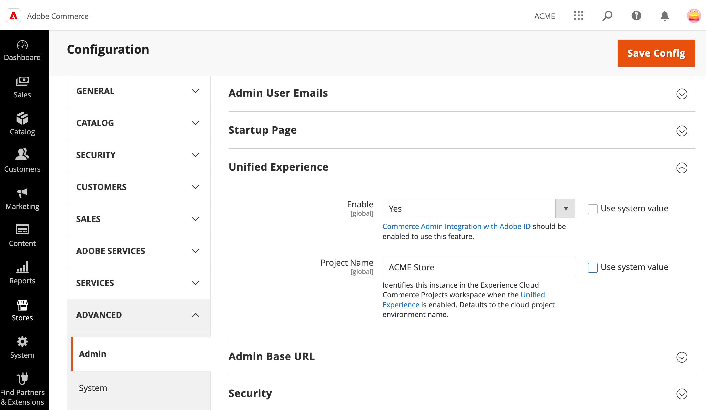

# Manage the Experience Cloud Integration

>[!NOTE]
>
> This feature is for Beta users only and is not yet accessible to all customers. Join the Beta by sending an email to [commerceonunifiedshell-beta@adobe.com](mailto:commerceonunifiedshell-beta@adobe.com).

After initial enablement, manage the status of the the Experience Cloud integration by enabling or disabling the Commerce Admin Unified Experience extension.

- If the Commerce Admin Unified Experience extension is enabled and administrator accounts are [provisioned correctly](#manage-admin-user-accounts), Commerce administrators can view and access available Commerce projects from Adobe Experience Cloud. Administrators can still access individual projects using the Admin URL for the Commerce project environment.

- If the Commerce Admin Unified Experience extension is disabled, access through Experience Cloud is disabled. Administrators must log in to individual projects using the Admin URL for the Commerce project environment.

>[!NOTE]
>
>If the Adobe Identity Management Service (IMS) integration is disabled, the Experience Cloud integration is disabled automatically.

## Manage the integration from the Admin

1. From the Commerce Admin, open the Store Configuration menu by selecting **[!UICONTROL Stores]** from the left navigation menu, and then select **[!UICONTROL Configuration]**.

1. From the Configuration menu, select **[!UICONTROL Advanced > Admin]**, and then expand the **[!UICONTROL Unified Experience option]**.

   {width="600" zoomable="yes"}

1. Enable or disable the integration by selecting the **[!UICONTROL Enable]** value.

1. Change the project name that displays in the Commerce Projects workspace by adding or updating the **[!UICONTROL Project Name]** value.

1. Save the configuration.

1. Clear the cache.

## Manage the integration using the Adobe Commerce CLI

Commerce system administrators with Admin access to the Commerce cloud project can use Adobe Commerce CLI commands to manage the Experience Cloud integration.

1. From your local development environment, log in to the cloud project.

   ```bash
   magento-cloud login
   ```

1. From the root directory of your Cloud project environment, connect to the Commerce application server.

   ```bash
   ssh magento-cloud
   ```

1. Check the status of the Admin Unified Experience extension:

   ```bash
   bin/magento admin:uex:status
   ```

1. Change the status of the extension to disable the integration

   - **Enable**—`bin/magento config:set admin/unified_experience/enabled 1`

   - **Disable**—`bin/magento config:set admin/unified_experience/enabled 0`

## Manage Admin user accounts

All Commerce Admin users must have both an Admin account on the Commerce instance and an Adobe user account (Adobe ID) to access Adobe products and services. Both accounts must be associated with the same email address.

- **Commerce Admin account**—[Manage Commerce Admin users](../systems/permissions-users-all.md) from the Admin for the Commerce instance. User accounts for Commerce administrators must be assigned the Admin role.

  System administrators on the Commerce project can use [SSH to connect to the remote environment](https://experienceleague.adobe.com/docs/commerce-cloud-service/user-guide/develop/secure-connections.html#connect-to-a-remote-environment), and use the Commerce CLI `admin:user:create` and `admin:user:unlock` commands to add or unlock Admin user accounts.

- **Adobe user account**–An administrator for the Adobe organization associated with the Commerce instance must log in to the Adobe Admin Console and add the Adobe ID for each Commerce administrator to the organization. Then, they must assign product entitlements and permissions to access the Commerce application. See [Configure Adobe Commerce users in the Adobe Admin Console](adobe-ims-config.md#step-4-configure-adobe-commerce-users-in-the-adobe-admin-console).

Administrators that manage the configuration for the Experience Cloud integration from the Adobe Developer Console must have an Adobe user account with System Administrator or Developer access.

>[!NOTE]
>
>An Adobe ID is an account created through Adobe that is required to access products and services through Experience Cloud. Commerce administrators that do not have an Adobe ID can [create a free account](https://helpx.adobe.com/manage-account/using/create-update-adobe-id.html) using the same email address they use to sign in to the Commerce Admin.
