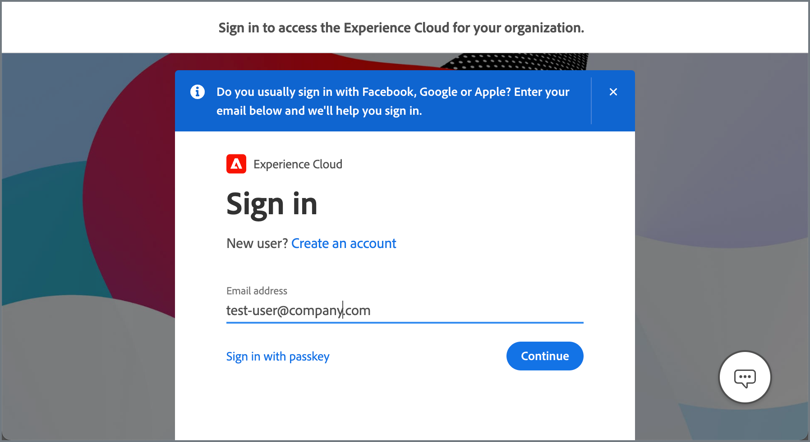

# Adobe Experience Cloud Integration for Commerce

<table style="border:1px solid red">
<tr><td> Exclusive feature only in Adobe Commerce (<a href="https://experienceleague.adobe.com/docs/commerce-admin/user-guides/home.html#product-editions">Learn more</a>)</td></tr>
</table>

Integrate Adobe Commerce projects with Experience Cloud by enabling the Admin Unified Experience extension. When the integration is active, administrators can access Commerce projects from Adobe Experience Cloud.

{width="700" zoomable="yes"}

## View available Commerce projects

Administrators can view Commerce projects that they have permission to access by selecting **[!UICONTROL Commerce]** from the Experience Cloud home page.

{width="700" zoomable="yes"}

Administrators can open the Admin and the Storefront for each project from the [!DNL Commerce Projects] workspace and view additional information.

- **Snapshot of Commerce storefront home page**—Snapshot of the storefront home page. If a project has multiple websites, the snapshot shows the home page for the default site.

- **[Project name](https://experienceleague.adobe.com/docs/commerce-cloud-service/user-guide/architecture/pro-develop-deploy-workflow.html)**—Identifies the cloud project environment for the instance. The Project name defaults to the [Git branch name](https://experienceleague.adobe.com/docs/commerce-cloud-service/user-guide/project/console-branches.html) in the cloud project. Change or update the project name in the [Unified Experience store configuration settings](admin-unified-experience-integration-manage.md#manage-the-integration-from-the-admin).

- **[Storefront URL](../stores-purchase/store-urls.md)**—Shows the base URL for the default website.

- **[Environment type](https://experienceleague.adobe.com/docs/commerce-cloud-service/user-guide/architecture/pro-develop-deploy-workflow.html)**—Commerce instances deployed to a development or staging environment are identified with a [!UICONTROL Development] or [!UICONTROL Staging] label. Instances that do not have a label are deployed to a Production environment.

- **Commerce Admin access**—Open the Admin by clicking **[!UICONTROL Open]**.

- **Storefront access**—Open the storefront by selecting **[!UICONTROL Open storefront]** from the options menu.

- **Quick access to select projects**—Select **[!UICONTROL Add to Favorites]** from the options menu to add a project to the [!UICONTROL Favorites] tab.

## Authentication flow

When the Experience Cloud integration is enabled, administrators use the following workflow to authenticate and access Commerce projects.

1. Log in through the Experience Cloud sign in page.

   {width="600" zoomable="yes"}

   Administrators must sign in to Experience Cloud with the Adobe business profile for the organization associated with the Commerce instance. See [Manage Adobe profiles](https://helpx.adobe.com/enterprise/using/manage-adobe-profiles.html).

1. On the Experience Cloud home page, open the [!UICONTROL Commerce Projects workspace] by selecting **[!UICONTROL Open]**.

1. Access the Admin for a project by selecting **[!UICONTROL Open]**.

1. On the Adobe Commerce Sign In page, select **[!UICONTROL Sign in with Adobe ID]** to complete authentication and open the Admin.

   {width="600" zoomable="yes"}

>[!NOTE]
>
>See [Manage the Experience Cloud Integration](admin-unified-experience-integration-manage.md) for details on how the authentication workflow is impacted when the Experience Cloud integration is enabled or disabled.

## Requirements

- Adobe Commerce 2.4.5 or later
- Adobe Commerce on cloud infrastructure
- Adobe Commerce extensions

  - Commerce Admin Unified Experience extension (`magento/module-unified-experience`)

    If the module is not available on the Commerce instance, it can be installed using Composer.

  - [Adobe I/O Events service](https://developer.adobe.com/commerce/extensibility/events/)—Required to send event data to manage administrator access to Commerce projects from Experience Cloud.

    The Adobe I/O Events integration with Commerce is enabled by the Commerce Event extension (`magento/commerce-eventing`) which is available with Adobe Commerce 2.4.4 and later versions.

## Enable the integration

Enable the integration by following the instructions to [Configure the Experience Cloud Integration with the Commerce Admin](admin-unified-experience-integration-configure.md).

>[!TIP]
>
>If the Experience Cloud integration is already enabled on the Commerce instance, see [Manage the Experience Cloud Integration](admin-unified-experience-integration-manage.md) for details about changing or updating the configuration, managing administrator access, and troubleshooting.
