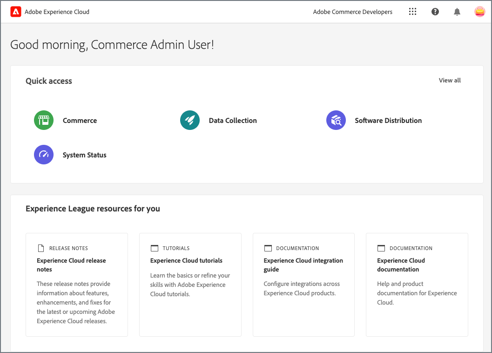
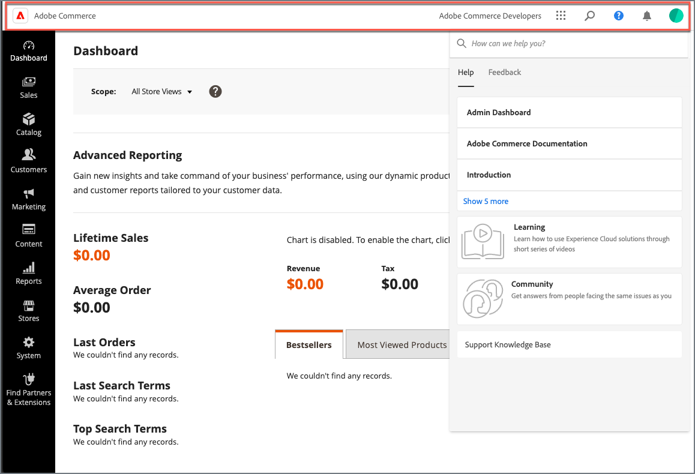
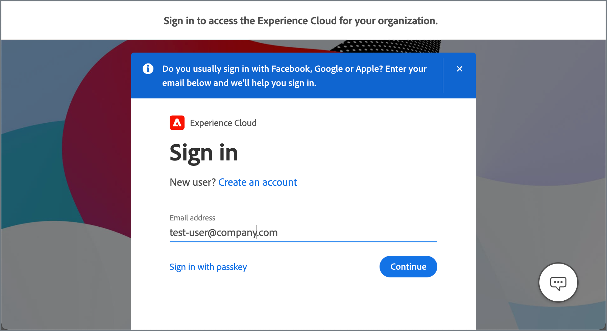

# Adobe Unified Shell for the Commerce Admin

Streamline cross-application workflows between Adobe Commerce and other Experience Cloud applications and improve the user experience by integrating the Commerce Admin with Adobe Unified Shell.

{width="700" zoomable="yes"}

When the extension is enabled, Commerce Admin users have single sign on access through Experience Cloud and a common interface to manage Experience Cloud applications and access Experience Cloud Platform services.

- **Commerce Admin users** continue using the same workflows to manage Commerce sites but can now complete additional tasks:

  - Search for product documentation, tutorials, and community posts
  - Access both Commerce-specific and global product announcements and notifications
  - Globally search within the context of the active application
  - Manage account preferences (alerts, notifications, and subscriptions)
  - Report issues or share ideas using the Feedback form
  - Switch seamlessly between Adobe Commerce and other Experience Cloud applications

- **Commerce application administrators** can deliver this enhanced experience by configuring the Commerce Admin for Unified Shell extension which enables the integration. The extension is available with Commerce 2.4.5 and later.

- **Commerce extension developers** can integrate with the Unified Shell application to deliver custom content, for example adding custom URLs to the integrated Help Center.

>[!IMPORTANT]
>
>This integration is available only for Commerce projects that use the  [Adobe Identity Management Service (IMS)](../getting-started/adobe-ims-config.md) for authentication.

## Using the Unified Shell application controls

When the Commerce Admin is integrated with Adobe Unified Shell, the Commerce Admin is hosted within the Unified Shell application framework which adds the Unified Shell application header.

{width="700" zoomable="yes"}

Commerce Admin users can access additional capabilities using the options available in the header.

| Option                                                     | Action                                                                                                                                                                                                                    |
|------------------------------------------------------------|---------------------------------------------------------------------------------------------------------------------------------------------------------------------------------------------------------------------------|
|             | Navigate seamlessly between Adobe Commerce and other Experience Cloud applications using the Application selector. The available applications and services are those provisioned for you within the current organization. |
|                    | Global search of the current application context. For example, from the Commerce Admin you can search for any value in the Commerce database including product, customer, and order records.                              |
|                      | Open the Experience Cloud Help Center to find product documentation, tutorials,and support articles in Adobe Experience League, and report issues or submit feedback.                                                     |
|           | View alerts and actionable updates, including product announcements, maintenance notices, and other important information                                                                                                 |
|  | View your user profile and set account preferences for notifications, subscriptions, and product data usage and collection                                                                                                |

{style="table-layout:auto"}

>[!NOTE]
>
>For details about the header controls and how to use them, see the [Experience Cloud Central Interface Components Guide](https://experienceleague.adobe.com/docs/core-services/interface/experience-cloud.html#support).

## Authentication Flow

When the Commerce Admin is integrated with Unified Shell, the Commerce Admin URL is redirected to a proxy URL. All Commerce Admin requests are then routed through the Unified Shell application.

If a Commerce Admin user opens the Commerce Admin URL configured for the project, they are are redirected to Experience Cloud to sign in.

{width="700" zoomable="yes"}

To authenticate, Commerce Admins must use their Adobe ID to sign in to the Experience Cloud organization associated with the Commerce environment.

>[!TIP]
>
>If your Adobe ID is associated with more than one organization, you might have to switch organizations to access the Commerce application. See [Sign in to Experience Cloud](https://experienceleague.adobe.com/docs/core-services/interface/experience-cloud.html#signin).

### Organization and Account provisioning and permissions

Organization and account provisioning required for the Unified Shell integration is performed by system administrators or developers with access to the root directory of the Commerce application and the Adobe Admin Console.

- Organization administrators create the organization and provision the user accounts, access permissions, and product entitlements.

  When a new user is added to an organization, they receive an invitation with information about their access rights, the organization they have been added to, and a link to sign in. See [Organizations in Experience Cloud](https://experienceleague.adobe.com/docs/core-services/interface/administration/organizations.html?lang=en).

- Commerce application administrators link the Commerce instance to an Adobe organization when they [configure the Adobe IMS integration](../getting-started/adobe-ims-config.md).

- Administrators with access to the organization from the Adobe Admin console can add and manage user accounts.  See [Configure Adobe Commerce users in the Admin Console](../getting-started/adobe-ims-config.md#step-4-configure-adobe-commerce-users-in-the-adobe-admin-console).

After organization and account provisioning is complete, Commerce Admin users can log in through Experience Cloud.

- Commerce Admin users must sign into the Unified Shell application using the Adobe business profile for the organization associated with the Commerce instance.  See [Manage Adobe profiles](https://helpx.adobe.com/enterprise/using/manage-adobe-profiles.html).

- Role and resource permissions for Commerce Admin user accounts are still managed from the Commerce application. Commerce Admin users with the required access can add or update permissions from the Commerce Admin [System menu](../systems/permissions.md).

>[!TIP]
>
>To troubleshoot authentication or permissions issues, contact the technical administrator for your Commerce project or submit an Adobe Support ticket.

## Requirements

Your Commerce project must meet the following requirements to enable the Commerce Admin on Unified Shell extension and configure the integration.

- Adobe Commerce 2.4.5 or later
- Commerce instance configured to use [Adobe IMS for authentication services](../getting-started/adobe-ims-config.md)

## Onboarding steps

1. Prepare the Commerce application environment.

1. Enable the Commerce Admin for Unified Shell integration using the Magento CLI.

1. Test the integration.

