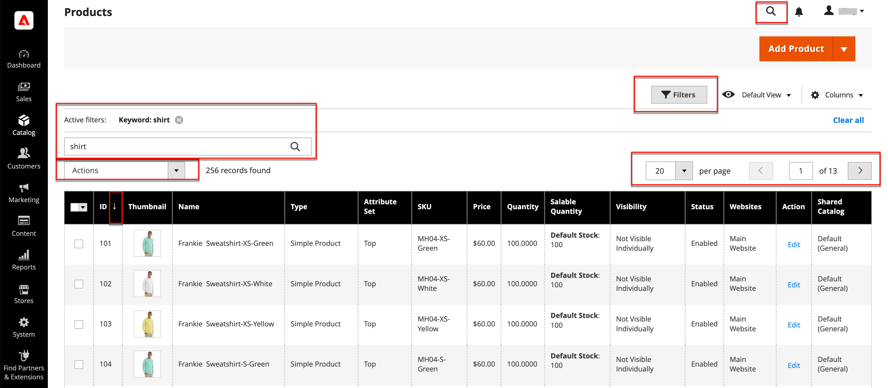
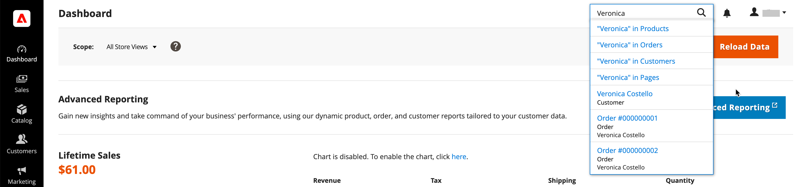

# The Admin Tools and Workspace

The Admin workspace provides access to all the tools, data, and content used to run your store. The default startup page can be set in the configuration. Many Admin pages have a grid that lists the data for the section, with a set of tools to search, sort, filter, select, and apply actions. By default, the [Dashboard](admin-dashboard.md) is the startup page for the Admin. However, you can choose any other page to appear as the startup page when you log in. You can click the logo in the Admin sidebar to return to the Admin startup page.

<!-- zoom -->

## Workspace controls

|Control|Description|
|--- |--- |
|Search|The Search box can be used to find any value in the database, including product, customer, and order records.|
|Sort|The header of each column can be used to sort the list in ascending or descending order.|
|Filters|Defines a set of search parameters that determines the records that appear in the grid. In addition, the filters in the header of some columns can be used to limit the list to specific values. Some filters have additional options that can be selected from a list box.|
|Default View|Determines the default column layout of the grid.|
|Columns|Determines the selection of [columns](admin-grid-controls.md) and their order in the grid. The column layout can be changed and saved as a _view_. By default, only some of the columns are included in the grid.|
|Paginate|The pagination controls are used to view the additional pages of results.|
|Actions|The Actions control applies an operation to all selected records.|
|Select|The Select control is used to select multiple records that are to be the target of action. Options: Select All / Deselect All|

## Workspace Search

To find any record in the database, use the magnifying glass icon in the header of the _Admin_. The results can include customers, products, orders, or any related attribute. For example, if you enter a customer name, the results might include the customer record and any orders that are associated with the name.

<!-- zoom -->

1. In the header, click the **magnifying glass** () to open the search box.

1. Do one of the following:

   - To find a close match, enter the first few letters of what you want to find.
   - To find an exact match, enter the word, or multiple words that you want to find.

1. In the displayed search results, click any item to open the record.

## Change the Admin startup page

The [dashboard](admin-workspace.md#the-dashboard) is the default startup page for the Admin, although you can configure a different startup page.

1. On the _Admin_ sidebar, go to **Stores** > _Settings_ > **Configuration**.

1. In the left side panel under **Advanced**, choose **Admin**.

1. Expand  the **Startup Page** section.

1. Set **Startup Page** to the page that you want to appear first after you log in to the Admin.

   <!-- zoom -->
   
   For a detailed list of all Admin options, see [Admin](https://docs.magento.com/user-guide/configuration/advanced/admin.html) in the _Configuration Reference_.

1. When complete, click **Save Config**.
