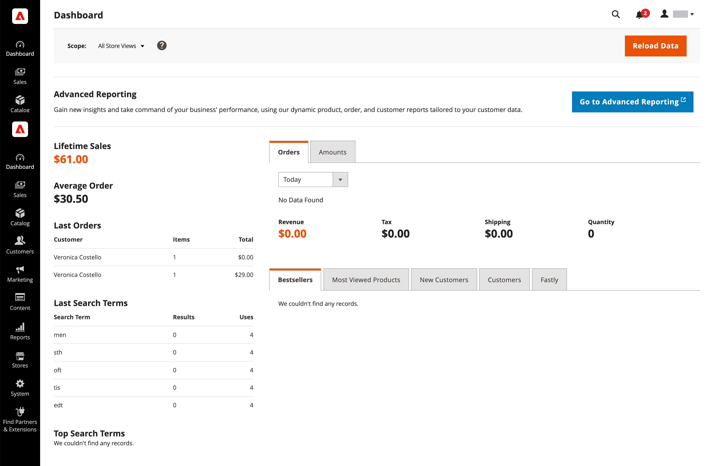
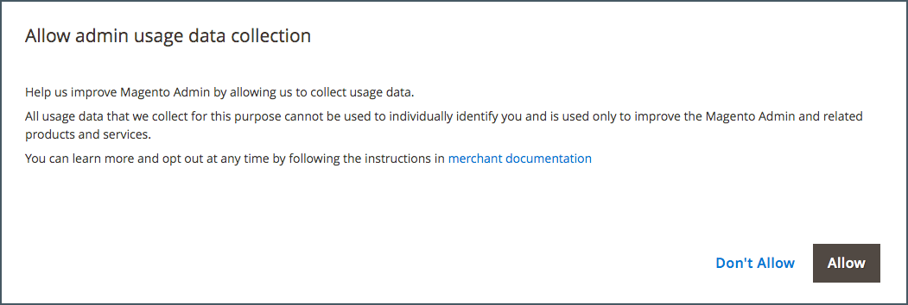

# What is the Admin?

Your store _Admin_ is the password-protected back office where you, as the merchant, set up products and promotions, manage orders, and perform other administrative tasks. All basic configuration tasks and store management operations are performed from the _Admin_.

For additional security, the _Admin_ login is protected by [two-factor authentication](../systems/security-two-factor-authentication.md), and can be configured to require a [CAPTCHA](../systems/security-captcha.md). To learn more, go to [Configuring Admin Security](../systems/security-admin.md).

{width="700" zoomable="yes"}

Your initial [sign-in](admin-signin.md) credentials were set up during Adobe Commerce or Magento Open Source installation. If you forget your password, a temporary password can be sent to the email address that is associated with the account. To increase security, configure your store to require a case-sensitive user name and strong password.

In addition to the default Admin user account, your business can create as many [additional accounts](../systems/permissions-users-all.md) that you require to manage the store and support customer accounts. Each account can be associated with a specific [role](../systems/permissions-user-roles.md) and level of access, based on business _need to know_. The email address that is associated with each Admin user account must be unique.

{{ims-admin-note}}

## Usage data collection

The first time you log in to the _Admin_, you are asked to grant Adobe permission to collect usage data for all Admin users. By allowing Admin usage data collection, you help Adobe improve the experience of using the Adobe Commerce Admin, and related products and services.

{width="400"}

Individual users are not identified in usage data. Yours data collection setting can be changed at any time from the [Admin Usage](../configuration-reference/advanced/admin.md#admin-usage) configuration.

For Adobe Commerce, allowing data collection also enables _In-Product Guidance_, which is designed to bring interactive content to the _Admin_. It provides help, tool tips, walk-through guides, onboarding information, feature announcements, and more.
