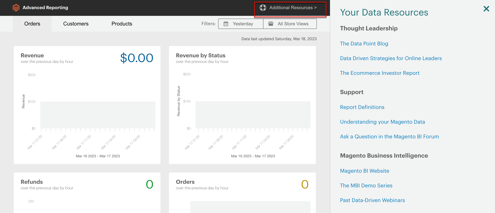
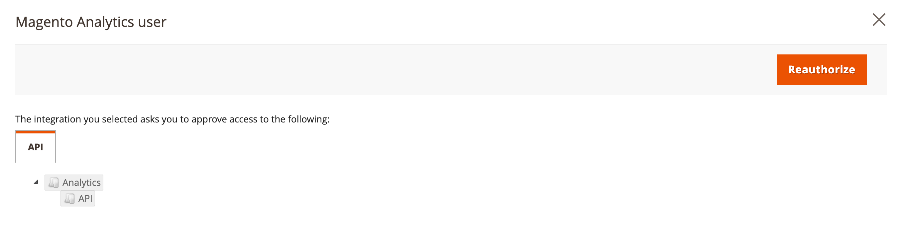
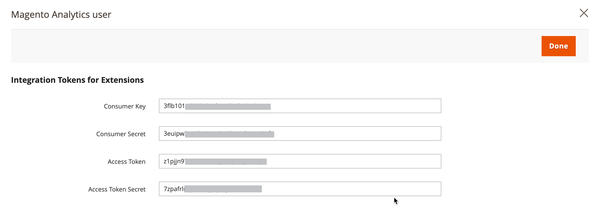

# [!DNL Business Intelligence] tools

Use business intelligence tools to gain the insight used to make sound business decisions.

## [!DNL Business Intelligence] account

When you activate a [!DNL Business Intelligence] account through Adobe, you get access to five dashboards with approximately 70 reports. These reports are designed to provide insights around your data and answer questions like "How are my orders growing month-over-month?", "Who are my most loyal customers?", and "Is my coupon strategy working?" For detailed information about this tool set, see the [MBI User Guide][1].

## [!DNL Advanced Reporting]

[!DNL Advanced Reporting] is included with Adobe Commerce and Magento Open Source. This feature gives you access to a suite of dynamic reports that are based on your product, order, and customer data, with a personalized dashboard that is tailored to your business needs. While [!DNL Advanced Reporting] uses [!DNL Business Intelligence] for analytics, you do not need to have a Business Intelligence account to use [!DNL Advanced Reporting].

For technical information, see the [[!DNL Advanced Reporting]][2]{:target="_blank"} topic in the developer documentation.

>[!NOTE]
>
>[!DNL Business Intelligence] accounts use built-in reporting, rather than the [!DNL Advanced Reporting] feature.

{width="700"}

### Requirements

* The website must run on a public web server.

* The domain must have a valid security (SSL) certificate.

* [!DNL Commerce] must have been installed or upgraded successfully without error.

* In the [!DNL Commerce] configuration for [store URLs](../stores-purchase/store-urls.md), the **[!UICONTROL Base URL (Secure)]** setting for the store view must point to the secure URL. For example: `https://yourdomain.com`.

* In the [!DNL Commerce] configuration for store URLs, **[!UICONTROL Use Secure URLs on Storefront]** and **[!UICONTROL Use Secure URLs in Admin]** must be set to `Yes`.

* [[!DNL Commerce] crontab][3] is created and cron jobs are running on the installed server.

>[!NOTE]
>
>[!DNL Advanced Reporting] can be used only with [!DNL Commerce] installations that have continually used a single [base currency](../stores-purchase/currency-configuration.md).


### Step 1: Enable [!DNL Advanced Reporting]

In the [!DNL Commerce] configuration, [[!DNL Advanced Reporting]](../configuration-reference/general/advanced-reporting.md) is enabled by default, and starts automatically if cron is [configured](../configuration-reference/advanced/system.md) and running. An attempt to establish the subscription is initiated at the beginning of each hour over the next 24-hours until successful. The subscription status is "pending" until the subscription is successfully established.

1. On the _Admin_ sidebar, go to **[!UICONTROL Stores]** > _[!UICONTROL Settings]_ > **[!UICONTROL Configuration]**.

1. In the left navigation panel where **[!UICONTROL General]** is expanded, choose **[!UICONTROL Advanced Reporting]** and do the following:

   * Verify that **[!UICONTROL Advanced Reporting Service]** is set to `Enable` (the default setting).

   * Set the **[!UICONTROL Time of day to send data]** to the hour, minute, and second, according to a 24-hour clock, that you want the service to receive updated data from your store. By default, data is sent at 2:00 AM.

   * Under **[!UICONTROL Industry Data]**, choose the **[!UICONTROL Industry]** that best describes your business.

   {width="400"}

1. When complete, click **[!UICONTROL Save Config]**.

1. When prompted, click **[[!UICONTROL Cache Management]](../systems/cache-management.md)** in the message at the top of the page and refresh any invalid caches.

1. Wait overnight, or until after the time of your next scheduled update. Then, check the status of your subscription. If the status is still _pending_, make sure that your installation meets all requirements.

### Step 2: Access [!DNL Advanced Reporting]

1. Do one of the following:

   * On the _Admin_ sidebar, choose **[!UICONTROL Dashboard]**. Then, click **[!UICONTROL Go to Advanced Reporting]**.
   * On the _Admin_ sidebar, go to **[!UICONTROL Reports]** > _[!UICONTROL Business Intelligence]_ > **[!UICONTROL Advanced Reporting]**.

   The [!DNL Advanced Reporting] dashboard provides a quick summary of your orders, customers, and products. Make sure to scroll down to see the full dashboard.

1. To get a better view of the data, set the **[!UICONTROL Filters]** in the upper-right corner to the time period and store view that you want to include in the report. Then, do the following:

   * Hover over any data point for more information.
   * To see all dashboard reports, click each tab.

   {width="600" zoomable="yes"}

## Access [!DNL Advanced Reporting] data resources

In the upper-right corner of the Advanced Reporting dashboard, click **[!UICONTROL Additional Resources]**.

{width="600" zoomable="yes"}

## Troubleshooting

If you get a 404 "Page Not Found" message, verify that your store meets the requirements for [!DNL Advanced Reporting]. Then, follow the instructions to verify that the integration is installed.

### Verify that the integration is active

1. On the _Admin_ sidebar, go to **[!UICONTROL System]** > _[!UICONTROL Extensions]_ > **[!UICONTROL Integration]**.

1. Verify that the **[!UICONTROL Magento Analytics user]** integration appears in the list and the **[!UICONTROL Status]** is `Active`.

1. To reestablish the user, click **[!UICONTROL Reauthorize]** and do the following:

   {width="600"}

   * When prompted, click **[!UICONTROL Reauthorize]** to approve access to the API resources.

      {width="600"}

   * Verify that the list of Integration Tokens for Extensions is complete. Then, click **Done**.

      {width="600"}

1. Look for the message that indicates the integration `Magento Analytics user` is reauthorized.

1. Wait overnight or until after the time of your next scheduled update.

### Verify single base currency

[!DNL Advanced Reporting] can be used only with [!DNL Commerce] installations that have used only a single [base currency](../stores-purchase/currency-configuration.md) since the time of installation. The result is that in the history, all orders use the same base currency. [!DNL Advanced Reporting] does not work if you have, at any time, changed your base currency and have orders in your history that were processed with different base currencies.

To determine if your store has multiple base currencies, you can query your [!DNL Commerce] database from the command line using the following MySQL example. You might be required to change the table names to match your data structure:

```sql
select distinct base_currency_code from sales_order;
```

### Data discrepancy

If you notice that the `Data last updated...` caption displays yesterday's date and not today's, there might be a delay of up to a day in the Advanced Reporting updates. This delay is due to a larger than expected queue size.

## Dashboard reports

**[!UICONTROL Orders]**

|Field|Description|
|--- |--- |
|[!UICONTROL Revenue]|Shows all revenue received by the store view during the defined time period.|
|[!UICONTROL Orders]|Shows all orders placed through the store view during the defined time period.|
|[!UICONTROL AOV]|Shows the average order value placed through the store view during the defined time period.|
|[!UICONTROL Refunds]|Shows all refunds processed through the store view during the defined time period.|
|[!UICONTROL Tax Collected]|Shows all tax collected through the store view during the defined time period.|
|[!UICONTROL Shipping Collected]|Shows all shipping fees collected through the store view during the defined time period.|
|[!UICONTROL Orders by Status]|Shows the number of orders by status, for the store view during the defined time period.|
|[!UICONTROL Orders by Status]|Lists a summary of  the number of orders by status.|
|[!UICONTROL Coupon Usage]|Lists all coupon codes  and the number of users for each, redeemed through the store view during the defined time period.|
|[!UICONTROL Orders and Revenue by Billing Region]|Lists the number of orders and revenue by region for the store view during the defined time period.|
|[!UICONTROL Tax Collected by Billing Region]|Lists the amount of tax collected by region for the store view during the defined time period.|
|[!UICONTROL Shipping Fees Collected by Shipping Region]|Lists the shipping fees collected by region for the store view during the defined time period.|

{style="table-layout:auto"}

**[!UICONTROL Customers]**

|Field|Description|
|--- |--- |
|[!UICONTROL Unique Customers]|Shows the number of unique customer accounts associated with the store view during the defined time period.|
|[!UICONTROL New Registered Accounts]|Shows the number of new customer accounts registered with the store view during the defined time period.|
|[!UICONTROL Top Coupon Users]|Lists the top coupon users by Customer ID, and the number of orders placed with coupons for the store view during the defined time period.|
|[!UICONTROL Customer KPI Table]|Lists  the number of orders, revenue, and average order value by Customer ID for the store view during the defined time period.|

{style="table-layout:auto"}

**[!UICONTROL Products]**

|Field|Description|
|--- |--- |
|[!UICONTROL Quantity of Products Sold]|Shows the number of products sold through the store view during the defined time period.|
|[!UICONTROL Products Added to Wishlists]|Lists all products added to wishlists through the store view during the defined time period.|
|[!UICONTROL Best Selling Products by Quantity]|Lists the best-selling products and quantity sold through the store view during the defined time period.|
|[!UICONTROL Best Selling Products by Revenue]|Lists the best-selling products and revenue generated by the sale of the product through the store view during the defined time period.|

{style="table-layout:auto"}


[1]: https://experienceleague.adobe.com/docs/commerce-business-intelligence/mbi/guide-overview.html
[2]: https://developer.adobe.com/commerce/php/development/advanced-reporting/
[3]: https://experienceleague.adobe.com/docs/commerce-operations/configuration-guide/cli/configure-cron-jobs.html
