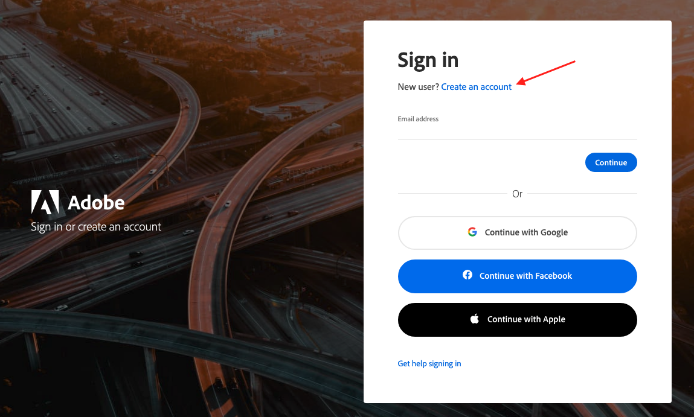
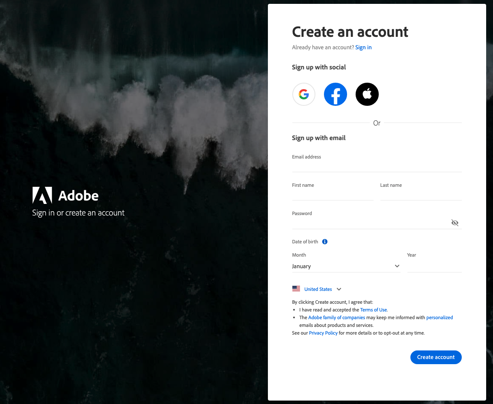
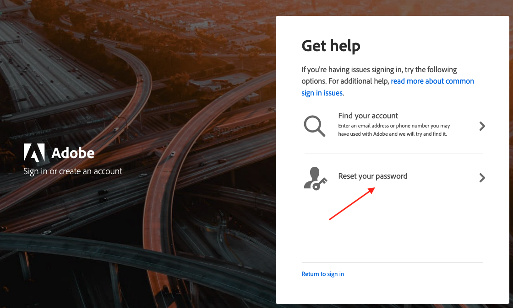

# Create and Access Your [!DNL Commerce] Account

Your [!DNL Commerce] account has a separate login from your store Admin. You can access this account from either the [!DNL Commerce] website or from your store Admin. From the dashboard of your [!DNL Commerce] account, you can find information that is related to the products and services that you have purchased, as well as your contact and billing information.

![Your [!DNL Commerce] account](./assets/home-acct.png)<!-- zoom -->

Anyone can open a free [!DNL Commerce] account from the website. The email address that is used to open an account can be associated with only one account, and the screen name that you enter becomes your identity in the forums.

>[!NOTE]
>
>After you create your account, it is recommended that you use Two-factor Authentication (TFA) to [secure your account](commerce-account-secure.md).

## Create a [!DNL Commerce] account

1. Go to the [[!DNL Commerce] site][1]{:target="_blank"}.

1. In the upper-right corner, click **[!UICONTROL Sign In]** and choose **Commerce (Magento)**.

1. Click **[!UICONTROL Create an account]**.

   <!-- zoom -->

1. Under _Personal Information_, do the following:

   - Enter your **First Name**, **Last Name**, and **[!UICONTROL Email]** address.

   - Enter your **Company Name** and set **My Company Primarily** to the best description of what your company does.

   - Set **My Role** to the best description of what you do for the company.

   - Set **Country** to reflect your operational location.

   <!-- zoom -->

1. Under _Login Information_, do the following:

   - To identify you in the [Community Forums][2]{:target="_blank"}, enter a **Screen Name**.

      Your screen name can be from four to 15 characters long, can include numbers and the underscore, but must start with a letter.

   - For **[!UICONTROL Password]** and **Confirm Password**, enter the desired password for your account.

      Your password must be between 8-16 characters, and include at least one capital letter, one number, and one special character or lowercase letter.

1. After you complete verification and accept terms of service, click **[!UICONTROL Save]**.

   Your account dashboard appears.

## Log in to your [!DNL Commerce] account

1. Go to the [[!DNL Commerce] site][1]{:target="_blank"}.

In the upper-right corner, click **[!UICONTROL Sign In]** and choose **[!UICONTROL Commerce (Magento)]**.

1. Enter the **[!UICONTROL Email]** address that is associated with your account.

1. Enter your **[!UICONTROL Password]**.

1. When complete, click **[!UICONTROL Continue]**.

## Receive a new password

1. If you forget your password, click **[!UICONTROL Forgot Your Password?]**

1. Enter the **[!UICONTROL Email Address]** that is associated with your account and click **[!UICONTROL Submit]**.

  Adobe sends you an email with a temporary password that you can use to log into your account. Then, reset your password from the dashboard of your account.

## Reset your password

1. Go to the [[!DNL Commerce] site][1]{:target="_blank"} and log into your account.

1. In the left panel, choose **[!UICONTROL Account Settings]**.

1. Click **[!UICONTROL Change Password]**.

   <!-- zoom -->

1. Enter your **[!UICONTROL Current Password]**.

   If you forgot your password, enter the temporary password that was sent to you.

1. Enter your **[!UICONTROL New Password]** and again for **[!UICONTROL Confirm New Password]**.

   >[!NOTE]
   >
   >Your password must be between 8-16 characters, and include at least one capital letter, one number, and one special character or lowercase letter.

1. When complete, click **[!UICONTROL Save]**.

## Link your [!DNL Commerce] account

You can link your [!DNL Commerce] account to your Adobe ID for single sign-on across all Adobe Commerce products and simpler user account management. When your [!DNL Commerce] accounts are linked to an Adobe ID in the [!DNL Commerce Identity Manager] and you are logged into that Adobe ID, you bypass the standard [!DNL Commerce] product login process. See [Setup [!DNL Commerce Identity Manager]](commerce-identity-manager.md).

[1]: https://account.magento.com/customer/account/login/
[2]: https://community.magento.com/
