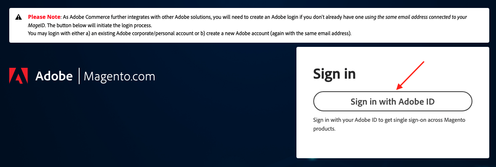
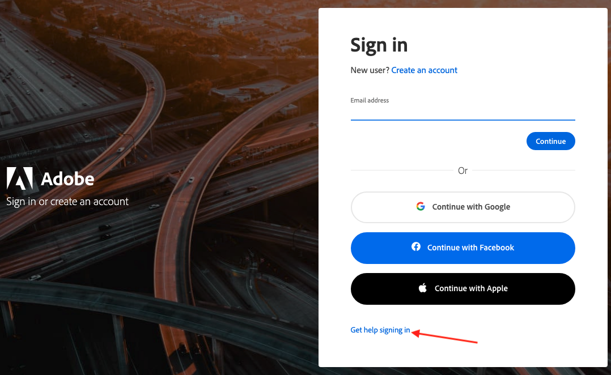

# Access Your [!DNL Commerce] Account

Your [!DNL Commerce] account has a separate login from your store Admin. You can access this account from either the [!DNL Commerce] website or from your store Admin. From the dashboard of your [!DNL Commerce] account, you can find information that is related to the products and services that you have purchased, as well as your contact and billing information.

![Your [!DNL Commerce] account](./assets/home-acct.png)<!-- zoom -->

>[!NOTE]
>
>After you create your account, it is recommended that you use Two-factor Authentication (TFA) to [secure your account](commerce-account-secure.md).

## Create a [!DNL Commerce] account

Anyone can open a free [!DNL Commerce] account. The email address that you use to create a Commerce account can be associated with only one account.

>[!NOTE]
>
>You must use an Adobe ID to create and access a Commerce account. If you do not have an Adobe ID, you can create one during the account creation process. If you already have a Commerce account but you do not have an Adobe ID, see [log in to a Commerce account](#log-in-to-your-dnl-commerce-account).

1. Go to the [[!DNL Commerce] site](https://account.magento.com/customer/account/login/){:target="_blank"}.

1. Click **[!UICONTROL Sign in with Adobe ID]**.

   <!-- zoom -->

1. Click **[!UICONTROL Create an account]**.

   <!-- zoom -->

1. Complete the sign-up form.

   <!-- zoom -->

1. Click **[!UICONTROL Create account]**.

## Log in to your [!DNL Commerce] account

You must use an Adobe ID to access a Commerce account. If you already have a Commerce account but you do not have an Adobe ID, you can create one during the sign-in process.

>[!WARNING]
>
>You must use the email address that is associated with your existing Commerce account MAGEID. Using a different email address creates a new MAGEID.

1. Go to the [[!DNL Commerce] site](https://account.magento.com/customer/account/login/){:target="_blank"}.

1. Click **[!UICONTROL Sign in with Adobe ID]**.

   <!-- zoom -->

1. Enter your email address and click **[!UICONTROL Continue]**.

## Reset your password

1. Go to the [[!DNL Commerce] site](https://account.magento.com/customer/account/login/){:target="_blank"}.

1. Click **[!UICONTROL Sign in with Adobe ID]**.

   <!-- zoom -->

1. Click **[!UICONTROL Get help signing in]**.

   <!-- zoom -->

1. Click **[!UICONTROL Reset your password]**.

   <!-- zoom -->

1. Enter your email address.

1. Click **[!Continue]**.
