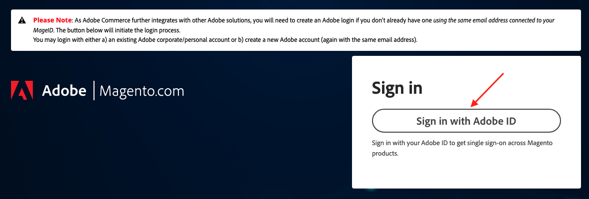
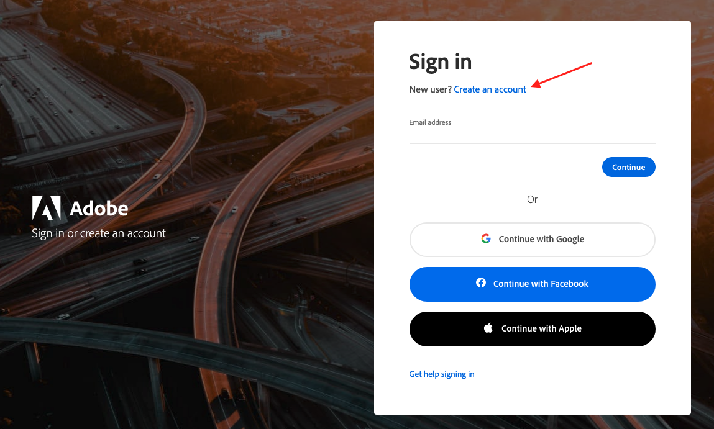
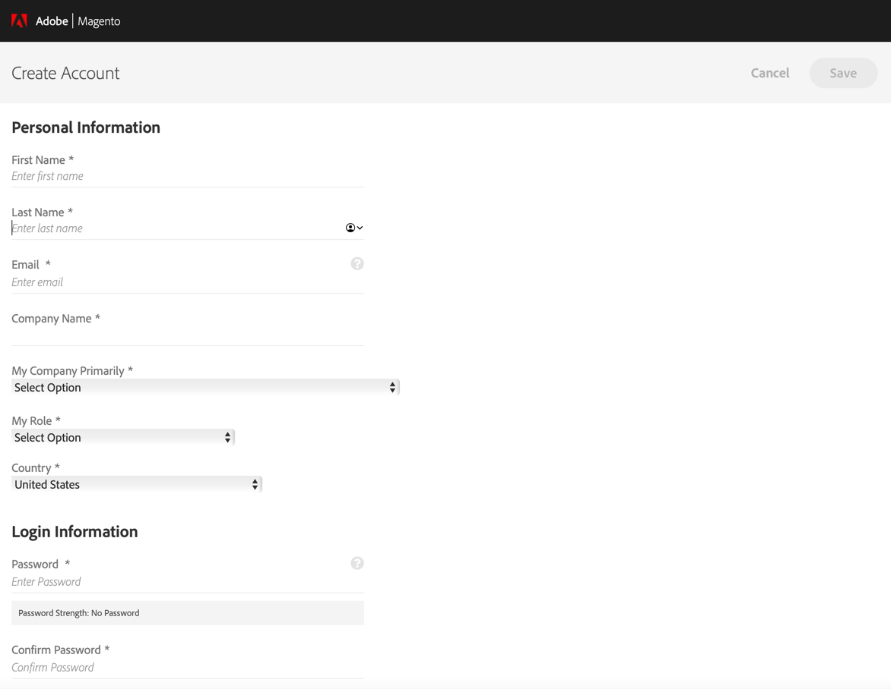
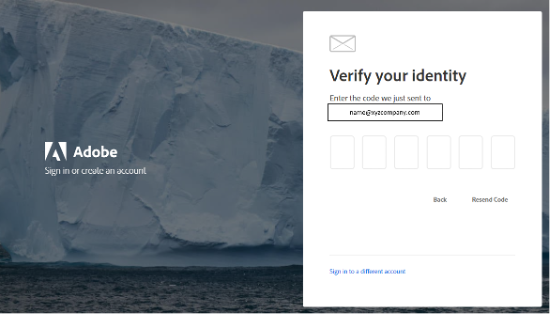
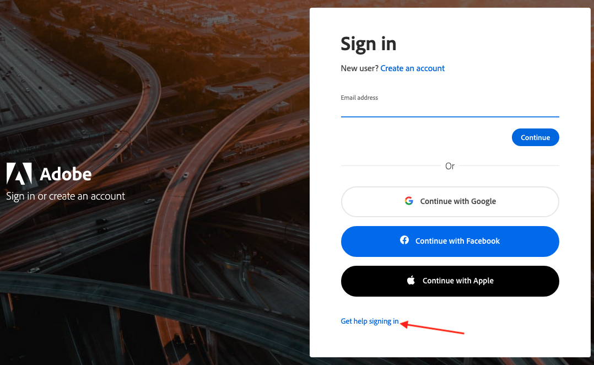
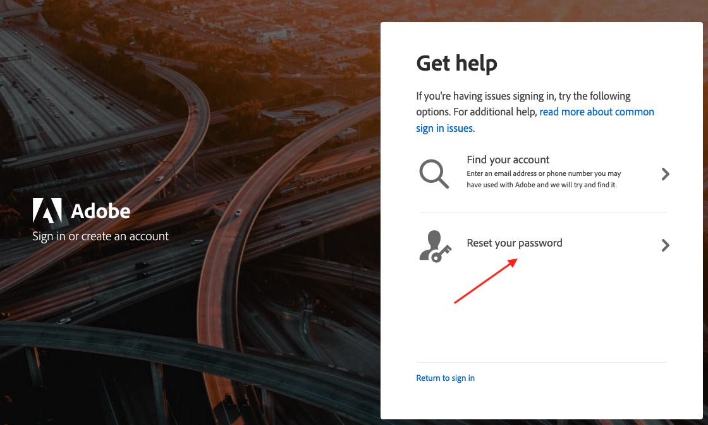

# Access your [!DNL Commerce] account

A [!DNL Commerce] account is your central access point for managing Adobe Commerce services for Adobe Commerce projects deployed on cloud infrastructure or on-premises. From the account dashboard, you can view subscriptions, manage Commerce Services API keys, review historical billing information, and collaborate with other users in your organization.

If you need to [submit your first ticket](https://experienceleague.adobe.com/en/docs/commerce-knowledge-base/kb/help-center-guide/magento-help-center-user-guide#support-case) or manage your Adobe Commerce relationship — rather than working within a specific storefront — start by creating or accessing your [!DNL Commerce] account.

You can access your [!DNL Commerce] account from the [!DNL Commerce] website. From the account dashboard, you can view information related to the products and services you have purchased and provide [Shared Access](https://experienceleague.adobe.com/en/docs/support-resources/adobe-support-tools-guide/adobe-commerce-support/adobe-commerce-help-center-user-guide#provide-shared-access) to other users. Some information, such as Commerce Services API keys, is visible only to license owners.

>[!NOTE]
>
>The **[!UICONTROL Billing History]** section on the [!DNL Commerce] account page displays only invoices created before the billing system update.
>
>If newer invoices are not listed, they have been transitioned to the new system and are not accessible from this page.

![Your [!DNL Commerce] account](./assets/home-acct.png){width="700"}

Your [!DNL Commerce] account login is separate from your store Admin login. You will normally use different credentials for each, and access to each system is managed independently.

However, a user who wants to streamline their login to Adobe Commerce and Adobe Business products can configure their Adobe ID to log in to the store Admin: [Configure the Commerce Admin Integration with Adobe ID](https://experienceleague.adobe.com/en/docs/commerce-admin/start/admin/ims/adobe-ims-config) in the *IMS Integration Guide for Commerce*.

>[!NOTE]
>
>After you create your account, it is recommended that you use Two-factor Authentication (TFA) to [secure your account](commerce-account-secure.md).

## Log in to your [!DNL Commerce] account

An Adobe ID is required to access your [!DNL Commerce] account. If you have an existing [!DNL Commerce] account but have not signed in since August 2022, you must create an Adobe ID during the sign-in process. You must complete this step before you can log in to your account.

>[!WARNING]
>
>If you cannot find the Commerce organization when submitting an Adobe Commerce [support case](https://experienceleague.adobe.com/en/docs/support-resources/adobe-support-tools-guide/adobe-commerce-support/adobe-commerce-help-center-user-guide#support-case), it usually means one of the following: the Account Owner has not created an Adobe ID, or an Adobe ID exists but is not linked to the Commerce account.

1. Go to the [[!DNL Commerce]](https://account.magento.com/customer/account/login/) site.

1. Click **[!UICONTROL Sign in with Adobe ID]**.

   {width="700"}

1. Enter your email address and click **[!UICONTROL Continue]**.

   >[!TIP]
   >
   >If you used an email address that is associated with an existing Commerce account MAGEID, the sign-in process automatically links it to your Adobe ID.

## Create a [!DNL Commerce] account

Anyone can create a free [!DNL Commerce] account. The email address that you use can only be associated with one Commerce account.

>[!NOTE]
>
>Use an Adobe ID to create and access a Commerce account.
>- If you don't have a Commerce account, you can create one during the sign-up process.
>- If you already have a Commerce account but you do not have an Adobe ID, see [log in to a Commerce account](#log-in-to-your-dnl-commerce-account).

1. Go to the [[!DNL Commerce] site](https://account.magento.com/customer/account/login/).

1. Click **[!UICONTROL Sign in with Adobe ID]**.

1. If you don't have an Adobe ID, click **[!UICONTROL Create an account]**. Otherwise, skip to step 7.

   {width="700"}

1. Complete the sign-up form.

   {width="700"}

1. Click **[!UICONTROL Create account]**.

1. Enter the verification code sent to your email address.

   {width="700"}

1. After your Adobe ID is created and verified, return to https://account.magento.com/. A MAGE ID will be generated and automatically linked to your Adobe ID.

## Reset your password

1. Go to the [[!DNL Commerce] site](https://account.magento.com/customer/account/login/).

1. Click **[!UICONTROL Sign in with Adobe ID]**.

1. Click **[!UICONTROL Get help signing in]**.

   {width="700"}

1. Click **[!UICONTROL Reset your password]**.

   {width="700"}

1. Enter your email address.

1. Click **[!UICONTROL Continue]**.

## Providing Shared Access to your Commerce account

Shared Access allows you to grant trusted users—such as colleagues, partners, or administrators—permission to manage your Adobe Commerce relationship on your behalf without using your personal login. This includes allowing others to open and track support cases.

See the [Share a Commerce account](https://experienceleague.adobe.com/en/docs/commerce-admin/start/commerce-account/commerce-account-share?lang=en) section of Adobe Commerce Getting Started Guide for detailed steps on setting up a shared account.

For detailed instructions on submitting a Commerce support case, see the [Adobe Commerce Help Center user guide](https://experienceleague.adobe.com/en/docs/support-resources/adobe-support-tools-guide/adobe-commerce-support/adobe-commerce-help-center-user-guide#support-case).
