# Secure Your [!DNL Commerce] Account

Two-factor Authentication (TFA or 2FA) is an added layer of security to better protect your [!DNL Commerce] account from unauthorized access. To complete the login process, TFA requires a _second factor_ in addition to the standard username and password credentials. This second factor takes the form of temporary verification codes that are continuously generated by a TFA application installed on your mobile device and paired with your [!DNL Commerce] account.

With TFA enabled, your account is more secure. An unauthorized user cannot log in unless they have both your username and password credentials (first factor) and a valid verification code from the TFA application on your personal device (second factor).

>[!NOTE]
>
>The two-factor authentication that protects the _Admin_ of your store has a separate setup. To learn more, see [Two-Factor Authentication](https://docs.magento.com/user-guide/stores/security-two-factor-authentication.html).  

## Before you begin

To use TFA, you must have a TFA application installed on your personal device (such as your smartphone, tablet, computer). There are many available, but some popular and free options include:

- Google Authenticator (iOS, Android™, BlackBerry®)

- Authy (iOS, Android™)

- Microsoft® Authenticator (iOS, Android™, Windows Phone)

## Enable two-factor authentication

1. Log in to your [[!DNL Commerce] account][1]{:target="_blank"}.

1. In the left navigation pane, select **[!UICONTROL Account Settings]**, and then select **[!UICONTROL Two-factor Authentication]**.

   <!-- zoom -->

1. Select **[!UICONTROL Enable]** to begin the two-factor authentication setup process.

1. Enter the **[!UICONTROL Verification Code]** sent to your email and select **[!UICONTROL Verify Code]** to continue.

   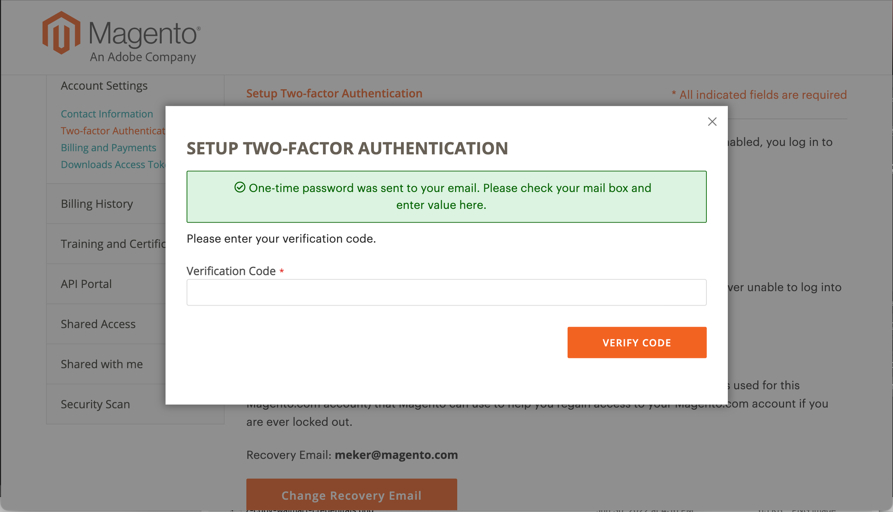<!-- zoom -->

1. Open the two-factor authentication application you downloaded and installed on your personal device.

1. On the [!UICONTROL SETUP TWO-FACTOR AUTHENTICATION] form, use the **[!UICONTROL Setup Code]** to add Adobe Commerce to your TFA application.

   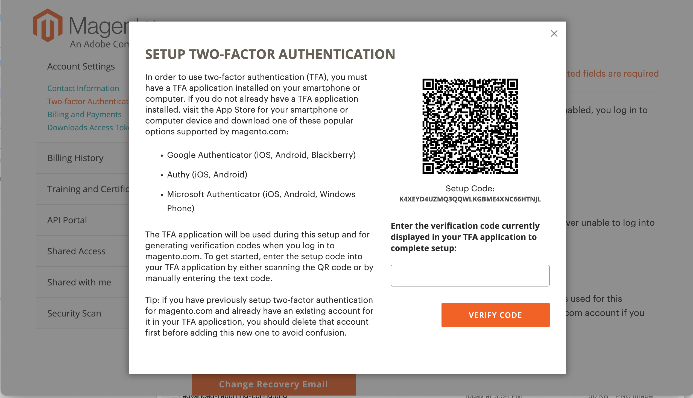<!-- zoom -->

   You can add the code by scanning the QR code using the TFA application, or by manually entering it. This code pairs your TFA application with your [!DNL Commerce] account and enables the permissions to generate the TFA app to generate verification codes for secure account access.

1. Complete the setup.

   -  On the [!UICONTROL SETUP TWO FACTOR-AUTHENTICATION] form, enter the verification code from your two-factor authentication application.
   
   - Select **[!UICONTROL Verify Code]**.

   >[!NOTE]
   >
   >For security, the verification codes in your TFA application continuously expire and regenerate. **_Always_** use the code that is currently displayed.

1. Save the **[!UICONTROL Recovery Codes]** presented in a safe and accessible place.

   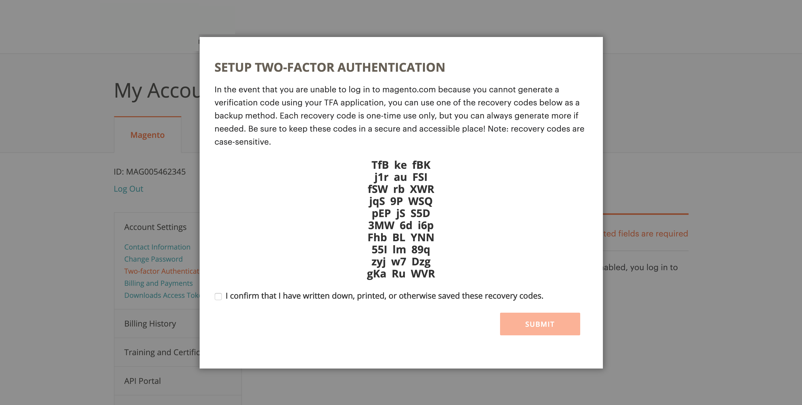<!-- zoom -->

   If you cannot provide a verification code when you log in to your [!DNL Commerce] account, you must use a recovery code to regain account access.

   Each recovery code can be used only one time, but you can [generate](#generate-new-recovery-codes) new ones. Recovery codes are case-sensitive.

1. Select the confirmation checkbox and select **[!UICONTROL Submit]** to continue.

1. To ensure that you can recover access to your account, enter a **[!UICONTROL Recovery Email]**.

   This email address is needed if you cannot generate a verification code from your two-factor authentication application and you do not have access to an unused pre-generated recovery code.

   Once every 24 hours, you can generate and send a temporary recovery code to your designated recovery email address. Use this code to regain account access.

   >[!IMPORTANT]
   >
   >Maintain access to your recovery email account. Otherwise, you cannot use temporary recovery codes sent to that account.

   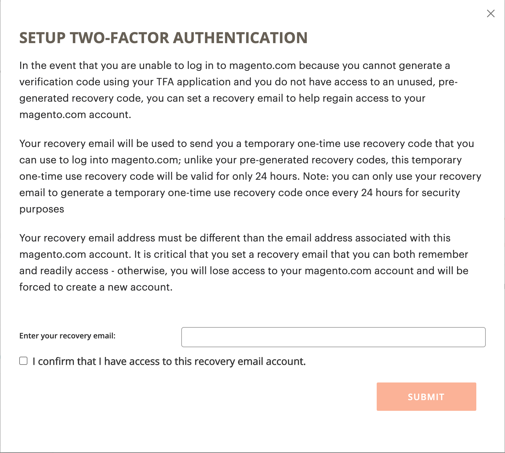<!-- zoom -->

1. Select the confirmation checkbox and select **[!UICONTROL Submit]** to complete the two-factor authentication setup process.

   - A notification is sent to the email address associated with your [!DNL Commerce] account to confirm that you have successfully enabled two-factor authentication.

   - A notification is sent to your recovery email account to confirm the configuration.

>[!TIP]
>
>If you lose your personal device or get a new one, you can [change your two-factor authentication app](#change-your-two-factor-authentication-application) and generate new recovery codes.

## Log in using a verification code

1. Go to the [!DNL Commerce] [account login][1]{:target="_blank"}.

1. Enter your username and password credentials, and then select **[!UICONTROL Login]**.

1. Enter the **[!UICONTROL Verification Code]** displayed in your two-factor authentication application when prompted.

   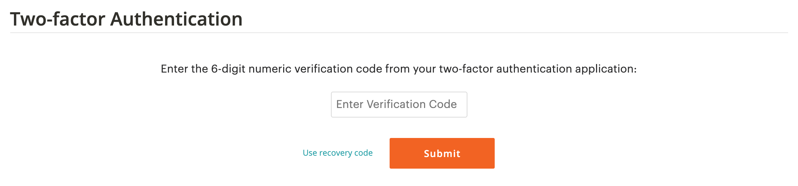<!-- zoom -->

1. Select **[!UICONTROL Submit]** to complete the login process.

## Log in using a recovery code

1. Go to the [!DNL Commerce] [account login][1]{:target="_blank"}.

1. Enter your username and password credentials, and then select **[!UICONTROL Login]**.

1. Select **[!UICONTROL Use recovery code]** to bypass the verification code prompt.

1. Enter an unused **[!UICONTROL Recovery Code]** when prompted.

   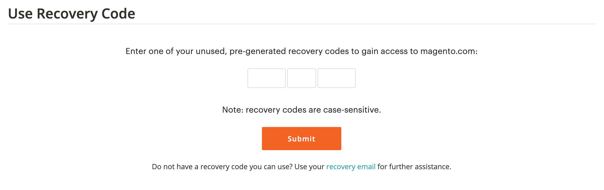<!-- zoom -->

1. Select **[!UICONTROL Submit]** to complete the login process.

## Log in using your recovery email

1. Log in to your [[!DNL Commerce] account][1]{:target="_blank"}.

1. Enter your username and password credentials, and then select **[!UICONTROL Login]**.

1. Select **[!UICONTROL Use recovery code]** to bypass the verification code prompt.

   <!-- zoom -->

1. To get a temporary recovery code through email, select the **[!UICONTROL recovery email]** link.

   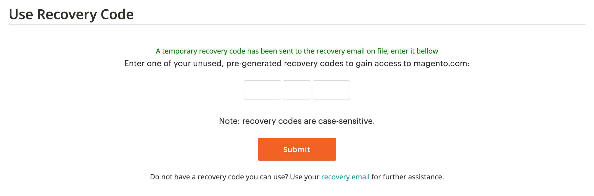<!-- zoom -->

1. Open your recovery email account to get the temporary code, and then enter the code in the designated fields.

1. Select **[!UICONTROL Submit]** to complete the login process.

After using a temporary recovery code to access your account, [generate new recovery codes](#generate-new-recovery-codes) and save them to prevent further account access issues.

## View your recovery codes

1. Go to the [!DNL Commerce] [account login][1]{:target="_blank"}.

1. Enter your username and password credentials, and then select **[!UICONTROL Login]**.

1. Complete the login process using one of the two-factor authentication methods described earlier.

1. In the left navigation pane, select **[!UICONTROL Account Settings]**, and then select **[!UICONTROL Two-factor Authentication]**.

   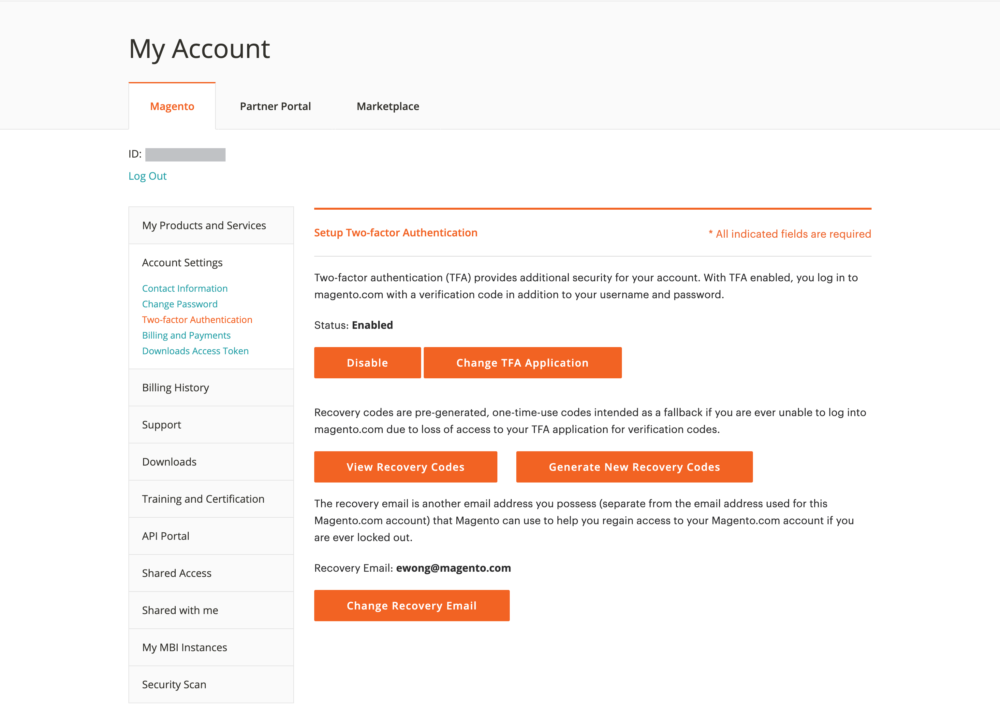<!-- zoom -->

1. To view your pre-generated recovery codes, select **View Recovery Codes**.

1. Enter the **[!UICONTROL Verification Code]** sent to your email and select **[!UICONTROL Verify Code]** to continue.

   <!-- zoom-->

1. Save the **Recovery Codes** presented in a safe and accessible place.

   If you cannot provide a verification code to log in to your [!DNL Commerce] account, using a recovery code is the only way to regain account access.

   Each recovery code is one-time use only, but you can always [generate](#generate-new-recovery-codes) new ones. Recovery codes are case-sensitive.

   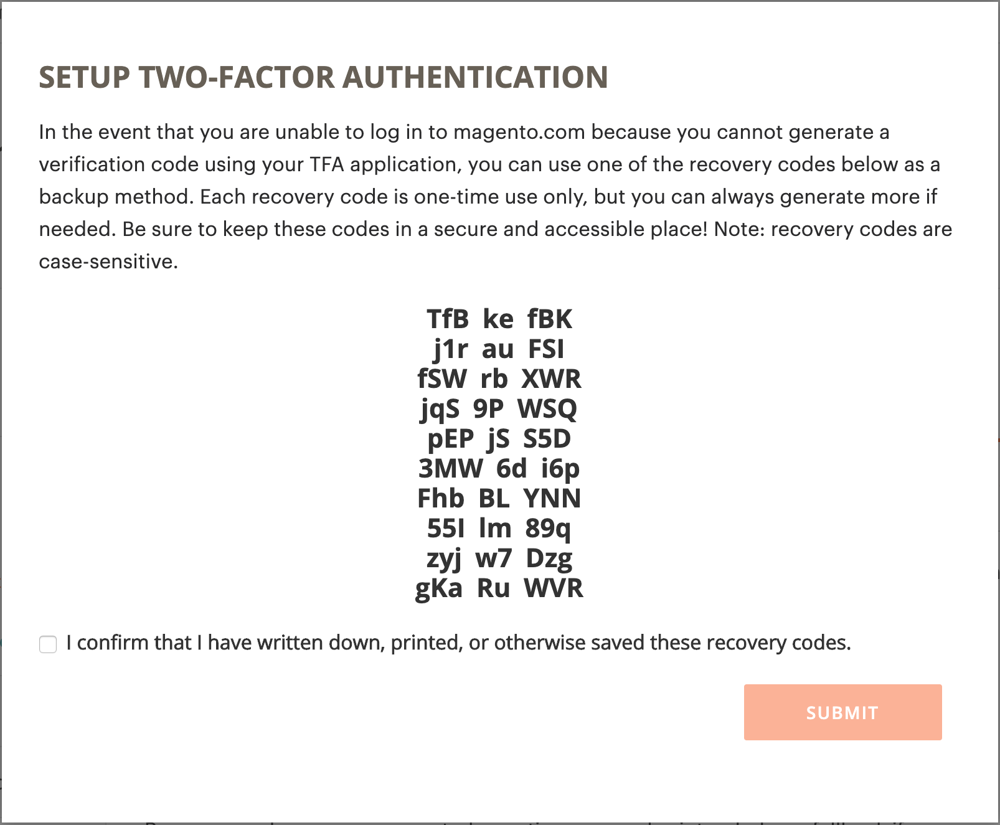<!-- zoom -->

1. Select the confirmation checkbox and select **[!UICONTROL Submit]** to close the dialog.

## Generate new recovery codes

1. Go to the [!DNL Commerce] [account login][1]{:target="_blank"}.

1. Enter your username and password credentials, and then select **[!UICONTROL Login]**.

1. Complete the login process using one of the two-factor authentication methods described earlier.

1. In the left navigation pane, select **[!UICONTROL Account Settings]**, and then select **[!UICONTROL Two-factor Authentication]**.

   <!-- zoom -->

1. To generate new pre-generated Recovery Codes, select **Generate New Recovery Codes**.

1. Enter the **[!UICONTROL Verification Code]** sent to your email and select **[!UICONTROL Verify Code]** to continue.

   <!-- zoom -->

1. Save the **Recovery Codes** presented in a safe and accessible place.

   If you cannot provide a verification code when you log in to your [!DNL Commerce] account, using a recovery code is the only way to regain account access.

   All previously generated recovery codes are now rendered invalid and should be discarded (only the current set of generated recovery codes are functional). Recovery codes are case-sensitive.

   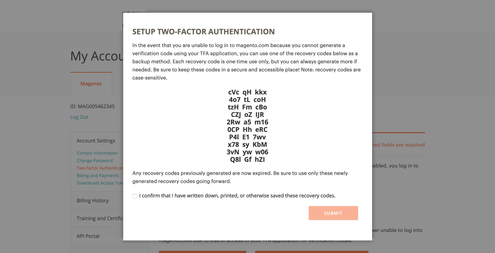<!-- zoom -->

1. Select the confirmation checkbox and select **[!UICONTROL Submit]** to close the dialog.

## Change your recovery email

1. Go to the [!DNL Commerce] [account login][1]{:target="_blank"}.

1. Enter your username and password credentials, and then select **[!UICONTROL Login]**.

1. Complete the login process using one of the two-factor authentication methods described earlier.

1. In the left navigation pane, select **[!UICONTROL Account Settings]**, and then select **[!UICONTROL Two-factor Authentication]**.

   <!-- zoom -->

1. Select **Change Recovery Email** to change the recovery email on file for your account.

1. Enter the **[!UICONTROL Verification Code]** sent to your email and select **[!UICONTROL Verify Code]** to continue.

   <!-- zoom -->

1. To help ensure that you can recover access to your account, enter a **Recovery Email**.

   This email address is needed if you cannot generate a verification code from your two-factor authentication application and you do not have access to an unused pre-generated recovery code.

   Once every 24 hours, you can generate and send a temporary recovery code to your designated recovery email address. You can use this code to regain account access.

   >[!IMPORTANT]
   >
   >Maintain access to your recovery email account. Otherwise, you cannot use temporary recovery codes sent to that account.

   <!-- zoom -->

1. Select the confirmation checkbox and select **[!UICONTROL Submit]** to close the dialog.

   The system sends an email notification to the recovery email that you designated to confirm that particular email address is on file as your recovery email for receiving temporary recovery codes.

## Change your two-factor authentication application

1. Go to the [!DNL Commerce] [account login][1]{:target="_blank"}.

1. Enter your username and password credentials, and then select **[!UICONTROL Login]**.

1. Complete the login process using one of the two-factor authentication methods described earlier.

1. In the left navigation pane, select **[!UICONTROL Account Settings]**, and then select **[!UICONTROL Two-factor Authentication]**.

   <!-- zoom -->

1. Select **Change TFA Application** to use a different TFA application with your magento.com account.

1. Enter the **[!UICONTROL Verification Code]** sent to your email and select **[!UICONTROL Verify Code]** to continue.

   <!-- zoom -->

1. Open the two-factor authentication application on your personal device.

1. Enter the **Setup Code** into your two-factor authentication application.

   You can add the code by scanning the QR code using the TFA application, or manually entering it. This code pairs your TFA application with your [!DNL Commerce] account and enables the permissions for the TFA app to generate verification codes for secure account access.

   >[!NOTE]
   >
   >For security, the verification codes in your TFA application continuously expire and regenerate. **_Always_** use the code that is currently displayed.

1. With your TFA application now paired with  your [!DNL Commerce] account, enter the **[!UICONTROL Verification Code]** displayed in your TFA application and select **[!UICONTROL Verify Code]** to continue.

   <!-- zoom -->

1. Save the **Recovery Codes** presented in a safe and accessible place.

   If you cannot provide a verification code when you log in to your [!DNL Commerce] account, the only way to regain account access is to use a recovery code.

     Each recovery code is one-time use only, but you can always [generate](#generate-new-recovery-codes) new ones. Recovery codes are case-sensitive. Recovery codes are case-sensitive.

1. Select the checkbox to confirm and select **[!UICONTROL Submit]** to continue.

   <!-- zoom -->

1. To help ensure that you can recover access to your account, enter a **Recovery Email**.

   This email address is needed if you cannot generate a verification code from your two-factor authentication application and you do not have access to an unused pre-generated recovery code.

   Once every 24 hours, you can generate and send a temporary recovery code to your designated recovery email address. Use this code to regain account access.

   >[!IMPORTANT]
   >
   >Maintain access to your recovery email account. Otherwise, you cannot use temporary recovery codes sent to that account.

   <!-- zoom -->

1. Select the confirmation checkbox and select **[!UICONTROL Submit]** to complete the two-factor authentication setup process.

   An email notification is sent to the recovery email that you designated to confirm that particular email address is on file as your recovery email for receiving a temporary recovery code.

## Disable two-factor authentication

>[!IMPORTANT]
>
>If your organizational security policy requires multi-factor authentication on Adobe Commerce accounts, you cannot disable two-factor authentication.

1. Go to the [!DNL Commerce] [account login][1]{:target="_blank"}.

1. Enter your username and password credentials, and then select **[!UICONTROL Login]**.

1. Complete the login process using one of the two-factor authentication methods described earlier.

1. In the left navigation pane, select **[!UICONTROL Account Settings]** and select **[!UICONTROL Two-factor Authentication]** underneath.

   <!-- zoom -->

1. Select **[!UICONTROL Disable]** to begin the TFA deactivation process.

1. Enter the **[!UICONTROL Verification Code]** sent to your email and select **[!UICONTROL Verify Code]** to continue.

   <!-- zoom -->

1. Select the confirmation checkbox and select **[!UICONTROL Submit]** to complete the deactivation for two-factor authentication.

   The system sends an email confirmation indicating that TFA has been disabled on your [!DNL Commerce] account.

   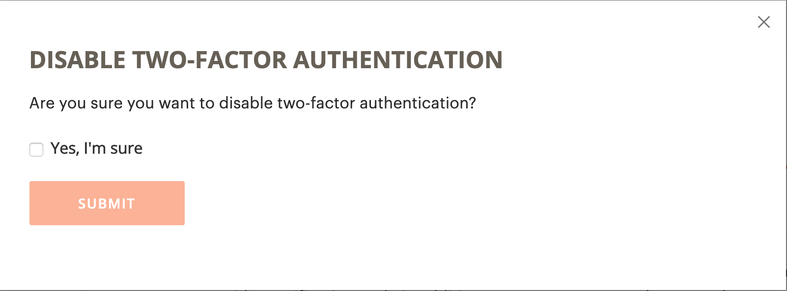<!-- zoom -->

[1]: https://account.magento.com/customer/account/login
[2]: https://community.magento.com/
