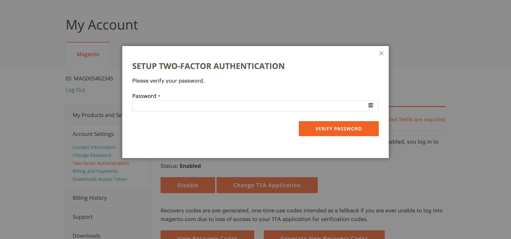

# Secure Your [!DNL Commerce] Account

Two-factor Authentication (TFA or 2FA) is an added layer of security to better protect your [!DNL Commerce] account from unauthorized users who might want to use your account in ways you do not want. TFA requires a _second factor_ (beyond your standard username and password combination) in order to complete the login process. This second factor takes the form of special, temporary verification codes that are continuously generated by a TFA application (on your mobile phone, for example) that is synced to your [!DNL Commerce] account. With TFA enabled, an unauthorized user must have your username and password combination (first factor) and access to the TFA application on your personal device (second factor) in order to log in to your [!DNL Commerce] account. This type of security makes unauthorized access much more difficult and, therefore, more secure.

>[!NOTE]
>
>The two-factor authentication that protects the _Admin_ of your store has a separate setup. To learn more, see [Two-Factor Authentication](https://docs.magento.com/user-guide/stores/security-two-factor-authentication.html).  

## Before you begin

In order to use TFA, you must have a TFA application installed on your personal device (such as your smartphone, tablet, computer). There are many available, but some popular and free options include:

- Google Authenticator (iOS, Android™, BlackBerry®)

- Authy (iOS, Android™)

- Microsoft® Authenticator (iOS, Android™, Windows Phone)

## Enable two-factor authentication

1. Log in to your [[!DNL Commerce] account][1]{:target="_blank"}.

1. In the left navigation pane, click **[!UICONTROL Account Settings]** and click **[!UICONTROL Two-factor Authentication]** underneath.

   <!-- zoom -->

1. Click **[!UICONTROL Enable]** to begin the two-factor authentication setup process.

1. Enter the **[!UICONTROL Verification Code** sent to your device and click **[!UICONTROL Verify Code]** to continue.

   <!-- zoom -->

1. Open the two-factor authentication application you downloaded and installed on your personal device.

1. On the [!UICONTROL SETUP TWO-FACTOR AUTHENTICATION] form, use the **[!UICONTROL Setup Code]** to add Adobe Commerce to your TFA application.

   <!-- zoom -->

   You can add the code by scanning the QR code using the TFA application, or manually entering it. This code links your TFA application with your [!DNL Commerce] account and enables the permissions for the TFA app to generate verification codes for secure account access.

1. Complete the setup.

   -  On the [!UICONTROL SETUP TWO FACTOR-AUTHENTICATION] form, enter the verification code from your two-factor authentication application.
   
   - Select **[!UICONTROL Verify Code]**.

   >[!NOTE]
   >
   >Verification Codes are constantly expiring and regenerated by your TFA application for security purposes, so **_always_** use the one that is currently displayed.

1. Save the **[!UICONTROL Recovery Codes]** presented in a safe and accessible place.

   If you cannot provide a Verification Code to log into your [!DNL Commerce] account, using a Recovery Code is the only way to regain access to your [!DNL Commerce] account.

   Each Recovery Code is one-time use only, so do not try to reuse a Recovery Code you have already used previously (but you can always generate more---see the following for details). Recovery Codes are case-sensitive.

1. Select the confirmation checkbox and click **[!UICONTROL Submit]** to continue.

   <!-- zoom -->

1. To help ensure that you can recover access to your account, enter a **[!UICONTROL Recovery Email]**.

   This email address is needed if you cannot generate a Verification Code from your two-factor authentication application and you do not have access to an unused pre-generated Recovery Code.

   Once every 24 hours, you are able to generate and send a temporary Recovery Code to your designated Recovery email address that you can use to regain access to your account.

   >[!IMPORTANT]
   >
   >It is imperative that you maintain access to the email account of your Recovery Email; otherwise, you cannot access any temporary Recovery Codes sent to that account.

   <!-- zoom -->

1. Select the confirmation checkbox and click **[!UICONTROL Submit]** to complete the two-factor authentication setup process.

   - An email notification is sent to the email address associated with your [!DNL Commerce] account to confirm that you have successfully enabled two-factor authentication.

   - An email notification is sent to the Recovery Email that you designated to confirm that particular email address is on file as your Recovery Email for receiving a temporary Recovery Code.

## Log in using a verification code

1. Go to the [!DNL Commerce] [account login][1]{:target="_blank"}.

1. Enter your username and password combination, and then click **[!UICONTROL Login]** to log into My Account.

1. Enter the **[!UICONTROL Verification Code]** displayed in your two-factor authentication application when prompted.

   <!-- zoom -->

1. Click **[!UICONTROL Submit]** to complete the login process.

## Log in using a recovery code

1. Go to the [!DNL Commerce] [account login][1]{:target="_blank"}.

1. Enter your username and password combination, and then click **[!UICONTROL Login]** to log into My Account.

1. Click **[!UICONTROL Use recovery code]** to bypass the verification code prompt.

1. Enter an unused **[!UICONTROL Recovery Code]** when prompted.

   <!-- zoom -->

1. Click **[!UICONTROL Submit]** to complete the login process.

## Log in using your recovery email

1. Log in to your [[!DNL Commerce] account][1]{:target="_blank"}.

1. Enter your username and password combination, and then click **[!UICONTROL Login]** to log into _[!UICONTROL My Account]_.

1. Click **[!UICONTROL Use recovery code]** to bypass the verification code prompt.

   <!-- zoom -->

1. To have a temporary Recovery Code sent to the Recovery Email address on file for your [!DNL Commerce] account, click the **[!UICONTROL recovery email]** link.

   <!-- zoom -->

1. Access the email account of your Recovery Email to retrieve the temporary Recovery Code and enter it into the designated fields.

1. Click **[!UICONTROL Submit]** to complete the login process.

   - Because the Recovery Email capability is only available once every 24 hours, it is recommended that you generate new Recovery Codes and securely store them to avoid any future issues with accessing your [!DNL Commerce] account.

   - It is also recommended that you change your two-factor authentication application (if you have a device available) in order to generate Verification Codes again and use them to access your [!DNL Commerce] account.

## View your recovery codes

1. Go to the [!DNL Commerce] [account login][1]{:target="_blank"}.

1. Enter your username and password combination, and then click **[!UICONTROL Login]** to log into My Account.

1. Complete the login process using one of the two-factor authentication methods described earlier.

1. In the left navigation pane, click **[!UICONTROL Account Settings]** and click **[!UICONTROL Two-factor Authentication]** underneath.

   <!-- zoom -->

1. To view your pre-generated Recovery Codes, click **View Recovery Codes**.

1. Reenter your **[!UICONTROL Password]** and click **[!UICONTROL Verify Password]** to continue.

   <!-- zoom -->

1. Save the **Recovery Codes** presented in a safe and accessible place.

   If you cannot provide a Verification Code to log into your [!DNL Commerce] account, using a Recovery Code is the only way to regain access to your [!DNL Commerce] account.

   Each Recovery Code is one-time use only, so do not try to reuse a Recovery Code you have already used previously (but you can always generate more---see the following for details). Recovery Codes are case-sensitive.

   <!-- zoom -->

1. Select the confirmation checkbox and click **[!UICONTROL Submit]** to close the dialog.

## Generate new recovery codes

1. Go to the [!DNL Commerce] [account login][1]{:target="_blank"}.

1. Enter your username and password combination, and then click **[!UICONTROL Login]** to log into My Account.

1. Complete the login process using one of the two-factor authentication methods described earlier.

1. In the left navigation pane, click **[!UICONTROL Account Settings]** and click **[!UICONTROL Two-factor Authentication]** underneath.

   <!-- zoom -->

1. To generate new pre-generated Recovery Codes, click **Generate New Recovery Codes**.

1. Reenter your **[!UICONTROL Password]** and click **[!UICONTROL Verify Password]** to continue.

   <!-- zoom -->

1. Save the **Recovery Codes** presented in a safe and accessible place.

   If you cannot provide a Verification Code to log into your [!DNL Commerce] account, using a Recovery Code is the only way to regain access to your [!DNL Commerce] account.

   All previously generated Recovery Codes are now rendered invalid and should be discarded (only the current set of generated Recovery Codes are functional). Recovery Codes are case-sensitive.

   <!-- zoom -->

1. Select the confirmation checkbox and click **[!UICONTROL Submit]** to close the dialog.

## Change your recovery email

1. Go to the [!DNL Commerce] [account login][1]{:target="_blank"}.

1. Enter your username and password combination, and then click **[!UICONTROL Login]** to log into My Account.

1. Complete the login process using one of the two-factor authentication methods described earlier.

1. In the left navigation pane, click **[!UICONTROL Account Settings]** and click **[!UICONTROL Two-factor Authentication]** underneath.

   <!-- zoom -->

1. Click **Change Recovery Email** to change the Recovery Email on file for your account.

1. Reenter your **[!UICONTROL Password]** and click **[!UICONTROL Verify Password]** to continue.

   <!-- zoom -->

1. To help ensure that you can recover access to your account, enter a **Recovery Email**.

   This email address is needed if you cannot generate a Verification Code from your two-factor authentication application and you do not have access to an unused pre-generated Recovery Code.

   Once every 24 hours, you can generate and send a temporary Recovery Code to your designated Recovery email address that you can use to regain access to your account.

   >[!IMPORTANT]
   >
   >It is imperative that you maintain access to the email account of your Recovery Email; otherwise, you cannot access any temporary Recovery Codes sent to that account.

   <!-- zoom -->

1. Select the confirmation checkbox and click **[!UICONTROL Submit]** to close the dialog.

   The system sends an email notification to the Recovery Email that you designated to confirm that particular email address is on file as your Recovery Email for receiving temporary Recovery Codes.

## Change your two-factor authentication application

1. Go to the [!DNL Commerce] [account login][1]{:target="_blank"}.

1. Enter your username and password combination, and then click **[!UICONTROL Login]** to log into My Account.

1. Complete the login process using one of the two-factor authentication methods described earlier.

1. In the left navigation pane, click **[!UICONTROL Account Settings]** and click **[!UICONTROL Two-factor Authentication]** underneath.

   <!-- zoom -->

1. Click **Change TFA Application** to use a different TFA application with your magento.com account.

1. Reenter your **[!UICONTROL Password]** and click **[!UICONTROL Verify Password]** to continue.

   <!-- zoom -->

1. Open the two-factor authentication application you downloaded and installed on your personal device.

1. Enter the **Setup Code** into your two-factor authentication application.

   You can either scan the QR code using the two-factor authentication application or manually enter the code into your two-factor authentication application. This code syncs your two-factor authentication application with your [!DNL Commerce] account and allow your two-factor authentication application to generate verification codes that the system accepts.

   >[!NOTE]
   >
   >Verification Codes are constantly expiring and regenerated by your two-factor authentication application for security purposes, so **always** use the one that is currently displayed.

1. With your TFA application now synced to your [!DNL Commerce] account, enter the **Verification Code** displayed in your TFA application and click **Verify Code** to continue.

   <!-- zoom -->

1. Save the **Recovery Codes** presented in a safe and accessible place.

   If you cannot provide a Verification Code to log into your [!DNL Commerce] account, using a Recovery Code is the only way to regain access to your [!DNL Commerce] account.

   Each Recovery Code is one-time use only, so do not try to reuse a Recovery Code you have already used previously (but you can always generate more---see the previous for details). Recovery Codes are case-sensitive.

1. Select the checkbox to confirm and click **[!UICONTROL Submit]** to continue.

   <!-- zoom -->

1. To help ensure that you can recover access to your account, enter a **Recovery Email**.

   This email address is needed if you cannot generate a Verification Code from your two-factor authentication application and you do not have access to an unused pre-generated Recovery Code.

   Once every 24 hours, you can generate and send a temporary Recovery Code to your designated Recovery email address that you can use to regain access to your account.

   >[!IMPORTANT]
   >
   >It is imperative that you maintain access to the email account of your Recovery Email; otherwise, you cannot access any temporary Recovery Codes sent to that account.

   <!-- zoom -->

1. Select the confirmation checkbox and click **[!UICONTROL Submit]** to complete the two-factor authentication setup process.

   An email notification is sent to the Recovery Email that you designated to confirm that particular email address is on file as your Recovery Email for receiving a temporary Recovery Code.

## Disable two-factor authentication

1. Go to the [!DNL Commerce] [account login][1]{:target="_blank"}.

1. Enter your username and password combination, and then click **[!UICONTROL Login]** to log into My Account.

1. Complete the login process using one of the two-factor authentication methods described earlier.

1. In the left navigation pane, click **[!UICONTROL Account Settings]** and click **[!UICONTROL Two-factor Authentication]** underneath.

   <!-- zoom -->

1. Click **[!UICONTROL Disable]** to begin the TFA deactivation process.

1. Reenter your password and click **[!UICONTROL Verify Password]** to continue.

   <!-- zoom -->

1. Select the confirmation checkbox and click **[!UICONTROL Submit]** to complete the deactivation for two-factor authentication.

   The system sends an email confirmation indicating that TFA has been disabled on your [!DNL Commerce] account.

   <!-- zoom -->

[1]: https://account.magento.com/customer/account/login
[2]: https://community.magento.com/
