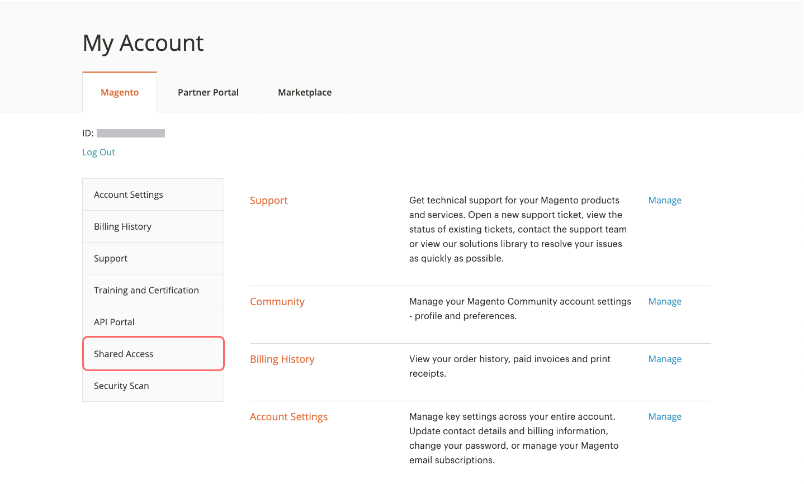
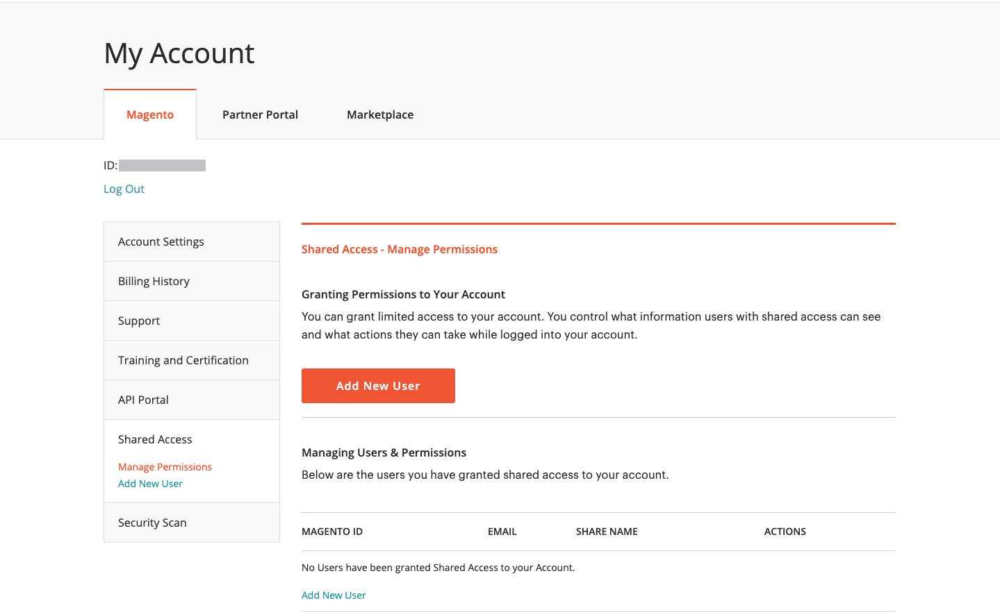
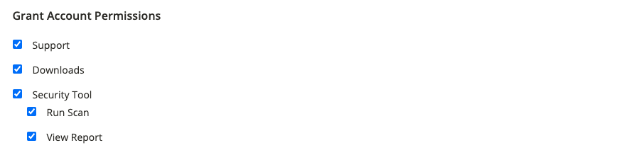
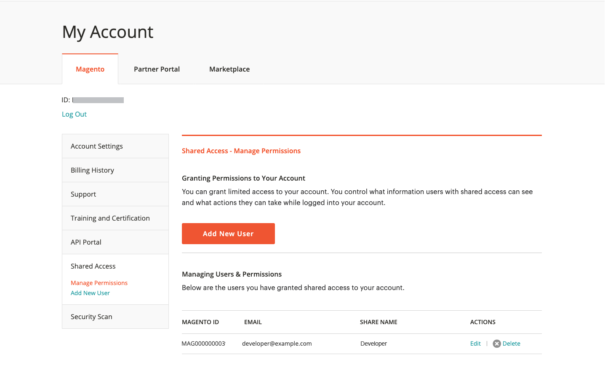
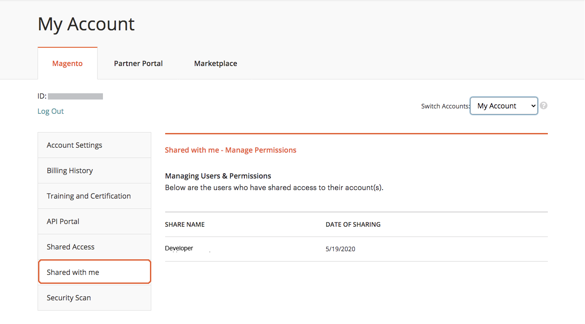
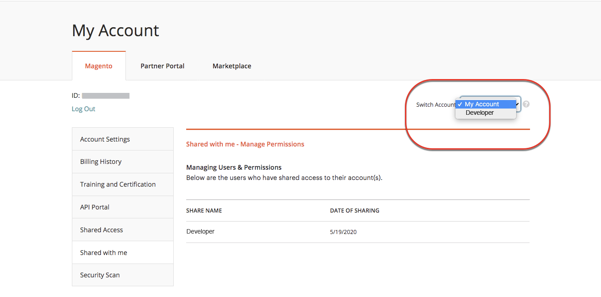
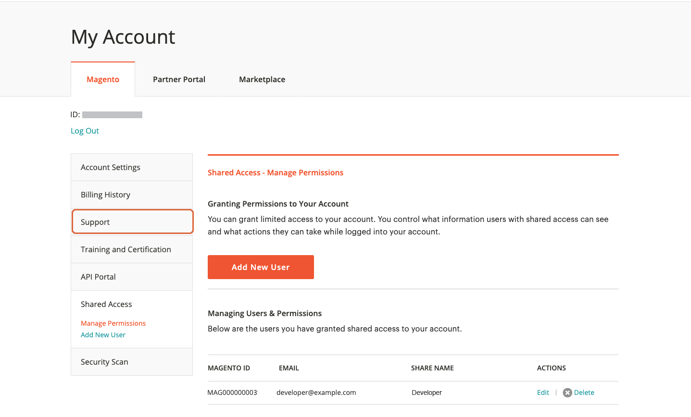

# Share a [!DNL Commerce] account

Your [!DNL Commerce] account contains information that you can make available to trusted employees and service providers who help manage your site. As the primary account holder, you have authority to grant limited access to other [!DNL Commerce] account holders. Shared access can be revoked, but cannot be transferred from one user to another.

The [!DNL Commerce] Support team does not have access to the account and cannot set up shared access for you. Only the primary account holder with appropriate permissions can set up shared access. When you share account access, all sensitive information, such as your billing history or credit card information, remains protected and is never available to other users.

>[!NOTE]
>
>All actions taken by users with shared access are the sole responsibility of the primary account holder. Adobe is not responsible for any actions taken by users who have shared access to your account.

{width="600" zoomable="yes"}

## Set up a shared account

1. Before you begin, get the following information from the [!DNL Commerce] account of the **new shared access grantee**:

   - The user must have already registered for an account at account.adobe.com and be logged in through account.magento.com.
   - The `MAGE ID/Account ID (MAG00XXXXXXX)` is displayed in the upper-left corner of the _[!UICONTROL Magento]_ tab, just above the **Log Out** link.
   - The `Email` address that is associated with the account.

1. Log in to your [[!DNL Commerce] account](commerce-account-create.md).

1. In the left navigation panel, click **[!UICONTROL Shared Access]**.

1. Click **[!UICONTROL Add New User]**.

   {width="600" zoomable="yes"}

1. Under [!UICONTROL _New User Information]_, do the following:

   - Enter the **[!UICONTROL Account ID]** from the new user's [!DNL Commerce] account.
   - Enter the **[!UICONTROL Email]** address that is associated with the new user's [!DNL Commerce] account.

   {width="600"}

1. Under _[!UICONTROL Shared Information]_, do the following:

   - To identify the shared account, enter a **[!UICONTROL Share Name]**. This name is for internal reference and is visible only to you and the person with whom you share your account.
   
     A best practice is to use your Organization name as the [!UICONTROL Share Name]. Do not use a name that begins with `CLOUD SHARED ACCESS FROM MAG XYX`.
   - If you want to share your personal contact information with the new user, enter **[!UICONTROL Your Email]** and **[!UICONTROL Your Phone]**.

1. Under _[!UICONTROL Grant Account Permissions]_, select the checkbox of each [!DNL Commerce] product and service that you want to share.

   {width="600"}

1. Click **[!UICONTROL Create Shared Access]**.

   The new user information appears in the _[!UICONTROL Manage Permissions]_ section of the Shared Access page, and an email invitation with instructions to access the shared account is sent to the new user.

   {width="600" zoomable="yes"}

>[!NOTE]
>
>It is not necessary to share access to the _[!UICONTROL Security Tool]_ - Any user with a MAGE ID can set up the Security Scan Tool with their own account. They just need the necessary privileges to make changes to the site and to verify ownership of the domain using one of the [required methods](https://experienceleague.adobe.com/en/docs/commerce-admin/systems/security/security-scan)).

## Access a shared account

The following instructions are written from the perspective of a shared user who receives an invitation to a shared account.

1. When you receive an invitation to a shared account, follow the instructions in the email to log in to your own [!DNL Commerce] account.

   The left navigation panel of your account has a new _[!UICONTROL Shared with me]_ tab. The _[!UICONTROL Switch Accounts]_ control in the upper-right corner has options for `My Account` and the name of the shared account.

   {width="600" zoomable="yes"}

1. To gain access to the shared account, set **[!UICONTROL Switch Accounts]** to the name of the shared account.

   {width="600" zoomable="yes"}

   The shared account displays a welcome message and contact information. The left navigation panel includes only the items that you have permission to use.

1. To connect the shared account to the Help Center, click **[!UICONTROL Support]** in the left navigation panel of the shared account.

   {width="600" zoomable="yes"}

   You can use the [Adobe Commerce Help Center](https://experienceleague.adobe.com/en/docs/commerce-knowledge-base/kb/overview.html) from the shared account to search for articles and troubleshooting information, find patches for known issues, and create support tickets.

   >[!NOTE]
   >
   >After receiving shared access, the user must log in to their [[!DNL Commerce] account](https://account.magento.com/customer/account/login), navigate to _Shared Access_, and click the **[!UICONTROL Support]** tab. This action is required the first time only to ensure that the [Adobe Commerce Support Knowledge Base](https://experienceleague.adobe.com/en/docs/commerce-knowledge-base/kb/overview.html) is configured properly through the `SSO` call.

1. To return to your own account, click **Back** in your browser controls and set **[!UICONTROL Switch Accounts]** to `My Account`.

## Revoke shared access

1. Sign in to your Commerce account.

1. In the left navigation panel, click **[!UICONTROL Shared Access]**.

1. Find the account to be revoked under _[!UICONTROL Managing Users & Permissions]_ and click **[!UICONTROL Delete]**. 

   >[!NOTE]
   >
   > If  **[!UICONTROL Delete]** is not displayed, check whether the **[!UICONTROL Share Name]** begins with `Cloud Shared Access from MAG XYZ`. You cannot delete accounts with that [naming pattern](https://experienceleague.adobe.com/en/docs/commerce-knowledge-base/kb/help-center-guide/magento-help-center-user-guide#remove-cloud-shared-access-users).
   > 
   > If so, ask the account owner to modify the Shared Access account to clear the account permissions. After that update, the user cannot access any account resources.
   >
   > In addition, make sure that the users are removed from the project so that they no longer receive email notifications: [Former team members receive Adobe Commerce cloud notification emails](https://experienceleague.adobe.com/en/docs/commerce-knowledge-base/kb/troubleshooting/miscellaneous/former-teammembers-receive-cloud-notification-emails.html)

1. When prompted to confirm, click **[!UICONTROL Delete User]**.

 >[!NOTE]
 >
 >You cannot delete users with the Share Name of _Cloud Shared Access from MAG[XYZ]_ in this interface. See [How to delete users who were granted shared access via a Cloud project?](https://experienceleague.adobe.com/en/docs/commerce-knowledge-base/kb/help-center-guide/magento-help-center-user-guide.html?lang=en#remove-cloud-shared-access-users).
