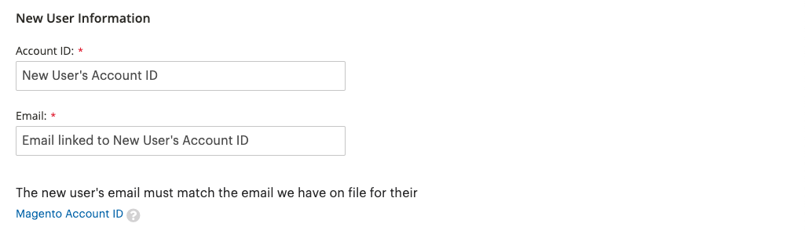

# Share Your Commerce Account

Your Commerce account contains information that you can make available to trusted employees and service providers who help manage your site. As the primary account holder, you have authority to grant limited access to other Commerce account holders. Shared access can be revoked, but cannot be transferred from one user to another.

The Commerce Support team does not have access to the account and cannot set up shared access for you. Only the primary account holder with appropriate permissions can set up shared access. When your account is shared, all sensitive information, such as your billing history or credit card information, remains protected and is not shared at any time with other users.

>[!NOTE]
>
>All actions taken by users with shared access are the sole responsibility of the primary account holder. Adobe is not responsible for any actions taken by users who have shared access to your account.

<!-- zoom -->

## Set up a shared account

1. Before you begin, get the following information from the Commerce account of the **new user**:

   - The `Account ID` that is displayed at the upper-left corner of the _Magento_ tab, just above the **Log Out** link.
   - The `Email` address that is associated with the account.

1. Log in to your [Commerce account](commerce-account-create.md).

1. In the left panel, click **Shared Access**.

1. Click **Add New User**.

   <!-- zoom -->

1. Under _New User Information_, do the following:

   - Enter the **Account ID** from the new user's Commerce account.
   - Enter the **Email** address that is associated with the new user's Commerce account.

   <!-- zoom -->

1. Under _Shared Information_, do the following:

   - To identify the shared account, enter a **Share Name**. The Share Name is for internal reference, and is visible only to you and the person with whom you share your account.
   - If you want to share your personal contact information with the new user, enter **Your Email** and **Your Phone**.

1. Under _Grant Account Permissions_, select the checkbox of each Commerce product and service that you want to share.

   <!-- zoom -->

1. When complete, click **Create Shared Access**.

   The new user information appears in the _Manage Permissions_ section of the Shared Access page, and an email invitation with instructions to access the shared account is sent to the new user.

   <!-- zoom -->

## Access a shared account

The following instructions are written from the perspective of a shared user who receives an invitation to a shared account.

1. When you receive an invitation to a shared account, follow the instructions in the email to log in to your own Commerce account.

   The left panel of your account has a new _Shared with me_ tab. The _Switch Accounts_ control in the upper-right corner has options for `My Account` and the name of the shared account.

   <!-- zoom -->

1. To gain access to the shared account, set **Switch Accounts** to the name of the shared account.

   <!-- zoom -->

   The shared account displays a welcome message and contact information. The left panel includes only the items that you have permission to use.

1. To connect the shared account to the Help Center, click **Support** in the left panel of the shared account.

   <!-- zoom -->

   You can use the [Adobe Commerce Help Center](https://support.magento.com/hc/en-us) from the shared account to search for articles and troubleshooting information, find patches for known issues, and create support tickets.

   >[!NOTE]
   >
   >After receiving shared access, the user must log in to their [Commerce account](https://account.magento.com/customer/account/login), navigate to _Shared Access_, and click the **Support** tab. This action is required the first time only, in order to ensure that the [Commerce Help Center](https://support.magento.com/hc/en-us) is configured properly through the `SSO` call.

1. To return to your own account, click **Back** in your browser controls and set **Switch Accounts** to `My Account`.

## Revoke shared access

1. Sign in to your Commerce account.

1. In the left panel, click **Shared Access**.

1. Find the account to be revoked under _Managing Users & Permissions_ and click **Delete**.

1. When prompted to confirm, click **Delete User**.
