# Commerce Identity Manager

The [Commerce Identity Manager](https://identity.magento.com) provides users with the ability to link their Commerce product accounts with an Adobe ID for seamless single sign-on across all Adobe Commerce products and simpler user account management. When your Commerce accounts are linked to an Adobe ID and you are logged into that Adobe ID, you bypass the standard Commerce product login process and do not need to log in again.

The Identity Manager is designed to work with all Commerce products, but account linking is only enabled for Commerce products that have been integrated with it. The Commerce products that are currently and officially integrated are:

- magento.com

<!-- add other products to this bullet list as they are integrated -->

>[!NOTE]
>
>These instructions contain screen images using account.magento.com as the example Commerce product. All products that are integrated with the identity manager adhere to the same processes described in the following sections.

## Set up Commerce Identity Manager

### Step 1: Register for an Adobe ID

In order to use the identity manager, you must have an active Adobe account for mapping your Commerce product accounts. If you already have an Adobe ID you would like to use for linking accounts, you can skip this step.

1. Go to the Adobe account login: [https://account.adobe.com][1]

1. Click **Create an account**.

   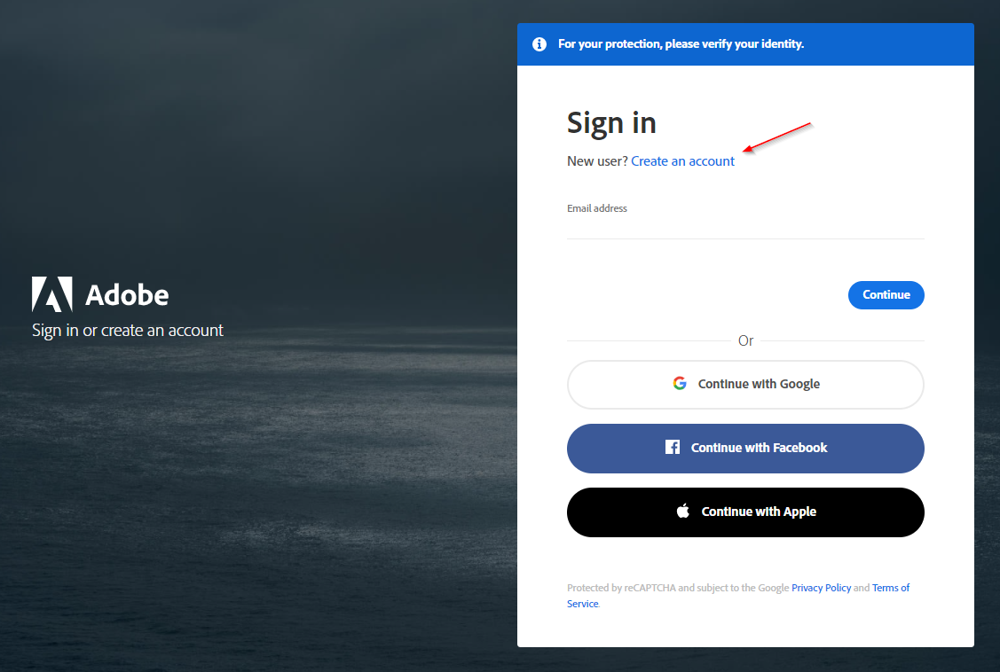<!-- zoom -->

1. Complete the form and click **Create account**.

   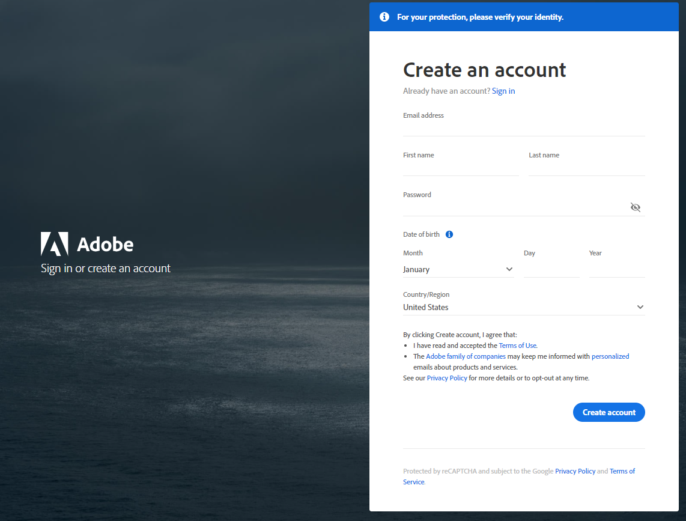<!-- zoom -->

### Step 2: Link a user account to the Adobe ID

Use one of these two methods for linking your Commerce product user account to the Adobe ID.

#### Method 1: From the Commerce product login page

1. Go to the product login page.

1. Click **Sign in with Adobe ID**

   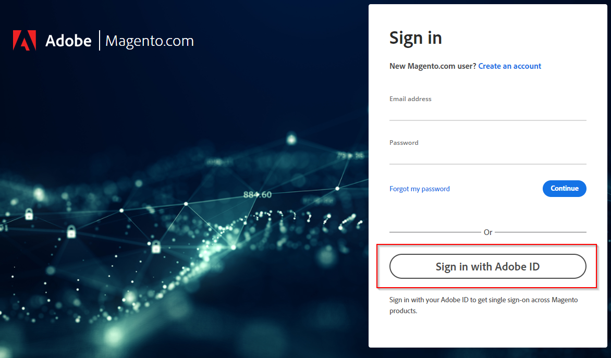<!-- zoom -->

1. If necessary, enter your Adobe ID email and click **Continue**, then enter your password and click **Continue** again.

   If you are already actively logged into an Adobe ID in your current browser session, the identity manager completes this step for you.

1. Enter the username and password combination of the Commerce account that you want to link and click **Continue**.

   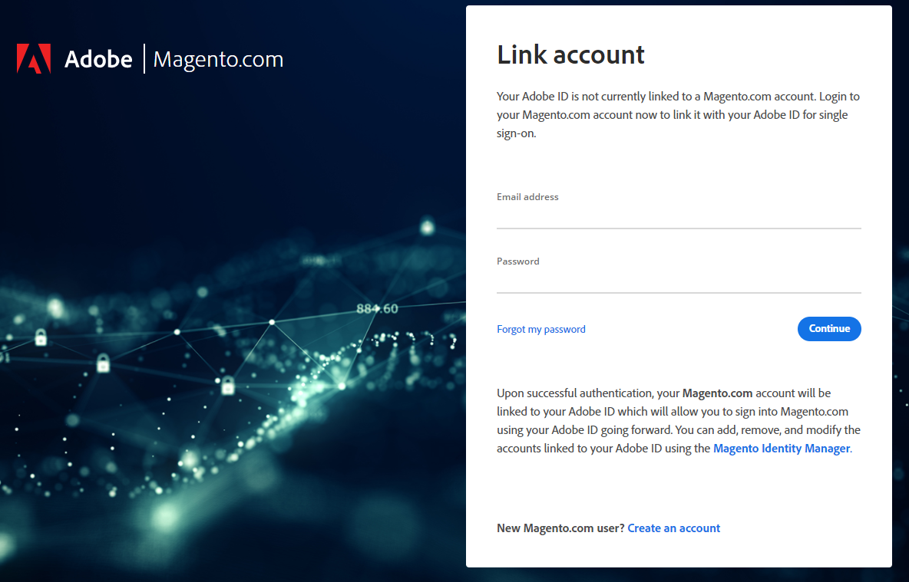<!-- zoom -->

1. If you have two-factor authentication (2FA) enabled on this Commerce account, enter the verification code displayed in your 2FA application and click **Submit**.

   If you are having trouble with authentication, see [Securing Your Account](commerce-account-secure.md) for more information.

   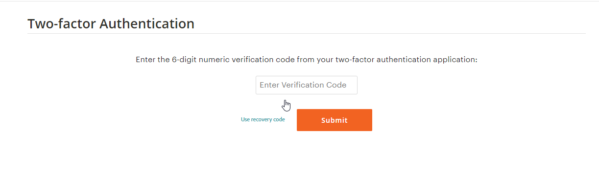<!-- zoom -->

   A message is displayed to confirm that the accounts have been successfully linked. You also receive an email with this confirmation information. At this point, you are logged into your Commerce account. Click **Continue** to proceed to your Commerce account.

   <!-- zoom -->

   >[!IMPORTANT]
   >
   >If the Commerce account you are attempting to link is already linked to an Adobe ID, the account mapping fails and you land on the identity manager dashboard with an error message. You are still logged into the Commerce account even if the mapping is unsuccessful. The Commerce account must first be unlinked from its current Adobe ID before you can link it your Adobe ID.

#### Method 2: From the identity manager dashboard:

1. Go to the Commerce Identity Manager dashboard: [https://identity.magento.com][2]

1. If necessary, enter your Adobe ID email and click **Continue**, then enter your password and click **Continue** again.

   If you are already actively logged into an Adobe ID in your current browser session, the identity manager completes this step for you.

1. Find the Commerce product from which you want to link an account and click **+ Add****.

   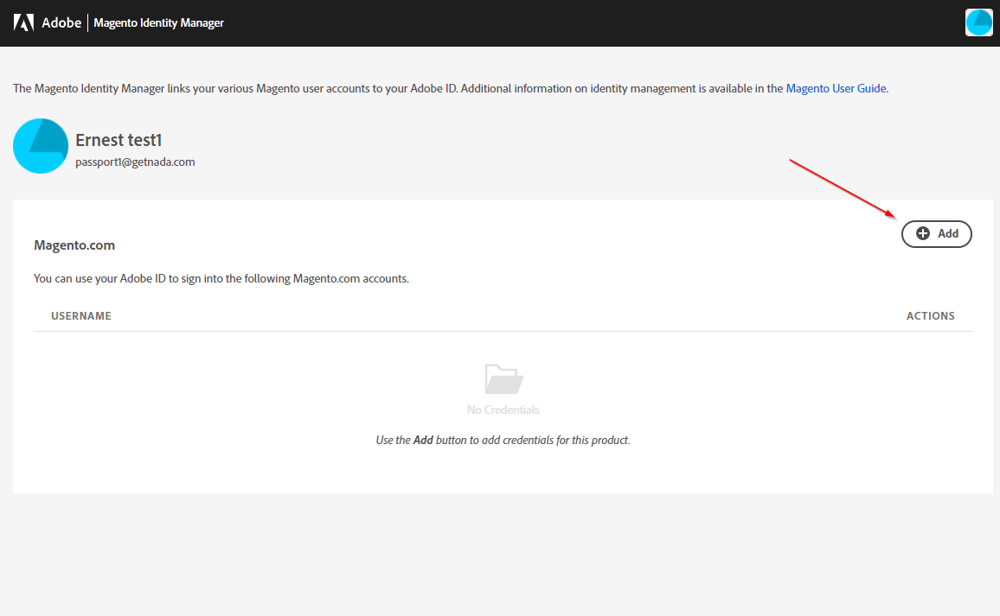<!-- zoom -->

   A message appears to explain that you may be unable to proceed if you are currently logged into the product you are trying to link. If necessary, navigate to the product to log out or ensure you are no longer logged in.

   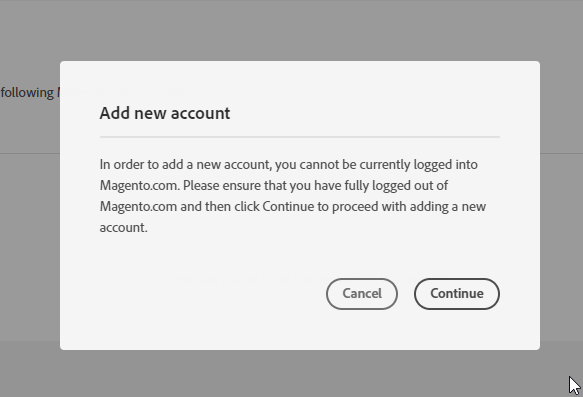<!-- zoom -->

   >[!IMPORTANT]
   >
   >If you are currently logged into the product you are trying to link and you click **Continue**, the identity manager directly links the account where you are currently logged in. In order to be prompted to link any account of your choice, navigate to the product and logout of your account before you click **Continue**. 
   > 
   >If you click **Continue** and the page simply refreshes, this likely means you are still actively logged into the product. Navigate to the product and logout of your account to proceed.

1. Enter the username and password combination of the Commerce account that you want to link, and then click **Continue**.

   <!-- zoom -->

1. If you have two-factor authentication (2FA) enabled for the Commerce account, enter the verification code displayed in your 2FA application and click **Submit**.

   If you are having trouble with authentication, see [Securing Your Account](commerce-account-secure.md) for more information.

   <!-- zoom -->

   When the link is complete, you are returned to the identity manager dashboard and you can see the recently linked account in the list below the Commerce product. You also receive an email to confirm the account linking.

   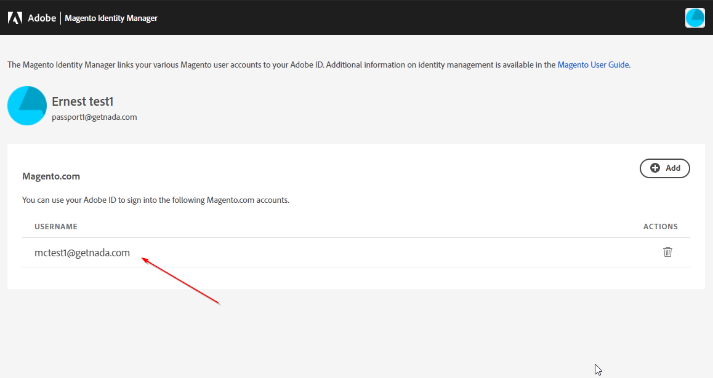<!-- zoom -->

### Step 3: Log in with your linked account

1. Go to the account login page.

1. Click **Sign in with Adobe ID**.

   <!-- zoom -->

1. If necessary, enter your Adobe ID email and click **Continue**, then enter your password and click **Continue** again.

   If you are already actively logged into an Adobe ID in your current browser session, the identity manager completes this step for you.

You are now logged into the Commerce product.

## Link multiple user accounts to one Adobe ID

The identity manager allows for unlimited Commerce accounts to be linked to an Adobe ID. To link another account, simply navigate to the identity manager dashboard and follow the preceding instructions for [linking an account from the identity manager](#method-2-from-the-identity-manager-dashboard).

When you have more than one account linked to your Adobe ID, there is also an option to add an account during the login process (see [Log in with multiple linked accounts](#log-in-with-multiple-linked-accounts)).

>[!IMPORTANT]
>
>While you can link as many Commerce accounts to your Adobe ID as you like, a Commerce account cannot be linked to more than one Adobe ID. If you attempt to link a Commerce account that is already linked to an Adobe ID, the account mapping fails and you land on the identity manager dashboard with an error message. You are still logged into the Commerce account even if the mapping is unsuccessful. The Commerce account must be unlinked from its current Adobe ID before you can link it to your Adobe ID.

### Log in with multiple linked accounts

1. Go to the account login page.

1. Click **Sign in with Adobe ID**.

   <!-- zoom -->

1. If necessary, enter your Adobe ID email and click **Continue**, then enter your password and click **Continue** again.

   If you are already actively logged into an Adobe ID in your current browser session, the identity manager completes this step for you.

1. To display the linked accounts, click the **Account to use** menu.

   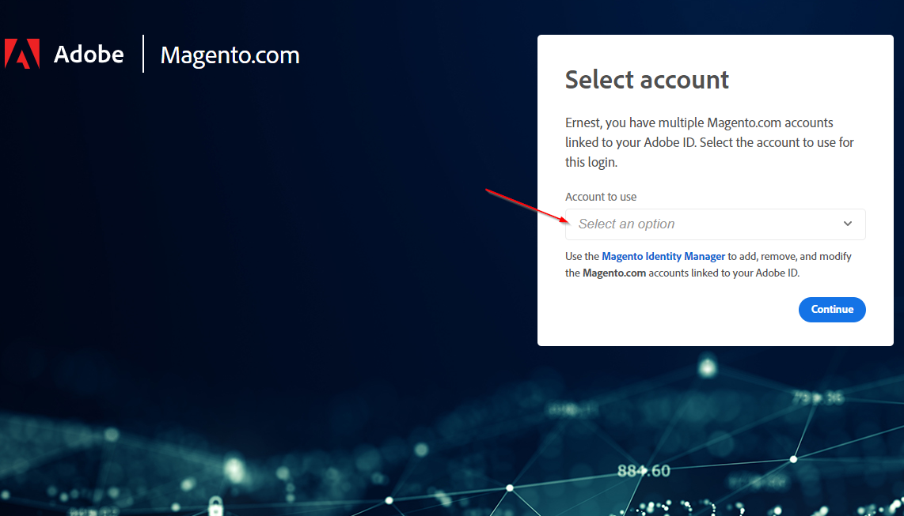<!-- zoom -->

1. Select the account that you want to use for login.

   There is also an option to add another account directly from the list.

   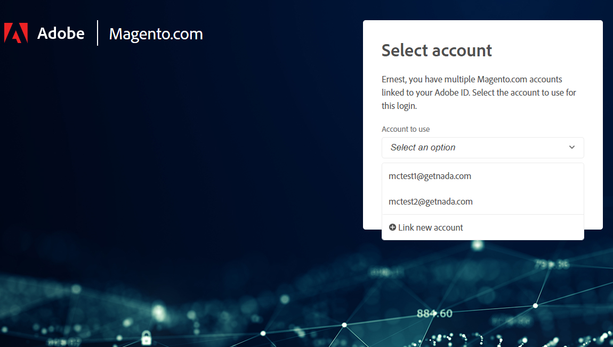<!-- zoom -->

1. Click **Continue**.

You are now logged into the Commerce account.

### Reorder accounts in the identity manager dashboard

The order of the accounts displayed in the identity manager dashboard determines the order of the displayed accounts for the **_Select an option_** list when you are [logging in with multiple linked accounts](#log-in-with-multiple-linked-accounts).

1. Go to the Commerce Identity Manager dashboard: [https://identity.magento.com][2]

1. If necessary, enter your Adobe ID email and click **Continue**, then enter your password and click **Continue**.

   If you are already actively logged into an Adobe ID in your current browser session, the identity manager completes this step for you.

1. Find the Commerce product accounts that you want to reorder.

1. For each account name, click-and-drag it into position within the list.

   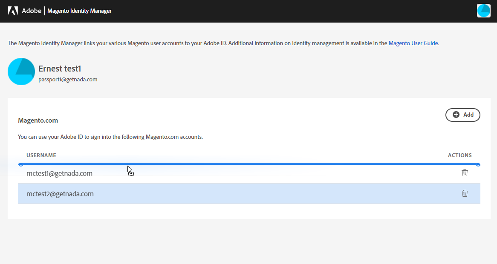<!-- zoom -->

   The new order is automatically saved.

   <!-- zoom -->

## Unlinking a user account from an Adobe ID

If you want to unlink a Commerce account from your Adobe ID, there are two methods available: directly from the identity manager dashboard, or using the confirmation email you received when linking the account.

### Unlink a user account from the dashboard

1. Go to the Commerce Identity Manager dashboard: [https://identity.magento.com][2]

1. If necessary, enter your Adobe ID email and click **Continue**, then enter your password and click **Continue** again.

   If you are already actively logged into an Adobe ID in your current browser session, the identity manager completes this step for you.

1. Find the Commerce product that you want to unlink (you should see the account listed under the USERNAME column of the table).

1. To remove the corresponding account, click the trash icon in the _ACTIONS_ column .

   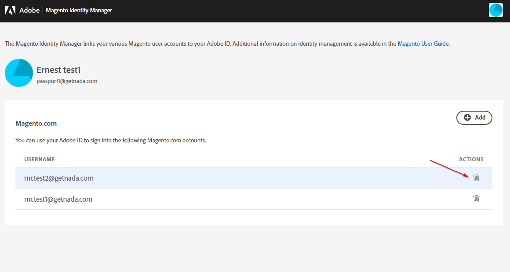<!-- zoom -->

1. Click **Yes - Delete** to complete unlinking the account.

   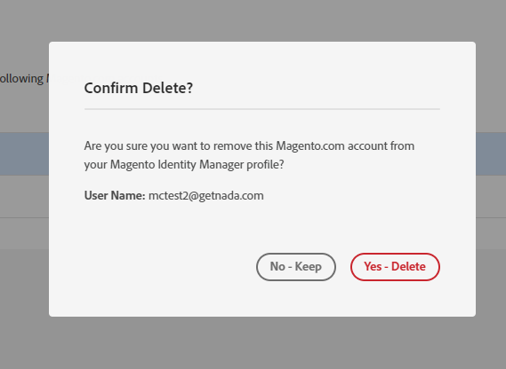<!-- zoom -->

After this step, the browser returns you to the identity manager dashboard, where the unlinked account is no longer displayed under the Commerce product.

### Unlink a user account from the confirmation email

1. Open the confirmation email that was delivered when the account was linked.

   The email is from `info@magento.com` and the subject reads _Your Magento.com account has been linked from an Adobe ID_. Be sure that the email corresponds to the correct Commerce account you want to unlink, which is emphasized by bold text.

1. Click **Remove Link** near the bottom of the email body.

   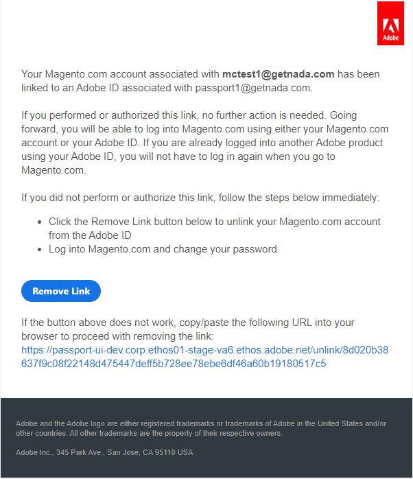<!-- zoom -->

   When the Commerce account is successfully unlinked, it launches a confirmation page in your browser. You can close this window/tab. You also receive an email confirming the account has been unlinked.

   >[!NOTE]
   >
   >If the **Remove Link** button does not work, copy/paste the URL that is below the button into your browser to proceed with removing the link.

## Log in with your user account

You are not forced to use the identity manager, and you can still log in to your account using the traditional method:

1. Go to the account login page.

1. Enter your username and password combination, and then click **Continue** to log into your account.

   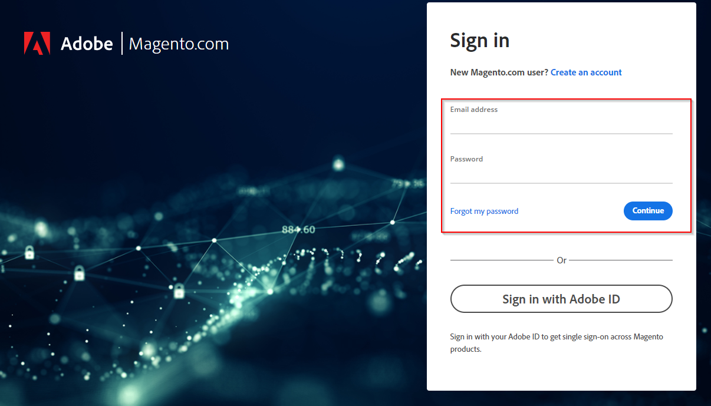<!-- zoom -->

>[!NOTE]
>
>Logging in with the user account fields does not enable the single sign-on capability. Single sign-on is only active when you are logged into an Adobe ID and elect to use **Sign in with Adobe ID**.

[1]: https://account.adobe.com
[2]: https://identity.magento.com
