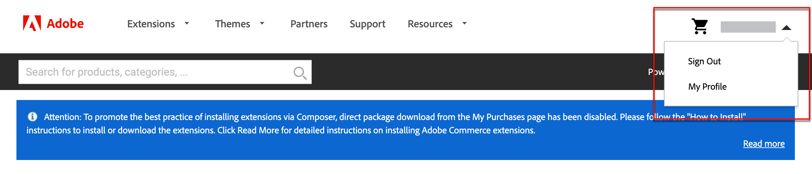
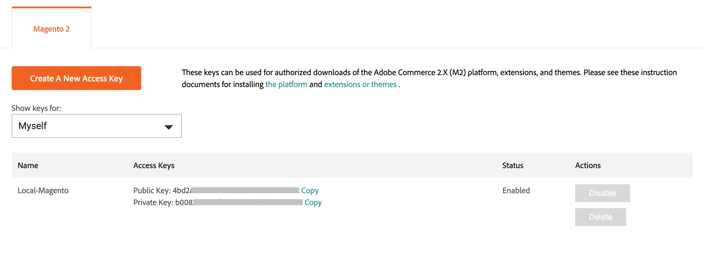
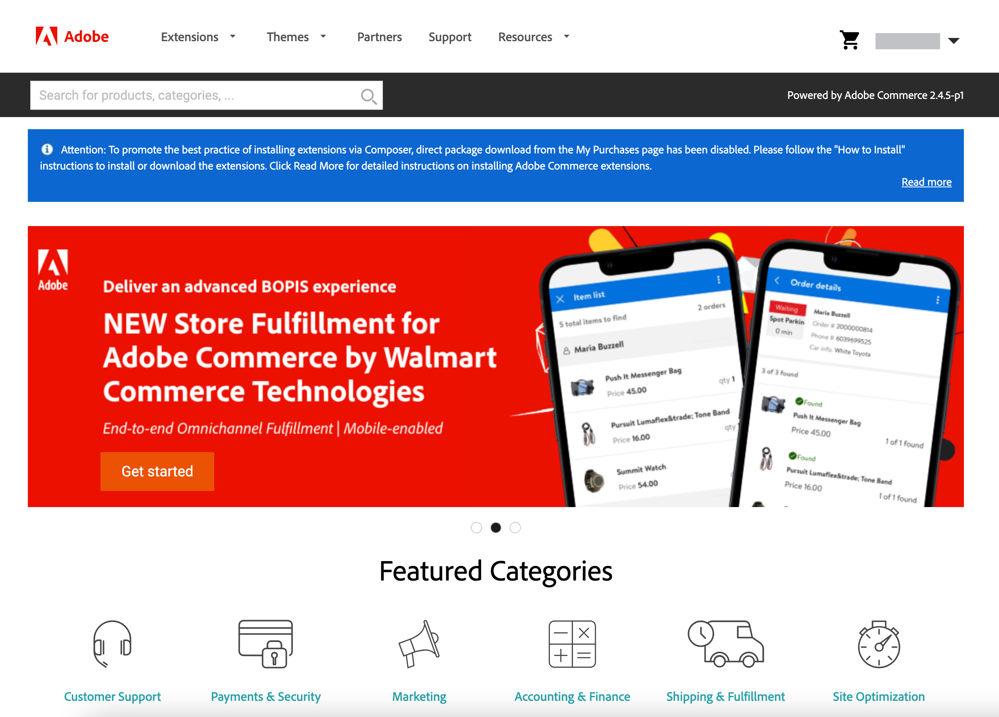

# Commerce Marketplace

[Commerce Marketplace][1] is the application store that offers merchants a curated selection of solutions, and provides qualified developers the tools, platform, and prime location to build a thriving business. Commerce Marketplace offers a selection of extensions that are available for free, and others that are for sale. Purchases can be paid by credit card or [PayPal][2].

All extensions available on Commerce Marketplace have passed an extensive review. The [Extension Quality Program][3] (EQP) combines Commerce expertise, development guidelines, and verification tools to ensure that all extensions on Commerce Marketplace meet coding standards and best practices. The review process includes both an automated check and manual QA review. During the process, the structure and code of each extension is examined and tested for evidence of virus/malware infection, and any indication of plagiarism. The review includes a deep technical examination and sanity check conducted by a Commerce engineer, with a focus on documentation, coding structure, performance, scalability, security, and compatibility with the Commerce core.

Although you can purchase extensions from other sources, only the extensions that are available on Commerce Marketplace are verified through extensive technical and marketing review within the Extension Quality Program.

## Marketplace credentials

Before you can install an extension purchased from Commerce Marketplace, sign in to your Commerce account and verify that you have an active access key. You can sign in to your Commerce account from the header of [Marketplace][1] or [Magento.com][6].

Your access key is a set of public and private keys that is used to synchronize your Commerce installation with your Commerce account and verify your credentials. After your account is synchronized, you must enter your private key each time you install an extension or module from Commerce Marketplace or upgrade your Commerce installation.

You can create multiple access keys for different purposes and enable or disable them as needed. However, you must use the same access key that was used to install the Commerce software. For example, you cannot use a Magento Open Source access key to update or upgrade Adobe Commerce, or conversely. You also cannot use an access key that belongs to another user or one that is from a [shared account](commerce-account-share.md).

### Create an access key

1. Sign in to your Commerce account.

1. On the _My Account_ page, choose the **Marketplace** tab.

1. In the upper-right corner next to your name, click the down arrow and choose **My Profile**.

    <!-- zoom -->

1. On the _Marketplace_ tab under _My Products_, click **Access Keys**, and then do one of the following:

    - Check to see if you already have a set of access keys for your Marketplace purchases. You can create multiple sets of access keys for different purposes.

    - Click **Create a New Access Key**. Enter a name for the new key pair and click **OK**. Valid characters include upper- and lowercase characters and hyphens instead of spaces.

1. When complete, click **OK**.

    Your new access key is enabled and appears in the list.

    Notice the _Copy_ link after each public and private key. In the next step, you will copy and paste these values to synchronize your store with Commerce Marketplace.

    <!-- zoom -->

## Installation Process

>[!IMPORTANT]
>
>Starting with Adobe Commerce and Magento Open Source 2.4.0, the Web Setup Wizard is removed, and you must use the command line to [install](https://devdocs.magento.com/guides/v2.4/install-gde/install/cli/install-cli.html){:target="_blank"} or [upgrade](https://experienceleague.adobe.com/docs/commerce-operations/upgrade-guide/implementation/perform-upgrade.html){:target="_blank"} your instance. This requirement also includes [modules](https://experienceleague.adobe.com/docs/commerce-operations/upgrade-guide/modules/upgrade.html){:target="_blank"} and [extensions](https://devdocs.magento.com/extensions/install/){:target="_blank"}.

The installation process for Marketplace purchases is different for _on-premise_ installations of Commerce than for installations hosted on [the Adobe Cloud Architecture][4].

<!-- zoom -->

## Support

If you need help with installing or with using an extension, look first in the documentation that accompanies the extension. If you can't find the answer to your question, use the contact information in the extension listing to contact the developer directly.

If what you purchase on Commerce Marketplace does not meet your needs, you can request a refund within 25 days from the date of purchase. Adobe reviews all refund requests and if approved, issues the appropriate refund.

For support issues related to Commerce Marketplace, see the [Marketplace Help Center][5].

[1]: https://marketplace.magento.com/
[2]: https://www.paypal.com/us/home
[3]: https://developer.adobe.com/commerce/marketplace/guides/sellers/extension-quality-program/
[4]: https://www.adobe.com/commerce/magento/enterprise.html
[5]: https://marketplacesupport.magento.com/hc/en-us
[6]: https://business.adobe.com/products/magento/magento-commerce.html
