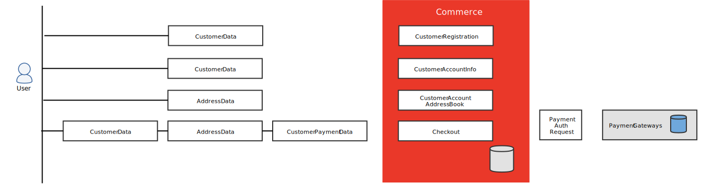

# CCPA compliance

>[!NOTE]
>
>This information is one in a series of topics to help Adobe Commerce merchants and developers understand the implications of the California Consumer Privacy Act. The information is based on the text of the statute. To confirm if CCPA applies to your business, consult with your attorney.

The [California Consumer Privacy Act][5] (CCPA) expands the rights of consumers in California for determining how their personal information is collected, stored, and used. Its emphasis is the protection of consumers from the unauthorized sale or exchange or their personal information. The CCPA was enacted in 2018 and went into effect January 1, 2020.

The CCPA grants the following new rights to consumers:

- **Right to know** the categories of personal information about them that is collected, used, shared, or sold in the past 12 months.
- **Right to delete** certain types of personal information that is held by a business and/or their service providers.
- **Right to opt out** of the sale of their personal information.
- **Right to non-discrimination** in terms of price or service for having exercised a privacy right under CCPA.

For CCPA purposes, personal information in this context is defined as:

>Information that identifies, relates to, describes, is capable of being associated with, or could reasonably be linked, directly or indirectly, with a particular consumer or household. (Section 1798.140)

In this regard, it covers certain data elements that may not be considered personal data in the context of other laws or regulations. Merchants should keep this in mind when determining whether and how they should comply with the law.

The CCPA also requires businesses to provide _reasonable security_, and includes expanded data protection provisions for consumers, including the right to pursue legal action if there is a data breach.

Consult with your legal counsel to determine if and how you should comply with any CCPA requirements that may be applicable to you and your business. This includes the new notice, opt-out, and record-keeping requirements that businesses must implement in accordance with the law.

## Business requirements

The CCPA applies to for-profit businesses that do business in California and meet any of the following:

- Have a gross annual revenue of over $25 million
- Buy, receive, or sell the personal information of 100,000 or more California residents, households, or devices
- Derive 50% or more of their annual revenue from selling California residents' personal information.

## CCPA compliance guide

This section provides a high-level outline of the steps required for merchants to comply with privacy regulations such as the California Consumer Privacy Act (CCPA).

### GDPR and CCPA

If your business is required to comply with both the [General Data Protection Regulation](compliance-gdpr.md) (GDPR) and the CCPA, you can use some of the work from your GDPR compliance program for the CCPA. Although the regulations have some similarities, a few differences include:

- The definition of personal information differs for each regulation.
- The GDPR requires consumers to opt in before their personal data may be used for certain purposes; CCPA provides consumers with the right to opt out.
- The CCPA has additional data inventory and mapping requirements.
- The regulations have different privacy policy requirements.

Businesses that comply with GDPR might have additional obligations under the CCPA. To learn more, see the [CCPA Fact Sheet][3]{:target="_blank"}.

### Compliance roadmap

A coordinated effort is required to develop and implement a plan to address compliance. Use this roadmap as a guide to mobilize resources and prioritize tasks so you can move ahead on multiple fronts. The process is essentially the same for all [!DNL Commerce] installations, with the following exception:

- **Adobe Commerce on cloud infrastructure**: Merchants with stores hosted on Adobe [cloud infrastructure][4]{:target="_blank"} can ask their Adobe Commerce Technical Account Manager or Customer Support for help with responding to consumer requests.

- **On-Premise**: Merchants with on-premise installations of Adobe Commerce or Magento Open Source must develop their own processes and tools to respond to and manage consumer requests related to privacy regulations.

#### Step 1: Assemble a cross-functional team to address regulation compliance

Assemble a team that represents the following functional roles in your business, and schedule a training session to bring them up to speed on the legislation. Then, assign required tasks to stakeholders by role.

- Business Strategy & Operations
- Legal
- Information Technology
- User Experience
- Customer Service
- Administrative Support

From a business perspective, you must determine if your company extends these privacy-protection measures only to consumers in California, or makes them available to all consumers, regardless of location.

#### Step 2: Take inventory of your digital properties

**Stakeholders:** Information Technology, Legal, Administrative Support

Take inventory of your digital properties, including all integrations and who has access to your consumer data.

1. Determine what public and private personal information is collected through your websites and mobile applications. For example, a standard Commerce database stores the following types of public and private personal information:

   - **Public**: Wish lists, product reviews

   - **Private**: Customer Information, Order Information, Reward Points, Gift Registry, Address Book, Store Credit, Payment Methods, Billing Agreements, Newsletter Subscriptions, Invitations.

      If your [!DNL Commerce] installation has been customized, additional personal information might be collected. Personal information might also reside in [cookies](./compliance-cookie-law.md), tags, and other technologies that collect information.

1. Identify the parties with whom you share data. The list should include service providers and third parties. Third parties include advertising networks, internet service providers, data analytics providers, government entities, operating systems and platforms, social networks, and consumer data resellers who do not directly collect personal information from your consumers.

   - **Service Providers**:  Entities who have access to your consumer data for a business purpose, and provide services on your behalf. For example, Adobe is service provider, as are some developers of customizations, extensions, and services.

      Check the default settings of Google Universal Analytics, Google Tag Manager &mdash; and any other data services you use &mdash; and make any changes necessary to comply with the regulation. To learn more, see [Google Privacy Settings](../merchandising-promotions/google-tools.md#google-privacy-settings).

   - **Other Third Parties**: Entities with whom you share or sell consumer data. For example, you might share consumer data with an advertising network in exchange for advertising.

#### Step 3: Map the customer journey and data collection process in your stores

**Stakeholders:** User Experience, Information Technology, Administrative Support

1. Identify each point in the [customer journey] where personal information is collected, and the type of information that is collected at each step.

    Visitors to your site must be notified in advance, or at the point of data collection. For example, a store without custom integrations collects personal information when a customer account is created and during checkout. If your store has custom integrations, there might be additional data items and attributes to identify.

1. See the following topics for applicable data flow diagrams and database entity mappings for each version:

   - [Personal Information Reference (2.x)][1]
   - [Personal Information Reference (1.x)][2]

   

#### Step 4: Establish procedures and mechanisms to respond to customer requests

**Stakeholders:** Customer Service, Information Technology, User Experience, Administrative Support

From a data management perspective, each request for personal information involves the following parties:

- **Data Subjects** (Consumers): Under CCPA, any person in California who provides personal information to make a purchase and/or to maintain a customer account might submit a request to access or delete their personal data.

- **Entities acting as Businesses within the scope of CCPA** (Brands): [!DNL Commerce] merchants collect and store personal information from their customers and guests who make purchases in their stores.

- **Data Processor** (Technology Vendors): Adobe Commerce and Magento Open Source act as processors of the personal data that is stored as part the services provided to merchants. As a processor, Adobe processes personal data in accordance with the merchant's permission and instructions, according to the license agreement.

Merchants are responsible to do the following:

1. Identify the parties involved in the Data Subject Access Request (DSAR) and verify the identity of any person who requests to know, opt out, or delete. This applies a person who has a password-protected customer account, or one who shops in your store as a guest.

1. Disclose and deliver information to a consumer in response to their rights request within 45 days of receiving a verifiable consumer request from the consumer, unless it is not possible. (The law contains certain other requirements for a business to maintain compliance for delays of up to an extra 45 days).

   Merchants must respond to each DSAR within 45 days, beginning from the day the request is received. If necessary, merchants can take up to 45 more days to respond, for a maximum total of 90 days from the day the request is received. This requires that the merchant notifies the customer to explain the reason for the delay.

1. Develop a mechanism for presenting the required notifications in your store and collecting consumer response.

1. Establish response procedures and document each of the following requests:

   - **Requests to Know** - Visitors to your store must be informed of any arrangements that you have to sell or share their personal information with third parties, and be allowed to opt out. The details of your use of personal information, and the parties with whom you share or sell data can be maintained in your privacy policy.

   - **Requests to Opt Out** - If personal data is sold or transferred to third parties in exchange for valuable consideration, the CCPA requires a _Do Not Sell My Info_ link at each point where it is collected. Additional user-enabled input controls, such as checkboxes and buttons, can be used in email communications, website preference settings, or in website forms at the point of data collection for individuals to submit a valid opt-out request.

   - **Requests to Delete**

      - Merchants whose stores are hosted on Adobe Commerce Cloud should contact Adobe Support for assistance deleting personal information. Contact your Adobe Technical Account Manager or Customer Support for more information.
      - Merchants running installations of Adobe Commerce or Magento Open Source on premise must implement their own process and script to delete personal information upon request.

#### Step 5: Write the content for the required customer notifications

**Stakeholders:** Legal, Customer Service, User Experience, Information Technology, Administrative Support

1. In partnership with your legal counsel, determine the types of notices that should be added to your website to meet CCPA obligations.

   - **Notice of Collection**: A notice given at or before the time personal information is collected from the consumer. The notice should be written in plain language, and be easy for the average person to understand. The notice should be conspicuous and provided in one or more same languages as your website content.

   - **Notice of Right to Opt Out**: A notice that informs consumers of their right to opt out of the sale of their personal information.

   - **Notice of Financial Incentive**: A notice that explains each financial incentive, price, or service difference that your company receives in exchange for personal information.

   - **How to Submit a Request for Personal Information Collection and Use**: Instructions for individuals to submit a request that you disclose the personal information that you have collected about the individual, including:

      - Specific pieces of personal information that you have collected about the consumer
      - Categories of personal information that you have collected about the consumer
      - Categories of sources from which the personal information is collected
      - Categories of personal information about the consumer that you have sold or disclosed for a business purpose
      - Categories of third parties to whom the personal information was sold or disclosed for a business purpose
      - The reasons why your business collects and/or sells personal information

1. Send the content to the team, and if possible, your legal counsel for review.

1. Determine where the notices appear, how they function (for each visit, at authentication or on click-through), and their position and format in relation to other content.

1. Pass the approved content to your development team.

#### Step 6: Review your agreements with service providers

**Stakeholders:** Legal, Administrative Support

Review and if necessary, update all service provider contracts to reflect CCPA requirements.

#### Step 7: Update your privacy policy

**Stakeholders:** Legal, Administrative Support

Review your current privacy policy and consider what, if any, additional disclosures are necessary.

- **Use of Personal Information**: You must disclose what personal information is collected, and any financial incentives you receive in exchange from the sale of personal information. It is also required that you explain how the incentive is allowed under CCPA, and how the value of the personal information is calculated.

- **Age of Consent**: If you collect or use personal information about minors, you may be subject to the following requirements:

   - **Minors < 13**: Parental authorization is required for minors under the age of 13 to opt in to the sale of their personal information.

   - **Minors 13 to < 16**: Minors at least 13 and less than 16 years of age can opt in to the sale of their personal information, provided the business establishes a reasonable process to document the action. The process must be  described in the company's [privacy policy](privacy-policy.md). When a business receives requests from minors in this age range, it must inform them of their right to opt out later, and explain how to do it.

   >[!IMPORTANT]
   >
   >Merchants are prohibited from storing the personal data of children on [!DNL Commerce] platform or systems. If there is reason to believe that collected data belongs to a minor, it must be removed from a [!DNL Commerce] platform immediately to avoid breach of Adobe license terms.

#### Step 8: Document all related procedures and maintain records

**Stakeholders:** Customer Service, Administrative Support

For 24 months after each individual rights request is received, maintain a record of the request and your company's response.

[1]: https://experienceleague.adobe.com/docs/commerce-operations/security-and-compliance/reference/data-m2.html
[2]: https://experienceleague.adobe.com/docs/commerce-operations/security-and-compliance/reference/data-m1.html
[3]: https://oag.ca.gov/system/files/attachments/press_releases/CCPA%20Fact%20Sheet%20%2800000002%29.pdf
[4]: https://www.adobe.com/commerce/magento.html
[5]: https://oag.ca.gov/privacy/ccpa
