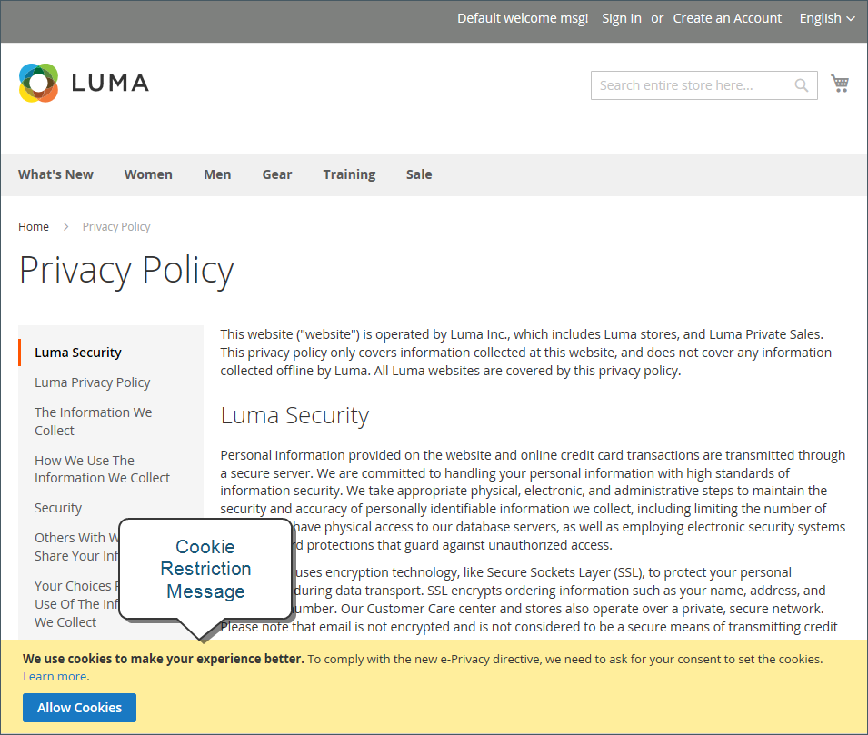
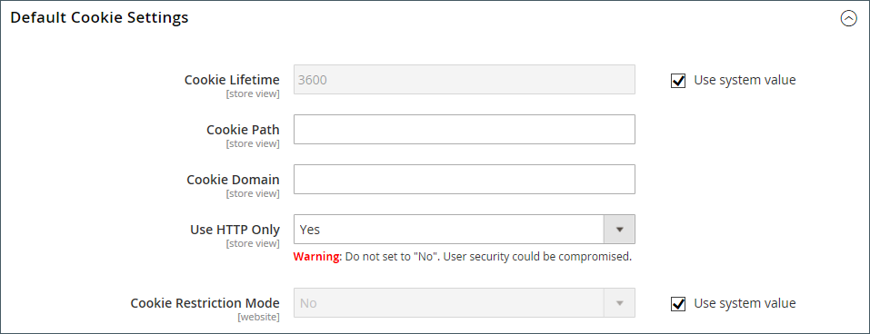

# Cookie law compliance

Cookies are small files that are saved to the computer of each visitor to your site, and used as temporary holding places for information. Information that is saved in cookies is used to personalize the shopping experience, link visitors to their shopping carts, measure traffic patterns, and improve the effectiveness of promotions. To keep pace with legislation in many countries regarding the use of cookies, Adobe Commerce and Magento Open Source offer merchants a choice of methods to obtain customer consent. For a list of the default cookies in Adobe Commerce and Magento Open Source, the [Cookie Reference](#default-cookies).

>[!NOTE]
>
>If you modify the default [Google privacy settings](../merchandising-promotions/google-tools.md#google-privacy-settings) to comply with the [General Data Protection Regulation](compliance-gdpr.md), it is not necessary to obtain user consent for the use of Google Analytics cookies.

## Cookie restriction mode

When cookie restriction mode is enabled, visitors to your store are notified that cookies are required for full-featured operations. Depending on your theme, the message might appear above the header, below the footer, or somewhere else on the page. The message links to your privacy policy for more information, and encourages visitors to click the Allow button to grant consent. After consent is granted, the message disappears.

Your [privacy policy](privacy-policy.md)) should include the name of your store and contact information, and explain the purpose of each cookie that is used by your store. To learn more, see [Cookie Reference](#default-cookies).

>[!NOTE]
>
>If you change the URL key of the privacy policy, you must also create a custom URL rewrite to redirect traffic to the new URL key. Otherwise, the link in the Cookie Restriction Mode message returns `404 Page Not Found`.

{width="600"}

### Step 1: Enable cookie restriction mode

1. On the _Admin_ sidebar, go to **[!UICONTROL Stores]** > _[!UICONTROL Settings]_ > **[!UICONTROL Configuration]**.

1. In the left navigation panel under **[!UICONTROL General]**, choose **[!UICONTROL Web]**.

1. Expand the **[!UICONTROL Default Cookie Settings]** section and do the following:

    {width="600"}
 
    - Enter the **[!UICONTROL Cookie Lifetime]** in seconds.

    - If you want to make cookies available to other folders, enter the **[!UICONTROL Cookie Path]**. To make the cookies available anywhere in the site, enter a forward slash (`/`). This value can contain only the cookie path, and **_cannot_** contain any other cookie parameters.

    - To make the cookies available to a subdomain, enter the subdomain name in the **[!UICONTROL Cookie Domain]** field (`subdomain.yourdomain.com`). To make cookies available to all subdomains, enter the domain name preceded by a period (`.yourdomain.com`). This value can contain only the cookie domain, and **_cannot_** contain any other cookie parameters.

    - To prevent scripting languages, such as JavaScript, from gaining access to cookies, make sure that **Use HTTP Only** is set to `Yes`.

    - Set **[!UICONTROL Cookie Restriction Mode]** to `Yes`.

        If necessary, clear the checkbox and click **[!UICONTROL OK]** to confirm scope switching.

1. When complete, click **[!UICONTROL Save Config]**.

1. When prompted to update the cache, click the **[!UICONTROL Cache Management]** link in the system message. Then, refresh each invalid cache.

### Step 2: Update your privacy policy

Update your [privacy policy](privacy-policy.md) so that it reflects the information that your company collects and how it is used.

## Default cookies

The default cookies in Adobe Commerce and Magento Open Source are classified as Exempt / Non-Exempt to help merchants meet the requirements of privacy regulations such as the [GDPR](compliance-gdpr.md). Merchants should use this information as a guide, and consult with legal advisors to update their Privacy and Cookie Policies as part of a comprehensive privacy regulation compliance strategy.

The following cookies are used by [!DNL Commerce] "out of the box" for on-premise and cloud installations. These cookies may be required by functionality that is explicitly requested by the customer. To learn about the lifetime of session cookies, see [Session Lifetime](../customers/customer-online-options.md).

Some of these cookies may provide configuration options, including enable/disable, as needed.

### Requested functionality cookies (exempt)

 
#### `add_to_cart` 

 (Adobe Commerce only) Used by Google Tag Manager. Captures the product SKU, name, price and quantity removed from the cart, and makes the information available for future integration by third-party scripts.

#### `guest-view`

Stores the Order ID that guest shoppers use to retrieve their order status. Guest orders view. Used in _[!DNL Orders and Returns]_ widgets.

- Is Secure? No
- HTTP Only: Yes
- Expiration Policy: Session
- Module: `Magento_Sales`

#### `login_redirect`

Preserves the destination page that was loading before the customer was directed to log in. A login redirect is used with the mini cart for logged-in customers if the [Display Mini Cart](../stores-purchase/cart-configuration.md#mini-cart) configuration option is set to `Yes`.

- Is Secure? No
- HTTP Only: No
- Expiration Policy: Session
- Module: `Magento_Customer`

#### `mage-banners-cache-storage`

 (Adobe Commerce only) Stores banner content locally to improve performance.

#### `mage-messages`

Tracks error messages and other notifications that are shown to the user, such as the cookie consent message, and various error messages. The message is deleted from the cookie after it is shown to the shopper.

There is not an option to disable this cookie.

- Is Secure? No
- HTTP Only: No
- Expiration Policy: Duration 1 year. Cleared on frontend when the message is displayed to the user.
- Module: `Magento_Theme`

#### `mage-translation-storage` (local storage)

Stores translated content when requested by the shopper. Used when [Translation Strategy](../configuration-reference/advanced/developer.md) is configured as "Dictionary (Translation on Storefront side)".

- Is Secure? No
- HTTP Only: No
- Expiration Policy: Per local storage rules
- Module: `Magento_Translation`

#### `mage-translation-file-version` (local storage)

Tracks the version of translations in local storage. Used when [Translation Strategy](../configuration-reference/advanced/developer.md) is configured as `Dictionary (Translation on Storefront side)`.

- Is Secure? No
- HTTP Only: No
- Expiration Policy: Per local storage rules
- Module: `Magento_Translation`

#### `product_data_storage` (local storage)

Stores configuration for product data related to Recently Viewed / Compared Products.

- Is Secure? No
- HTTP Only: No
- Expiration Policy: Per local storage rules
- Module: `Magento_Catalog`

#### `recently_compared_product` (local storage)

Stores product IDs of recently compared products.

- Is Secure? No
- HTTP Only: No
- Expiration Policy: Per local storage rules
- Module: `Magento_Catalog`

#### `recently_compared_product_previous` (local storage)

Stores product IDs of previously compared products for easy navigation.

- Is Secure? No
- HTTP Only: No
- Expiration Policy: Per local storage rules
- Module: `Magento_Catalog`

#### `recently_viewed_product` (local storage)

Stores product IDs of recently viewed products for easy navigation.

- Is Secure? No
- HTTP Only: No
- Expiration Policy: Per local storage rules
- Module: `Magento_Catalog`

#### `recently_viewed_product_previous` (local storage)

Stores product IDs of recently previously viewed products for easy navigation.

- Is Secure? No
- HTTP Only: No
- Expiration Policy: Per local storage rules
- Module: `Magento_Catalog`

#### `remove_from_cart`

 (Adobe Commerce only) Used by [Google Tag Manager](../merchandising-promotions/google-tag-manager.md). Captures the product SKU, name, price, and quantity added to the cart, and makes the information available for future integration by third-party scripts.

#### `stf`

Records the time messages are sent by the SendFriend ([Email a Friend](../stores-purchase/email-a-friend.md)) module.

- Is Secure? Yes
- HTTP Only: Yes
- Expiration Policy: Session
- Module: `Magento_SendFriend`

#### `X-Magento-Vary`

Configuration setting that improves performance when using Varnish static content caching.

- Is Secure? Yes
- HTTP Only: Yes
- Expiration Policy: Based on PHP setting session.cookie_lifetime
- Module: `Magento_PageCache`

#### `form_key`

A security measure that appends a random string to all form submissions to protect the data from Cross-Site Request Forgery (CSRF).

- Is Secure? No
- HTTP Only: No
- Expiration Policy:
    - PHP: Based on PHP setting session.cookie_lifetime
    - JS: Session
- Module: Page Cache

#### `mage-cache-sessid`

The value of this cookie triggers the cleanup of local cache storage. When the cookie is removed by the backend application, the Admin cleans up local storage, and sets the cookie value to `true`.

- Is Secure? No
- HTTP Only: No
- Expiration Policy: Session
- Module: `Magento_Customer`

#### `mage-cache-storage`

Local storage of visitor-specific content that enables ecommerce functions.

- Is Secure? No
- HTTP Only: No
- Expiration Policy: Session
- Module: `Magento_Customer`, `Magento_Persistent`

#### `mage-cache-storage` (local storage)

Local storage of visitor-specific content that enables ecommerce functions.

- Is Secure? No
- HTTP Only: No
- Expiration Policy: Session
- Module: `Magento_Customer`, `Magento_Persistent`, `Magento_NegotiableQuote`

#### `mage-cache-storage-section-invalidation` (local storage)

Forces local storage of specific content sections that should be invalidated.

- Is Secure? No
- HTTP Only: No
- Expiration Policy: Per local storage
- Module: `Magento_Customer`

#### `persistent_shopping_cart`

Stores the key (ID) of persistent cart to make it possible to restore the cart for an anonymous shopper.

- Is Secure? Yes
- HTTP Only: Yes
- Expiration Policy: Based on [Persistent Shopping Cart](../stores-purchase/cart-persistent.md) - Persistence Lifetime (seconds) configuration
- Module: `Magento_Persistent`

#### `private_content_version`

Appends a random, unique number and time to pages with customer content to prevent them from being cached on the server.

It is set in multiple places: in PHP, in JavaScript as a cookie, and in JavaScript to local storage.

For HTTP Only=`Yes` (based on request), it means that the cookie is secure if set during HTTPS request and unsecure if set during HTTP request.

- Is Secure? `Yes` (based on request), `No`
- HTTP Only: `No`
- Expiration Policy: Based on [Persistent Shopping Cart](../stores-purchase/cart-persistent.md) - Persistence Lifetime (seconds) configuration
    - PHP: `1` year / `315360000s` (ten years)
    - JS: `1` day
    - JS local storage: Per local storage rules (forever)
- Module: `Magento_PageCache`, `Magento_Customer`

#### `section_data_ids`

Stores customer-specific information related to shopper-initiated actions, such as wish list display and checkout information.

- Is Secure? `No`
- HTTP Only: `No`
- Expiration Policy: `Session`
- Module: `Magento_Customer`

#### `store`

Tracks the specific store view / locale selected by the shopper.

- Is Secure? `No`
- HTTP Only: `Yes`
- Expiration Policy: `1` year
- Module: `Magento_Store`

#### `mage-banners-cache-storage` - local storage

 (Adobe Commerce only) Local storage for Banner functionality.

- Is Secure? `No`
- HTTP Only: `No`
- Expiration Policy: Per local storage rules
- Module: `Magento_Banner`

## Google Analytics cookies

The following cookies are used when [Google Analytics](../merchandising-promotions/google-analytics.md) or Google Universal Analytics is fully enabled for your installation. To disable these cookies for privacy regulation compliance, see [Google Privacy Settings](../merchandising-promotions/google-tools.md#google-privacy-settings). To learn more, see [Google Analytics Cookie Usage on Websites][1].

### Google Universal Analytics cookies  - non-exempt

 (Adobe Commerce only) JavaScript Libraries: `gtag.js` and `analytics.js`

- `_ga`: Distinguishes visitors to your site.
- `_gid`: Distinguishes visitors to your site.
- `gat`: Used to throttle request rate.
- `dc_gtm_<property-id>`: Throttles request rate when Google Analytics is deployed with [Google Tag Manager](../merchandising-promotions/google-tag-manager.md).
- `AMP_TOKEN`: Contains a token that can be used to retrieve a Client ID from AMP Client ID service. Other possible values include opt-out, inflight request, or an error retrieving a Client ID from  AMP Client ID service.
- `_gac_<property-id>`: Contains campaign-related information for the user. Google AdWords conversion tags read this cookie if Google Analytics is linked to your [AdWords][2] account.

### Google Analytics cookies - non-exempt

 (Adobe Commerce only) JavaScript Library: `ga.js`

- `__utma`: Distinguishes shoppers and sessions. This cookie is created when the JavaScript library executes and there is no existing `__utma` cookie. The cookie is updated every time data is sent to Google Analytics.
- `__utmt`: Used to throttle request rate.
- `__utmb`: Determines new sessions/visits. This cookie is created when the JavaScript library executes and there is no existing `__utmb` cookie. The cookie is updated every time data is sent to Google Analytics.
- `_utmz`: Saves the traffic source or campaign that explains how the shopper reached your site. The cookie is created when the JavaScript library executes, and is updated every time data is sent to Google Analytics.
- `__utmv`: Stores visitor-level custom variable data. This cookie is created when a developer uses the `_setCustomVar` method with a visitor-level custom variable. This cookie is updated every time data is sent to Google Analytics.

## Product Recommendations cookies

 (Adobe Commerce only) The following cookies are used by Product Recommendations for Adobe Commerce customers. These cookies are installed with the [DataServices module](https://experienceleague.adobe.com/docs/commerce-merchant-services/product-recommendations/getting-started/install-configure.html).

- `mg_dnt`: Allows you to [restrict Adobe Commerce data collection](https://experienceleague.adobe.com/docs/commerce-merchant-services/product-recommendations/developer/setting-cookie.html) if you have custom code to manage cookie consent on your site.
- `user_allowed_save_cookie`: Used for [cookie restriction mode](#cookie-restriction-mode).
- `authentication_flag`: Indicates if a shopper has signed in or signed out. This cookie is updated at the same time as the `dataservices_customer_id` cookie.
- `dataservices_customer_id`: Indicates if a shopper has signed in or signed out. This cookie contains the customer's unique ID in the system.
- `dataservices_customer_group`: Indicates a customer's group. This cookie is stored as [sha1](https://en.wikipedia.org/wiki/SHA-1) checksum of the customer's group ID.
- `dataservices_cart_id`: Identifies a shopper's cart actions. This cookie contains the customer's unique cart ID in the system.
- `dataservices_product_context`: Identifies a shopper's product interactions. This cookie contains the customer's unique quote ID in the system.

## Additional cookies

 (Adobe Commerce only) The following cookies are set for Adobe Commerce customers. These cookies are installed with the [DataServices module](https://experienceleague.adobe.com/docs/commerce-merchant-services/product-recommendations/getting-started/install-configure.html).

- `mg`: Set by Snowplow JavaScript tracker. More information can be found in the [Snowplow documentation](https://docs.snowplow.io/docs/collecting-data/collecting-from-own-applications/javascript-trackers/javascript-tracker/javascript-tracker-v3/tracker-setup/initialization-options).
- `com.adobe.alloy.getTld`: Given the current web page's hostname, this is the top-most domain that is not a "public suffix" as outlined in https://publicsuffix.org. Essentially, this is the top-most domain that can accept cookies. This cookie is part of the [Alloy Web SDK](https://github.com/adobe/alloy).

[1]: https://developers.google.com/analytics/devguides/collection/analyticsjs/cookie-usage
[2]: https://support.google.com/adwords/answer/7521212
