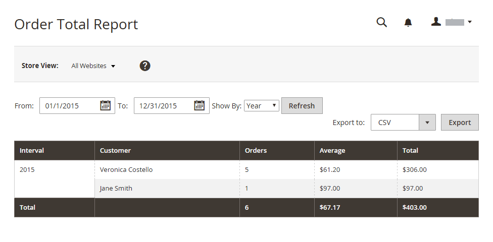
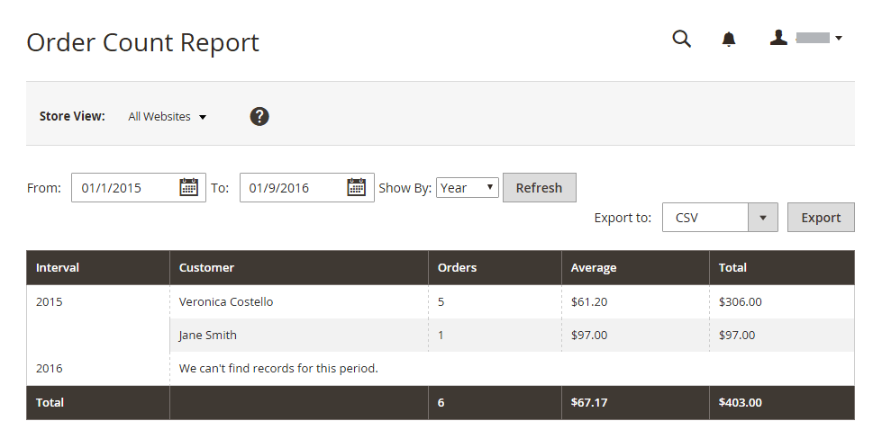
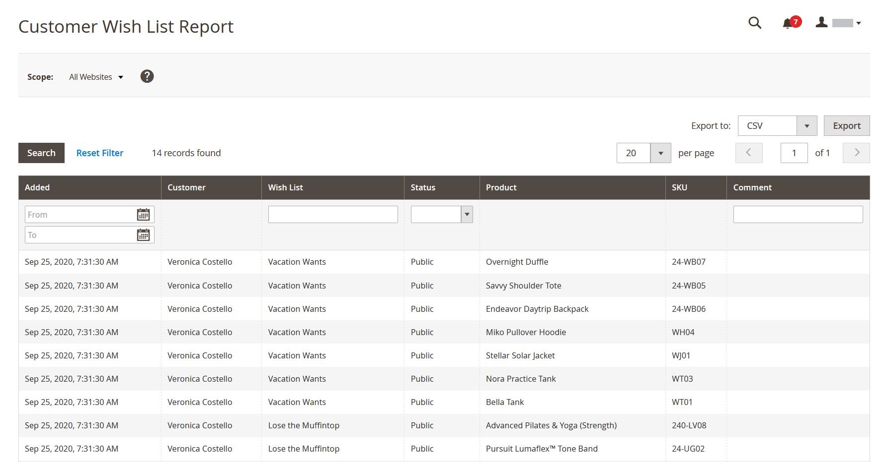
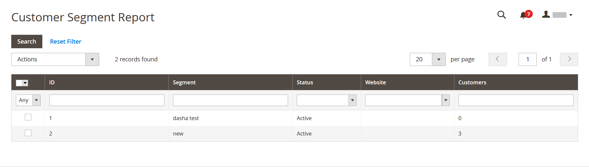

# Customer reports

Customer reports provide insight into customer activity during a specified time period or date range.

## [!UICONTROL Order Total Report]

The [!UICONTROL Order Total Report] shows customer orders for a specified time interval or date range. The report includes the number of orders per customer, average order amount, and total amount.

On the _Admin_ sidebar, go to **[!UICONTROL Reports]** > _[!UICONTROL Customers]_ > **[!UICONTROL Order Total]**.

{width="600"}

### Workspace controls

|Control|Description|
|--- |--- |
|[!UICONTROL From / To]| Used to define a search for the orders based on the start and end date.|
|[!UICONTROL Show By]|Defines the granularity of the order record splitting. Options: `Month` / `Day` / `Year` |
|[!UICONTROL Refresh]|Updates the grid to the specified filters.|
|[!UICONTROL Export]|Exports the selected records as a CSV or Excel XML file.|
|[!UICONTROL Scope]| Used to set the site or store for which the report is generated.|

{style="table-layout:auto"}

### Column descriptions

|Column|Description|
|--- |--- |
|[!UICONTROL Interval]|The order total interval, by `Month` / `Day` / `Year`.|
|[!UICONTROL Customer]|The name of the customer who placed the orders.|
|[!UICONTROL Orders]|The number of orders for the specified interval.|
|[!UICONTROL Average]|Average order amount.|
|[!UICONTROL Total]|The sum of all orders for the period.|

{style="table-layout:auto"}

## [!UICONTROL Order Count Report]

The [!UICONTROL Order Count Report] shows the number of orders per customer for a specified time interval or date range. The report includes the number of orders per customer, average order amount, and total amount.

On the _Admin_ sidebar, go to **[!UICONTROL Reports]** > _[!UICONTROL Customers]_ > **[!UICONTROL Order Count]**.

{width="600"}

### Workspace controls

|Control|Description|
|--- |--- |
|[!UICONTROL From / To]| Used to define a search for the orders based on the start and end date.|
|[!UICONTROL Show By]|Defines the granularity of the order record splitting. Options: `Month` / `Day` / `Year` |
|[!UICONTROL Refresh]|Updates the grid to the specified filters.|
|[!UICONTROL Export]|Exports the selected records as a CSV or Excel XML file.|
|[!UICONTROL Scope]| Used to set the site or store for which the report is generated.|

{style="table-layout:auto"}

### Column descriptions

|Column|Description|
|--- |--- |
|[!UICONTROL Interval]|The order count interval, by `Month` / `Day` / `Year`.|
|[!UICONTROL Customer]|The customer who placed the order.|
|[!UICONTROL Orders]|The number of orders for the specified interval.|
|[!UICONTROL Average]|Average order amount.|
|[!UICONTROL Total]|The sum of all orders for the period.|

{style="table-layout:auto"}

## [!UICONTROL New Accounts Report]

The [!UICONTROL New Accounts Report] shows the number of new customer accounts opened during a specified time interval or date range.

On the _Admin_ sidebar, go to **[!UICONTROL Reports]** > _[!UICONTROL Customers]_ > **[!UICONTROL New]**.

{width="600"}

### Workspace controls

|Control|Description|
|--- |--- |
|[!UICONTROL From / To]|Used to define a search for the new accounts based on the start and end date.|
|[!UICONTROL Show By]|Defines the granularity of the order record splitting. Options: Month / Day / Year |
|[!UICONTROL Refresh]|Updates the grid to the specified filters.|
|[!UICONTROL Export]|Exports the selected records as a CSV or Excel XML file.|
|[!UICONTROL Scope]|Used to set the site or store for which the report is generated.|

{style="table-layout:auto"}

### Column descriptions

|Column|Description|
|--- |--- |
|[!UICONTROL Interval]|New account creation interval, by Month / Day / Year.|
|[!UICONTROL New Accounts]|The number of new accounts created in a certain interval.|

{style="table-layout:auto"}

## [!UICONTROL Customer Wish List Report]

 (Adobe Commerce only)

The [!UICONTROL Customer Wish List Report] provides information about customer wish lists.

On the _Admin_ sidebar, go to **[!UICONTROL Reports]** > _[!UICONTROL Customers]_ > **[!UICONTROL Wish Lists]**.

{width="600"}

### Workspace controls

|Control|Description|
|--- |--- |
|[!UICONTROL Scope]|Used to set the site or store for which the report is generated.|
|[!UICONTROL Search]| Initiates a search by the specified parameters.|
|[!UICONTROL Reset Filter]| Initiates a reset of all search parameters.|
|[!UICONTROL Per Page]| Sets the number of records displayed in a single page. |
|[!UICONTROL Export]|Exports the selected records as a CSV or Excel XML file.|
|[!UICONTROL From / To]|Used to define a search for the wish lists based on the start and end date.|
|[!UICONTROL Wishlist]| Initiates a wish list search by name.|
|[!UICONTROL Status]| The status of the wish list. Options: `Private` / `Public` |
|[!UICONTROL Comment]| Initiates a search by text in the wish list comments.|

{style="table-layout:auto"}

### Column descriptions

|Column|Description|
|--- |--- |
|[!UICONTROL Added]| Date the wish list was created.|
|[!UICONTROL Customer]| First and last name of the customer who created the wish list.|
|[!UICONTROL Wishlist]| Name of the wish list.|
|[!UICONTROL Status]| The status of the wish list. Options: `Private` / `Public` |
|[!UICONTROL Product]| Name of the product added to the wish list.|
|[!UICONTROL SKU]| SKU of the product added to the wish list.|
|[!UICONTROL Comment]| The comment text that was entered when the wish list was created.|

{style="table-layout:auto"}

## [!UICONTROL Customer Segment Report]

 (Adobe Commerce only)

The [!UICONTROL Customer Segment Report] provides information about the number of customers in each segment.

On the _Admin_ sidebar, go to **[!UICONTROL Reports]** > _[!UICONTROL Customers]_ > **[!UICONTROL Segments]**.

{width="600"}

### Workspace controls

|Control|Description|
|--- |--- |
|[!UICONTROL Search]| Initiates a search by the specified parameters.|
|[!UICONTROL Reset Filter]| Initiates a reset of all search parameters.|
|[!UICONTROL Action]| Initiates the display of segments by parameters. Options: `Action` / `View Combined Report`|
|[!UICONTROL Per Page]| Sets the number of records displayed in a single page.|

{style="table-layout:auto"}

### Column descriptions

|Column|Description|
|--- |--- |
|[!UICONTROL ID]|A unique numeric identifier that is assigned to each segment.|
|[!UICONTROL Segment]|Segment name.|
|[!UICONTROL Status]|Segment status. Options: `Active` / `Inactive`|
|[!UICONTROL Website]|Website to which the segment is assigned.|
|[!UICONTROL Customers]|Number of customers assigned to the segment.|

{style="table-layout:auto"}
