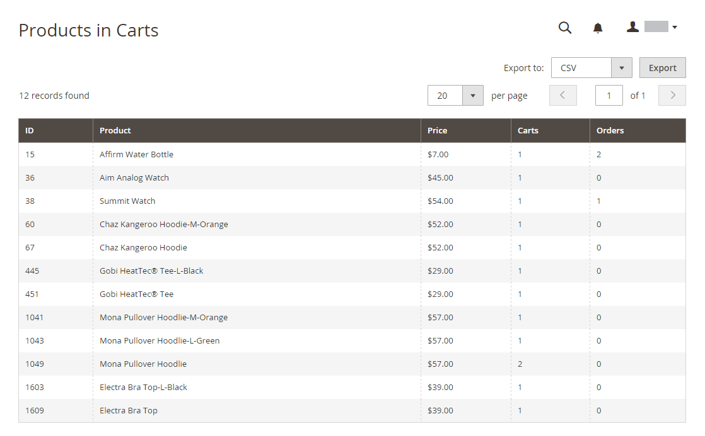
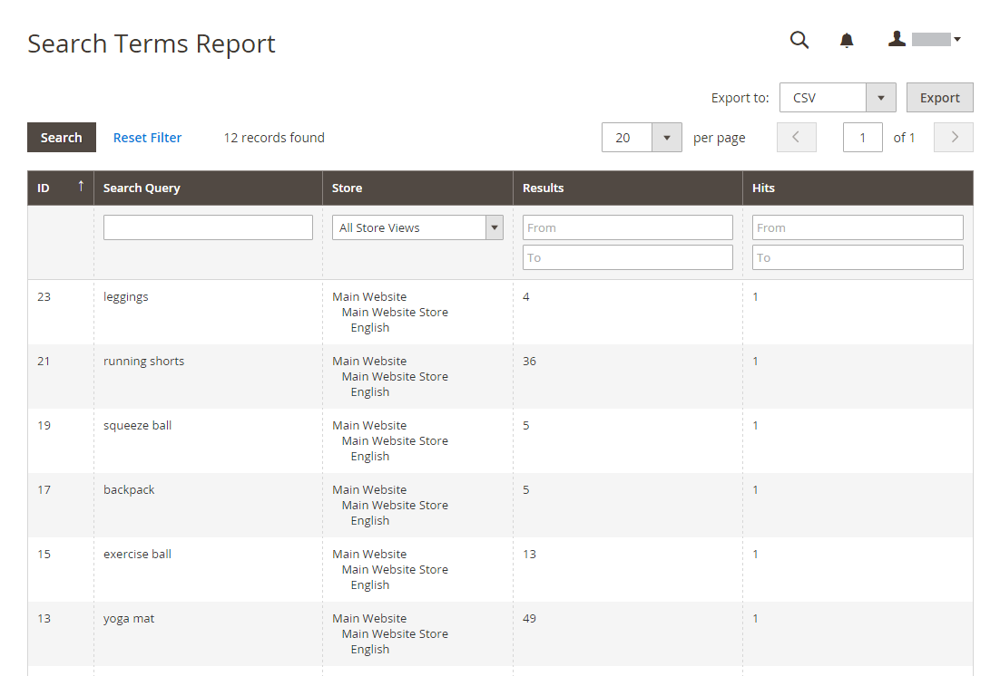
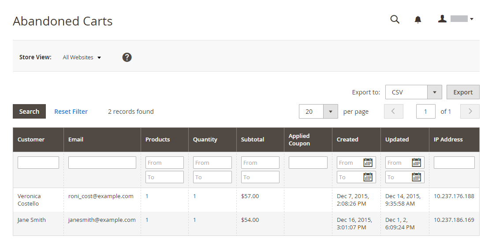
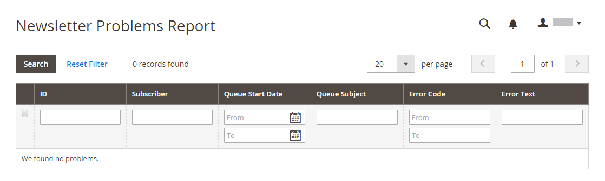

# Marketing Reports

Marketing reports provide information about the status of shopping carts, the use of search terms, and newsletter transmissions.

## Products in Cart

<!-- zoom -->

The [!UICONTROL Products in Cart] report provides a list of all products currently in shopping carts. It includes the name and price of each item, the number of carts with the item, and the number of times each item has been ordered.

## Search Terms

<!-- zoom -->

The [Search Terms Report](https://docs.magento.com/user-guide/marketing/search-terms-report.html) shows what your customers are looking for in each store view. The report includes the number of matching items found in the catalog, and how many times the search term has been used.

## Abandoned Carts

<!-- zoom -->

The Abandoned Carts Report lists all registered customers who have abandoned carts that have not yet expired. The report includes the customer name and email address, the number of products in the cart and subtotal, the date created, and date last updated.

## Newsletter Problems

<!-- zoom -->

The Newsletter Problems Report includes information about any newsletter queue that failed to transmit successfully. The report includes the name of each subscriber, and queue date and subject, the information about the error.
