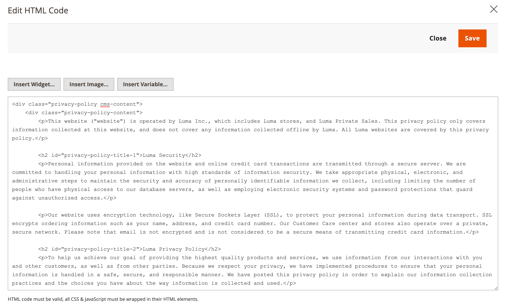

# Store privacy policy

Your store includes a sample privacy policy that must be updated with your own information. Your privacy policy should describe the type of information that your company collects, and how it is used. It should also list the filenames of [cookies](compliance-cookie-law.md#default-cookies) that are placed on the computers of people who visit your store. Any additional cookies that are associated with third-party extensions and add-ons should be included in the list.

## Personal data

There are two widely accepted classifications of personal data, which are commonly abbreviated as PI and PII. The example Privacy Policy in the Luma sample data refers to Personally Identifiable Information (PII). In addition, there are numerous variations of these definitions that are associated with legal regulations of different countries, regions, and states. The following definitions can be used for this general discussion:

### Personal Information (PI)

Any information that reasonably identifies or can be used to identify an individual directly or indirectly. Personal information may relate to any individual, such as a customer, employer, vendor, or contractor.

### Personally Identifiable Information (PII)

Any representation of information that permits the identity of an individual to whom the information applies to be reasonably inferred by either direct or indirect means. PII is defined as information that directly identifies an individual (such as name, address, social security number, or other identifying number). It is also information by which an agency intends to identify specific individuals with other data elements (indirect identification). These data elements may include a combination of gender, race, birth date, geographic indicator, and other descriptors. Also, it  includes information permitting the physical or online contacting of a specific individual is the same as personally identifiable information. This information can be maintained in either paper, electronic or other media.

{width="600" zoomable="yes"}

## Edit your privacy policy

>[!NOTE]
>
>The Luma sample data includes a sample privacy policy that you can modify for your use.

1. On the _Admin_ sidebar, go to **[!UICONTROL Content]** > _[!UICONTROL Elements]_ > **[!UICONTROL Pages]**.

1. In the grid, find **[!UICONTROL Privacy Policy]**. Then, in the _[!UICONTROL Action]_ column, click **[!UICONTROL Select]** and choose **[!UICONTROL Edit]**.

1. Expand the **[!UICONTROL Content]** section and make the necessary changes to the content.

   To learn more about using page content tools, see [Complete the content](../content-design/page-add.md#step-2-complete-the-content) in the _Content and Design Guide_.

   {width="600" zoomable="yes"}

   >[!NOTE]
   >
   >If you change the URL key of the privacy policy page, you must also create a [custom URL rewrite](../merchandising-promotions/url-rewrite-custom.md) to redirect traffic to the new URL key. Otherwise, the link in the footer returns `404 Page Not Found`.

1. When complete, click **[!UICONTROL Save Page]**.
