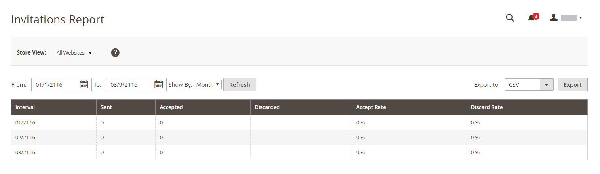
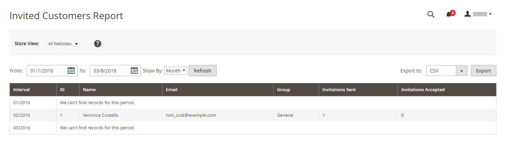
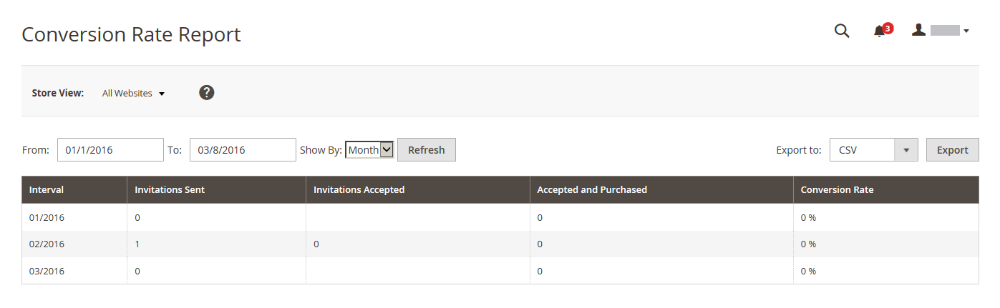

# Private Sales Reports

Available only in Adobe Commerce, the Private Sales reports provide information about events and private sales.

## Invitations

On the _Admin_ sidebar, go to **[!UICONTROL Reports]** > _[!UICONTROL Private Sales]_ > **[!UICONTROL Invitations]**.

<!-- zoom -->

The [Invitations report](../merchandising-promotions/invitations.md) shows the number of invitations sent during the specified time period, and the number accepted, and discarded.

## Invited Customers

On the _Admin_ sidebar, go to **[!UICONTROL Reports]** > _[!UICONTROL Private Sales]_ > **[!UICONTROL Invited Customers]**.

<!-- zoom -->

The Invited Customers Report shows all customers who have been sent invitations to a private sale or event. It includes the name and email address, customer group, and the number of invitations sent and the number accepted.

## Conversions

On the _Admin_ sidebar, go to **[!UICONTROL Reports]** > _[!UICONTROL Private Sales]_ > **[!UICONTROL Conversions]**.

<!-- zoom -->

The Conversions Report shows the number of invitations sent and accepted, the number of invitations that led to a purchase, and the conversion rate as a percentage.
