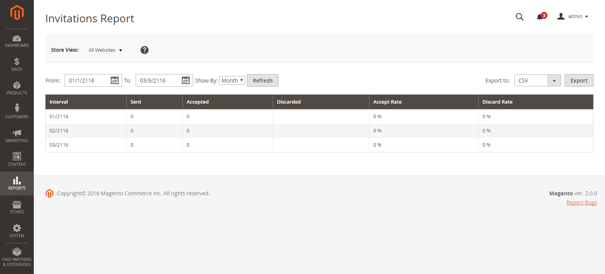
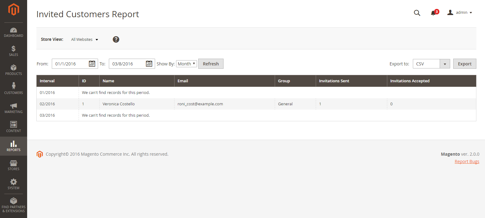
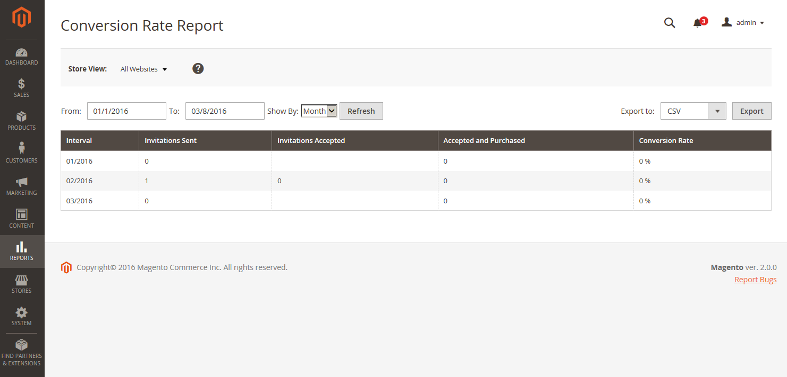

# Private Sales reports

{{ee-feature}}

The private sales reports provide information about [events and private sales](../merchandising-promotions/events-private-sales.md).

## [!UICONTROL Invitations Report]

The [!UICONTROL Invitations Report] shows the number of [invitations](../merchandising-promotions/invitations.md) sent during the specified time period, and the number accepted, and discarded.

On the _Admin_ sidebar, go to **[!UICONTROL Reports]** > _[!UICONTROL Private Sales]_ > **[!UICONTROL Invitations]**.

{width="600"}

## [!UICONTROL Invited Customers Report]

The [!UICONTROL Invited Customers Report] shows all customers who have been sent invitations to a private sale or event. It includes the name and email address, customer group, and the number of invitations sent and the number accepted.

On the _Admin_ sidebar, go to **[!UICONTROL Reports]** > _[!UICONTROL Private Sales]_ > **[!UICONTROL Invited Customers]**.

{width="600"}

## [!UICONTROL Conversion Rate Report]

The [!UICONTROL Conversion Rate Report] shows the number of invitations sent and accepted, the number of invitations that led to a purchase, and the conversion rate as a percentage.

On the _Admin_ sidebar, go to **[!UICONTROL Reports]** > _[!UICONTROL Private Sales]_ > **[!UICONTROL Conversions]**.

{width="600"}
