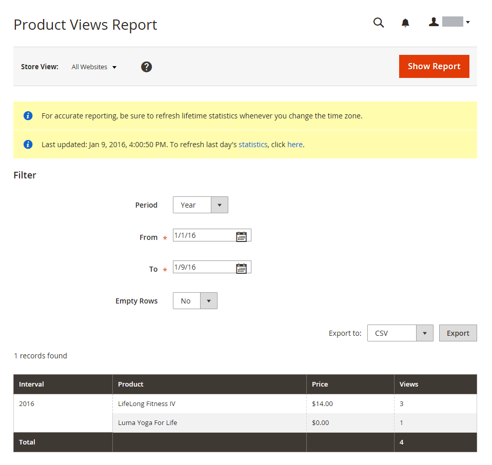
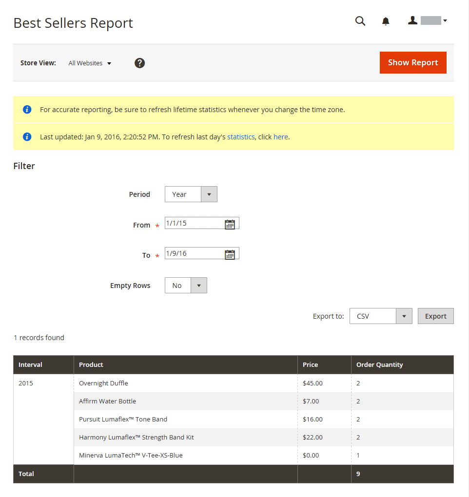
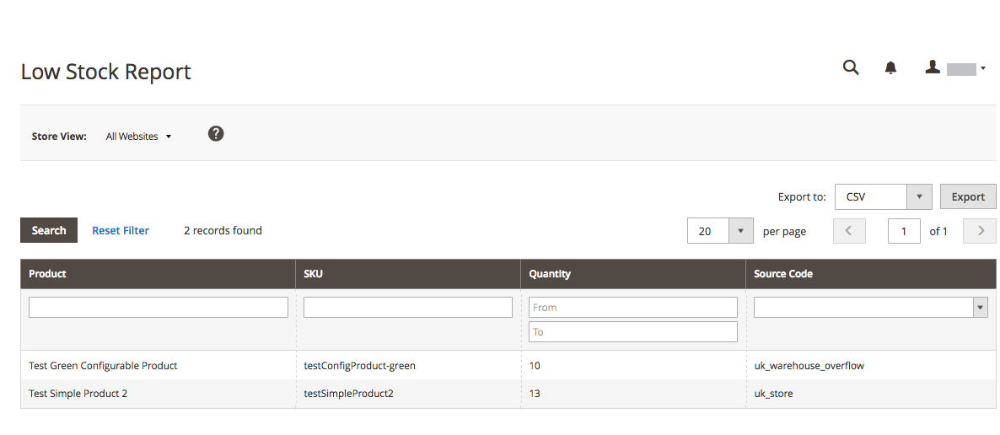
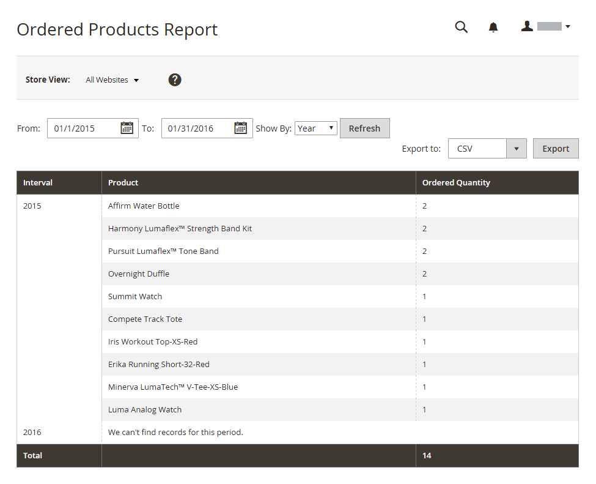
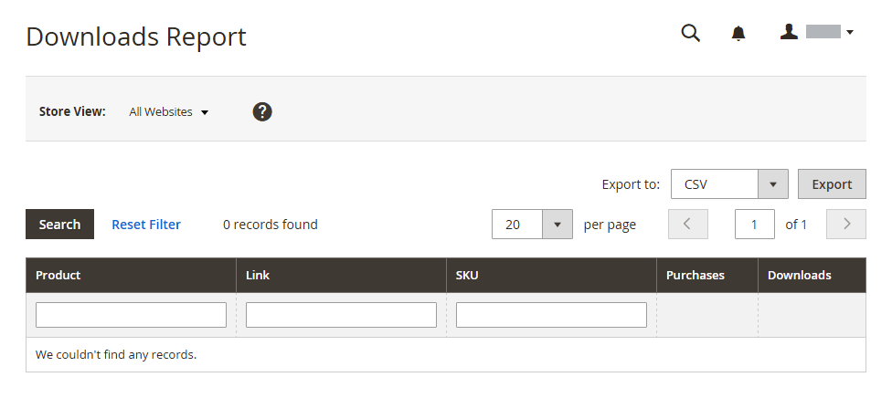

# Product reports

The product reports give you insight regarding products viewed and ordered, bestsellers, stock levels, and downloads.

## [!UICONTROL Product Views Report]

The [!UICONTROL Product Views Report] shows the products that have been viewed during a time interval or range of dates. The report includes the product name, price, and number of views.

On the _Admin_ sidebar, go to **[!UICONTROL Reports]** > _[!UICONTROL Products]_ > **[!UICONTROL Views]**.

{width="600"}

## [!UICONTROL Bestsellers Report]

The [!UICONTROL Bestsellers Report] shows the five top-selling five during an interval of time or date range. The report includes the product name, price, and quantity ordered.

On the _Admin_ sidebar, go to **[!UICONTROL Reports]** > _[!UICONTROL Products]_ > **[!UICONTROL Bestsellers]**.

{width="600"}

## [!UICONTROL Low Stock Report]

The [!UICONTROL Low Stock Report] lists all products with stock levels within a specified range. With [[!DNL Inventory Management]](../inventory-management/introduction.md) enabled, the report includes low stock inventory amounts per source with the listed source code.

On the _Admin_ sidebar, go to **[!UICONTROL Reports]** > _[!UICONTROL Products]_ > **[!UICONTROL Low Stock]**.

{width="600"}

## [!UICONTROL Ordered Products Report]

The [!UICONTROL Ordered Products Report] lists all products ordered for a specified time interval or date range. The report includes the product name and quantity ordered.

On the _Admin_ sidebar, go to **[!UICONTROL Reports]** > _[!UICONTROL Products]_ > **[!UICONTROL Ordered]**.

{width="600"}

## [!UICONTROL Downloads Report]

The [!UICONTROL Downloads Report] lists all downloads during the specified time interval or date range. The report includes the product name, download link, and SKU, with the number of purchases and downloads.

On the _Admin_ sidebar, go to **[!UICONTROL Reports]** > _[!UICONTROL Products]_ > **[!UICONTROL Downloaded]**.

{width="600"}
