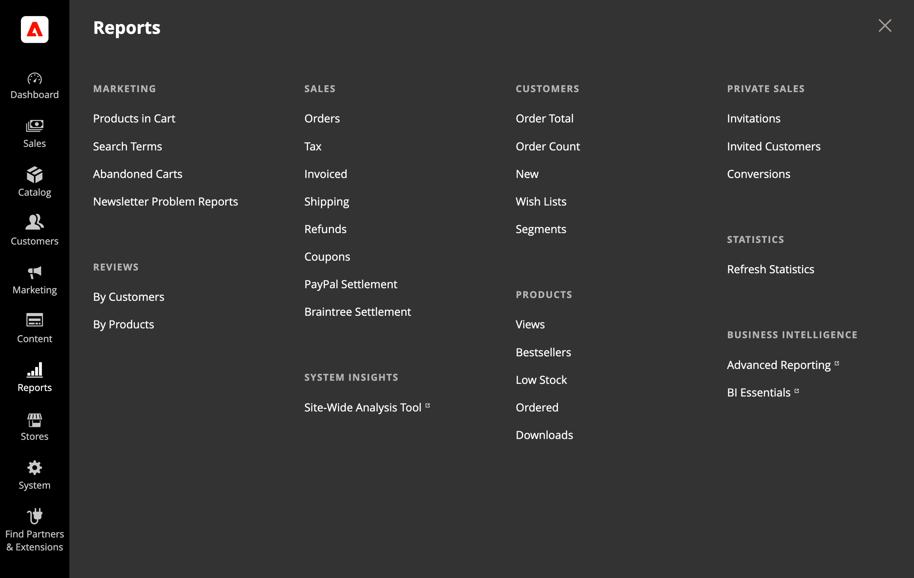

# Reports Menu

Adobe Commerce and Magento Open Source provide a wide selection of reports to keep you informed on your marketing efforts, sales products, and customer activity. The Reports menu provides easy access to current information about your sales, products, customers, and promotions.

<!-- zoom -->

## Display the Reports menu

On the _Admin_ sidebar, choose **Reports**.

## Menu Options

### Marketing

A selection of [marketing reports](marketing-reports.md), including Products in Cart, Search Terms, Abandoned Carts, and Newsletter Problem Reports.

### Reviews

The selection of product [review reports](review-reports.md) includes By Customer and By Product.

### Sales

The selection of [sales reports](sales-reports.md) includes Orders, Tax, Invoiced, Shipping, Refunds, Coupons, and settlement reports for PayPal and Braintree.

### System Insights

(Adobe Commerce only) The [Site-Wide Analysis Tool](https://experienceleague.adobe.com/docs/commerce-operations/tools/site-wide-analysis-tool/access.html) provides system insights for installations of Adobe Commerce on cloud infrastructure with 24/7 real-time performance monitoring, reports, and recommendations.

### Customers

(Adobe Commerce only) The selection of [customer reports](customer-reports.md) includes Order Total, Order Account, New, Wish Lists, and Segments.

### Products

The selection of [product reports](product-reports.md) includes Views, Bestsellers, Low Stock, Ordered, and Downloads.

### Private Sales

(Adobe Commerce only) The selection of reports for [private sales and events](private-sales-reports.md) includes Invitation, Invited Customers, and Conversions.

### Statistics

[Statistics](sales-reports.md#refresh-statistics) is a tool that reduces the performance impact of generating reports by calculating and storing statistical data. Rather than recalculate the statistics every time a report is generated, the stored statistics are used until you refresh the statistics.

### Business Intelligence

Integrated [Business Intelligence](business-intelligence.md) tools provide the insight that you need for making strategic business decisions.
