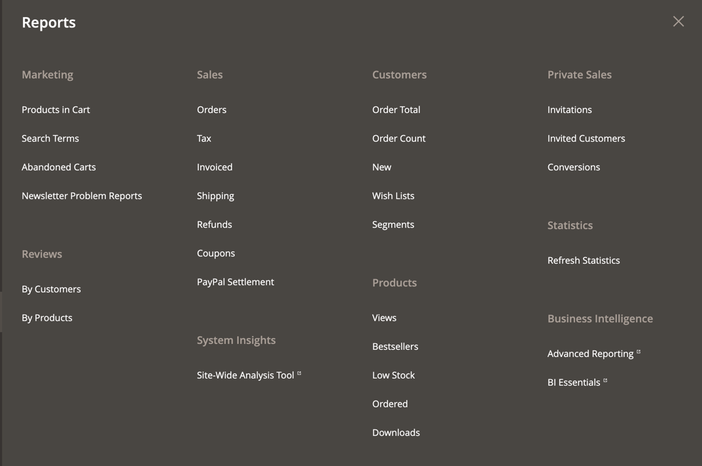

# [!UICONTROL Reports] menu

Adobe Commerce provides a wide selection of reports to keep you informed on your marketing efforts, sales products, and customer activity. The Reports menu provides easy access to current information about your sales, products, customers, and promotions.

{width="600"}

## Display the [!UICONTROL Reports] menu

On the _Admin_ sidebar, choose **[!UICONTROL Reports]**.

## Menu options

### [!UICONTROL Marketing]

A selection of [marketing reports](marketing-reports.md), including Products in Cart, Search Terms, Abandoned Carts, and Newsletter Problem Reports.

### [!UICONTROL Reviews]

[!BADGE PaaS only]{type=Informative url="https://experienceleague.adobe.com/en/docs/commerce/user-guides/product-solutions" tooltip="Applies to Adobe Commerce on Cloud projects (Adobe-managed PaaS infrastructure) and on-premises projects only."}

The selection of product [review reports](review-reports.md) includes By Customer and By Product.

### [!UICONTROL Sales]

The selection of [sales reports](sales-reports.md) includes Orders, Tax, Invoiced, Shipping, Refunds, Coupons, and settlement reports for PayPal and Braintree.

### [!UICONTROL System Insights]

[!BADGE PaaS only]{type=Informative url="https://experienceleague.adobe.com/en/docs/commerce/user-guides/product-solutions" tooltip="Applies to Adobe Commerce on Cloud projects (Adobe-managed PaaS infrastructure) and on-premises projects only."}

(Adobe Commerce only) The [[!DNL Site-Wide Analysis Tool]](https://experienceleague.adobe.com/docs/commerce-operations/tools/site-wide-analysis-tool/access.html) provides system insights for installations of Adobe Commerce on cloud infrastructure with 24/7 real-time performance monitoring, reports, and recommendations.

### [!UICONTROL Customers]

(Adobe Commerce only) The selection of [customer reports](customer-reports.md) includes Order Total, Order Account, New, Wish Lists, and Segments.

### [!UICONTROL Products]

The selection of [product reports](product-reports.md) includes Views, Bestsellers, Low Stock, Ordered, and Downloads.

### [!UICONTROL Private Sales]

[!BADGE PaaS only]{type=Informative url="https://experienceleague.adobe.com/en/docs/commerce/user-guides/product-solutions" tooltip="Applies to Adobe Commerce on Cloud projects (Adobe-managed PaaS infrastructure) and on-premises projects only."}

(Adobe Commerce only) The selection of reports for [private sales and events](private-sales-reports.md) includes Invitation, Invited Customers, and Conversions.

### [!UICONTROL Statistics]

[!BADGE PaaS only]{type=Informative url="https://experienceleague.adobe.com/en/docs/commerce/user-guides/product-solutions" tooltip="Applies to Adobe Commerce on Cloud projects (Adobe-managed PaaS infrastructure) and on-premises projects only."}

[Statistics](sales-reports.md#refresh-statistics) is a tool that reduces the performance impact of generating reports by calculating and storing statistical data. Rather than recalculate the statistics every time a report is generated, the stored statistics are used until you refresh the statistics.

### [!DNL Commerce Intelligence]

[!BADGE PaaS only]{type=Informative url="https://experienceleague.adobe.com/en/docs/commerce/user-guides/product-solutions" tooltip="Applies to Adobe Commerce on Cloud projects (Adobe-managed PaaS infrastructure) and on-premises projects only."}

Integrated [[!DNL Commerce Intelligence]](business-intelligence.md) tools provide the insight that you need for making strategic business decisions.
