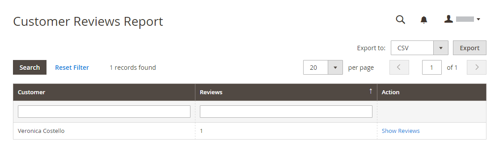
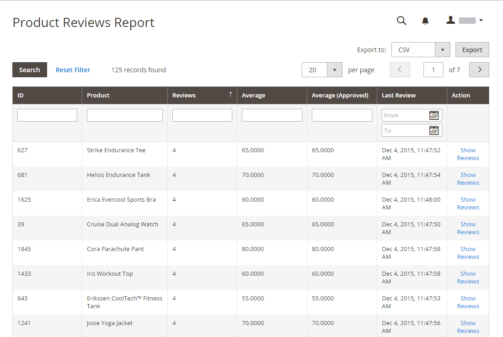

# Review reports

If you are using the built-in [!DNL Commerce] Reviews, review reports provide information about product reviews by customer and by product.

## [!UICONTROL Customer Reviews Report]

The [!UICONTROL Customer Reviews Report] provides a list of all customers who have submitted product reviews. The report includes the number of reviews submitted by each customer, and a link to the list of reviews.

On the _Admin_ sidebar, go to **[!UICONTROL Reports]** > _[!UICONTROL Reviews]_ > **[!UICONTROL By Customers]**.

{width="600"}

## [!UICONTROL Product Reviews Report]

The [!UICONTROL Product Reviews Report] lists all products that have been reviewed by customers. The report includes the number of reviews and average rating, the product was last reviewed, and a link to the list of reviews for each product.

On the _Admin_ sidebar, go to **[!UICONTROL Reports]** > _[!UICONTROL Reviews]_ > **[!UICONTROL By Products]**.

{width="600"}
