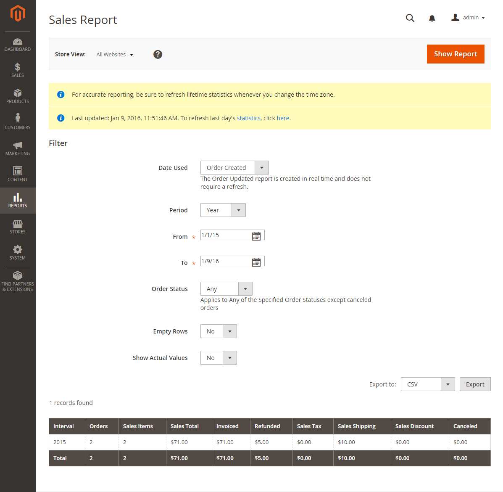

# Sales Reports

The selection of sales reports includes Orders, Tax, Invoiced, Shipping, Refunds, Coupons, and PayPal Settlement.

## Orders

<!-- zoom -->

The Orders Report can be filtered by time interval, date, and status. The report includes the number of orders placed and canceled, with totals for sales, amounts invoiced, refunded, tax collected, shipping charged, and discounts.

## Tax

<!-- zoom -->

The Tax Report can be filtered by time interval, date, and status. The report includes the tax rule applied, tax rate, number of orders, and amount of tax charged.

## Invoiced

<!-- zoom -->

The Invoice Report can be filtered by time interval, date, and status. The report includes the number of orders and invoices during the time period, with amounts invoiced, paid, and unpaid.

## Shipping

<!-- zoom -->

The Shipping Report can be filtered by time interval, date, and status. The report includes the number of orders for carrier or shipping method used, with amounts for total sales  and total shipping.

## Refunds

<!-- zoom -->

The Refunds Report can be filtered by time interval, date, and status. The report includes the number of refunded orders, and total amount refunded online and offline.

## Coupons

<!-- zoom -->

The [Coupons report](../merchandising-promotions/price-rules-cart-coupon.md#coupons-report) can be filtered by time interval, date, and status. The report includes each coupon code used during the specified time interval, related price rule, and number of times used, with totals and subtotals for sales and discounts.

## PayPal Settlement

<!-- zoom -->

The [PayPal Settlement Report](../stores-purchase/paypal-settlement-reports.md) can be filtered by date, merchant account, transaction ID, invoice ID, or PayPal reference ID. The report includes the type of event, such as a debit card transaction, the start and finish dates, gross amount, and related fees. The report can be automatically updated with the most current data from PayPal.

## Braintree Settlement

<!-- zoom -->

The [Braintree](../stores-purchase/braintree.md) Settlement Report can be filtered according to creation date, amount, status, transaction type, payment type, transaction ID, order ID, PayPal payment ID, type, merchant account ID, or settlement batch ID. The report contains the transaction ID, order ID, PayPal payment ID, type, creation date, amount, settlement code, status, settlement response text, reimbursement IDs, merchant account ID, settlement batch ID, and currency.

## Manage your sales reports

### Step 1: Refresh the report statistics

1. On the _Admin_ sidebar, go to **[!UICONTROL Reports]**.

1. Choose the reports to refresh.

1. To update statistics, click **[!UICONTROL here]** in the text.

### Step 2: Filter reports

In the Admin, you can access can generate a report for a whole website or for one store, within a time interval or a date. To filter a sale report, set the following options:

| Option | Description |
|--- |--- |
|[!UICONTROL Date Used]|Sets the data to be used for the report.|
|[!UICONTROL Period]|The period for which the data is used: Day/Month/Year.|
|[!UICONTROL From/To]|Used to define search data by start and end date.|
|[!UICONTROL Order Status]|Indicates the order status|
|[!UICONTROL Empty Rows]|Indicates whether to add blank rows to the report.|

### Step 3: Show and export reports

1. To generate the report, click **[!UICONTROL Show Report]**.

1. To export the report, select the file type: `Excel XML` or `CSV`

1. Click **[!UICONTROL Export]**.

## Refresh Statistics

To reduce the performance impact of generating sales reports, [!DNL Commerce] calculates and stores the required statistics for each report. Rather than recalculate the statistics every time a report is generated, the stored statistics are used, unless you refresh the statistics. To include the most recent data, the report statistics must be refreshed before a sales report is generated.

<!-- zoom -->

1. On the _Admin_ sidebar, go to **[!UICONTROL Reports]** > _[!UICONTROL Statistics]_ > **[!UICONTROL Refresh Statistics]**.

1. In the list, select the checkbox for each report to be refreshed.

1. Set the **[!UICONTROL Actions]** control to one of the following:

   - `Refresh Lifetime Statistics`
   - `Refresh Statistics for the Last Day`

1. Click **[!UICONTROL Submit]**.
