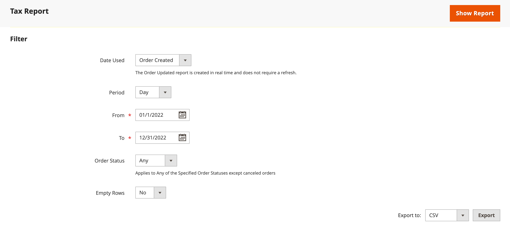
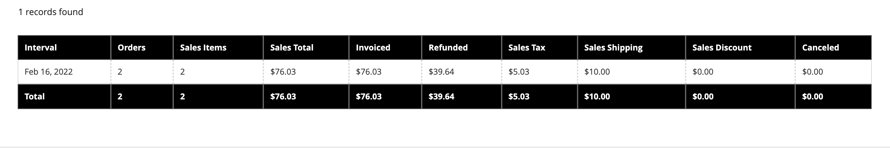
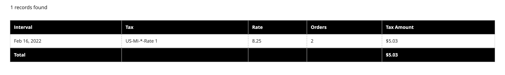
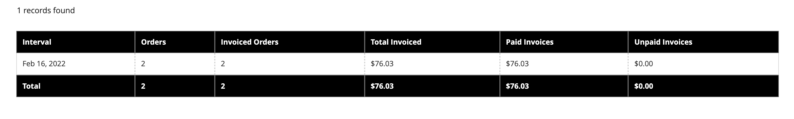
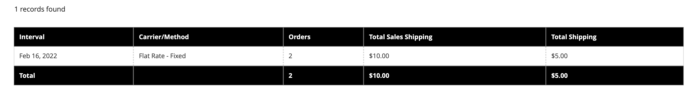
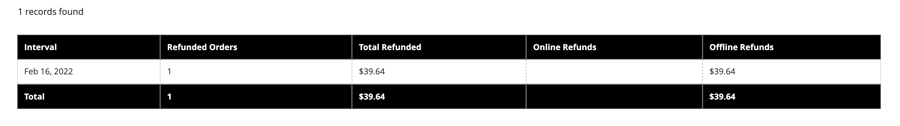
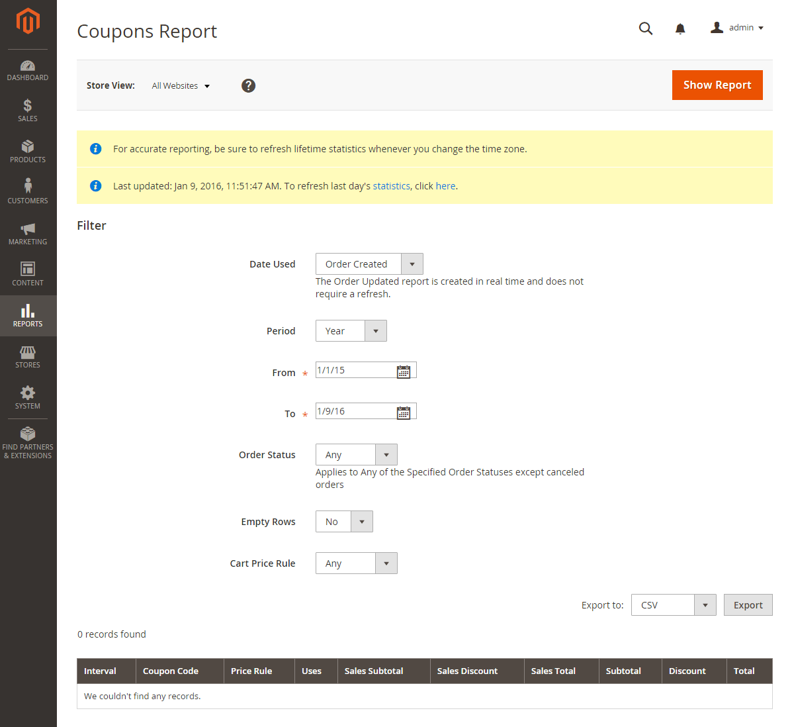
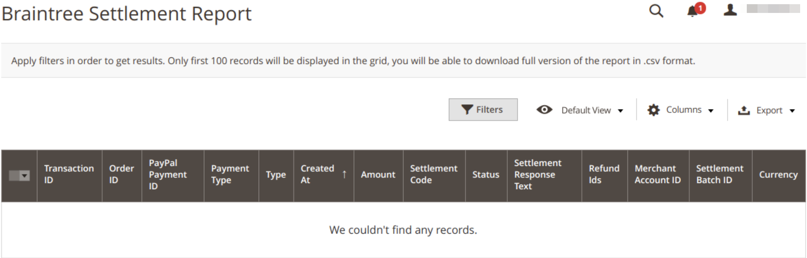
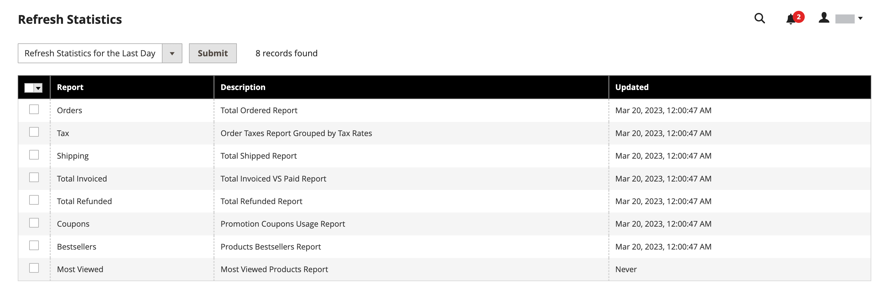

# Sales reports

The selection of sales reports includes Orders, Tax, Invoiced, Shipping, Refunds, Coupons, and PayPal Settlement.

## Report filters

You can generate a sales report for a whole website or for one store. The sales reports can be filtered by time interval, date, and status.

{width="600"}  

To filter a sales report, set the following options:

| Option | Description |
|--- |--- |
|[!UICONTROL Date Used]|Sets the data to be used for the report.|
|[!UICONTROL Period]|The period for which the data is used: Day/Month/Year.|
|[!UICONTROL From/To]|Used to define search data by start and end date.|
|[!UICONTROL Order Status]|Indicates the order status|
|[!UICONTROL Empty Rows]|Indicates whether to add blank rows to the report.|

## [!UICONTROL Orders Report]

The [!UICONTROL Orders Report] includes the number of orders placed and canceled, with totals for sales, amounts invoiced, refunded, tax collected, shipping charged, and discounts.

1. On the _Admin_ sidebar, go to **[!UICONTROL Reports]** > _[!UICONTROL Sales]_ > **[!UICONTROL Orders]**.

1. In the **[!UICONTROL Filter]** section, select the reporting period options and order status used to populate the report.

1. Click **[!UICONTROL Show Report]**.

{width="600"}

## [!UICONTROL Tax Report]

The [!UICONTROL Tax Report] includes the tax rule applied, tax rate, number of orders, and amount of tax charged.

1. On the _Admin_ sidebar, go to **[!UICONTROL Reports]** > _[!UICONTROL Sales]_ > **[!UICONTROL Tax]**.

1. In the **[!UICONTROL Filter]** section, select the reporting period options and order status used to populate the report.

1. Click **[!UICONTROL Show Report]**.

{width="600"} 

## [!UICONTROL Invoice Report]

The [!UICONTROL Invoice Report] includes the number of orders and invoices during the time period, with amounts invoiced, paid, and unpaid.

1. On the _Admin_ sidebar, go to **[!UICONTROL Reports]** > _[!UICONTROL Sales]_ > **[!UICONTROL Invoiced]**.

1. In the **[!UICONTROL Filter]** section, select the reporting period options and order status used to populate the report.

1. Click **[!UICONTROL Show Report]**.

{width="600"} 

## [!UICONTROL Shipping Report]

The [!UICONTROL Shipping Report] includes the number of orders for the carrier or shipping method used, including amounts for total sales and total shipping.

1. On the _Admin_ sidebar, go to **[!UICONTROL Reports]** > _[!UICONTROL Sales]_ > **[!UICONTROL Shipping]**.

1. In the **[!UICONTROL Filter]** section, select the reporting period options and order status used to populate the report.

1. Click **[!UICONTROL Show Report]**.

{width="600"}

## [!UICONTROL Refunds Report]

The [!UICONTROL Refunds Report] includes the number of refunded orders, and total amount refunded online and offline.

1. On the _Admin_ sidebar, go to **[!UICONTROL Reports]** > _[!UICONTROL Sales]_ > **[!UICONTROL Refunds]**.

1. In the **[!UICONTROL Filter]** section, select the reporting period options and order status used to populate the report.

1. Click **[!UICONTROL Show Report]**.

{width="600"} 

## [!UICONTROL Coupons Report]

The [!UICONTROL Coupons Report] includes each coupon code used during the specified time interval, related price rule, and number of times used, with totals and subtotals for sales and discounts.

1. On the _Admin_ sidebar, go to **[!UICONTROL Reports]** > _[!UICONTROL Sales]_ > **[!UICONTROL Coupons]**.

1. In the **[!UICONTROL Filter]** section, select the reporting period options and order status used to populate the report.

1. Click **[!UICONTROL Show Report]**.

For more information about using the [!UICONTROL Coupons Report] to gather data for your promotion campaigns, see [Coupons reporting](../merchandising-promotions/price-rules-cart-coupon.md#coupons-report) in the _Merchandising and Promotions Guide_.

<!---  need coupon data  -->

## [!UICONTROL PayPal Settlement Reports]

The [PayPal Settlement Reports] page includes the type of event, such as a debit card transaction, the start and finish dates, gross amount, and related fees. The report can be automatically updated with the most current data from PayPal. There are filtering options for date range, merchant account, transaction ID, invoice ID, or PayPal reference ID.

On the _Admin_ sidebar, go to **[!UICONTROL Reports]** > _[!UICONTROL Sales]_ > **[!UICONTROL PayPal Settlement]**.

{width="600"}

For more information about using the [!UICONTROL PayPal Settlement Reports] to retrieve information about each PayPal transaction that affects the settlement of funds, see [PayPal Settlement reports](../stores-purchase/paypal-settlement-reports.md) in the _Stores and Purchase Experience Guide_.

## [!UICONTROL Braintree Settlement Report]

The [Braintree](../stores-purchase/braintree.md) Settlement Report can be filtered according to creation date, amount, status, transaction type, payment type, transaction ID, order ID, PayPal payment ID, type, merchant account ID, or settlement batch ID. The report contains the transaction ID, order ID, PayPal payment ID, type, creation date, amount, settlement code, status, settlement response text, reimbursement IDs, merchant account ID, settlement batch ID, and currency.

On the _Admin_ sidebar, go to **[!UICONTROL Reports]** > _[!UICONTROL Sales]_ > **[!UICONTROL Braintree Settlement]**.

<!---  need a Braintree connection to update report screen -->

## Export reports

1. To export the report, select the file type: `Excel XML` or `CSV`

1. Click **[!UICONTROL Export]**.

## Refresh statistics

To reduce the performance impact of generating sales reports, [!DNL Commerce] calculates and stores the required statistics for each report. Rather than recalculate the statistics every time a report is generated, the stored statistics are used, unless you refresh the statistics. To include the most recent data, the report statistics must be refreshed before a sales report is generated.

{width="700"}

1. On the _Admin_ sidebar, go to **[!UICONTROL Reports]** > _[!UICONTROL Statistics]_ > **[!UICONTROL Refresh Statistics]**.

1. In the list, select the checkbox for each report to be refreshed.

1. Set the **[!UICONTROL Actions]** control to one of the following:

   - `Refresh Lifetime Statistics`
   - `Refresh Statistics for the Last Day`

1. Click **[!UICONTROL Submit]**.
