# Store Details

The basic information for your store includes the store name and address, telephone number and email address, that appear on email messages, invoices, and other communications sent to your customers.

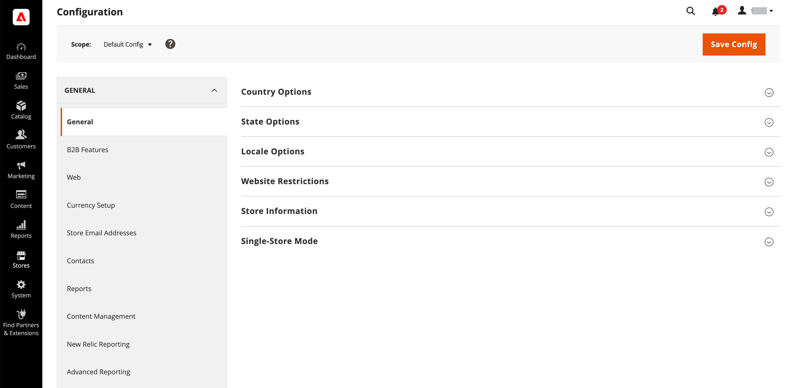<!-- zoom -->

## [!UICONTROL Store Information]

The _[!UICONTROL Store Information]_ section provides the basic information that appears on sales documents and in other communications.

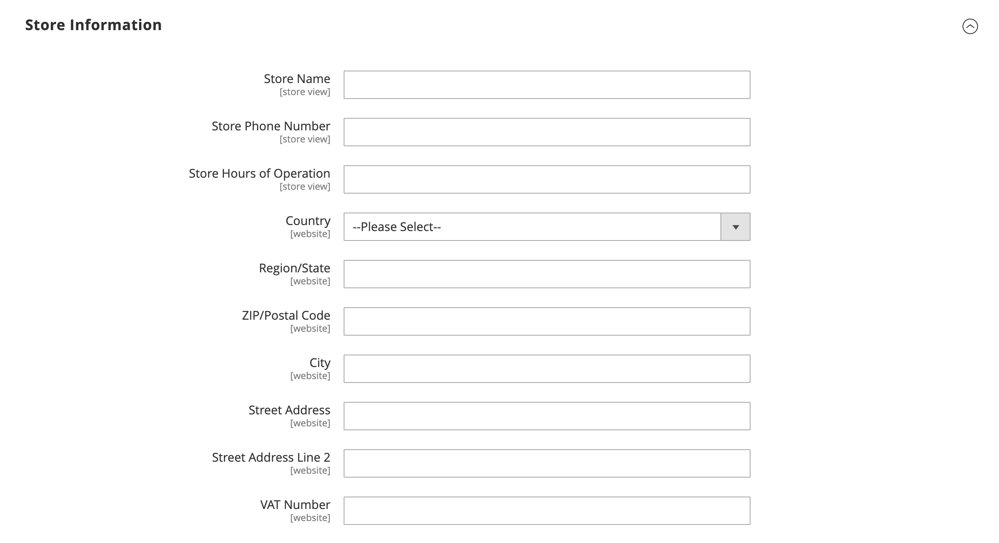<!-- zoom -->

1. On the _Admin_ sidebar, go to **[!UICONTROL Stores]** > _[!UICONTROL Settings]_ > **[!UICONTROL Configuration]**.

1. Under **[!UICONTROL General]** in the left panel, choose **[!UICONTROL General]**.

1. Expand  the **[!UICONTROL Store Information]** section and do the following:

    - Enter the **[!UICONTROL Store Name]** that you want to use in all communications.

    - Enter the **[!UICONTROL Store Phone Number]**, formatted as you want it to appear.

    - For **[!UICONTROL Store Hours of Operation]**, enter the hours your store is open for business. For example: Mon - Fri, 9-5, Sat 9-noon PST.

    - Select the **[!UICONTROL Country]** where your business is located.

    - Select the **[!UICONTROL Region/State]** with the country.

    - Enter the **[!UICONTROL Store Address]**. If the address is long, continue the address on **Store Address Line 2**.

    - If applicable, enter the **[!UICONTROL VAT Number]** of your store.

      To verify the number, click the **[!UICONTROL Validate VAT Number]** button. To learn more, see [VAT ID Validation](https://docs.magento.com/user-guide/tax/vat-validation.html).

1. When complete, click **[!UICONTROL Save Config]**.

For more information about the Store information configuration options, see the [Configuration Reference Guide](https://docs.magento.com/user-guide/configuration/general/general.html#store-information).

## Locale Options

The locale determines the many of the settings that are used throughout the store. Some of them are:

- Language
- Country
- Tax rate
- Currency
- Price
- Number format

The locale setting determines the time zone and language used for each store, and identifies the days of the work week in the area.

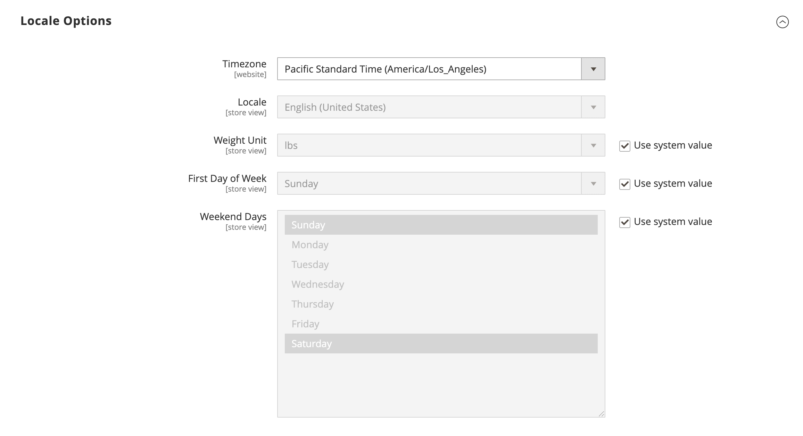<!-- zoom -->

1. On the _Admin_ sidebar, go to **[!UICONTROL Stores]** > _[!UICONTROL Settings]_ > **[!UICONTROL Configuration]**.

1. In the left panel under **[!UICONTROL General]**, choose **[!UICONTROL General]**.

1. Expand  the **[!UICONTROL Locale Options]** section.

1. Select your **[!UICONTROL Timezone]** from the list.

1. Set **[!UICONTROL Locale]** to the store language.

1. Set **[!UICONTROL Weight Unit]** to the unit of measurement that is typically used for shipments from your locale.

1. Set **[!UICONTROL First Day of the Week]** to the day that is considered to be the first day of the week in your area.

1. In the **[!UICONTROL Weekend Days]** list, select the days that fall on a weekend in your area.

   To select multiple days, hold down the Ctrl key (PC) or the Command key (Mac) and click each item.

1. When complete, click **[!UICONTROL Save Config]**.

For more information about the Locale configuration options, see the [Configuration Reference Guide](https://docs.magento.com/user-guide/configuration/general/general.html#locale-options).

## State Options

In many countries, the state, province, or region is a required part of a postal address. The information is used for shipping and billing information, to calculate tax rates, and so on. For countries where the state is not required, the field can be omitted entirely from the address, or included as an optional field.

Because standard address formats vary from one country to another, you can also edit the template that is used to format the address for invoices, packing slips, and shipping labels.

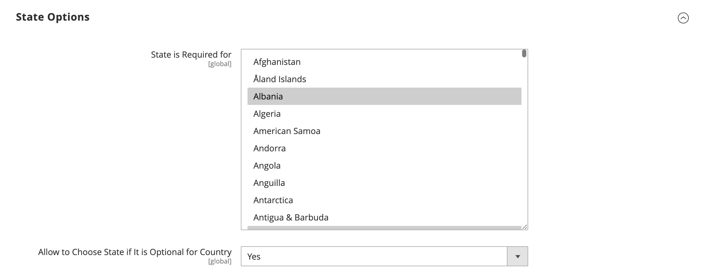<!-- zoom -->

1. On the _Admin_ sidebar, go to **[!UICONTROL Stores]** > _[!UICONTROL Settings]_ > **[!UICONTROL Configuration]**.

1. Under **[!UICONTROL General]** in the left panel, choose **[!UICONTROL General]**.

1. Expand  the **[!UICONTROL State Options]** section and do the following:

   - In the **[!UICONTROL State is required for]** list, select each country where Region/State is a required entry.

   - Set **[!UICONTROL Allow to Choose State if it is Optional for Country]** to one of the following:

      `Yes` - In countries where the state field is not required, includes the State field as an optional entry.

      `No` - In countries where the state field is not required, omits the State field.

1. When complete, click **[!UICONTROL Save Config]**.

For more information about the State configuration options, see the [Configuration Reference Guide](https://docs.magento.com/user-guide/configuration/general/general.html#state-options).

## Country Options

The Country Options identify the country where your business is located and the countries from which you accept payment.

<!-- zoom -->

### Set the country options for your store

1. On the _Admin_ sidebar, go to **[!UICONTROL Stores]** > _[!UICONTROL Settings]_ > **[!UICONTROL Configuration]**.

1. In the left panel under **[!UICONTROL General]**, choose **[!UICONTROL General]**.

1. Expand  the **[!UICONTROL Country Options]** section.

   >[!NOTE]
   >
   >If needed, clear the **[!UICONTROL Use system value]** checkbox for each setting you want to change.

1. Choose the **[!UICONTROL Default Country]** where your business is located.

1. In the **[!UICONTROL Allow Countries]** list, select each country from which you accept orders.

   By default, all countries in the list are selected. To select multiple countries, hold down the Ctrl key (PC) or the Command key (Mac) and click each item.

1. In the **[!UICONTROL Zip/Postal Code is Optional for]** list, select each country where you conduct business that does not require a ZIP or postal code to be included as part of the street address.

1. In the **[!UICONTROL European Union Countries]** list, select each country in the EU where you conduct business.

   By default, all EU countries are selected. To select the countries that you need, hold down the Ctrl key (PC) or the Command key (Mac) and click each item.

1. In the **[!UICONTROL Top Destinations]** list, select the primary countries that you target for sales.

1. When complete, click **[!UICONTROL Save Config]**.

### Set the country options for specific delivery method

You can also configure shipping to specific countries for each available [delivery method](https://docs.magento.com/user-guide/shipping/delivery.html) (UPS, FedEx, and so on).

1. On the _Admin_ sidebar, go to **[!UICONTROL Stores]** > _[!UICONTROL Settings]_ > **[!UICONTROL Configuration]**.

1. In the left panel, expand **[!UICONTROL Sales]** and choose **[!UICONTROL Delivery Methods]**.

1. Select the shipping carrier to which you want to apply specific countries.

1. For **[!UICONTROL Ship to Applicable Countries]**, deselect the **[!UICONTROL Use system value]** checkbox and select the **[!UICONTROL Specific Countries]** option.

1. In the **[!UICONTROL Top Destinations]** list, select the primary countries that you target for shipping.

1. When complete, click **[!UICONTROL Save Config]**.

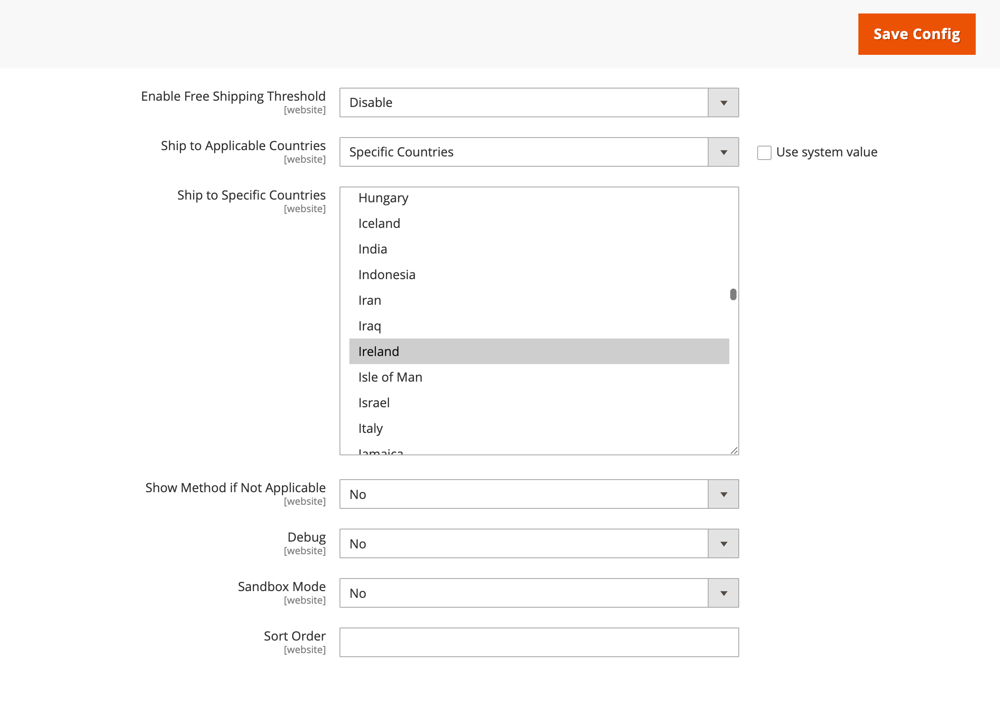<!-- zoom -->

### Troubleshooting resources

For help with troubleshooting country configuration issues, see the following [!DNL Commerce] Support articles:

- [How to add a country](https://support.magento.com/hc/en-us/articles/360057988152)
- [Provided countryId does not exist](https://support.magento.com/hc/en-us/articles/360056291111)
- [Country payment issue](https://support.magento.com/hc/en-us/articles/360043955991)

## Merchant Location

The Merchant Location setting is used to configure [payment methods](https://docs.magento.com/user-guide/payment/payments.html). If there is no value for this setting, the [Default Country](#country-options) setting is used.

1. On the _Admin_ sidebar, go to **[!UICONTROL Stores]** > _[!UICONTROL Settings]_ > **[!UICONTROL Configuration]**.

1. In the left panel, expand **[!UICONTROL Sales]** and choose **[!UICONTROL Payment Methods]**.

1. Expand  the **Merchant Location** section and choose your **[!UICONTROL Merchant Country]**.

   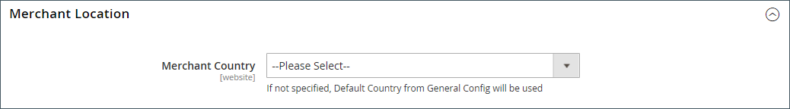<!-- zoom -->

1. When complete, click **[!UICONTROL Save Config]**.

For more information about the Payment Methods configuration options, see the [Configuration Reference Guide](https://docs.magento.com/user-guide/configuration/sales/payment-methods.html).

## Currency

Currency Setup - Defines the base [currency](https://docs.magento.com/user-guide/stores/currency-configuration.html) and any additional currencies that are accepted as payment. Also establishes the import connection and schedule that is used to update currency rates automatically.

Currency Symbols - Defines the [currency symbols](https://docs.magento.com/user-guide/stores/currency-symbols.html) that appear in product prices and sales documents such as orders and invoices. [!DNL Commerce] supports currencies from over 200 countries around the world.

Updating Currency Rates - Currency rates can be [updated](https://docs.magento.com/user-guide/stores/currency-update.html) manually or imported into your store as needed, or according to a predefined schedule.

Currency Chooser - If multiple currencies are available, the [currency chooser](https://docs.magento.com/user-guide/stores/currency.html) is available in the header of the store.

## Store Email Addresses

You can have up to five different email addresses to represent distinct functions or departments for each store or view. In addition to the following predefined email identities, there are a few custom identities that you can set up according to your needs.

- General Contact
- Sales Representative
- Customer Support

Each identity and its associated email address can be associated with specific automated email messages and appear as the sender of email messages that are sent from your store.

### Step 1: Set up the email addresses for your domain

Before you can configure email addresses for the store, each must be set up as a valid email address for your domain. To create each email address that is needed, follow the instructions from your server administrator or email-hosting provider.

### Step 2: Configure the email addresses for your store

1. On the _Admin_ sidebar, go to **[!UICONTROL Stores]** > _[!UICONTROL Settings]_ > **[!UICONTROL Configuration]**.

1. Under **[!UICONTROL General]** in the left panel, choose **[!UICONTROL Store Email Addresses]**.

1. Expand  the **[!UICONTROL General Contact]** section and do the following:

   <!-- zoom -->

   - For **[!UICONTROL Sender Name]**, enter the name of the person that is associated with the General Contact identity to appear as the sender of any email messages.

   - For **[!UICONTROL Sender Email]**, enter the associated email address.

1. Repeat this process for each store email address that you plan to use.

1. When complete, click **[!UICONTROL Save Config]**.

### Step 3: Update the sales email configuration

If you use custom email addresses, make sure to update the configuration of any related email messages, so the correct identity appears as the sender.

1. In the left panel, expand **[!UICONTROL Sales]** and choose **[!UICONTROL Sales Emails]**.

   The page has a separate section for each of the following:

   - Order and Order Comments
   - Invoice and Invoice Comments
   - Shipment and Shipment Comments
   - Credit Memo and Credit Memo Comments
   - RMA, RMA Authorization, RMA Admin Comments, and RMA Customer Comments  (Adobe Commerce only)

1. Starting with **[!UICONTROL Order]**, expand the section for each message and make sure that the correct sender is selected.

    <!-- zoom -->

1. When complete, click **[!UICONTROL Save Config]**.

For more information about the Sales Emails configuration options, see the [Configuration Reference Guide](https://docs.magento.com/user-guide/configuration/sales/sales-emails.html).

## Contact Us form

The _Contact Us_ link in the footer of the store is an easy way for customers to keep in touch with you. Customers can complete the form to send a message to your store. A standard [!DNL Commerce] installation displays the default _Contact Us_ form. After submitting the form, a thank-you message appears

It is important to understand that the default Contact Us form is rendered directly from code rather than from a CMS page.

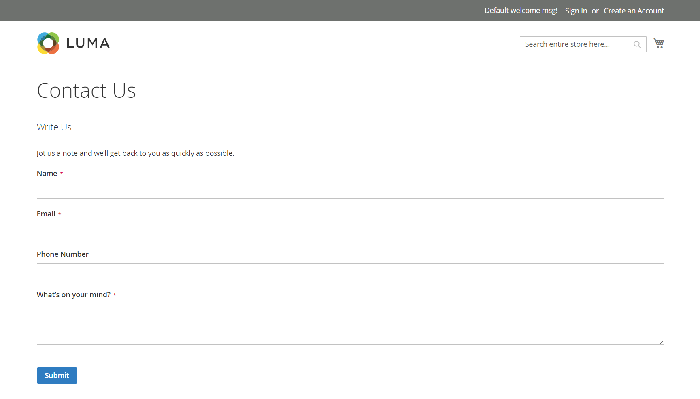<!-- zoom -->

The store footer includes a link to the Contact Us page that is available throughout the store.

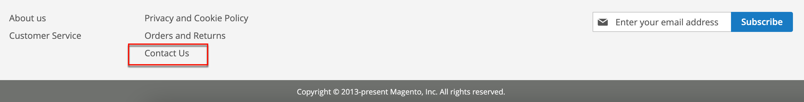<!-- zoom -->

The Luma sample data includes additional information on the Contact Us page that demonstrates how you might customize the page for your store.

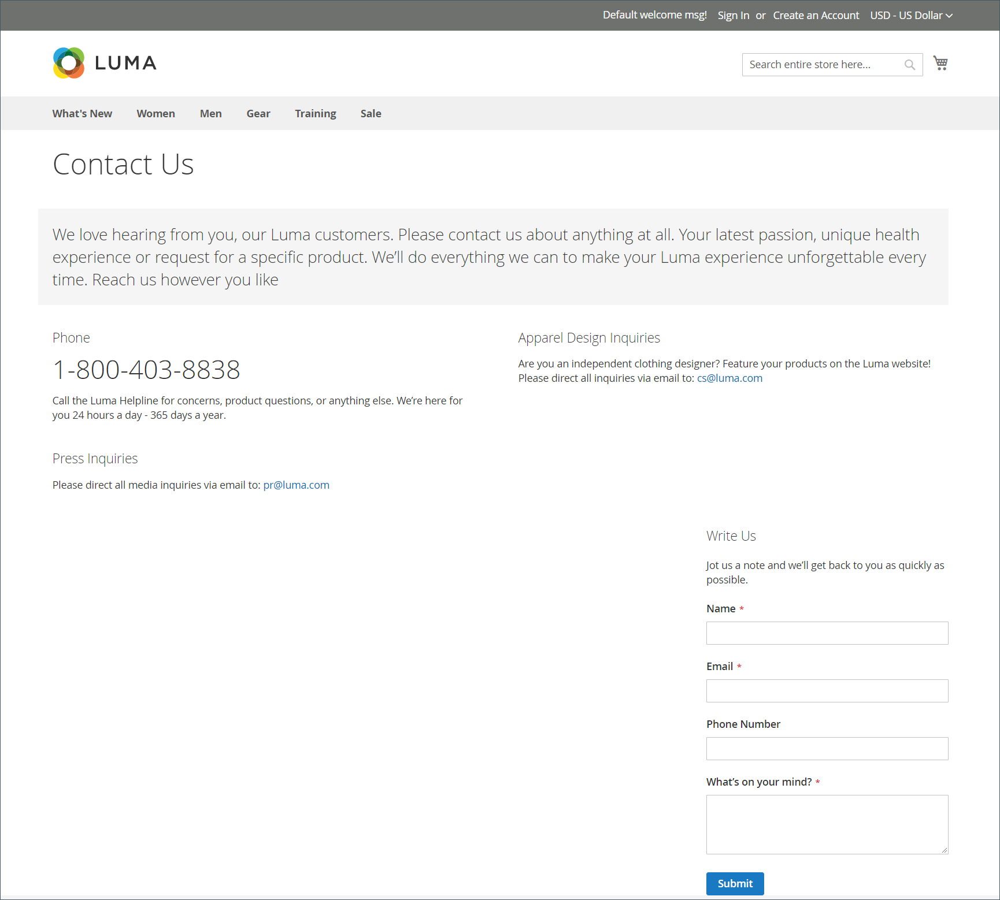<!-- zoom -->

### Configure the Contact Us form

1. On the _Admin_ sidebar, go to **[!UICONTROL Stores]** > _[!UICONTROL Settings]_ > **[!UICONTROL Configuration]**.

1. In the left panel under **[!UICONTROL General]**, choose **[!UICONTROL Contacts]**.

1. Expand  the **[!UICONTROL Contact Us]** section and set **[!UICONTROL Enable Contact Us]** to `Yes`.

   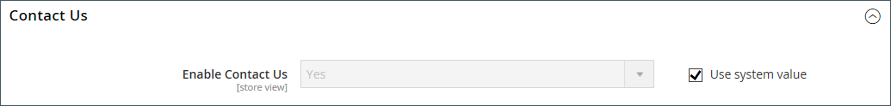<!-- zoom -->

1. Expand  the **[!UICONTROL Email Options]** section and set the email contact options:

   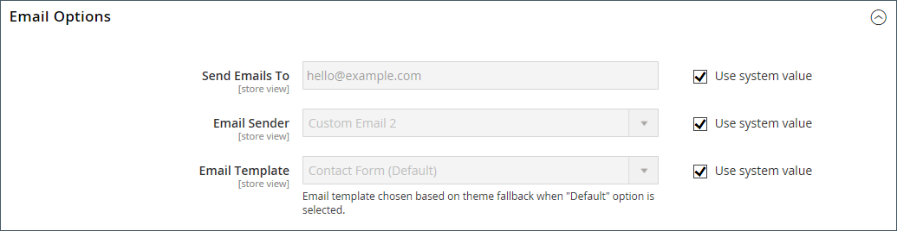<!-- zoom -->

   - For **[!UICONTROL Send Emails to]**, enter the email address where messages from the Contact Us form are sent.

   - Set **[!UICONTROL Email Sender]** to the store identity that appears as the sender of the message from the Contact Us form. For example: Custom Email 2.

   - Set **[!UICONTROL Email Template]** to the template that is used for messages sent from the Contact Us form.

1. When compete, click **[!UICONTROL Save Config]**.

### Customize the content

### Method 1: Using sample data

The Luma sample data includes a _Contact Us Info_ block that can be customized for your store. The `contact-us-info` [block](https://docs.magento.com/user-guide/cms/blocks.html) can be easily modified to add your own content to the Contact Us page.

1. On the _Admin_ sidebar, go to **[!UICONTROL Content]** > _[!UICONTROL Elements]_ > **[!UICONTROL Blocks]**.

1. Find the **[!UICONTROL Contact Us Info]** block in the list and open in **[!UICONTROL Edit]** mode.

   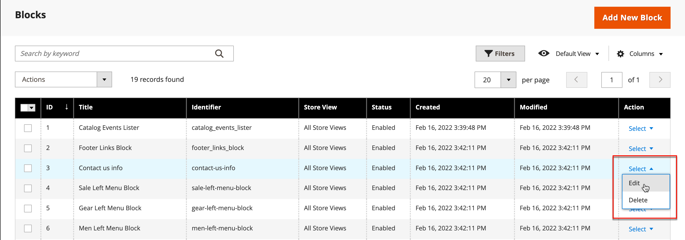<!-- zoom -->

1. Scroll down to the **[!UICONTROL Content]** field and make any necessary changes.

   - Use the editor [toolbar](https://docs.magento.com/user-guide/cms/editor.html) to format the text, and add [images](https://docs.magento.com/user-guide/cms/editor-insert-image.html) and [links](https://docs.magento.com/user-guide/cms/editor-insert-link.html).

   -  To work directly with the HTML, click **[!UICONTROL Show / Hide Editor]**.

   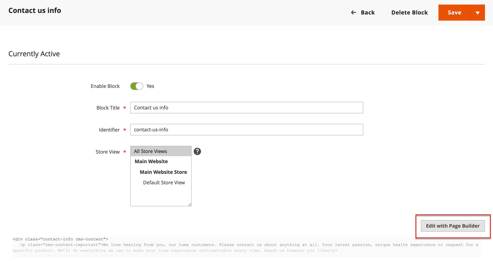<!-- zoom -->

1. When complete, click **[!UICONTROL Save Block]**.

### Method 2: Without sample data

>[!IMPORTANT]
>
>Starting with the 2.4.0 release, the contact form can no longer call inside a CMS block or CMS page. All customization of the contact form should be done using layout xml or custom theme templates.

By default, shoppers access the contact form using the _Contact link_ in the footer of the storefront pages. For more information about customizing the contact page, refer to the [Frontend Developer Guide][theme-guide]{:target="_blank"}.

[theme-guide]: https://devdocs.magento.com/guides/v2.4/frontend-dev-guide/bk-frontend-dev-guide.html
