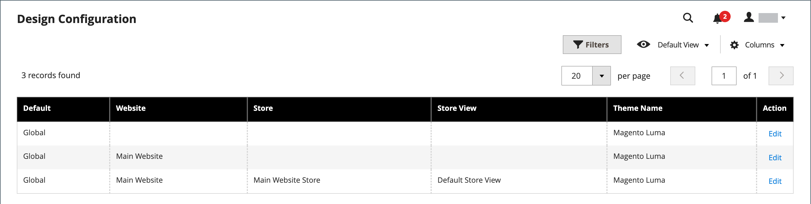
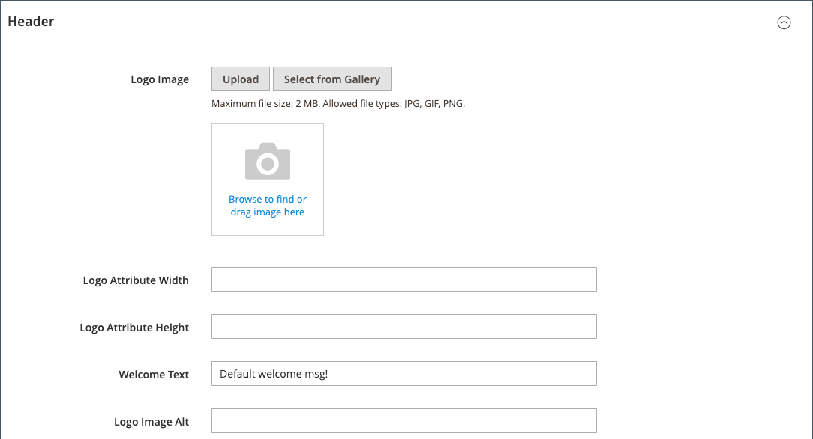

# Storefront Branding

One of the first things you want to do is to [change the logo](#upload-your-logo) in the header and [upload a favicon](#add-a-favicon) for the browser. You should also [add your welcome message](#change-the-welcome-message) and [update the copyright notice](#change-the-copyright-notice) in the footer. These tasks are a few simple design elements that you can take care of right away. While your store is in development, you can [turn on the store demo notice](#set-the-store-demo-notice), and then remove it when you are ready to launch.

<!-- zoom -->

## Upload Your Logo

The size and location of the logo in the header is determined by the store theme. Your logo can be saved as either a GIF, PNG, or JPG (JPEG) file type and uploaded from the Admin of your store.

<!-- zoom -->

The logo image resides in the following location on the server. Any image file with the name `logo.svg` is used as the default theme logo.

Full path - `app/design/frontend/[vendor]/[theme]/web/images/logo.svg`

Relative path -  `images/logo.svg`

If you do not know the size of the logo or other images used in your theme, open the page in a browser, right-click the image, and inspect the element.

>[!NOTE]
>
>In addition to the logo in the header, your logo also appears on [email templates](https://docs.magento.com/user-guide/marketing/email-logo.html) and on [PDF invoices](https://docs.magento.com/user-guide/marketing/sales-document-pdf-logo.html) and other sales documents. The logos used for email templates and invoices have different size requirements, and must be uploaded separately. To learn more, see [Communications](https://docs.magento.com/user-guide/marketing/communications.html).

Supported logo file formats:

|File format|Description|
|--- |--- |
|PNG|(Portable Network Graphics) This newer alternative to the GIF format supports up to 16 million colors (24 bit). The lossless compression format produces a high-quality bitmap image with crisp text, but a larger file size than some formats. The PNG format supports transparent layers, and is designed for online viewing and streaming.|
|GIF|(Graphics Interchange Format) A widely supported, and older bitmap format that is limited to 256 colors (8 bit). The GIF format supports simple animation and transparent layers.|
|JPG (JPEG)|(Joint Photographics Expert Group) A compressed bitmap format that is used by most digital cameras. The lossy compression causes some data loss, which is sometimes noticeable as blurry spots in text.|

{style="table-layout:auto"}

1. On the _Admin_ sidebar, go to **[!UICONTROL Content]** > _[!UICONTROL Design]_ > **[!UICONTROL Configuration]**.

   <!-- zoom -->

1. Find the store view that you want to configure and click **[!UICONTROL Edit]** in the _[!UICONTROL Action]_ column.

1. Expand  the **[!UICONTROL Header]** section.

   <!-- zoom -->

1. To upload a new logo, click **[!UICONTROL Upload]** and choose the file from your system.

1. Enter the **[!UICONTROL Logo Image Width]** and **[!UICONTROL Logo Image Height]** in pixels.

1. For **[!UICONTROL Logo Image Alt]**, enter the text that you want to appear when someone hovers over the image.

1. When complete, click **[!UICONTROL Save Configuration]**.

## Add a Favicon

_Favicon_ is short for _favorite icon_ and refers to the little icon on the tab of each browser page. Depending on the browser, the favicon also appears in address bar, just before the URL.

A favicon is generally 16 x 16 pixels or 32 x 32 pixels in size. [!DNL Commerce] accepts ICO, PNG, APNG, GIF, and JPG (JPEG) file types, although not all browsers support these formats. The most widely supported file format to use for a favicon is ICO. You can use other image file types, but the format might not be supported by all browsers. There are many free tools available online that you can use to generate an ICO image or convert an image to that format.

<!-- zoom -->

[!DNL Commerce] supports the following file formats as the favicon:

|File format|Description|
|--- |--- |
|ICO|This image file format is designed for small-size computer icon images. Mostly used in Microsoft® Windows OS, the ICO format can contain images of up to 256 x 256 pixels and 16 million colors (24 bit) with 8 bits of transparency.|
|PNG|(Portable Network Graphics) This newer alternative to the GIF format supports up to 16 million colors (24 bit). The lossless compression format produces a high-quality bitmap image with crisp text, but a larger file size than some formats. The PNG format supports transparent layers, and is designed for online viewing and streaming.|
|APNG|(Animated Portable Network Graphics) A file format similar to PNG that supports simple animation.|
|GIF|(Graphics Interchange Format) A widely supported, and older bitmap format that is limited to 256 colors (8 bit). The GIF format supports simple animation and transparent layers.|
|JPG (JPEG)|(Joint Photographics Expert Group) A compressed bitmap format that is used by most digital cameras. The lossy compression causes some data loss, which is sometimes noticeable as blurry spots in text.|

{style="table-layout:auto"}

### Step 1: Create a favicon

1. Using the image editor of your choice, create a 16 x 16 or 32 x 32 graphic image of your logo.

1. (Optional) Use one of the available online tools to convert the file to the .ico format and save the file to your computer.

### Step 2: Upload the favicon to your store

1. On the _Admin_ sidebar, go to **[!UICONTROL Content]** > _[!UICONTROL Design]_ > **[!UICONTROL Configuration]**.

1. In the grid, find the store view that you want to configure and click **[!UICONTROL Edit]** in the _[!UICONTROL Action]_ column.

1. Under _[!UICONTROL Other Settings]_, expand  the **[!UICONTROL HTML Head]** section.

   <!-- zoom -->

1. If you want to remove the current favicon, click the _Delete_ () icon in the lower-left corner of the image.

1. Click **[!UICONTROL Upload]** and open the favicon file that you prepared.

   <!-- zoom -->

1. When complete, click **[!UICONTROL Save Configuration]**.

### Step 3: Refresh the cache

1. When prompted to refresh the cache, click the **[!UICONTROL Cache Management]** link in the message at the top of the workspace.

1. In the list, select the **[!UICONTROL Page Cache]** checkbox that is marked `Invalidated`.

1. Set **[!UICONTROL Actions]** to `Refresh` and click **[!UICONTROL Submit]**.

1. To view the new favicon, return to your storefront and refresh the browser.

## Change the welcome message

The welcome message in the header expands to include the name of the customer who is logged in. Before you launch your store, be sure to change the default _Welcome_ text for each store view.

<!-- zoom -->

1. On the _Admin_ sidebar, go to **[!UICONTROL Content]** > _[!UICONTROL Design]_ > **[!UICONTROL Configuration]**.

1. In the grid, find the store view that you want to configure and click **[!UICONTROL Edit]** in the _[!UICONTROL Action]_ column.

1. Under _[!UICONTROL Other Settings]_, expand  the **[!UICONTROL Header]** section.

1. For **[!UICONTROL Welcome Text]**, enter the welcome message text that you want to appear in the header of your store.

   <!-- zoom -->

1. When complete, click **[!UICONTROL Save Configuration]**.

1. When prompted to update the Page Cache, click the **[!UICONTROL Cache Management]** link at the top of the workspace and follow the instructions to refresh the cache.

## Change the copyright notice

Your store displays a copyright notice in the footer of each page. As a best practice, the copyright notice should include the current year, and identify your company as the legal owner of the content on the site.

<!-- zoom -->

The `&copy;` character code is used to insert the copyright symbol, as shown in the following examples:

- Long format example

   `Copyright &copy; 2013-present Luma, Inc. All rights reserved.`

- Short format example

   `&copy; 2021 Luma, Inc. All rights reserved.`

To update the copyright notice:

1. On the _Admin_ sidebar, go to **[!UICONTROL Content]** > _[!UICONTROL Design]_ > **[!UICONTROL Configuration]**.

1. In the grid, find the store view that you want to configure and click **[!UICONTROL Edit]** in the _[!UICONTROL Action]_ column.

1. Under _Other Settings_, expand the **[!UICONTROL Footer]** section.

   <!-- zoom -->

1. For **[!UICONTROL Copyright]**, enter the copyright notice that you want to appear in the footer of each page.

   Use the `&copy;` character code to insert a copyright symbol.

1. When complete, click **[!UICONTROL Save Configuration]**.

## Set the store demo notice

If your store is online, but still under construction, you can display a store demo notice at the top of the page to let people know that the store is not yet open for business. When you are ready to _go live_, simply remove the message. This is similar to flipping the sign hanging in the window from _Closed_ to _Open_. The format of the demo notice is determined by the theme of your store.

<!-- zoom -->

1. On the _Admin_ sidebar, go to **[!UICONTROL Content]** > _[!UICONTROL Design]_ > **[!UICONTROL Configuration]**.

1. In the grid, find the store view that you want to configure and click **[!UICONTROL Edit]** in the _[!UICONTROL Action]_ column.

1. Under _[!UICONTROL Other Settings]_, expand  the **[!UICONTROL HTML Head]** section.

   <!-- zoom -->

1. Scroll down to the bottom and set the **[!UICONTROL Display Demo Store Notice]** to your preference.

1. When complete, click **[!UICONTROL Save Configuration]**.

1. If you are prompted to update the cache, click **[!UICONTROL Cache Management]** in the system message and follow the instructions to refresh the cache.
