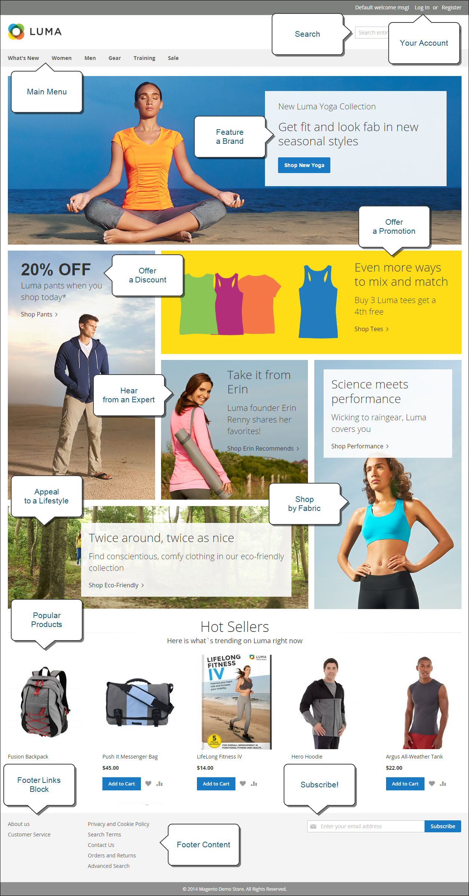
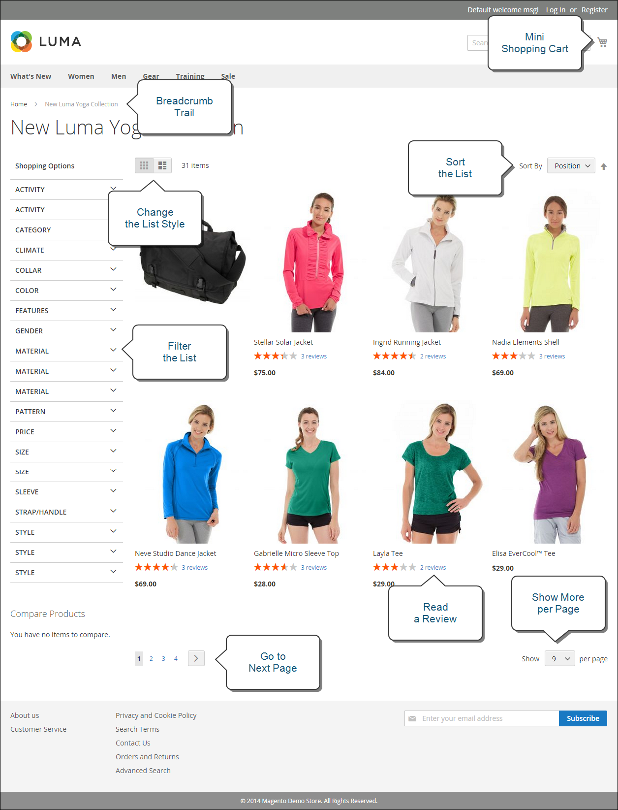
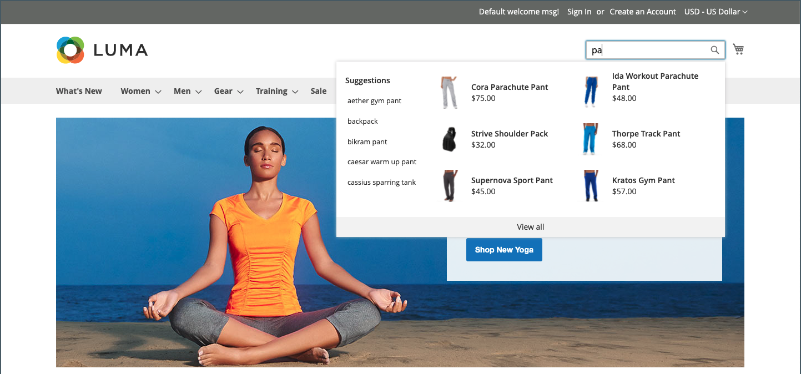
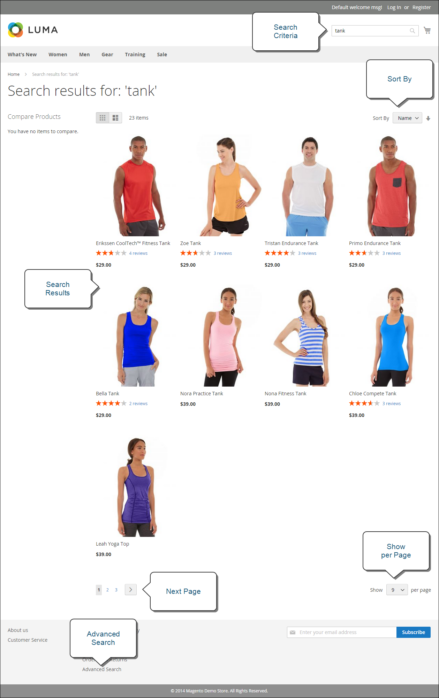
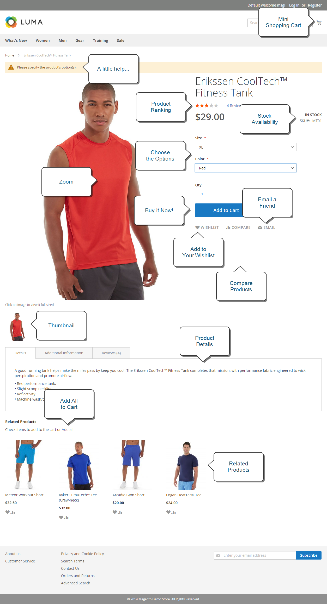
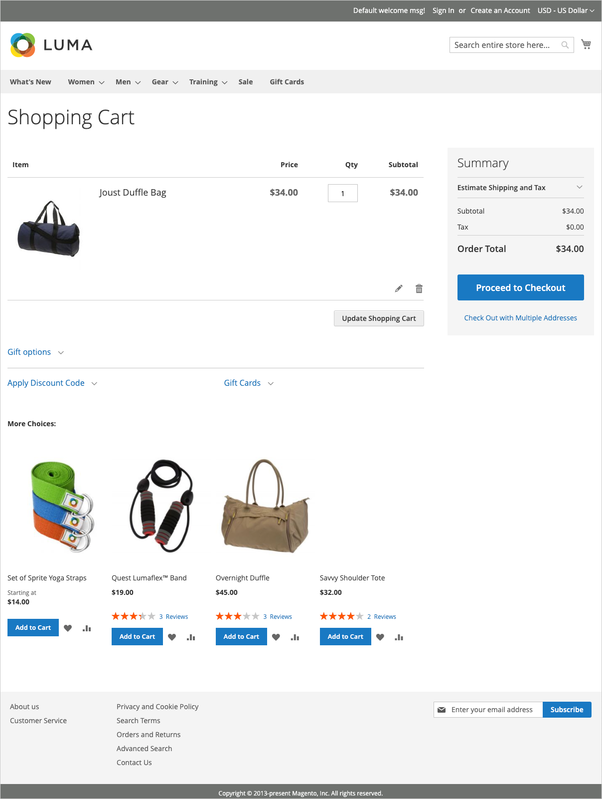
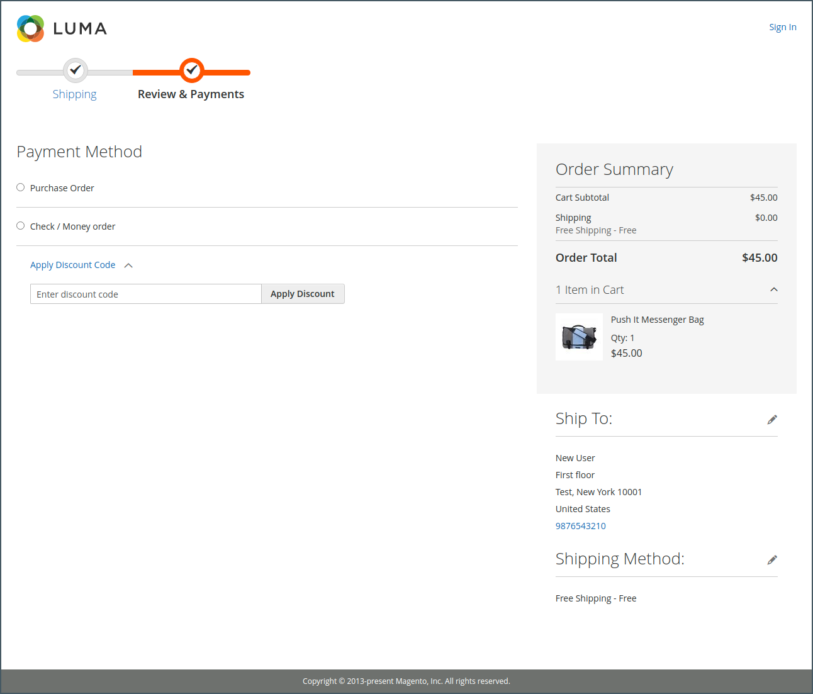

# What is the Storefront?

Within your Adobe Commerce or Magento Open Source implementation, the storefront is the external, public-facing part of your store. It provides the content and functional components that your customers use to shop and purchase.

The path customers take to a sale is sometimes called the _path to purchase_, and your storefront includes the components for customers to complete this path. The following sections provide an overview of the basic page types that provide strategic value---the places customers usually visit while shopping in your store. As you review them, consider different store features that can be used at each stage of the customer journey.

## Home Page

Did you know that most people spend only a few seconds on a page before they decide to stay or go somewhere else? That's not long to make an impression. Studies show that people also love photographs, especially of other people. Whatever design you choose, everything on your home page should move visitors along toward the next step in the sales process. The idea is to guide their attention in a cohesive flow from one point of interest to the next.

<!-- zoom -->

## Catalog Page

Catalog page listings typically have small product images and brief descriptions, and can be formatted as a list or as a grid. You can add blocks, videos, and keyword-rich descriptions, and also create special designs for a promotion or season. You might create a special category to feature a lifestyle or brand that is a curated collection of products from different categories.

The initial product description usually gives shoppers enough information to merit a closer look. People who know what they want can add the product to their carts and go. Customers who shop while logged in to their accounts enjoy a personalized shopping experience.

<!-- zoom -->

## Search Results

Did you know that people who use search are nearly twice as likely to make a purchase as those who rely on navigation alone? You might consider these shoppers to be _pre-qualified_.

### Live Search

With [Live Search](https://experienceleague.adobe.com/docs/commerce-merchant-services/live-search/overview.html) for Adobe Commerce, your store delivers a fast, super-relevant, and intuitive search experience, and is available for Adobe Commerce at no additional charge.

<!-- zoom -->

### Standard catalog search

With [standard catalog search](../catalog/search.md), your store includes a Search box in the upper-right corner, and a link to Advanced Search in the footer. All search terms that shoppers submit are saved, so you can see exactly what they're looking for. You can offer suggestions, and enter synonyms and common misspellings. Then, display a specific page when a search term is entered.

<!-- zoom -->

## Product Page

The product page has a lot going on! The first thing that catches your eye on the product page is the main image with a high-resolution zoom and thumbnail gallery. In addition to the price and availability, there is a tabbed section with more information and a list of related products.

<!-- zoom -->

## Shopping Cart

The cart is where order total can be determined, along with discount coupons and estimated shipping and tax, and a great place to display your trust badges and seals. This is  also an ideal opportunity to offer one last item. As a cross-sell, you can select certain items to be offered as an impulse purchase whenever a specific item appears in the cart.

<!-- zoom -->

## Checkout Page

Checkout process consists of two steps:

1. Shipping Information

   The first step of the checkout process is for the customer to complete the shipping address information, and to choose the shipping method. If the customer has an account, the shipping address is entered automatically, but can be changed if needed.

   <!-- zoom -->

1. Review and Payment Information

   The second step of the checkout process is for the customer to choose the payment method and optionally apply a  discount code.

   >[!NOTE]
   >
   >Although [!DNL Commerce] allows configuring multiple coupon codes, a customer may apply only one coupon code to the cart. (See the [Coupon codes](../merchandising-promotions/price-rules-cart-coupon.md#coupon-codes) for more information.)

   <!-- zoom -->

The progress bar at the top of the page follows each step of the checkout process, and the Order Summary shows the information that was entered up to this point.

>[!NOTE]
>
>The exception to a two-step checkout applies to virtual and/or downloadable products. If there are only these types of products in the shopping cart, checkout is automatically transformed to one-step procedure, because shipping information is not required.
